# Hello 算法

> 动画图解、一键运行的数据结构与算法教程 · 在线阅读 https://www.hello-algo.com
> 许可: CC BY-NC-SA 4.0
# 序

---

---
comments: true
icon: material/rocket-launch-outline
---

# 序

几年前，我在力扣上分享了“剑指 Offer”系列题解，受到了许多读者的鼓励和支持。在与读者交流期间，我最常被问的一个问题是“如何入门算法”。逐渐地，我对这个问题产生了浓厚的兴趣。

两眼一抹黑地刷题似乎是最受欢迎的方法，简单、直接且有效。然而刷题就如同玩“扫雷”游戏，自学能力强的人能够顺利将地雷逐个排掉，而基础不足的人很可能被炸得满头是包，并在挫折中步步退缩。通读教材也是一种常见做法，但对于面向求职的人来说，毕业论文、投递简历、准备笔试和面试已经消耗了大部分精力，啃厚重的书往往变成了一项艰巨的挑战。

如果你也面临类似的困扰，那么很幸运这本书“找”到了你。本书是我对这个问题给出的答案，即使不是最优解，也至少是一次积极的尝试。本书虽然不足以让你直接拿到 Offer，但会引导你探索数据结构与算法的“知识地图”，带你了解不同“地雷”的形状、大小和分布位置，让你掌握各种“排雷方法”。有了这些本领，相信你可以更加自如地刷题和阅读文献，逐步构建起完整的知识体系。

我深深赞同费曼教授所言：“Knowledge isn't free. You have to pay attention.”从这个意义上看，这本书并非完全“免费”。为了不辜负你为本书所付出的宝贵“注意力”，我会竭尽所能，投入最大的“注意力”来完成本书的创作。

本人自知学疏才浅，书中内容虽然已经过一段时间的打磨，但一定仍有许多错误，恳请各位老师和同学批评指正。

{ class="cover-image" }

<div style="text-align: center;">
    <h2 style="margin-top: 0.8em; margin-bottom: 0.8em;">Hello，算法！</h2>
</div>

计算机的出现给世界带来了巨大变革，它凭借高速的计算能力和出色的可编程性，成为了执行算法与处理数据的理想媒介。无论是电子游戏的逼真画面、自动驾驶的智能决策，还是 AlphaGo 的精彩棋局、ChatGPT 的自然交互，这些应用都是算法在计算机上的精妙演绎。

事实上，在计算机问世之前，算法和数据结构就已经存在于世界的各个角落。早期的算法相对简单，例如古代的计数方法和工具制作步骤等。随着文明的进步，算法逐渐变得更加精细和复杂。从巧夺天工的匠人技艺、到解放生产力的工业产品、再到宇宙运行的科学规律，几乎每一件平凡或令人惊叹的事物背后，都隐藏着精妙的算法思想。

同样，数据结构无处不在：大到社会网络，小到地铁线路，许多系统都可以建模为“图”；大到一个国家，小到一个家庭，社会的主要组织形式呈现出“树”的特征；冬天的衣服就像“栈”，最先穿上的最后才能脱下；羽毛球筒则如同“队列”，一端放入、另一端取出；字典就像一个“哈希表”，能够快速查找目标词条。

本书旨在通过清晰易懂的动画图解和可运行的代码示例，使读者理解算法和数据结构的核心概念，并能够通过编程来实现它们。在此基础上，本书致力于揭示算法在复杂世界中的生动体现，展现算法之美。希望本书能够帮助到你！

---

# 第 0 章 &nbsp; 前言

---

# 前言


!!! abstract

    算法犹如美妙的交响乐，每一行代码都像韵律般流淌。
    
    愿这本书在你的脑海中轻轻响起，留下独特而深刻的旋律。

---

# 0.1 &nbsp; 关于本书

---

# 关于本书

本项目旨在创建一本开源、免费、对新手友好的数据结构与算法入门教程。

- 全书采用动画图解，内容清晰易懂、学习曲线平滑，引导初学者探索数据结构与算法的知识地图。
- 源代码可一键运行，帮助读者在练习中提升编程技能，了解算法工作原理和数据结构底层实现。
- 提倡读者互助学习，欢迎大家在评论区提出问题与分享见解，在交流讨论中共同进步。

## 读者对象

若你是算法初学者，从未接触过算法，或者已经有一些刷题经验，对数据结构与算法有模糊的认识，在会与不会之间反复横跳，那么本书正是为你量身定制的！

如果你已经积累一定的刷题量，熟悉大部分题型，那么本书可助你回顾与梳理算法知识体系，仓库源代码可以当作“刷题工具库”或“算法字典”来使用。

若你是算法“大神”，我们期待收到你的宝贵建议，或者[一起参与创作](https://www.hello-algo.com/chapter_appendix/contribution/)。

!!! success "前置条件"

    你需要至少具备任一语言的编程基础，能够阅读和编写简单代码。

## 内容结构

本书的主要内容如下图所示。

- **复杂度分析**：数据结构和算法的评价维度与方法。时间复杂度和空间复杂度的推算方法、常见类型、示例等。
- **数据结构**：基本数据类型和数据结构的分类方法。数组、链表、栈、队列、哈希表、树、堆、图等数据结构的定义、优缺点、常用操作、常见类型、典型应用、实现方法等。
- **算法**：搜索、排序、分治、回溯、动态规划、贪心等算法的定义、优缺点、效率、应用场景、解题步骤和示例问题等。

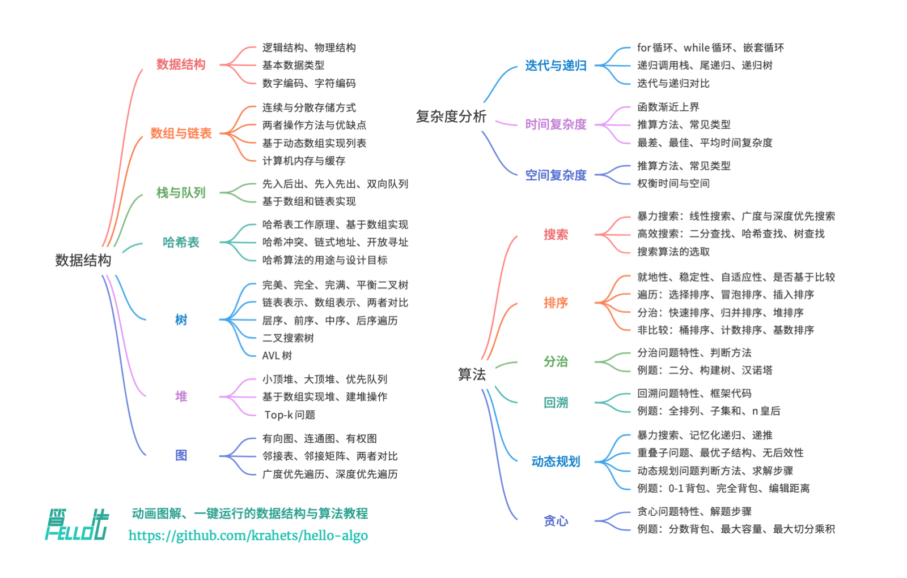

## 致谢

本书在开源社区众多贡献者的共同努力下不断完善。感谢每一位投入时间与精力的撰稿人，他们是（按照 GitHub 自动生成的顺序）：krahets、coderonion、Gonglja、nuomi1、Reanon、justin-tse、hpstory、danielsss、curtishd、night-cruise、S-N-O-R-L-A-X、rongyi、msk397、gvenusleo、khoaxuantu、rivertwilight、K3v123、gyt95、zhuoqinyue、yuelinxin、Zuoxun、mingXta、Phoenix0415、FangYuan33、GN-Yu、longsizhuo、pengchzn、QiLOL、Cathay-Chen、guowei-gong、xBLACKICEx、IsChristina、JoseHung、qualifier1024、hello-ikun、magentaqin、Guanngxu、thomasq0、sunshinesDL、L-Super、Transmigration-zhou、WSL0809、Slone123c、lhxsm、yuan0221、what-is-me、theNefelibatas、Shyam-Chen、sangxiaai、longranger2、codeberg-user、xiongsp、JeffersonHuang、prinpal、seven1240、Wonderdch、malone6、xiaomiusa87、gaofer、bluebean-cloud、a16su、SamJin98、hongyun-robot、nanlei、XiaChuerwu、yd-j、iron-irax、mgisr、steventimes、junminhong、heshuyue、danny900714、Nigh、Dr-XYZ、MolDuM、XC-Zero、reeswell、PXG-XPG、NI-SW、Horbin-Magician、Enlightenus、YangXuanyi、xjr7670、beatrix-chan、DullSword、qq909244296、iStig、boloboloda、hts0000、gledfish、fbigm、echo1937、jiaxianhua、wenjianmin、keshida、kilikilikid、lclc6、lwbaptx、linyejoe2、liuxjerry、szu17dmy、dshlstarr、Yucao-cy、coderlef、czruby、bongbongbakudan、beintentional、ZongYangL、ZhongYuuu、ZhongGuanbin、hezhizhen、linzeyan、ZJKung、JTCPOWI、KawaiiAsh、luluxia、xb534、ztkuaikuai、yw-1021、ElaBosak233、baagod、zhouLion、yishangzhang、yi427、yanedie、yabo083、weibk、wangwang105、th1nk3r-ing、tao363、4yDX3906、syd168、sslmj2020、smilelsb、siqyka、selear、sdshaoda、Xi-Row、popozhu、nuquist19、noobcodemaker、XiaoK29、chadyi、lyl625760、lucaswangdev、llql1211、0130w、shanghai-Jerry、EJackYang、Javesun99、eltociear、lipusheng、KNChiu、BlindTerran、ShiMaRing、lovelock、FreddieLi、FloranceYeh、fanchenggang、gltianwen、goerll、nedchu、curly210102、CuB3y0nd、KraHsu、CarrotDLaw、youshaoXG、bubble9um、Asashishi、Asa0oo0o0o、fanenr、eagleanurag、akshiterate、52coder、foursevenlove、KorsChen、hopkings2008、yang-le、realwujing、Evilrabbit520、Umer-Jahangir、Turing-1024-Lee、Suremotoo、paoxiaomooo、Chieko-Seren、Senrian、Allen-Scai、19santosh99、ymmmas、Risuntsy、Richard-Zhang1019、RafaelCaso、qingpeng9802、primexiao、Urbaner3、codetypess、nidhoggfgg、MwumLi、CreatorMetaSky、martinx、ZnYang2018、hugtyftg、logan-qiu、psychelzh、Kunchen-Luo、Keynman 和 KeiichiKasai。

本书的代码审阅工作由 coderonion、curtishd、Gonglja、gvenusleo、hpstory、justin-tse、khoaxuantu、krahets、night-cruise、nuomi1、Reanon 和 rongyi 完成（按照首字母顺序排列）。感谢他们付出的时间与精力，正是他们确保了各语言代码的规范与统一。

本书的英文版由 yuelinxin、K3v123、magentaqin、QiLOL、Phoenix0415、SamJin98、yanedie、RafaelCaso、pengchzn 和 thomasq0 审阅；日文版由 eltociear 审阅；俄文版由 И. А. Шевкун 和 Yuyan Huang 审阅；繁体中文版由 Shyam-Chen 和 Dr-XYZ 审阅。正是因为他们的贡献，这本书才能够服务于更广泛的读者群体，感谢他们。

本书的 ePub 电子书生成工具由 zhongfq 开发。感谢他的贡献，为读者提供了更灵活的阅读方式。

在本书的创作过程中，我得到了许多人的帮助。

- 感谢我在公司的导师李汐博士，在一次畅谈中你鼓励我“快行动起来”，坚定了我写这本书的决心；
- 感谢我的女朋友泡泡作为本书的首位读者，从算法小白的角度提出许多宝贵建议，使得本书更适合新手阅读；
- 感谢腾宝、琦宝、飞宝为本书起了一个富有创意的名字，唤起大家写下第一行代码“Hello World!”的美好回忆；
- 感谢校铨在知识产权方面提供的专业帮助，这对本开源书的完善起到了重要作用；
- 感谢苏潼为本书设计了精美的封面和 logo ，并在我的强迫症的驱使下多次耐心修改；
- 感谢 @squidfunk 提供的排版建议，以及他开发的开源文档主题 [Material-for-MkDocs](https://github.com/squidfunk/mkdocs-material) 。

在写作过程中，我阅读了许多关于数据结构与算法的教材和文章。这些作品为本书提供了优秀的范本，确保了本书内容的准确性与品质。在此感谢所有老师和前辈的杰出贡献！

本书倡导手脑并用的学习方式，在这一点上我深受[《动手学深度学习》](https://github.com/d2l-ai/d2l-zh)的启发。在此向各位读者强烈推荐这本优秀的著作。

**衷心感谢我的父母，正是你们一直以来的支持与鼓励，让我有机会做这件富有趣味的事**。

---

# 0.2 &nbsp; 如何使用本书

---

# 如何使用本书

!!! tip

    为了获得最佳的阅读体验，建议你通读本节内容。

## 行文风格约定

- 标题后标注 `*` 的是选读章节，内容相对困难。如果你的时间有限，可以先跳过。
- 专业术语会使用黑体（纸质版和 PDF 版）或添加下划线（网页版），例如<u>数组（array）</u>。建议记住它们，以便阅读文献。
- 重点内容和总结性语句会 **加粗**，这类文字值得特别关注。
- 有特指含义的词句会使用“引号”标注，以避免歧义。
- 当涉及编程语言之间不一致的名词时，本书均以 Python 为准，例如使用 `None` 来表示“空”。
- 本书部分放弃了编程语言的注释规范，以换取更加紧凑的内容排版。注释主要分为三种类型：标题注释、内容注释、多行注释。

=== "Python"

    ```python title=""
    """标题注释，用于标注函数、类、测试样例等"""
    
    # 内容注释，用于详解代码
    
    """
    多行
    注释
    """
    ```

=== "C++"

    ```cpp title=""
    /* 标题注释，用于标注函数、类、测试样例等 */
    
    // 内容注释，用于详解代码
    
    /**
     * 多行
     * 注释
     */
    ```

=== "Java"

    ```java title=""
    /* 标题注释，用于标注函数、类、测试样例等 */
    
    // 内容注释，用于详解代码
    
    /**
     * 多行
     * 注释
     */
    ```

=== "C#"

    ```csharp title=""
    /* 标题注释，用于标注函数、类、测试样例等 */
    
    // 内容注释，用于详解代码
    
    /**
     * 多行
     * 注释
     */
    ```

=== "Go"

    ```go title=""
    /* 标题注释，用于标注函数、类、测试样例等 */
    
    // 内容注释，用于详解代码
    
    /**
     * 多行
     * 注释
     */
    ```

=== "Swift"

    ```swift title=""
    /* 标题注释，用于标注函数、类、测试样例等 */
    
    // 内容注释，用于详解代码
    
    /**
     * 多行
     * 注释
     */
    ```

=== "JS"

    ```javascript title=""
    /* 标题注释，用于标注函数、类、测试样例等 */
    
    // 内容注释，用于详解代码
    
    /**
     * 多行
     * 注释
     */
    ```

=== "TS"

    ```typescript title=""
    /* 标题注释，用于标注函数、类、测试样例等 */
    
    // 内容注释，用于详解代码
    
    /**
     * 多行
     * 注释
     */
    ```

=== "Dart"

    ```dart title=""
    /* 标题注释，用于标注函数、类、测试样例等 */
    
    // 内容注释，用于详解代码
    
    /**
     * 多行
     * 注释
     */
    ```

=== "Rust"

    ```rust title=""
    /* 标题注释，用于标注函数、类、测试样例等 */

    // 内容注释，用于详解代码
    
    // 多行
    // 注释
    ```

=== "C"

    ```c title=""
    /* 标题注释，用于标注函数、类、测试样例等 */
    
    // 内容注释，用于详解代码
    
    /**
     * 多行
     * 注释
     */
    ```

=== "Kotlin"

    ```kotlin title=""
    /* 标题注释，用于标注函数、类、测试样例等 */
    
    // 内容注释，用于详解代码
    
    /**
     * 多行
     * 注释
     */
    ```

=== "Ruby"

    ```ruby title=""
    ### 标题注释，用于标注函数、类、测试样例等 ###

    # 内容注释，用于详解代码
    
    # 多行
    # 注释
    ```

## 在动画图解中高效学习

相较于文字，视频和图片具有更高的信息密度和结构化程度，更易于理解。在本书中，**重点和难点知识将主要通过动画以图解形式展示**，而文字则作为解释与补充。

如果你在阅读本书时，发现某段内容提供了如下图所示的动画图解，**请以图为主、以文字为辅**，综合两者来理解内容。

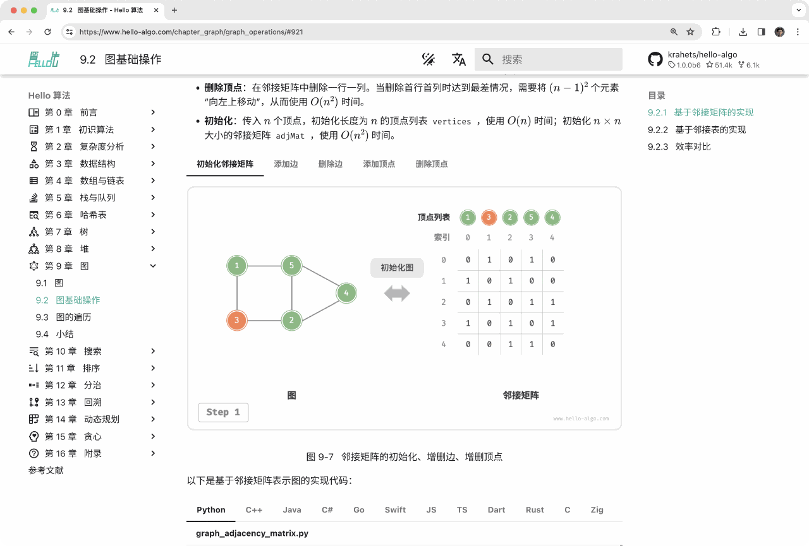

## 在代码实践中加深理解

本书的配套代码托管在 [GitHub 仓库](https://github.com/krahets/hello-algo)。如下图所示，**源代码附有测试样例，可一键运行**。

如果时间允许，**建议你参照代码自行敲一遍**。如果学习时间有限，请至少通读并运行所有代码。

与阅读代码相比，编写代码的过程往往能带来更多收获。**动手学，才是真的学**。

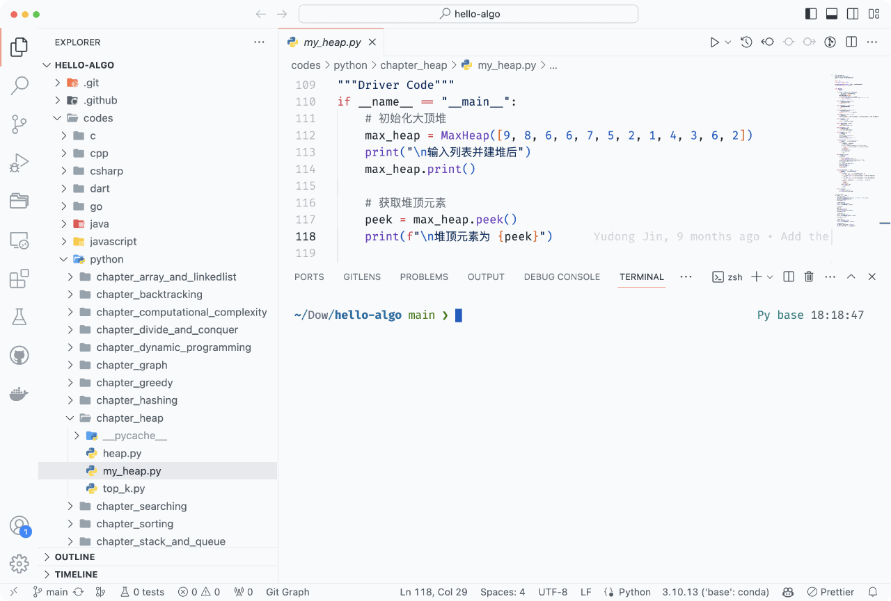

运行代码的前置工作主要分为三步。

**第一步：安装本地编程环境**。请参照附录所示的[教程](https://www.hello-algo.com/chapter_appendix/installation/)进行安装，如果已安装，则可跳过此步骤。

**第二步：克隆或下载代码仓库**。前往 [GitHub 仓库](https://github.com/krahets/hello-algo)。如果已经安装 [Git](https://git-scm.com/downloads) ，可以通过以下命令克隆本仓库：

```shell
git clone https://github.com/krahets/hello-algo.git
```

当然，你也可以在下图所示的位置，点击“Download ZIP”按钮直接下载代码压缩包，然后在本地解压即可。


**第三步：运行源代码**。如下图所示，对于顶部标有文件名称的代码块，我们可以在仓库的 `codes` 文件夹内找到对应的源代码文件。源代码文件可一键运行，将帮助你节省不必要的调试时间，让你能够专注于学习内容。

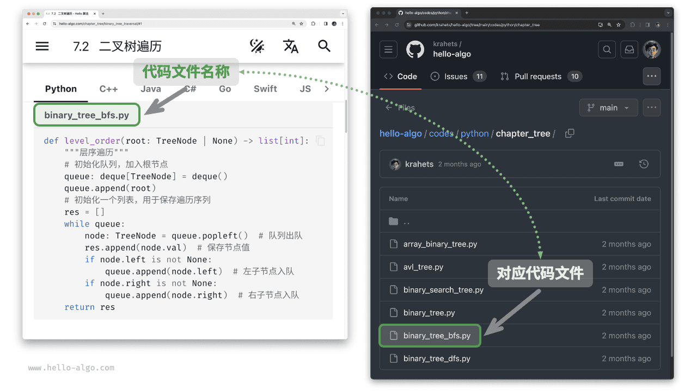

除了本地运行代码，**网页版还支持 Python 代码的可视化运行**（基于 [pythontutor](https://pythontutor.com/) 实现）。如下图所示，你可以点击代码块下方的“可视化运行”来展开视图，观察算法代码的执行过程；也可以点击“全屏观看”，以获得更好的阅览体验。

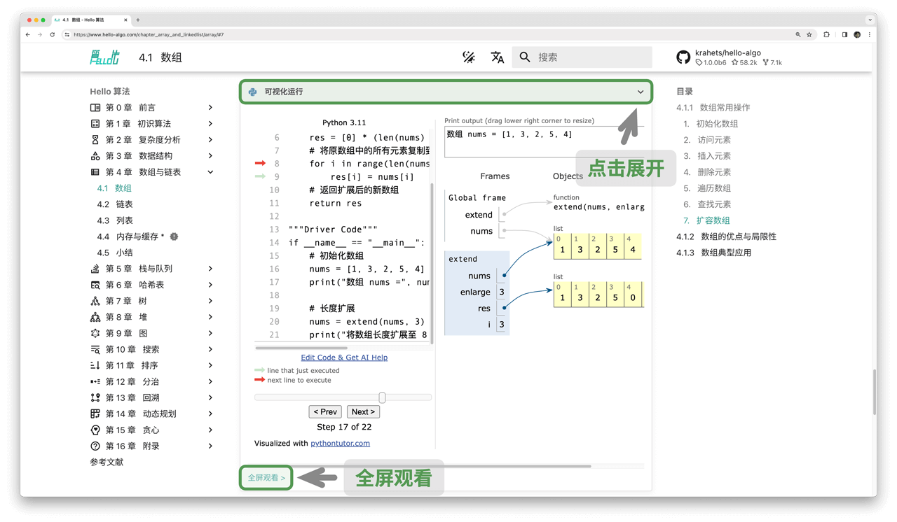

## 在提问讨论中共同成长

在阅读本书时，请不要轻易跳过那些没学明白的知识点。**欢迎在评论区提出你的问题**，我和小伙伴们将竭诚为你解答，一般情况下可在两天内回复。

如下图所示，网页版每个章节的底部都配有评论区。希望你能多关注评论区的内容。一方面，你可以了解大家遇到的问题，从而查漏补缺，激发更深入的思考。另一方面，期待你能慷慨地回答其他小伙伴的问题，分享你的见解，帮助他人进步。


## 算法学习路线

从总体上看，我们可以将学习数据结构与算法的过程划分为三个阶段。

1. **阶段一：算法入门**。我们需要熟悉各种数据结构的特点和用法，学习不同算法的原理、流程、用途和效率等方面的内容。
2. **阶段二：刷算法题**。建议从热门题目开刷，先积累至少 100 道题目，熟悉主流的算法问题。初次刷题时，“知识遗忘”可能是一个挑战，但请放心，这是很正常的。我们可以按照“艾宾浩斯遗忘曲线”来复习题目，通常在进行 3～5 轮的重复后，就能将其牢记在心。推荐的题单和刷题计划请见此 [GitHub 仓库](https://github.com/krahets/LeetCode-Book)。
3. **阶段三：搭建知识体系**。在学习方面，我们可以阅读算法专栏文章、解题框架和算法教材，以不断丰富知识体系。在刷题方面，可以尝试采用进阶刷题策略，如按专题分类、一题多解、一解多题等，相关的刷题心得可以在各个社区找到。

如下图所示，本书内容主要涵盖“阶段一”，旨在帮助你更高效地展开阶段二和阶段三的学习。

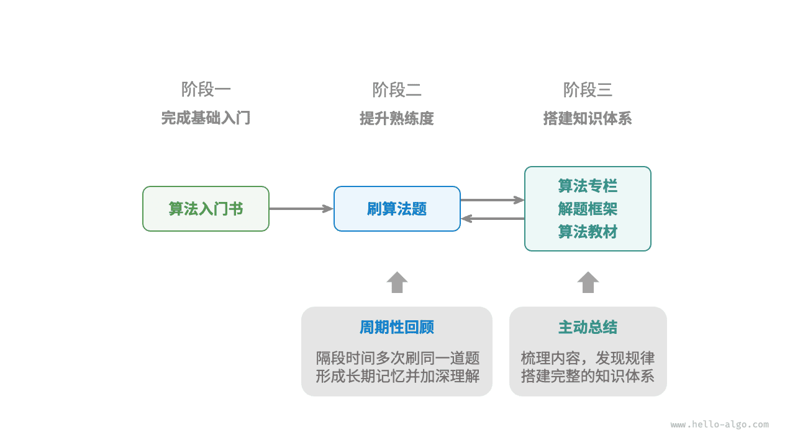

---

# 0.3 &nbsp; 小结

---

# 小结

### 重点回顾

- 本书的主要受众是算法初学者。如果你已有一定基础，本书能帮助你系统回顾算法知识，书中源代码也可作为“刷题工具库”使用。
- 书中内容主要包括复杂度分析、数据结构和算法三部分，涵盖了该领域的大部分主题。
- 对于算法新手，在初学阶段阅读一本入门书至关重要，可以少走许多弯路。
- 书中的动画图解通常用于介绍重点和难点知识。阅读本书时，应给予这些内容更多关注。
- 实践乃学习编程之最佳途径。强烈建议运行源代码并亲自敲代码。
- 本书网页版的每个章节都设有评论区，欢迎随时分享你的疑惑与见解。

---

# 第 1 章 &nbsp; 初识算法

---

# 初识算法


!!! abstract

    一位少女翩翩起舞，与数据交织在一起，裙摆上飘扬着算法的旋律。
    
    她邀请你共舞，请紧跟她的步伐，踏入充满逻辑与美感的算法世界。

---

# 1.1 &nbsp; 算法无处不在

---

# 算法无处不在

当我们听到“算法”这个词时，很自然地会想到数学。然而实际上，许多算法并不涉及复杂数学，而是更多地依赖基本逻辑，这些逻辑在我们的日常生活中处处可见。

在正式探讨算法之前，有一个有趣的事实值得分享：**你已经在不知不觉中学会了许多算法，并习惯将它们应用到日常生活中了**。下面我将举几个具体的例子来证实这一点。

**例一：查字典**。在字典里，每个汉字都对应一个拼音，而字典是按照拼音字母顺序排列的。假设我们需要查找一个拼音首字母为 $r$ 的字，通常会按照下图所示的方式实现。

1. 翻开字典约一半的页数，查看该页的首字母是什么，假设首字母为 $m$ 。
2. 由于在拼音字母表中 $r$ 位于 $m$ 之后，所以排除字典前半部分，查找范围缩小到后半部分。
3. 不断重复步骤 `1.` 和步骤 `2.` ，直至找到拼音首字母为 $r$ 的页码为止。

=== "<1>"
    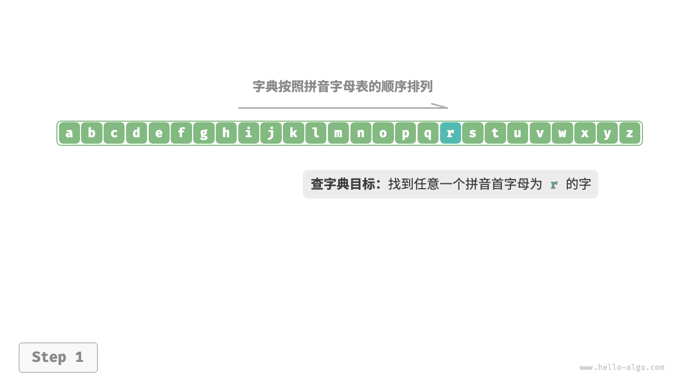

=== "<2>"
    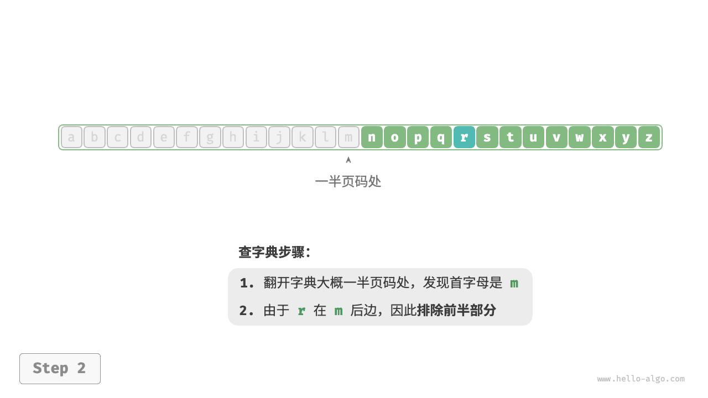

=== "<3>"
    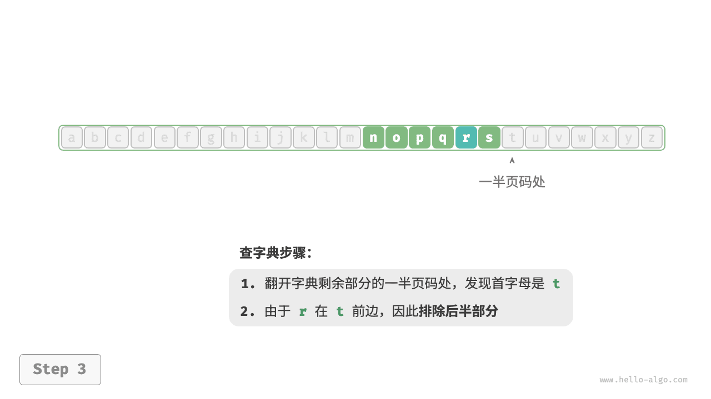

=== "<4>"
    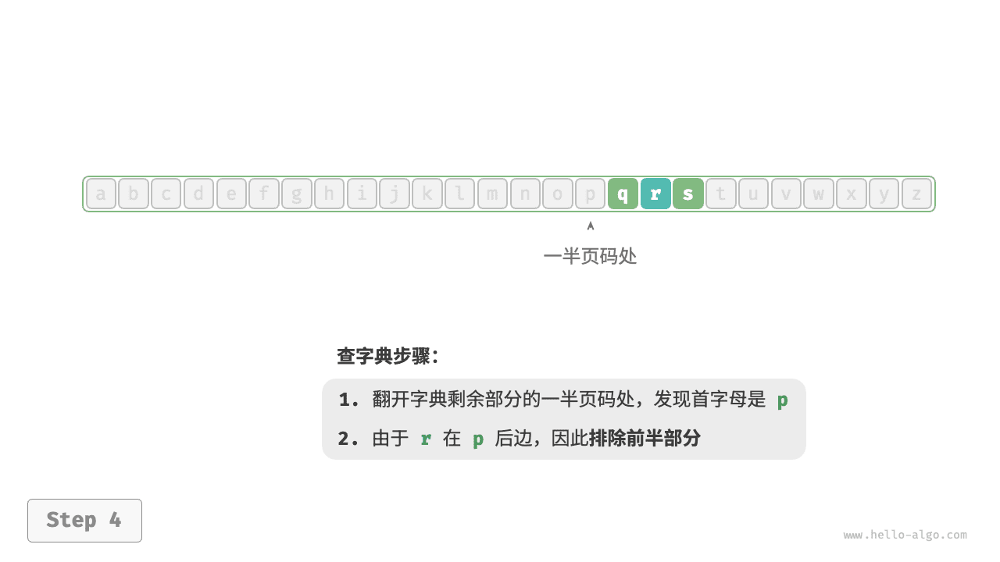

=== "<5>"
    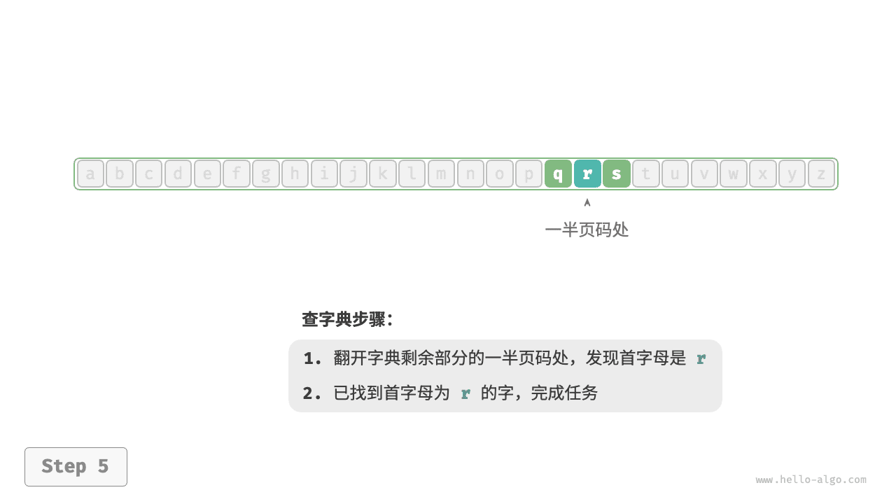

查字典这个小学生必备技能，实际上就是著名的“二分查找”算法。从数据结构的角度，我们可以把字典视为一个已排序的“数组”；从算法的角度，我们可以将上述查字典的一系列操作看作“二分查找”。

**例二：整理扑克**。我们在打牌时，每局都需要整理手中的扑克牌，使其从小到大排列，实现流程如下图所示。

1. 将扑克牌划分为“有序”和“无序”两部分，并假设初始状态下最左 1 张扑克牌已经有序。
2. 在无序部分抽出一张扑克牌，插入至有序部分的正确位置；完成后最左 2 张扑克已经有序。
3. 不断循环步骤 `2.` ，每一轮将一张扑克牌从无序部分插入至有序部分，直至所有扑克牌都有序。

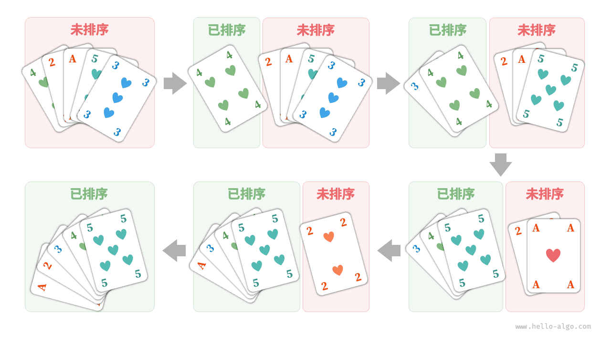

上述整理扑克牌的方法本质上是“插入排序”算法，它在处理小型数据集时非常高效。许多编程语言的排序库函数中都有插入排序的身影。

**例三：货币找零**。假设我们在超市购买了 $69$ 元的商品，给了收银员 $100$ 元，则收银员需要找我们 $31$ 元。他会很自然地完成如下图所示的思考。

1. 可选项是比 $31$ 元面值更小的货币，包括 $1$ 元、$5$ 元、$10$ 元、$20$ 元。
2. 从可选项中拿出最大的 $20$ 元，剩余 $31 - 20 = 11$ 元。
3. 从剩余可选项中拿出最大的 $10$ 元，剩余 $11 - 10 = 1$ 元。
4. 从剩余可选项中拿出最大的 $1$ 元，剩余 $1 - 1 = 0$ 元。
5. 完成找零，方案为 $20 + 10 + 1 = 31$ 元。

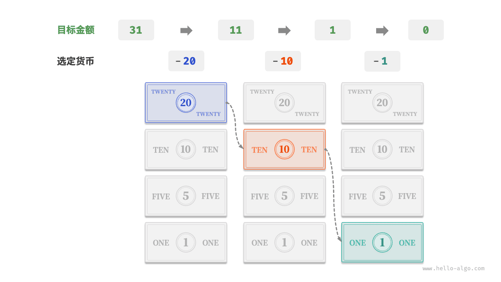

在以上步骤中，我们每一步都采取当前看来最好的选择（尽可能用大面额的货币），最终得到了可行的找零方案。从数据结构与算法的角度看，这种方法本质上是“贪心”算法。

小到烹饪一道菜，大到星际航行，几乎所有问题的解决都离不开算法。计算机的出现使得我们能够通过编程将数据结构存储在内存中，同时编写代码调用 CPU 和 GPU 执行算法。这样一来，我们就能把生活中的问题转移到计算机上，以更高效的方式解决各种复杂问题。

!!! tip

    如果你对数据结构、算法、数组和二分查找等概念仍感到一知半解，请继续往下阅读，本书将引导你迈入数据结构与算法的知识殿堂。

---

# 1.2 &nbsp; 算法是什么

---

# 算法是什么

## 算法定义

<u>算法（algorithm）</u>是在有限时间内解决特定问题的一组指令或操作步骤，它具有以下特性。

- 问题是明确的，包含清晰的输入和输出定义。
- 具有可行性，能够在有限步骤、时间和内存空间下完成。
- 各步骤都有确定的含义，在相同的输入和运行条件下，输出始终相同。

## 数据结构定义

<u>数据结构（data structure）</u>是组织和存储数据的方式，涵盖数据内容、数据之间关系和数据操作方法，它具有以下设计目标。

- 空间占用尽量少，以节省计算机内存。
- 数据操作尽可能快速，涵盖数据访问、添加、删除、更新等。
- 提供简洁的数据表示和逻辑信息，以便算法高效运行。

**数据结构设计是一个充满权衡的过程**。如果想在某方面取得提升，往往需要在另一方面作出妥协。下面举两个例子。

- 链表相较于数组，在数据添加和删除操作上更加便捷，但牺牲了数据访问速度。
- 图相较于链表，提供了更丰富的逻辑信息，但需要占用更大的内存空间。

## 数据结构与算法的关系

如下图所示，数据结构与算法高度相关、紧密结合，具体表现在以下三个方面。

- 数据结构是算法的基石。数据结构为算法提供了结构化存储的数据，以及操作数据的方法。
- 算法为数据结构注入生命力。数据结构本身仅存储数据信息，结合算法才能解决特定问题。
- 算法通常可以基于不同的数据结构实现，但执行效率可能相差很大，选择合适的数据结构是关键。

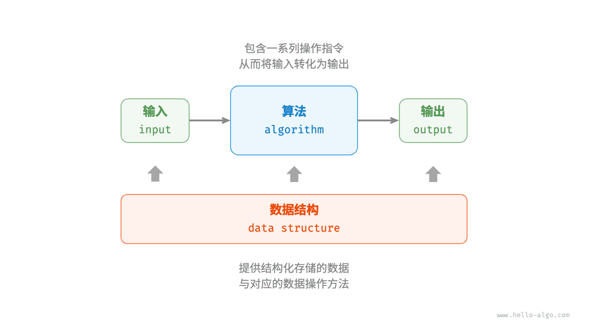

数据结构与算法犹如下图所示的拼装积木。一套积木，除了包含许多零件之外，还附有详细的组装说明书。我们按照说明书一步步操作，就能组装出精美的积木模型。


两者的详细对应关系如下表所示。

<p align="center"> 表 <id> &nbsp; 将数据结构与算法类比为拼装积木 </p>

| 数据结构与算法 | 拼装积木                                 |
| -------------- | ---------------------------------------- |
| 输入数据       | 未拼装的积木                             |
| 数据结构       | 积木组织形式，包括形状、大小、连接方式等 |
| 算法           | 把积木拼成目标形态的一系列操作步骤       |
| 输出数据       | 积木模型                                 |

值得说明的是，数据结构与算法是独立于编程语言的。正因如此，本书得以提供基于多种编程语言的实现。

!!! tip "约定俗成的简称"

    在实际讨论时，我们通常会将“数据结构与算法”简称为“算法”。比如众所周知的 LeetCode 算法题目，实际上同时考查数据结构和算法两方面的知识。

---

# 1.3 &nbsp; 小结

---

# 小结

### 重点回顾

- 算法在日常生活中无处不在，并不是遥不可及的高深知识。实际上，我们已经在不知不觉中学会了许多算法，用以解决生活中的大小问题。
- 查字典的原理与二分查找算法相一致。二分查找算法体现了分而治之的重要算法思想。
- 整理扑克的过程与插入排序算法非常类似。插入排序算法适合排序小型数据集。
- 货币找零的步骤本质上是贪心算法，每一步都采取当前看来最好的选择。
- 算法是在有限时间内解决特定问题的一组指令或操作步骤，而数据结构是计算机中组织和存储数据的方式。
- 数据结构与算法紧密相连。数据结构是算法的基石，而算法为数据结构注入生命力。
- 我们可以将数据结构与算法类比为拼装积木，积木代表数据，积木的形状和连接方式等代表数据结构，拼装积木的步骤则对应算法。

### Q & A

**Q**：作为一名程序员，我在日常工作中从未用算法解决过问题，常用算法都被编程语言封装好了，直接用就可以了；这是否意味着我们工作中的问题还没有到达需要算法的程度？

如果把具体的工作技能比作是武功的“招式”的话，那么基础科目应该更像是“内功”。

我认为学算法（以及其他基础科目）的意义不是在于在工作中从零实现它，而是基于学到的知识，在解决问题时能够作出专业的反应和判断，从而提升工作的整体质量。举一个简单例子，每种编程语言都内置了排序函数：

- 如果我们没有学过数据结构与算法，那么给定任何数据，我们可能都塞给这个排序函数去做了。运行顺畅、性能不错，看上去并没有什么问题。
- 但如果学过算法，我们就会知道内置排序函数的时间复杂度是 $O(n \log n)$ ；而如果给定的数据是固定位数的整数（例如学号），那么我们就可以用效率更高的“基数排序”来做，将时间复杂度降为 $O(nk)$ ，其中 $k$ 为位数。当数据体量很大时，节省出来的运行时间就能创造较大价值（成本降低、体验变好等）。

在工程领域中，大量问题是难以达到最优解的，许多问题只是被“差不多”地解决了。问题的难易程度一方面取决于问题本身的性质，另一方面也取决于观测问题的人的知识储备。人的知识越完备、经验越多，分析问题就会越深入，问题就能被解决得更优雅。

---

# 第 2 章 &nbsp; 复杂度分析

---

# 复杂度分析


!!! abstract

    复杂度分析犹如浩瀚的算法宇宙中的时空向导。
    
    它带领我们在时间与空间这两个维度上深入探索，寻找更优雅的解决方案。

---

# 2.1 &nbsp; 算法效率评估

---

# 算法效率评估

在算法设计中，我们先后追求以下两个层面的目标。

1. **找到问题解法**：算法需要在规定的输入范围内可靠地求得问题的正确解。
2. **寻求最优解法**：同一个问题可能存在多种解法，我们希望找到尽可能高效的算法。

也就是说，在能够解决问题的前提下，算法效率已成为衡量算法优劣的主要评价指标，它包括以下两个维度。

- **时间效率**：算法运行时间的长短。
- **空间效率**：算法占用内存空间的大小。

简而言之，**我们的目标是设计“既快又省”的数据结构与算法**。而有效地评估算法效率至关重要，因为只有这样，我们才能将各种算法进行对比，进而指导算法设计与优化过程。

效率评估方法主要分为两种：实际测试、理论估算。

## 实际测试

假设我们现在有算法 `A` 和算法 `B` ，它们都能解决同一问题，现在需要对比这两个算法的效率。最直接的方法是找一台计算机，运行这两个算法，并监控记录它们的运行时间和内存占用情况。这种评估方式能够反映真实情况，但也存在较大的局限性。

一方面，**难以排除测试环境的干扰因素**。硬件配置会影响算法的性能表现。比如一个算法的并行度较高，那么它就更适合在多核 CPU 上运行，一个算法的内存操作密集，那么它在高性能内存上的表现就会更好。也就是说，算法在不同的机器上的测试结果可能是不一致的。这意味着我们需要在各种机器上进行测试，统计平均效率，而这是不现实的。

另一方面，**展开完整测试非常耗费资源**。随着输入数据量的变化，算法会表现出不同的效率。例如，在输入数据量较小时，算法 `A` 的运行时间比算法 `B` 短；而在输入数据量较大时，测试结果可能恰恰相反。因此，为了得到有说服力的结论，我们需要测试各种规模的输入数据，而这需要耗费大量的计算资源。

## 理论估算

由于实际测试具有较大的局限性，我们可以考虑仅通过一些计算来评估算法的效率。这种估算方法被称为<u>渐近复杂度分析（asymptotic complexity analysis）</u>，简称<u>复杂度分析</u>。

复杂度分析能够体现算法运行所需的时间和空间资源与输入数据规模之间的关系。**它描述了随着输入数据规模的增加，算法执行所需时间和空间的增长趋势**。这个定义有些拗口，我们可以将其分为三个重点来理解。

- “时间和空间资源”分别对应<u>时间复杂度（time complexity）</u>和<u>空间复杂度（space complexity）</u>。
- “随着输入数据规模的增加”意味着复杂度反映了算法运行效率与输入数据规模之间的关系。
- “时间和空间的增长趋势”表示复杂度分析关注的不是运行时间或占用空间的具体值，而是时间或空间增长的“快慢”。

**复杂度分析克服了实际测试方法的弊端**，体现在以下几个方面。

- 它无需实际运行代码，更加绿色节能。
- 它独立于测试环境，分析结果适用于所有运行平台。
- 它可以体现不同数据量下的算法效率，尤其是在大数据量下的算法性能。

!!! tip

    如果你仍对复杂度的概念感到困惑，无须担心，我们会在后续章节中详细介绍。

复杂度分析为我们提供了一把评估算法效率的“标尺”，使我们可以衡量执行某个算法所需的时间和空间资源，对比不同算法之间的效率。

复杂度是个数学概念，对于初学者可能比较抽象，学习难度相对较高。从这个角度看，复杂度分析可能不太适合作为最先介绍的内容。然而，当我们讨论某个数据结构或算法的特点时，难以避免要分析其运行速度和空间使用情况。

综上所述，建议你在深入学习数据结构与算法之前，**先对复杂度分析建立初步的了解，以便能够完成简单算法的复杂度分析**。

---

# 2.2 &nbsp; 迭代与递归

---

# 迭代与递归

在算法中，重复执行某个任务是很常见的，它与复杂度分析息息相关。因此，在介绍时间复杂度和空间复杂度之前，我们先来了解如何在程序中实现重复执行任务，即两种基本的程序控制结构：迭代、递归。

## 迭代

<u>迭代（iteration）</u>是一种重复执行某个任务的控制结构。在迭代中，程序会在满足一定的条件下重复执行某段代码，直到这个条件不再满足。

### for 循环

`for` 循环是最常见的迭代形式之一，**适合在预先知道迭代次数时使用**。

以下函数基于 `for` 循环实现了求和 $1 + 2 + \dots + n$ ，求和结果使用变量 `res` 记录。需要注意的是，Python 中 `range(a, b)` 对应的区间是“左闭右开”的，对应的遍历范围为 $a, a + 1, \dots, b-1$ ：

```src
[file]{iteration}-[class]{}-[func]{for_loop}
```

下图是该求和函数的流程框图。

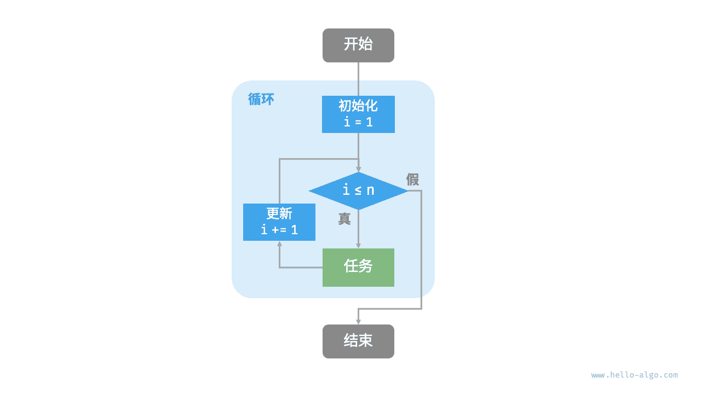

此求和函数的操作数量与输入数据大小 $n$ 成正比，或者说成“线性关系”。实际上，**时间复杂度描述的就是这个“线性关系”**。相关内容将会在下一节中详细介绍。

### while 循环

与 `for` 循环类似，`while` 循环也是一种实现迭代的方法。在 `while` 循环中，程序每轮都会先检查条件，如果条件为真，则继续执行，否则就结束循环。

下面我们用 `while` 循环来实现求和 $1 + 2 + \dots + n$ ：

```src
[file]{iteration}-[class]{}-[func]{while_loop}
```

**`while` 循环比 `for` 循环的自由度更高**。在 `while` 循环中，我们可以自由地设计条件变量的初始化和更新步骤。

例如在以下代码中，条件变量 $i$ 每轮进行两次更新，这种情况就不太方便用 `for` 循环实现：

```src
[file]{iteration}-[class]{}-[func]{while_loop_ii}
```

总的来说，**`for` 循环的代码更加紧凑，`while` 循环更加灵活**，两者都可以实现迭代结构。选择使用哪一个应该根据特定问题的需求来决定。

### 嵌套循环

我们可以在一个循环结构内嵌套另一个循环结构，下面以 `for` 循环为例：

```src
[file]{iteration}-[class]{}-[func]{nested_for_loop}
```

下图是该嵌套循环的流程框图。

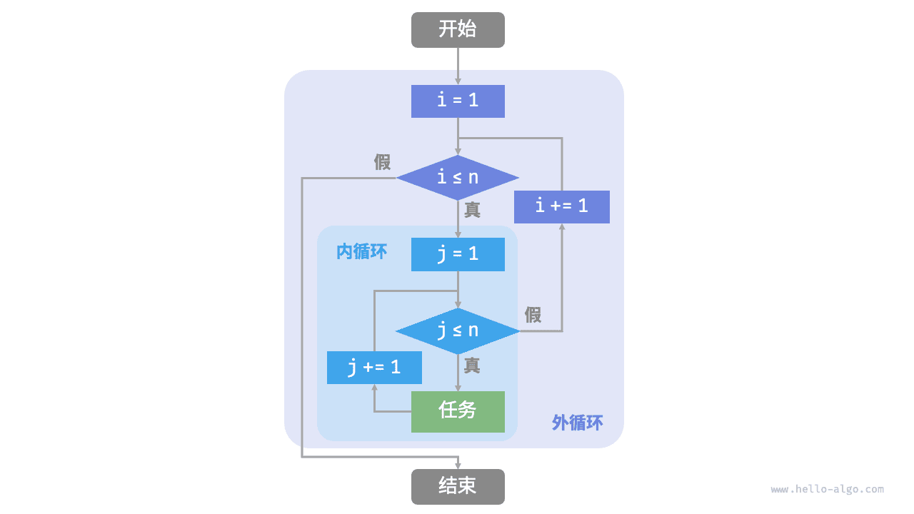

在这种情况下，函数的操作数量与 $n^2$ 成正比，或者说算法运行时间和输入数据大小 $n$ 成“平方关系”。

我们可以继续添加嵌套循环，每一次嵌套都是一次“升维”，将会使时间复杂度提高至“立方关系”“四次方关系”，以此类推。

## 递归

 <u>递归（recursion）</u>是一种算法策略，通过函数调用自身来解决问题。它主要包含两个阶段。

1. **递**：程序不断深入地调用自身，通常传入更小或更简化的参数，直到达到“终止条件”。
2. **归**：触发“终止条件”后，程序从最深层的递归函数开始逐层返回，汇聚每一层的结果。

而从实现的角度看，递归代码主要包含三个要素。

1. **终止条件**：用于决定什么时候由“递”转“归”。
2. **递归调用**：对应“递”，函数调用自身，通常输入更小或更简化的参数。
3. **返回结果**：对应“归”，将当前递归层级的结果返回至上一层。

观察以下代码，我们只需调用函数 `recur(n)`  ，就可以完成 $1 + 2 + \dots + n$ 的计算：

```src
[file]{recursion}-[class]{}-[func]{recur}
```

下图展示了该函数的递归过程。

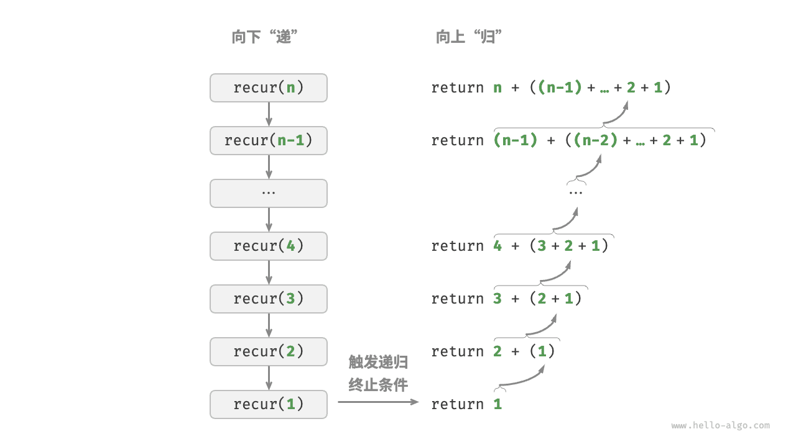

虽然从计算角度看，迭代与递归可以得到相同的结果，**但它们代表了两种完全不同的思考和解决问题的范式**。

- **迭代**：“自下而上”地解决问题。从最基础的步骤开始，然后不断重复或累加这些步骤，直到任务完成。
- **递归**：“自上而下”地解决问题。将原问题分解为更小的子问题，这些子问题和原问题具有相同的形式。接下来将子问题继续分解为更小的子问题，直到基本情况时停止（基本情况的解是已知的）。

以上述求和函数为例，设问题 $f(n) = 1 + 2 + \dots + n$ 。

- **迭代**：在循环中模拟求和过程，从 $1$ 遍历到 $n$ ，每轮执行求和操作，即可求得 $f(n)$ 。
- **递归**：将问题分解为子问题 $f(n) = n + f(n-1)$ ，不断（递归地）分解下去，直至基本情况 $f(1) = 1$ 时终止。

### 调用栈

递归函数每次调用自身时，系统都会为新开启的函数分配内存，以存储局部变量、调用地址和其他信息等。这将导致两方面的结果。

- 函数的上下文数据都存储在称为“栈帧空间”的内存区域中，直至函数返回后才会被释放。因此，**递归通常比迭代更加耗费内存空间**。
- 递归调用函数会产生额外的开销。**因此递归通常比循环的时间效率更低**。

如下图所示，在触发终止条件前，同时存在 $n$ 个未返回的递归函数，**递归深度为 $n$** 。

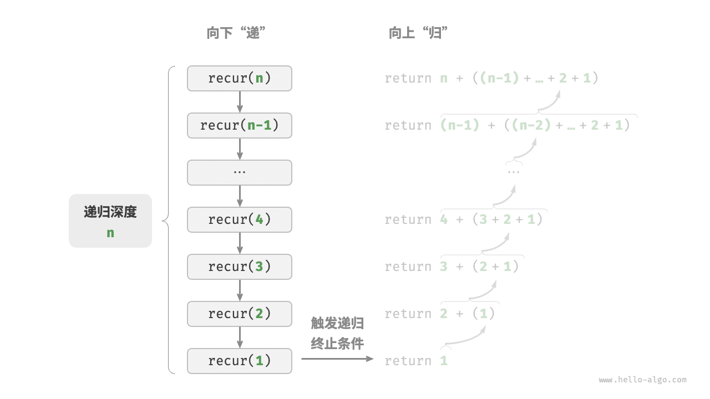

在实际中，编程语言允许的递归深度通常是有限的，过深的递归可能导致栈溢出错误。

### 尾递归

有趣的是，**如果函数在返回前的最后一步才进行递归调用**，则该函数可以被编译器或解释器优化，使其在空间效率上与迭代相当。这种情况被称为<u>尾递归（tail recursion）</u>。

- **普通递归**：当函数返回到上一层级的函数后，需要继续执行代码，因此系统需要保存上一层调用的上下文。
- **尾递归**：递归调用是函数返回前的最后一个操作，这意味着函数返回到上一层级后，无须继续执行其他操作，因此系统无须保存上一层函数的上下文。

以计算 $1 + 2 + \dots + n$ 为例，我们可以将结果变量 `res` 设为函数参数，从而实现尾递归：

```src
[file]{recursion}-[class]{}-[func]{tail_recur}
```

尾递归的执行过程如下图所示。对比普通递归和尾递归，两者的求和操作的执行点是不同的。

- **普通递归**：求和操作是在“归”的过程中执行的，每层返回后都要再执行一次求和操作。
- **尾递归**：求和操作是在“递”的过程中执行的，“归”的过程只需层层返回。

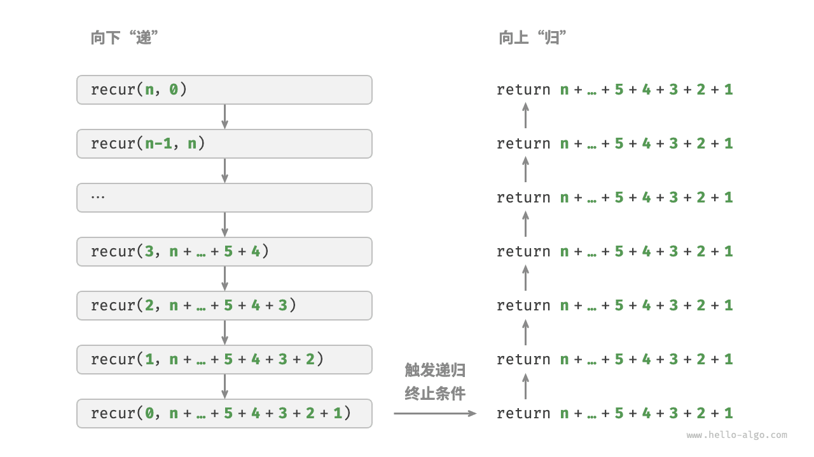

!!! tip

    请注意，许多编译器或解释器并不支持尾递归优化。例如，Python 默认不支持尾递归优化，因此即使函数是尾递归形式，仍然可能会遇到栈溢出问题。

### 递归树

当处理与“分治”相关的算法问题时，递归往往比迭代的思路更加直观、代码更加易读。以“斐波那契数列”为例。

!!! question

    给定一个斐波那契数列 $0, 1, 1, 2, 3, 5, 8, 13, \dots$ ，求该数列的第 $n$ 个数字。

设斐波那契数列的第 $n$ 个数字为 $f(n)$ ，易得两个结论。

- 数列的前两个数字为 $f(1) = 0$ 和 $f(2) = 1$ 。
- 数列中的每个数字是前两个数字的和，即 $f(n) = f(n - 1) + f(n - 2)$ 。

按照递推关系进行递归调用，将前两个数字作为终止条件，便可写出递归代码。调用 `fib(n)` 即可得到斐波那契数列的第 $n$ 个数字：

```src
[file]{recursion}-[class]{}-[func]{fib}
```

观察以上代码，我们在函数内递归调用了两个函数，**这意味着从一个调用产生了两个调用分支**。如下图所示，这样不断递归调用下去，最终将产生一棵层数为 $n$ 的<u>递归树（recursion tree）</u>。

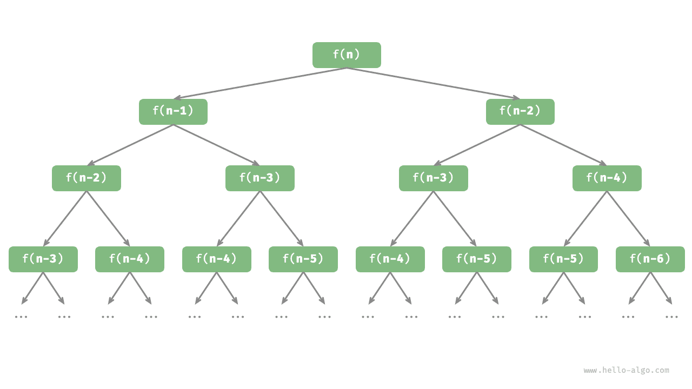

从本质上看，递归体现了“将问题分解为更小子问题”的思维范式，这种分治策略至关重要。

- 从算法角度看，搜索、排序、回溯、分治、动态规划等许多重要算法策略直接或间接地应用了这种思维方式。
- 从数据结构角度看，递归天然适合处理链表、树和图的相关问题，因为它们非常适合用分治思想进行分析。

## 两者对比

总结以上内容，如下表所示，迭代和递归在实现、性能和适用性上有所不同。

<p align="center"> 表 <id> &nbsp; 迭代与递归特点对比 </p>

|          | 迭代                                   | 递归                                                         |
| -------- | -------------------------------------- | ------------------------------------------------------------ |
| 实现方式 | 循环结构                               | 函数调用自身                                                 |
| 时间效率 | 效率通常较高，无函数调用开销           | 每次函数调用都会产生开销                                     |
| 内存使用 | 通常使用固定大小的内存空间             | 累积函数调用可能使用大量的栈帧空间                           |
| 适用问题 | 适用于简单循环任务，代码直观、可读性好 | 适用于子问题分解，如树、图、分治、回溯等，代码结构简洁、清晰 |

!!! tip

    如果感觉以下内容理解困难，可以在读完“栈”章节后再来复习。

那么，迭代和递归具有什么内在联系呢？以上述递归函数为例，求和操作在递归的“归”阶段进行。这意味着最初被调用的函数实际上是最后完成其求和操作的，**这种工作机制与栈的“先入后出”原则异曲同工**。

事实上，“调用栈”和“栈帧空间”这类递归术语已经暗示了递归与栈之间的密切关系。

1. **递**：当函数被调用时，系统会在“调用栈”上为该函数分配新的栈帧，用于存储函数的局部变量、参数、返回地址等数据。
2. **归**：当函数完成执行并返回时，对应的栈帧会被从“调用栈”上移除，恢复之前函数的执行环境。

因此，**我们可以使用一个显式的栈来模拟调用栈的行为**，从而将递归转化为迭代形式：

```src
[file]{recursion}-[class]{}-[func]{for_loop_recur}
```

观察以上代码，当递归转化为迭代后，代码变得更加复杂了。尽管迭代和递归在很多情况下可以互相转化，但不一定值得这样做，有以下两点原因。

- 转化后的代码可能更加难以理解，可读性更差。
- 对于某些复杂问题，模拟系统调用栈的行为可能非常困难。

总之，**选择迭代还是递归取决于特定问题的性质**。在编程实践中，权衡两者的优劣并根据情境选择合适的方法至关重要。

---

# 2.3 &nbsp; 时间复杂度

---

# 时间复杂度

运行时间可以直观且准确地反映算法的效率。如果我们想准确预估一段代码的运行时间，应该如何操作呢？

1. **确定运行平台**，包括硬件配置、编程语言、系统环境等，这些因素都会影响代码的运行效率。
2. **评估各种计算操作所需的运行时间**，例如加法操作 `+` 需要 1 ns ，乘法操作 `*` 需要 10 ns ，打印操作 `print()` 需要 5 ns 等。
3. **统计代码中所有的计算操作**，并将所有操作的执行时间求和，从而得到运行时间。

例如在以下代码中，输入数据大小为 $n$ ：

=== "Python"

    ```python title=""
    # 在某运行平台下
    def algorithm(n: int):
        a = 2      # 1 ns
        a = a + 1  # 1 ns
        a = a * 2  # 10 ns
        # 循环 n 次
        for _ in range(n):  # 1 ns
            print(0)        # 5 ns
    ```

=== "C++"

    ```cpp title=""
    // 在某运行平台下
    void algorithm(int n) {
        int a = 2;  // 1 ns
        a = a + 1;  // 1 ns
        a = a * 2;  // 10 ns
        // 循环 n 次
        for (int i = 0; i < n; i++) {  // 1 ns
            cout << 0 << endl;         // 5 ns
        }
    }
    ```

=== "Java"

    ```java title=""
    // 在某运行平台下
    void algorithm(int n) {
        int a = 2;  // 1 ns
        a = a + 1;  // 1 ns
        a = a * 2;  // 10 ns
        // 循环 n 次
        for (int i = 0; i < n; i++) {  // 1 ns
            System.out.println(0);     // 5 ns
        }
    }
    ```

=== "C#"

    ```csharp title=""
    // 在某运行平台下
    void Algorithm(int n) {
        int a = 2;  // 1 ns
        a = a + 1;  // 1 ns
        a = a * 2;  // 10 ns
        // 循环 n 次
        for (int i = 0; i < n; i++) {  // 1 ns
            Console.WriteLine(0);      // 5 ns
        }
    }
    ```

=== "Go"

    ```go title=""
    // 在某运行平台下
    func algorithm(n int) {
        a := 2     // 1 ns
        a = a + 1  // 1 ns
        a = a * 2  // 10 ns
        // 循环 n 次
        for i := 0; i < n; i++ {  // 1 ns
            fmt.Println(a)        // 5 ns
        }
    }
    ```

=== "Swift"

    ```swift title=""
    // 在某运行平台下
    func algorithm(n: Int) {
        var a = 2 // 1 ns
        a = a + 1 // 1 ns
        a = a * 2 // 10 ns
        // 循环 n 次
        for _ in 0 ..< n { // 1 ns
            print(0) // 5 ns
        }
    }
    ```

=== "JS"

    ```javascript title=""
    // 在某运行平台下
    function algorithm(n) {
        var a = 2; // 1 ns
        a = a + 1; // 1 ns
        a = a * 2; // 10 ns
        // 循环 n 次
        for(let i = 0; i < n; i++) { // 1 ns
            console.log(0); // 5 ns
        }
    }
    ```

=== "TS"

    ```typescript title=""
    // 在某运行平台下
    function algorithm(n: number): void {
        var a: number = 2; // 1 ns
        a = a + 1; // 1 ns
        a = a * 2; // 10 ns
        // 循环 n 次
        for(let i = 0; i < n; i++) { // 1 ns
            console.log(0); // 5 ns
        }
    }
    ```

=== "Dart"

    ```dart title=""
    // 在某运行平台下
    void algorithm(int n) {
      int a = 2; // 1 ns
      a = a + 1; // 1 ns
      a = a * 2; // 10 ns
      // 循环 n 次
      for (int i = 0; i < n; i++) { // 1 ns
        print(0); // 5 ns
      }
    }
    ```

=== "Rust"

    ```rust title=""
    // 在某运行平台下
    fn algorithm(n: i32) {
        let mut a = 2;      // 1 ns
        a = a + 1;          // 1 ns
        a = a * 2;          // 10 ns
        // 循环 n 次
        for _ in 0..n {     // 1 ns
            println!("{}", 0);  // 5 ns
        }
    }
    ```

=== "C"

    ```c title=""
    // 在某运行平台下
    void algorithm(int n) {
        int a = 2;  // 1 ns
        a = a + 1;  // 1 ns
        a = a * 2;  // 10 ns
        // 循环 n 次
        for (int i = 0; i < n; i++) {   // 1 ns
            printf("%d", 0);            // 5 ns
        }
    }
    ```

=== "Kotlin"

    ```kotlin title=""
    // 在某运行平台下
    fun algorithm(n: Int) {
        var a = 2 // 1 ns
        a = a + 1 // 1 ns
        a = a * 2 // 10 ns
        // 循环 n 次
        for (i in 0..<n) {  // 1 ns
            println(0)      // 5 ns
        }
    }
    ```

=== "Ruby"

    ```ruby title=""
    # 在某运行平台下
    def algorithm(n)
        a = 2       # 1 ns
        a = a + 1   # 1 ns
        a = a * 2   # 10 ns
        # 循环 n 次
        (0...n).each do # 1 ns
            puts 0      # 5 ns
        end
    end
    ```

根据以上方法，可以得到算法的运行时间为 $(6n + 12)$ ns ：

$$
1 + 1 + 10 + (1 + 5) \times n = 6n + 12
$$

但实际上，**统计算法的运行时间既不合理也不现实**。首先，我们不希望将预估时间和运行平台绑定，因为算法需要在各种不同的平台上运行。其次，我们很难获知每种操作的运行时间，这给预估过程带来了极大的难度。

## 统计时间增长趋势

时间复杂度分析统计的不是算法运行时间，**而是算法运行时间随着数据量变大时的增长趋势**。

“时间增长趋势”这个概念比较抽象，我们通过一个例子来加以理解。假设输入数据大小为 $n$ ，给定三个算法 `A`、`B` 和 `C` ：

=== "Python"

    ```python title=""
    # 算法 A 的时间复杂度：常数阶
    def algorithm_A(n: int):
        print(0)
    # 算法 B 的时间复杂度：线性阶
    def algorithm_B(n: int):
        for _ in range(n):
            print(0)
    # 算法 C 的时间复杂度：常数阶
    def algorithm_C(n: int):
        for _ in range(1000000):
            print(0)
    ```

=== "C++"

    ```cpp title=""
    // 算法 A 的时间复杂度：常数阶
    void algorithm_A(int n) {
        cout << 0 << endl;
    }
    // 算法 B 的时间复杂度：线性阶
    void algorithm_B(int n) {
        for (int i = 0; i < n; i++) {
            cout << 0 << endl;
        }
    }
    // 算法 C 的时间复杂度：常数阶
    void algorithm_C(int n) {
        for (int i = 0; i < 1000000; i++) {
            cout << 0 << endl;
        }
    }
    ```

=== "Java"

    ```java title=""
    // 算法 A 的时间复杂度：常数阶
    void algorithm_A(int n) {
        System.out.println(0);
    }
    // 算法 B 的时间复杂度：线性阶
    void algorithm_B(int n) {
        for (int i = 0; i < n; i++) {
            System.out.println(0);
        }
    }
    // 算法 C 的时间复杂度：常数阶
    void algorithm_C(int n) {
        for (int i = 0; i < 1000000; i++) {
            System.out.println(0);
        }
    }
    ```

=== "C#"

    ```csharp title=""
    // 算法 A 的时间复杂度：常数阶
    void AlgorithmA(int n) {
        Console.WriteLine(0);
    }
    // 算法 B 的时间复杂度：线性阶
    void AlgorithmB(int n) {
        for (int i = 0; i < n; i++) {
            Console.WriteLine(0);
        }
    }
    // 算法 C 的时间复杂度：常数阶
    void AlgorithmC(int n) {
        for (int i = 0; i < 1000000; i++) {
            Console.WriteLine(0);
        }
    }
    ```

=== "Go"

    ```go title=""
    // 算法 A 的时间复杂度：常数阶
    func algorithm_A(n int) {
        fmt.Println(0)
    }
    // 算法 B 的时间复杂度：线性阶
    func algorithm_B(n int) {
        for i := 0; i < n; i++ {
            fmt.Println(0)
        }
    }
    // 算法 C 的时间复杂度：常数阶
    func algorithm_C(n int) {
        for i := 0; i < 1000000; i++ {
            fmt.Println(0)
        }
    }
    ```

=== "Swift"

    ```swift title=""
    // 算法 A 的时间复杂度：常数阶
    func algorithmA(n: Int) {
        print(0)
    }

    // 算法 B 的时间复杂度：线性阶
    func algorithmB(n: Int) {
        for _ in 0 ..< n {
            print(0)
        }
    }

    // 算法 C 的时间复杂度：常数阶
    func algorithmC(n: Int) {
        for _ in 0 ..< 1_000_000 {
            print(0)
        }
    }
    ```

=== "JS"

    ```javascript title=""
    // 算法 A 的时间复杂度：常数阶
    function algorithm_A(n) {
        console.log(0);
    }
    // 算法 B 的时间复杂度：线性阶
    function algorithm_B(n) {
        for (let i = 0; i < n; i++) {
            console.log(0);
        }
    }
    // 算法 C 的时间复杂度：常数阶
    function algorithm_C(n) {
        for (let i = 0; i < 1000000; i++) {
            console.log(0);
        }
    }

    ```

=== "TS"

    ```typescript title=""
    // 算法 A 的时间复杂度：常数阶
    function algorithm_A(n: number): void {
        console.log(0);
    }
    // 算法 B 的时间复杂度：线性阶
    function algorithm_B(n: number): void {
        for (let i = 0; i < n; i++) {
            console.log(0);
        }
    }
    // 算法 C 的时间复杂度：常数阶
    function algorithm_C(n: number): void {
        for (let i = 0; i < 1000000; i++) {
            console.log(0);
        }
    }
    ```

=== "Dart"

    ```dart title=""
    // 算法 A 的时间复杂度：常数阶
    void algorithmA(int n) {
      print(0);
    }
    // 算法 B 的时间复杂度：线性阶
    void algorithmB(int n) {
      for (int i = 0; i < n; i++) {
        print(0);
      }
    }
    // 算法 C 的时间复杂度：常数阶
    void algorithmC(int n) {
      for (int i = 0; i < 1000000; i++) {
        print(0);
      }
    }
    ```

=== "Rust"

    ```rust title=""
    // 算法 A 的时间复杂度：常数阶
    fn algorithm_A(n: i32) {
        println!("{}", 0);
    }
    // 算法 B 的时间复杂度：线性阶
    fn algorithm_B(n: i32) {
        for _ in 0..n {
            println!("{}", 0);
        }
    }
    // 算法 C 的时间复杂度：常数阶
    fn algorithm_C(n: i32) {
        for _ in 0..1000000 {
            println!("{}", 0);
        }
    }
    ```

=== "C"

    ```c title=""
    // 算法 A 的时间复杂度：常数阶
    void algorithm_A(int n) {
        printf("%d", 0);
    }
    // 算法 B 的时间复杂度：线性阶
    void algorithm_B(int n) {
        for (int i = 0; i < n; i++) {
            printf("%d", 0);
        }
    }
    // 算法 C 的时间复杂度：常数阶
    void algorithm_C(int n) {
        for (int i = 0; i < 1000000; i++) {
            printf("%d", 0);
        }
    }
    ```

=== "Kotlin"

    ```kotlin title=""
    // 算法 A 的时间复杂度：常数阶
    fun algoritm_A(n: Int) {
        println(0)
    }
    // 算法 B 的时间复杂度：线性阶
    fun algorithm_B(n: Int) {
        for (i in 0..<n){
            println(0)
        }
    }
    // 算法 C 的时间复杂度：常数阶
    fun algorithm_C(n: Int) {
        for (i in 0..<1000000) {
            println(0)
        }
    }
    ```

=== "Ruby"

    ```ruby title=""
    # 算法 A 的时间复杂度：常数阶
    def algorithm_A(n)
        puts 0
    end

    # 算法 B 的时间复杂度：线性阶
    def algorithm_B(n)
        (0...n).each { puts 0 }
    end

    # 算法 C 的时间复杂度：常数阶
    def algorithm_C(n)
        (0...1_000_000).each { puts 0 }
    end
    ```

下图展示了以上三个算法函数的时间复杂度。

- 算法 `A` 只有 $1$ 个打印操作，算法运行时间不随着 $n$ 增大而增长。我们称此算法的时间复杂度为“常数阶”。
- 算法 `B` 中的打印操作需要循环 $n$ 次，算法运行时间随着 $n$ 增大呈线性增长。此算法的时间复杂度被称为“线性阶”。
- 算法 `C` 中的打印操作需要循环 $1000000$ 次，虽然运行时间很长，但它与输入数据大小 $n$ 无关。因此 `C` 的时间复杂度和 `A` 相同，仍为“常数阶”。

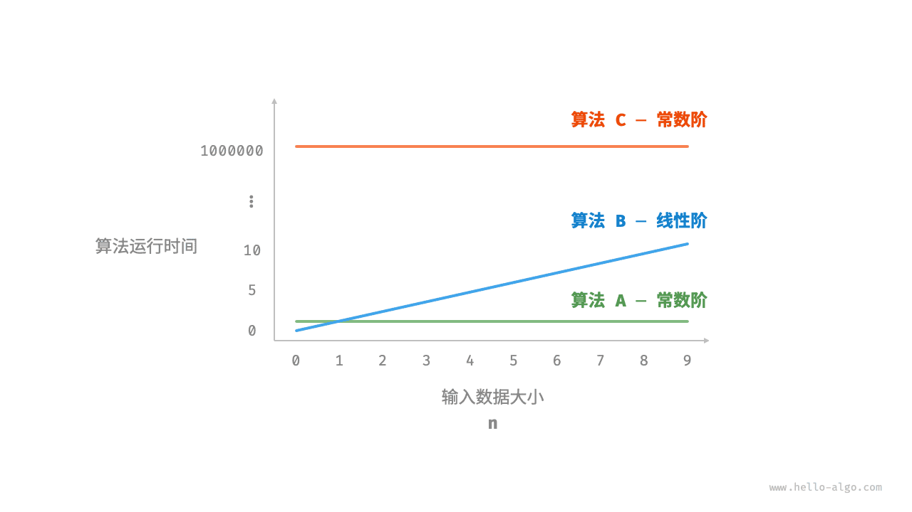

相较于直接统计算法的运行时间，时间复杂度分析有哪些特点呢？

- **时间复杂度能够有效评估算法效率**。例如，算法 `B` 的运行时间呈线性增长，在 $n > 1$ 时比算法 `A` 更慢，在 $n > 1000000$ 时比算法 `C` 更慢。事实上，只要输入数据大小 $n$ 足够大，复杂度为“常数阶”的算法一定优于“线性阶”的算法，这正是时间增长趋势的含义。
- **时间复杂度的推算方法更简便**。显然，运行平台和计算操作类型都与算法运行时间的增长趋势无关。因此在时间复杂度分析中，我们可以简单地将所有计算操作的执行时间视为相同的“单位时间”，从而将“计算操作运行时间统计”简化为“计算操作数量统计”，这样一来估算难度就大大降低了。
- **时间复杂度也存在一定的局限性**。例如，尽管算法 `A` 和 `C` 的时间复杂度相同，但实际运行时间差别很大。同样，尽管算法 `B` 的时间复杂度比 `C` 高，但在输入数据大小 $n$ 较小时，算法 `B` 明显优于算法 `C` 。对于此类情况，我们时常难以仅凭时间复杂度判断算法效率的高低。当然，尽管存在上述问题，复杂度分析仍然是评判算法效率最有效且常用的方法。

## 函数渐近上界

给定一个输入大小为 $n$ 的函数：

=== "Python"

    ```python title=""
    def algorithm(n: int):
        a = 1      # +1
        a = a + 1  # +1
        a = a * 2  # +1
        # 循环 n 次
        for i in range(n):  # +1
            print(0)        # +1
    ```

=== "C++"

    ```cpp title=""
    void algorithm(int n) {
        int a = 1;  // +1
        a = a + 1;  // +1
        a = a * 2;  // +1
        // 循环 n 次
        for (int i = 0; i < n; i++) { // +1（每轮都执行 i ++）
            cout << 0 << endl;    // +1
        }
    }
    ```

=== "Java"

    ```java title=""
    void algorithm(int n) {
        int a = 1;  // +1
        a = a + 1;  // +1
        a = a * 2;  // +1
        // 循环 n 次
        for (int i = 0; i < n; i++) { // +1（每轮都执行 i ++）
            System.out.println(0);    // +1
        }
    }
    ```

=== "C#"

    ```csharp title=""
    void Algorithm(int n) {
        int a = 1;  // +1
        a = a + 1;  // +1
        a = a * 2;  // +1
        // 循环 n 次
        for (int i = 0; i < n; i++) {   // +1（每轮都执行 i ++）
            Console.WriteLine(0);   // +1
        }
    }
    ```

=== "Go"

    ```go title=""
    func algorithm(n int) {
        a := 1      // +1
        a = a + 1   // +1
        a = a * 2   // +1
        // 循环 n 次
        for i := 0; i < n; i++ {   // +1
            fmt.Println(a)         // +1
        }
    }
    ```

=== "Swift"

    ```swift title=""
    func algorithm(n: Int) {
        var a = 1 // +1
        a = a + 1 // +1
        a = a * 2 // +1
        // 循环 n 次
        for _ in 0 ..< n { // +1
            print(0) // +1
        }
    }
    ```

=== "JS"

    ```javascript title=""
    function algorithm(n) {
        var a = 1; // +1
        a += 1; // +1
        a *= 2; // +1
        // 循环 n 次
        for(let i = 0; i < n; i++){ // +1（每轮都执行 i ++）
            console.log(0); // +1
        }
    }
    ```

=== "TS"

    ```typescript title=""
    function algorithm(n: number): void{
        var a: number = 1; // +1
        a += 1; // +1
        a *= 2; // +1
        // 循环 n 次
        for(let i = 0; i < n; i++){ // +1（每轮都执行 i ++）
            console.log(0); // +1
        }
    }
    ```

=== "Dart"

    ```dart title=""
    void algorithm(int n) {
      int a = 1; // +1
      a = a + 1; // +1
      a = a * 2; // +1
      // 循环 n 次
      for (int i = 0; i < n; i++) { // +1（每轮都执行 i ++）
        print(0); // +1
      }
    }
    ```

=== "Rust"

    ```rust title=""
    fn algorithm(n: i32) {
        let mut a = 1;   // +1
        a = a + 1;      // +1
        a = a * 2;      // +1

        // 循环 n 次
        for _ in 0..n { // +1（每轮都执行 i ++）
            println!("{}", 0); // +1
        }
    }
    ```

=== "C"

    ```c title=""
    void algorithm(int n) {
        int a = 1;  // +1
        a = a + 1;  // +1
        a = a * 2;  // +1
        // 循环 n 次
        for (int i = 0; i < n; i++) {   // +1（每轮都执行 i ++）
            printf("%d", 0);            // +1
        }
    }
    ```

=== "Kotlin"

    ```kotlin title=""
    fun algorithm(n: Int) {
        var a = 1 // +1
        a = a + 1 // +1
        a = a * 2 // +1
        // 循环 n 次
        for (i in 0..<n) { // +1（每轮都执行 i ++）
            println(0) // +1
        }
    }
    ```

=== "Ruby"

    ```ruby title=""
    def algorithm(n)
        a = 1       # +1
        a = a + 1   # +1
        a = a * 2   # +1
        # 循环 n 次
        (0...n).each do # +1
            puts 0      # +1
        end
    end
    ```

设算法的操作数量是一个关于输入数据大小 $n$ 的函数，记为 $T(n)$ ，则以上函数的操作数量为：

$$
T(n) = 3 + 2n
$$

$T(n)$ 是一次函数，说明其运行时间的增长趋势是线性的，因此它的时间复杂度是线性阶。

我们将线性阶的时间复杂度记为 $O(n)$ ，这个数学符号称为<u>大 $O$ 记号（big-$O$ notation）</u>，表示函数 $T(n)$ 的<u>渐近上界（asymptotic upper bound）</u>。

时间复杂度分析本质上是计算“操作数量 $T(n)$”的渐近上界，它具有明确的数学定义。

!!! note "函数渐近上界"

    若存在正实数 $c$ 和实数 $n_0$ ，使得对于所有的 $n > n_0$ ，均有 $T(n) \leq c \cdot f(n)$ ，则可认为 $f(n)$ 给出了 $T(n)$ 的一个渐近上界，记为 $T(n) = O(f(n))$ 。

如下图所示，计算渐近上界就是寻找一个函数 $f(n)$ ，使得当 $n$ 趋向于无穷大时，$T(n)$ 和 $f(n)$ 处于相同的增长级别，仅相差一个常数系数 $c$。

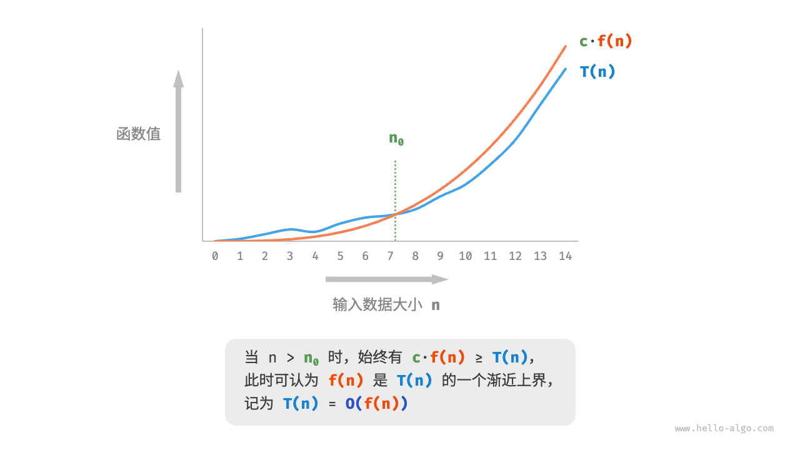

## 推算方法

渐近上界的数学味儿有点重，如果你感觉没有完全理解，也无须担心。我们可以先掌握推算方法，在不断的实践中，就可以逐渐领悟其数学意义。

根据定义，确定 $f(n)$ 之后，我们便可得到时间复杂度 $O(f(n))$ 。那么如何确定渐近上界 $f(n)$ 呢？总体分为两步：首先统计操作数量，然后判断渐近上界。

### 第一步：统计操作数量

针对代码，逐行从上到下计算即可。然而，由于上述 $c \cdot f(n)$ 中的常数系数 $c$ 可以取任意大小，**因此操作数量 $T(n)$ 中的各种系数、常数项都可以忽略**。根据此原则，可以总结出以下计数简化技巧。

1. **忽略 $T(n)$ 中的常数**。因为它们都与 $n$ 无关，所以对时间复杂度不产生影响。
2. **省略所有系数**。例如，循环 $2n$ 次、$5n + 1$ 次等，都可以简化记为 $n$ 次，因为 $n$ 前面的系数对时间复杂度没有影响。
3. **循环嵌套时使用乘法**。总操作数量等于外层循环和内层循环操作数量之积，每一层循环依然可以分别套用第 `1.` 点和第 `2.` 点的技巧。

给定一个函数，我们可以用上述技巧来统计操作数量：

=== "Python"

    ```python title=""
    def algorithm(n: int):
        a = 1      # +0（技巧 1）
        a = a + n  # +0（技巧 1）
        # +n（技巧 2）
        for i in range(5 * n + 1):
            print(0)
        # +n*n（技巧 3）
        for i in range(2 * n):
            for j in range(n + 1):
                print(0)
    ```

=== "C++"

    ```cpp title=""
    void algorithm(int n) {
        int a = 1;  // +0（技巧 1）
        a = a + n;  // +0（技巧 1）
        // +n（技巧 2）
        for (int i = 0; i < 5 * n + 1; i++) {
            cout << 0 << endl;
        }
        // +n*n（技巧 3）
        for (int i = 0; i < 2 * n; i++) {
            for (int j = 0; j < n + 1; j++) {
                cout << 0 << endl;
            }
        }
    }
    ```

=== "Java"

    ```java title=""
    void algorithm(int n) {
        int a = 1;  // +0（技巧 1）
        a = a + n;  // +0（技巧 1）
        // +n（技巧 2）
        for (int i = 0; i < 5 * n + 1; i++) {
            System.out.println(0);
        }
        // +n*n（技巧 3）
        for (int i = 0; i < 2 * n; i++) {
            for (int j = 0; j < n + 1; j++) {
                System.out.println(0);
            }
        }
    }
    ```

=== "C#"

    ```csharp title=""
    void Algorithm(int n) {
        int a = 1;  // +0（技巧 1）
        a = a + n;  // +0（技巧 1）
        // +n（技巧 2）
        for (int i = 0; i < 5 * n + 1; i++) {
            Console.WriteLine(0);
        }
        // +n*n（技巧 3）
        for (int i = 0; i < 2 * n; i++) {
            for (int j = 0; j < n + 1; j++) {
                Console.WriteLine(0);
            }
        }
    }
    ```

=== "Go"

    ```go title=""
    func algorithm(n int) {
        a := 1     // +0（技巧 1）
        a = a + n  // +0（技巧 1）
        // +n（技巧 2）
        for i := 0; i < 5 * n + 1; i++ {
            fmt.Println(0)
        }
        // +n*n（技巧 3）
        for i := 0; i < 2 * n; i++ {
            for j := 0; j < n + 1; j++ {
                fmt.Println(0)
            }
        }
    }
    ```

=== "Swift"

    ```swift title=""
    func algorithm(n: Int) {
        var a = 1 // +0（技巧 1）
        a = a + n // +0（技巧 1）
        // +n（技巧 2）
        for _ in 0 ..< (5 * n + 1) {
            print(0)
        }
        // +n*n（技巧 3）
        for _ in 0 ..< (2 * n) {
            for _ in 0 ..< (n + 1) {
                print(0)
            }
        }
    }
    ```

=== "JS"

    ```javascript title=""
    function algorithm(n) {
        let a = 1;  // +0（技巧 1）
        a = a + n;  // +0（技巧 1）
        // +n（技巧 2）
        for (let i = 0; i < 5 * n + 1; i++) {
            console.log(0);
        }
        // +n*n（技巧 3）
        for (let i = 0; i < 2 * n; i++) {
            for (let j = 0; j < n + 1; j++) {
                console.log(0);
            }
        }
    }
    ```

=== "TS"

    ```typescript title=""
    function algorithm(n: number): void {
        let a = 1;  // +0（技巧 1）
        a = a + n;  // +0（技巧 1）
        // +n（技巧 2）
        for (let i = 0; i < 5 * n + 1; i++) {
            console.log(0);
        }
        // +n*n（技巧 3）
        for (let i = 0; i < 2 * n; i++) {
            for (let j = 0; j < n + 1; j++) {
                console.log(0);
            }
        }
    }
    ```

=== "Dart"

    ```dart title=""
    void algorithm(int n) {
      int a = 1; // +0（技巧 1）
      a = a + n; // +0（技巧 1）
      // +n（技巧 2）
      for (int i = 0; i < 5 * n + 1; i++) {
        print(0);
      }
      // +n*n（技巧 3）
      for (int i = 0; i < 2 * n; i++) {
        for (int j = 0; j < n + 1; j++) {
          print(0);
        }
      }
    }
    ```

=== "Rust"

    ```rust title=""
    fn algorithm(n: i32) {
        let mut a = 1;     // +0（技巧 1）
        a = a + n;        // +0（技巧 1）

        // +n（技巧 2）
        for i in 0..(5 * n + 1) {
            println!("{}", 0);
        }

        // +n*n（技巧 3）
        for i in 0..(2 * n) {
            for j in 0..(n + 1) {
                println!("{}", 0);
            }
        }
    }
    ```

=== "C"

    ```c title=""
    void algorithm(int n) {
        int a = 1;  // +0（技巧 1）
        a = a + n;  // +0（技巧 1）
        // +n（技巧 2）
        for (int i = 0; i < 5 * n + 1; i++) {
            printf("%d", 0);
        }
        // +n*n（技巧 3）
        for (int i = 0; i < 2 * n; i++) {
            for (int j = 0; j < n + 1; j++) {
                printf("%d", 0);
            }
        }
    }
    ```

=== "Kotlin"

    ```kotlin title=""
    fun algorithm(n: Int) {
        var a = 1   // +0（技巧 1）
        a = a + n   // +0（技巧 1）
        // +n（技巧 2）
        for (i in 0..<5 * n + 1) {
            println(0)
        }
        // +n*n（技巧 3）
        for (i in 0..<2 * n) {
            for (j in 0..<n + 1) {
                println(0)
            }
        }
    }
    ```

=== "Ruby"

    ```ruby title=""
    def algorithm(n)
        a = 1       # +0（技巧 1）
        a = a + n   # +0（技巧 1）
        # +n（技巧 2）
        (0...(5 * n + 1)).each do { puts 0 }
        # +n*n（技巧 3）
        (0...(2 * n)).each do
            (0...(n + 1)).each do { puts 0 }
        end
    end
    ```

以下公式展示了使用上述技巧前后的统计结果，两者推算出的时间复杂度都为 $O(n^2)$ 。

$$
\begin{aligned}
T(n) & = 2n(n + 1) + (5n + 1) + 2 & \text{完整统计 (-.-|||)} \newline
& = 2n^2 + 7n + 3 \newline
T(n) & = n^2 + n & \text{偷懒统计 (o.O)}
\end{aligned}
$$

### 第二步：判断渐近上界

**时间复杂度由 $T(n)$ 中最高阶的项来决定**。这是因为在 $n$ 趋于无穷大时，最高阶的项将发挥主导作用，其他项的影响都可以忽略。

下表展示了一些例子，其中一些夸张的值是为了强调“系数无法撼动阶数”这一结论。当 $n$ 趋于无穷大时，这些常数变得无足轻重。

<p align="center"> 表 <id> &nbsp; 不同操作数量对应的时间复杂度 </p>

| 操作数量 $T(n)$        | 时间复杂度 $O(f(n))$ |
| ---------------------- | -------------------- |
| $100000$               | $O(1)$               |
| $3n + 2$               | $O(n)$               |
| $2n^2 + 3n + 2$        | $O(n^2)$             |
| $n^3 + 10000n^2$       | $O(n^3)$             |
| $2^n + 10000n^{10000}$ | $O(2^n)$             |

## 常见类型

设输入数据大小为 $n$ ，常见的时间复杂度类型如下图所示（按照从低到高的顺序排列）。

$$
\begin{aligned}
& O(1) < O(\log n) < O(n) < O(n \log n) < O(n^2) < O(2^n) < O(n!) \newline
& \text{常数阶} < \text{对数阶} < \text{线性阶} < \text{线性对数阶} < \text{平方阶} < \text{指数阶} < \text{阶乘阶}
\end{aligned}
$$

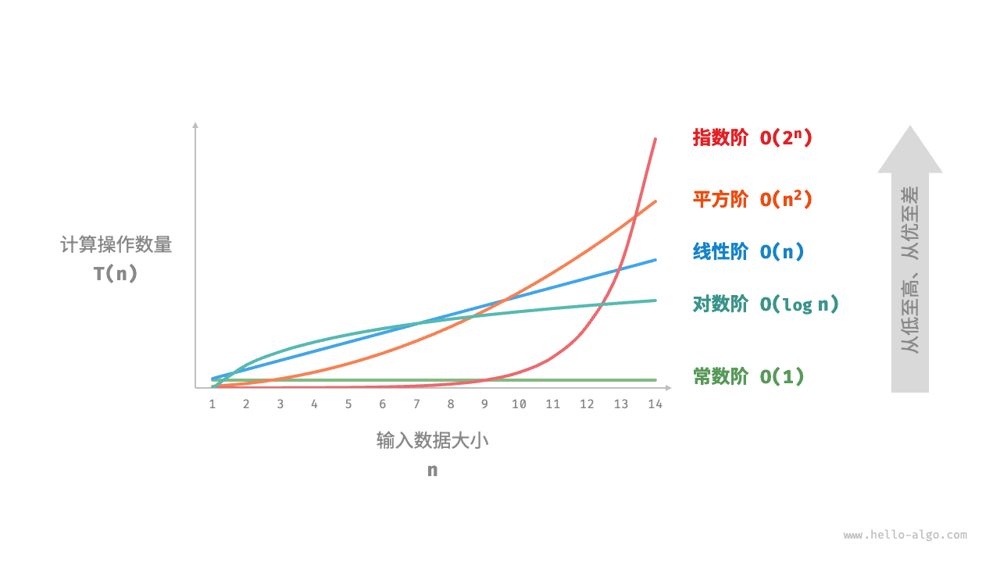

### 常数阶 $O(1)$

常数阶的操作数量与输入数据大小 $n$ 无关，即不随着 $n$ 的变化而变化。

在以下函数中，尽管操作数量 `size` 可能很大，但由于其与输入数据大小 $n$ 无关，因此时间复杂度仍为 $O(1)$ ：

```src
[file]{time_complexity}-[class]{}-[func]{constant}
```

### 线性阶 $O(n)$

线性阶的操作数量相对于输入数据大小 $n$ 以线性级别增长。线性阶通常出现在单层循环中：

```src
[file]{time_complexity}-[class]{}-[func]{linear}
```

遍历数组和遍历链表等操作的时间复杂度均为 $O(n)$ ，其中 $n$ 为数组或链表的长度：

```src
[file]{time_complexity}-[class]{}-[func]{array_traversal}
```

值得注意的是，**输入数据大小 $n$ 需根据输入数据的类型来具体确定**。比如在第一个示例中，变量 $n$ 为输入数据大小；在第二个示例中，数组长度 $n$ 为数据大小。

### 平方阶 $O(n^2)$

平方阶的操作数量相对于输入数据大小 $n$ 以平方级别增长。平方阶通常出现在嵌套循环中，外层循环和内层循环的时间复杂度都为 $O(n)$ ，因此总体的时间复杂度为 $O(n^2)$ ：

```src
[file]{time_complexity}-[class]{}-[func]{quadratic}
```

下图对比了常数阶、线性阶和平方阶三种时间复杂度。

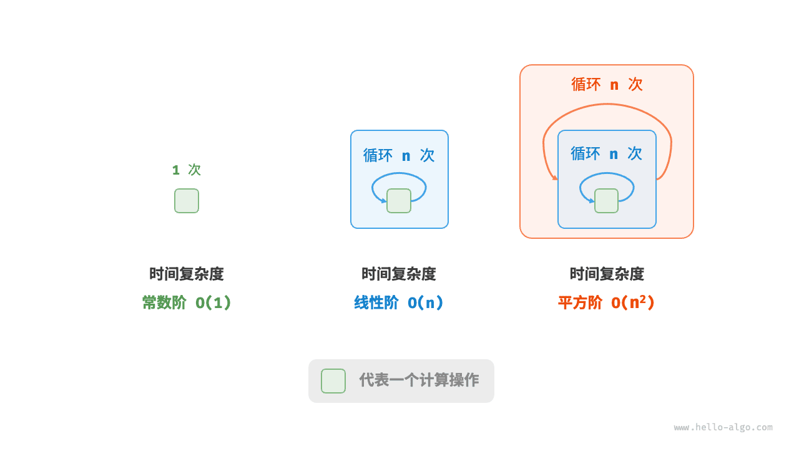

以冒泡排序为例，外层循环执行 $n - 1$ 次，内层循环执行 $n-1$、$n-2$、$\dots$、$2$、$1$ 次，平均为 $n / 2$ 次，因此时间复杂度为 $O((n - 1) n / 2) = O(n^2)$ ：

```src
[file]{time_complexity}-[class]{}-[func]{bubble_sort}
```

### 指数阶 $O(2^n)$

生物学的“细胞分裂”是指数阶增长的典型例子：初始状态为 $1$ 个细胞，分裂一轮后变为 $2$ 个，分裂两轮后变为 $4$ 个，以此类推，分裂 $n$ 轮后有 $2^n$ 个细胞。

下图和以下代码模拟了细胞分裂的过程，时间复杂度为 $O(2^n)$ 。请注意，输入 $n$ 表示分裂轮数，返回值 `count` 表示总分裂次数。

```src
[file]{time_complexity}-[class]{}-[func]{exponential}
```

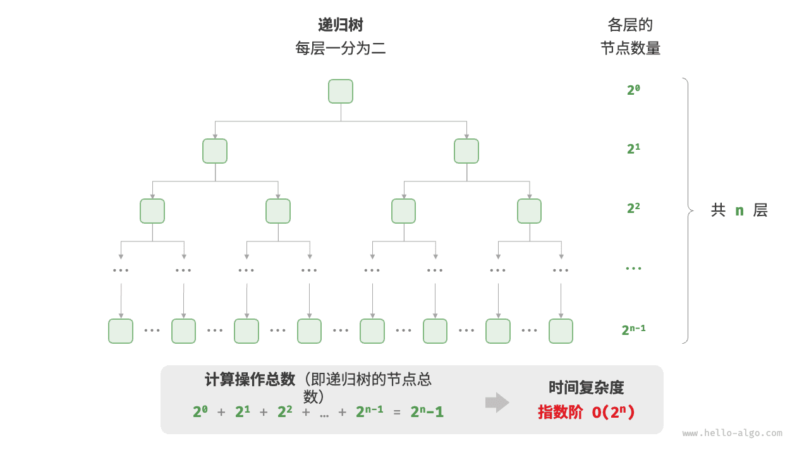

在实际算法中，指数阶常出现于递归函数中。例如在以下代码中，其递归地一分为二，经过 $n$ 次分裂后停止：

```src
[file]{time_complexity}-[class]{}-[func]{exp_recur}
```

指数阶增长非常迅速，在穷举法（暴力搜索、回溯等）中比较常见。对于数据规模较大的问题，指数阶是不可接受的，通常需要使用动态规划或贪心算法等来解决。

### 对数阶 $O(\log n)$

与指数阶相反，对数阶反映了“每轮缩减到一半”的情况。设输入数据大小为 $n$ ，由于每轮缩减到一半，因此循环次数是 $\log_2 n$ ，即 $2^n$ 的反函数。

下图和以下代码模拟了“每轮缩减到一半”的过程，时间复杂度为 $O(\log_2 n)$ ，简记为 $O(\log n)$ ：

```src
[file]{time_complexity}-[class]{}-[func]{logarithmic}
```

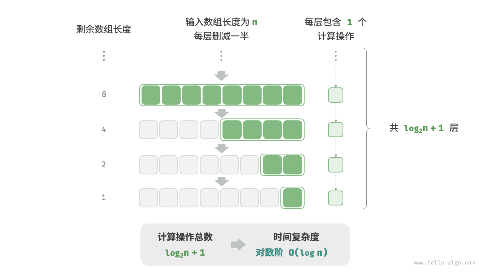

与指数阶类似，对数阶也常出现于递归函数中。以下代码形成了一棵高度为 $\log_2 n$ 的递归树：

```src
[file]{time_complexity}-[class]{}-[func]{log_recur}
```

对数阶常出现于基于分治策略的算法中，体现了“一分为多”和“化繁为简”的算法思想。它增长缓慢，是仅次于常数阶的理想的时间复杂度。

!!! tip "$O(\log n)$ 的底数是多少？"

    准确来说，“一分为 $m$”对应的时间复杂度是 $O(\log_m n)$ 。而通过对数换底公式，我们可以得到具有不同底数、相等的时间复杂度：

    $$
    O(\log_m n) = O(\log_k n / \log_k m) = O(\log_k n)
    $$

    也就是说，底数 $m$ 可以在不影响复杂度的前提下转换。因此我们通常会省略底数 $m$ ，将对数阶直接记为 $O(\log n)$ 。

### 线性对数阶 $O(n \log n)$

线性对数阶常出现于嵌套循环中，两层循环的时间复杂度分别为 $O(\log n)$ 和 $O(n)$ 。相关代码如下：

```src
[file]{time_complexity}-[class]{}-[func]{linear_log_recur}
```

下图展示了线性对数阶的生成方式。二叉树的每一层的操作总数都为 $n$ ，树共有 $\log_2 n + 1$ 层，因此时间复杂度为 $O(n \log n)$ 。

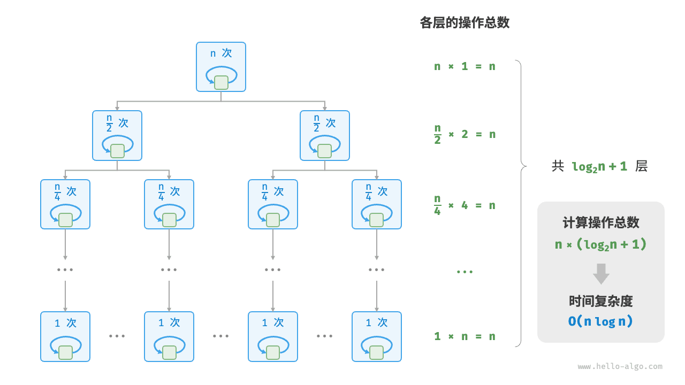

主流排序算法的时间复杂度通常为 $O(n \log n)$ ，例如快速排序、归并排序、堆排序等。

### 阶乘阶 $O(n!)$

阶乘阶对应数学上的“全排列”问题。给定 $n$ 个互不重复的元素，求其所有可能的排列方案，方案数量为：

$$
n! = n \times (n - 1) \times (n - 2) \times \dots \times 2 \times 1
$$

阶乘通常使用递归实现。如下图和以下代码所示，第一层分裂出 $n$ 个，第二层分裂出 $n - 1$ 个，以此类推，直至第 $n$ 层时停止分裂：

```src
[file]{time_complexity}-[class]{}-[func]{factorial_recur}
```

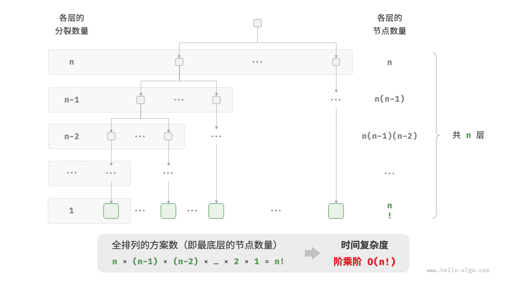

请注意，因为当 $n \geq 4$ 时恒有 $n! > 2^n$ ，所以阶乘阶比指数阶增长得更快，在 $n$ 较大时也是不可接受的。

## 最差、最佳、平均时间复杂度

**算法的时间效率往往不是固定的，而是与输入数据的分布有关**。假设输入一个长度为 $n$ 的数组 `nums` ，其中 `nums` 由从 $1$ 至 $n$ 的数字组成，每个数字只出现一次；但元素顺序是随机打乱的，任务目标是返回元素 $1$ 的索引。我们可以得出以下结论。

- 当 `nums = [?, ?, ..., 1]` ，即当末尾元素是 $1$ 时，需要完整遍历数组，**达到最差时间复杂度 $O(n)$** 。
- 当 `nums = [1, ?, ?, ...]` ，即当首个元素为 $1$ 时，无论数组多长都不需要继续遍历，**达到最佳时间复杂度 $\Omega(1)$** 。

“最差时间复杂度”对应函数渐近上界，使用大 $O$ 记号表示。相应地，“最佳时间复杂度”对应函数渐近下界，用 $\Omega$ 记号表示：

```src
[file]{worst_best_time_complexity}-[class]{}-[func]{find_one}
```

值得说明的是，我们在实际中很少使用最佳时间复杂度，因为通常只有在很小概率下才能达到，可能会带来一定的误导性。**而最差时间复杂度更为实用，因为它给出了一个效率安全值**，让我们可以放心地使用算法。

从上述示例可以看出，最差时间复杂度和最佳时间复杂度只出现于“特殊的数据分布”，这些情况的出现概率可能很小，并不能真实地反映算法运行效率。相比之下，**平均时间复杂度可以体现算法在随机输入数据下的运行效率**，用 $\Theta$ 记号来表示。

对于部分算法，我们可以简单地推算出随机数据分布下的平均情况。比如上述示例，由于输入数组是被打乱的，因此元素 $1$ 出现在任意索引的概率都是相等的，那么算法的平均循环次数就是数组长度的一半 $n / 2$ ，平均时间复杂度为 $\Theta(n / 2) = \Theta(n)$ 。

但对于较为复杂的算法，计算平均时间复杂度往往比较困难，因为很难分析出在数据分布下的整体数学期望。在这种情况下，我们通常使用最差时间复杂度作为算法效率的评判标准。

!!! question "为什么很少看到 $\Theta$ 符号？"

    可能由于 $O$ 符号过于朗朗上口，因此我们常常使用它来表示平均时间复杂度。但从严格意义上讲，这种做法并不规范。在本书和其他资料中，若遇到类似“平均时间复杂度 $O(n)$”的表述，请将其直接理解为 $\Theta(n)$ 。

---

# 2.4 &nbsp; 空间复杂度

---

# 空间复杂度

<u>空间复杂度（space complexity）</u>用于衡量算法占用内存空间随着数据量变大时的增长趋势。这个概念与时间复杂度非常类似，只需将“运行时间”替换为“占用内存空间”。

## 算法相关空间

算法在运行过程中使用的内存空间主要包括以下几种。

- **输入空间**：用于存储算法的输入数据。
- **暂存空间**：用于存储算法在运行过程中的变量、对象、函数上下文等数据。
- **输出空间**：用于存储算法的输出数据。

一般情况下，空间复杂度的统计范围是“暂存空间”加上“输出空间”。

暂存空间可以进一步划分为三个部分。

- **暂存数据**：用于保存算法运行过程中的各种常量、变量、对象等。
- **栈帧空间**：用于保存调用函数的上下文数据。系统在每次调用函数时都会在栈顶部创建一个栈帧，函数返回后，栈帧空间会被释放。
- **指令空间**：用于保存编译后的程序指令，在实际统计中通常忽略不计。

在分析一段程序的空间复杂度时，**我们通常统计暂存数据、栈帧空间和输出数据三部分**，如下图所示。

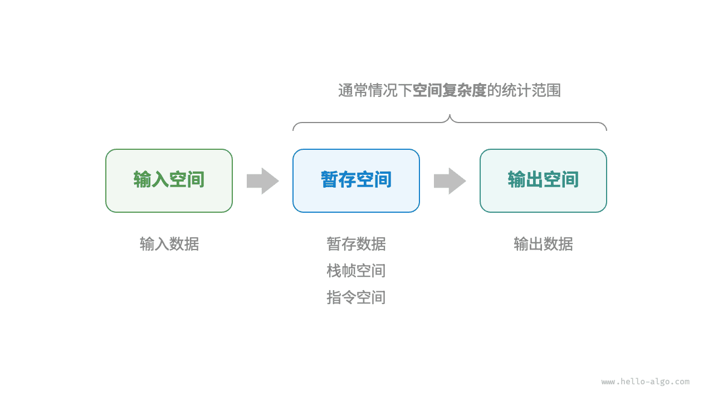

相关代码如下：

=== "Python"

    ```python title=""
    class Node:
        """类"""
        def __init__(self, x: int):
            self.val: int = x              # 节点值
            self.next: Node | None = None  # 指向下一节点的引用

    def function() -> int:
        """函数"""
        # 执行某些操作...
        return 0

    def algorithm(n) -> int:  # 输入数据
        A = 0                 # 暂存数据（常量，一般用大写字母表示）
        b = 0                 # 暂存数据（变量）
        node = Node(0)        # 暂存数据（对象）
        c = function()        # 栈帧空间（调用函数）
        return A + b + c      # 输出数据
    ```

=== "C++"

    ```cpp title=""
    /* 结构体 */
    struct Node {
        int val;
        Node *next;
        Node(int x) : val(x), next(nullptr) {}
    };

    /* 函数 */
    int func() {
        // 执行某些操作...
        return 0;
    }

    int algorithm(int n) {        // 输入数据
        const int a = 0;          // 暂存数据（常量）
        int b = 0;                // 暂存数据（变量）
        Node* node = new Node(0); // 暂存数据（对象）
        int c = func();           // 栈帧空间（调用函数）
        return a + b + c;         // 输出数据
    }
    ```

=== "Java"

    ```java title=""
    /* 类 */
    class Node {
        int val;
        Node next;
        Node(int x) { val = x; }
    }
    
    /* 函数 */
    int function() {
        // 执行某些操作...
        return 0;
    }
    
    int algorithm(int n) {        // 输入数据
        final int a = 0;          // 暂存数据（常量）
        int b = 0;                // 暂存数据（变量）
        Node node = new Node(0);  // 暂存数据（对象）
        int c = function();       // 栈帧空间（调用函数）
        return a + b + c;         // 输出数据
    }
    ```

=== "C#"

    ```csharp title=""
    /* 类 */
    class Node(int x) {
        int val = x;
        Node next;
    }

    /* 函数 */
    int Function() {
        // 执行某些操作...
        return 0;
    }

    int Algorithm(int n) {        // 输入数据
        const int a = 0;          // 暂存数据（常量）
        int b = 0;                // 暂存数据（变量）
        Node node = new(0);       // 暂存数据（对象）
        int c = Function();       // 栈帧空间（调用函数）
        return a + b + c;         // 输出数据
    }
    ```

=== "Go"

    ```go title=""
    /* 结构体 */
    type node struct {
        val  int
        next *node
    }

    /* 创建 node 结构体  */
    func newNode(val int) *node {
        return &node{val: val}
    }
    
    /* 函数 */
    func function() int {
        // 执行某些操作...
        return 0
    }

    func algorithm(n int) int { // 输入数据
        const a = 0             // 暂存数据（常量）
        b := 0                  // 暂存数据（变量）
        newNode(0)              // 暂存数据（对象）
        c := function()         // 栈帧空间（调用函数）
        return a + b + c        // 输出数据
    }
    ```

=== "Swift"

    ```swift title=""
    /* 类 */
    class Node {
        var val: Int
        var next: Node?

        init(x: Int) {
            val = x
        }
    }

    /* 函数 */
    func function() -> Int {
        // 执行某些操作...
        return 0
    }

    func algorithm(n: Int) -> Int { // 输入数据
        let a = 0             // 暂存数据（常量）
        var b = 0             // 暂存数据（变量）
        let node = Node(x: 0) // 暂存数据（对象）
        let c = function()    // 栈帧空间（调用函数）
        return a + b + c      // 输出数据
    }
    ```

=== "JS"

    ```javascript title=""
    /* 类 */
    class Node {
        val;
        next;
        constructor(val) {
            this.val = val === undefined ? 0 : val; // 节点值
            this.next = null;                       // 指向下一节点的引用
        }
    }

    /* 函数 */
    function constFunc() {
        // 执行某些操作
        return 0;
    }

    function algorithm(n) {       // 输入数据
        const a = 0;              // 暂存数据（常量）
        let b = 0;                // 暂存数据（变量）
        const node = new Node(0); // 暂存数据（对象）
        const c = constFunc();    // 栈帧空间（调用函数）
        return a + b + c;         // 输出数据
    }
    ```

=== "TS"

    ```typescript title=""
    /* 类 */
    class Node {
        val: number;
        next: Node | null;
        constructor(val?: number) {
            this.val = val === undefined ? 0 : val; // 节点值
            this.next = null;                       // 指向下一节点的引用
        }
    }

    /* 函数 */
    function constFunc(): number {
        // 执行某些操作
        return 0;
    }

    function algorithm(n: number): number { // 输入数据
        const a = 0;                        // 暂存数据（常量）
        let b = 0;                          // 暂存数据（变量）
        const node = new Node(0);           // 暂存数据（对象）
        const c = constFunc();              // 栈帧空间（调用函数）
        return a + b + c;                   // 输出数据
    }
    ```

=== "Dart"

    ```dart title=""
    /* 类 */
    class Node {
      int val;
      Node next;
      Node(this.val, [this.next]);
    }

    /* 函数 */
    int function() {
      // 执行某些操作...
      return 0;
    }

    int algorithm(int n) {  // 输入数据
      const int a = 0;      // 暂存数据（常量）
      int b = 0;            // 暂存数据（变量）
      Node node = Node(0);  // 暂存数据（对象）
      int c = function();   // 栈帧空间（调用函数）
      return a + b + c;     // 输出数据
    }
    ```

=== "Rust"

    ```rust title=""
    use std::rc::Rc;
    use std::cell::RefCell;
    
    /* 结构体 */
    struct Node {
        val: i32,
        next: Option<Rc<RefCell<Node>>>,
    }

    /* 创建 Node 结构体 */
    impl Node {
        fn new(val: i32) -> Self {
            Self { val: val, next: None }
        }
    }

    /* 函数 */
    fn function() -> i32 {      
        // 执行某些操作...
        return 0;
    }

    fn algorithm(n: i32) -> i32 {       // 输入数据
        const a: i32 = 0;               // 暂存数据（常量）
        let mut b = 0;                  // 暂存数据（变量）
        let node = Node::new(0);        // 暂存数据（对象）
        let c = function();             // 栈帧空间（调用函数）
        return a + b + c;               // 输出数据
    }
    ```

=== "C"

    ```c title=""
    /* 函数 */
    int func() {
        // 执行某些操作...
        return 0;
    }

    int algorithm(int n) { // 输入数据
        const int a = 0;   // 暂存数据（常量）
        int b = 0;         // 暂存数据（变量）
        int c = func();    // 栈帧空间（调用函数）
        return a + b + c;  // 输出数据
    }
    ```

=== "Kotlin"

    ```kotlin title=""
    /* 类 */
    class Node(var _val: Int) {
        var next: Node? = null
    }

    /* 函数 */
    fun function(): Int {
        // 执行某些操作...
        return 0
    }

    fun algorithm(n: Int): Int { // 输入数据
        val a = 0                // 暂存数据（常量）
        var b = 0                // 暂存数据（变量）
        val node = Node(0)       // 暂存数据（对象）
        val c = function()       // 栈帧空间（调用函数）
        return a + b + c         // 输出数据
    }
    ```

=== "Ruby"

    ```ruby title=""
    ### 类 ###
    class Node
        attr_accessor :val      # 节点值
        attr_accessor :next     # 指向下一节点的引用

        def initialize(x)
            @val = x
        end
    end

    ### 函数 ###
    def function
        # 执行某些操作...
        0
    end

    ### 算法 ###
    def algorithm(n)        # 输入数据
        a = 0               # 暂存数据（常量）
        b = 0               # 暂存数据（变量）
        node = Node.new(0)  # 暂存数据（对象）
        c = function        # 栈帧空间（调用函数）
        a + b + c           # 输出数据
    end
    ```

## 推算方法

空间复杂度的推算方法与时间复杂度大致相同，只需将统计对象从“操作数量”转为“使用空间大小”。

而与时间复杂度不同的是，**我们通常只关注最差空间复杂度**。这是因为内存空间是一项硬性要求，我们必须确保在所有输入数据下都有足够的内存空间预留。

观察以下代码，最差空间复杂度中的“最差”有两层含义。

1. **以最差输入数据为准**：当 $n < 10$ 时，空间复杂度为 $O(1)$ ；但当 $n > 10$ 时，初始化的数组 `nums` 占用 $O(n)$ 空间，因此最差空间复杂度为 $O(n)$ 。
2. **以算法运行中的峰值内存为准**：例如，程序在执行最后一行之前，占用 $O(1)$ 空间；当初始化数组 `nums` 时，程序占用 $O(n)$ 空间，因此最差空间复杂度为 $O(n)$ 。

=== "Python"

    ```python title=""
    def algorithm(n: int):
        a = 0               # O(1)
        b = [0] * 10000     # O(1)
        if n > 10:
            nums = [0] * n  # O(n)
    ```

=== "C++"

    ```cpp title=""
    void algorithm(int n) {
        int a = 0;               // O(1)
        vector<int> b(10000);    // O(1)
        if (n > 10)
            vector<int> nums(n); // O(n)
    }
    ```

=== "Java"

    ```java title=""
    void algorithm(int n) {
        int a = 0;                   // O(1)
        int[] b = new int[10000];    // O(1)
        if (n > 10)
            int[] nums = new int[n]; // O(n)
    }
    ```

=== "C#"

    ```csharp title=""
    void Algorithm(int n) {
        int a = 0;                   // O(1)
        int[] b = new int[10000];    // O(1)
        if (n > 10) {
            int[] nums = new int[n]; // O(n)
        }
    }
    ```

=== "Go"

    ```go title=""
    func algorithm(n int) {
        a := 0                      // O(1)
        b := make([]int, 10000)     // O(1)
        var nums []int
        if n > 10 {
            nums := make([]int, n)  // O(n)
        }
        fmt.Println(a, b, nums)
    }
    ```

=== "Swift"

    ```swift title=""
    func algorithm(n: Int) {
        let a = 0 // O(1)
        let b = Array(repeating: 0, count: 10000) // O(1)
        if n > 10 {
            let nums = Array(repeating: 0, count: n) // O(n)
        }
    }
    ```

=== "JS"

    ```javascript title=""
    function algorithm(n) {
        const a = 0;                   // O(1)
        const b = new Array(10000);    // O(1)
        if (n > 10) {
            const nums = new Array(n); // O(n)
        }
    }
    ```

=== "TS"

    ```typescript title=""
    function algorithm(n: number): void {
        const a = 0;                   // O(1)
        const b = new Array(10000);    // O(1)
        if (n > 10) {
            const nums = new Array(n); // O(n)
        }
    }
    ```

=== "Dart"

    ```dart title=""
    void algorithm(int n) {
      int a = 0;                            // O(1)
      List<int> b = List.filled(10000, 0);  // O(1)
      if (n > 10) {
        List<int> nums = List.filled(n, 0); // O(n)
      }
    }
    ```

=== "Rust"

    ```rust title=""
    fn algorithm(n: i32) {
        let a = 0;                              // O(1)
        let b = [0; 10000];                     // O(1)
        if n > 10 {
            let nums = vec![0; n as usize];     // O(n)
        }
    }
    ```

=== "C"

    ```c title=""
    void algorithm(int n) {
        int a = 0;               // O(1)
        int b[10000];            // O(1)
        if (n > 10)
            int nums[n] = {0};   // O(n)
    }
    ```

=== "Kotlin"

    ```kotlin title=""
    fun algorithm(n: Int) {
        val a = 0                    // O(1)
        val b = IntArray(10000)      // O(1)
        if (n > 10) {
            val nums = IntArray(n)   // O(n)
        }
    }
    ```

=== "Ruby"

    ```ruby title=""
    def algorithm(n)
        a = 0                           # O(1)
        b = Array.new(10000)            # O(1)
        nums = Array.new(n) if n > 10   # O(n)
    end
    ```

**在递归函数中，需要注意统计栈帧空间**。观察以下代码：

=== "Python"

    ```python title=""
    def function() -> int:
        # 执行某些操作
        return 0

    def loop(n: int):
        """循环的空间复杂度为 O(1)"""
        for _ in range(n):
            function()

    def recur(n: int):
        """递归的空间复杂度为 O(n)"""
        if n == 1:
            return
        return recur(n - 1)
    ```

=== "C++"

    ```cpp title=""
    int func() {
        // 执行某些操作
        return 0;
    }
    /* 循环的空间复杂度为 O(1) */
    void loop(int n) {
        for (int i = 0; i < n; i++) {
            func();
        }
    }
    /* 递归的空间复杂度为 O(n) */
    void recur(int n) {
        if (n == 1) return;
        recur(n - 1);
    }
    ```

=== "Java"

    ```java title=""
    int function() {
        // 执行某些操作
        return 0;
    }
    /* 循环的空间复杂度为 O(1) */
    void loop(int n) {
        for (int i = 0; i < n; i++) {
            function();
        }
    }
    /* 递归的空间复杂度为 O(n) */
    void recur(int n) {
        if (n == 1) return;
        recur(n - 1);
    }
    ```

=== "C#"

    ```csharp title=""
    int Function() {
        // 执行某些操作
        return 0;
    }
    /* 循环的空间复杂度为 O(1) */
    void Loop(int n) {
        for (int i = 0; i < n; i++) {
            Function();
        }
    }
    /* 递归的空间复杂度为 O(n) */
    int Recur(int n) {
        if (n == 1) return 1;
        return Recur(n - 1);
    }
    ```

=== "Go"

    ```go title=""
    func function() int {
        // 执行某些操作
        return 0
    }
    
    /* 循环的空间复杂度为 O(1) */
    func loop(n int) {
        for i := 0; i < n; i++ {
            function()
        }
    }
    
    /* 递归的空间复杂度为 O(n) */
    func recur(n int) {
        if n == 1 {
            return
        }
        recur(n - 1)
    }
    ```

=== "Swift"

    ```swift title=""
    @discardableResult
    func function() -> Int {
        // 执行某些操作
        return 0
    }

    /* 循环的空间复杂度为 O(1) */
    func loop(n: Int) {
        for _ in 0 ..< n {
            function()
        }
    }

    /* 递归的空间复杂度为 O(n) */
    func recur(n: Int) {
        if n == 1 {
            return
        }
        recur(n: n - 1)
    }
    ```

=== "JS"

    ```javascript title=""
    function constFunc() {
        // 执行某些操作
        return 0;
    }
    /* 循环的空间复杂度为 O(1) */
    function loop(n) {
        for (let i = 0; i < n; i++) {
            constFunc();
        }
    }
    /* 递归的空间复杂度为 O(n) */
    function recur(n) {
        if (n === 1) return;
        return recur(n - 1);
    }
    ```

=== "TS"

    ```typescript title=""
    function constFunc(): number {
        // 执行某些操作
        return 0;
    }
    /* 循环的空间复杂度为 O(1) */
    function loop(n: number): void {
        for (let i = 0; i < n; i++) {
            constFunc();
        }
    }
    /* 递归的空间复杂度为 O(n) */
    function recur(n: number): void {
        if (n === 1) return;
        return recur(n - 1);
    }
    ```

=== "Dart"

    ```dart title=""
    int function() {
      // 执行某些操作
      return 0;
    }
    /* 循环的空间复杂度为 O(1) */
    void loop(int n) {
      for (int i = 0; i < n; i++) {
        function();
      }
    }
    /* 递归的空间复杂度为 O(n) */
    void recur(int n) {
      if (n == 1) return;
      recur(n - 1);
    }
    ```

=== "Rust"

    ```rust title=""
    fn function() -> i32 {
        // 执行某些操作
        return 0;
    }
    /* 循环的空间复杂度为 O(1) */
    fn loop(n: i32) {
        for i in 0..n {
            function();
        }
    }
    /* 递归的空间复杂度为 O(n) */
    fn recur(n: i32) {
        if n == 1 {
            return;
        }
        recur(n - 1);
    }
    ```

=== "C"

    ```c title=""
    int func() {
        // 执行某些操作
        return 0;
    }
    /* 循环的空间复杂度为 O(1) */
    void loop(int n) {
        for (int i = 0; i < n; i++) {
            func();
        }
    }
    /* 递归的空间复杂度为 O(n) */
    void recur(int n) {
        if (n == 1) return;
        recur(n - 1);
    }
    ```

=== "Kotlin"

    ```kotlin title=""
    fun function(): Int {
        // 执行某些操作
        return 0
    }
    /* 循环的空间复杂度为 O(1) */
    fun loop(n: Int) {
        for (i in 0..<n) {
            function()
        }
    }
    /* 递归的空间复杂度为 O(n) */
    fun recur(n: Int) {
        if (n == 1) return
        return recur(n - 1)
    }
    ```

=== "Ruby"

    ```ruby title=""
    def function
        # 执行某些操作
        0
    end

    ### 循环的空间复杂度为 O(1) ###
    def loop(n)
        (0...n).each { function }
    end

    ### 递归的空间复杂度为 O(n) ###
    def recur(n)
        return if n == 1
        recur(n - 1)
    end
    ```

函数 `loop()` 和 `recur()` 的时间复杂度都为 $O(n)$ ，但空间复杂度不同。

- 函数 `loop()` 在循环中调用了 $n$ 次 `function()` ，每轮中的 `function()` 都返回并释放了栈帧空间，因此空间复杂度仍为 $O(1)$ 。
- 递归函数 `recur()` 在运行过程中会同时存在 $n$ 个未返回的 `recur()` ，从而占用 $O(n)$ 的栈帧空间。

## 常见类型

设输入数据大小为 $n$ ，下图展示了常见的空间复杂度类型（从低到高排列）。

$$
\begin{aligned}
& O(1) < O(\log n) < O(n) < O(n^2) < O(2^n) \newline
& \text{常数阶} < \text{对数阶} < \text{线性阶} < \text{平方阶} < \text{指数阶}
\end{aligned}
$$

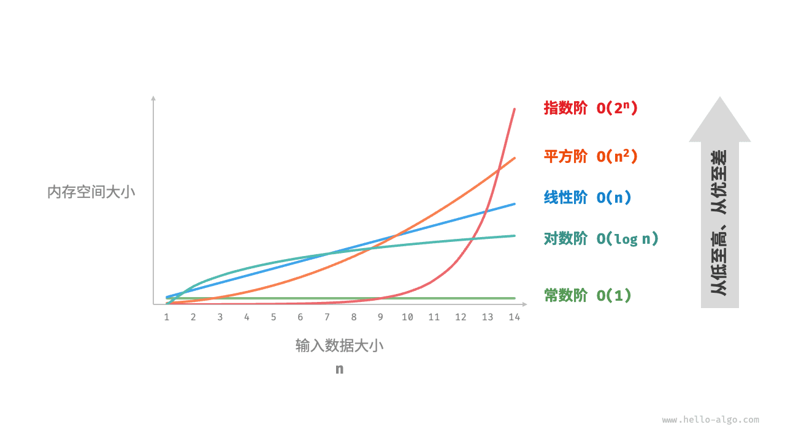

### 常数阶 $O(1)$

常数阶常见于数量与输入数据大小 $n$ 无关的常量、变量、对象。

需要注意的是，在循环中初始化变量或调用函数而占用的内存，在进入下一循环后就会被释放，因此不会累积占用空间，空间复杂度仍为 $O(1)$ ：

```src
[file]{space_complexity}-[class]{}-[func]{constant}
```

### 线性阶 $O(n)$

线性阶常见于元素数量与 $n$ 成正比的数组、链表、栈、队列等：

```src
[file]{space_complexity}-[class]{}-[func]{linear}
```

如下图所示，此函数的递归深度为 $n$ ，即同时存在 $n$ 个未返回的 `linear_recur()` 函数，使用 $O(n)$ 大小的栈帧空间：

```src
[file]{space_complexity}-[class]{}-[func]{linear_recur}
```

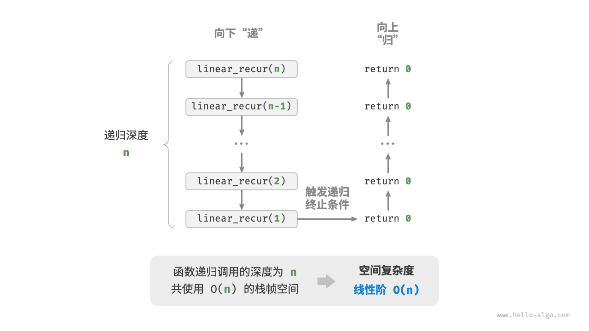

### 平方阶 $O(n^2)$

平方阶常见于矩阵和图，元素数量与 $n$ 成平方关系：

```src
[file]{space_complexity}-[class]{}-[func]{quadratic}
```

如下图所示，该函数的递归深度为 $n$ ，在每个递归函数中都初始化了一个数组，长度分别为 $n$、$n-1$、$\dots$、$2$、$1$ ，平均长度为 $n / 2$ ，因此总体占用 $O(n^2)$ 空间：

```src
[file]{space_complexity}-[class]{}-[func]{quadratic_recur}
```

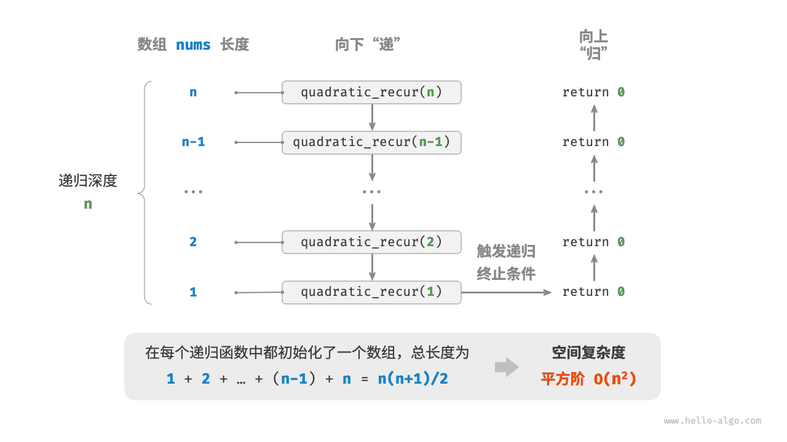

### 指数阶 $O(2^n)$

指数阶常见于二叉树。观察下图，层数为 $n$ 的“满二叉树”的节点数量为 $2^n - 1$ ，占用 $O(2^n)$ 空间：

```src
[file]{space_complexity}-[class]{}-[func]{build_tree}
```

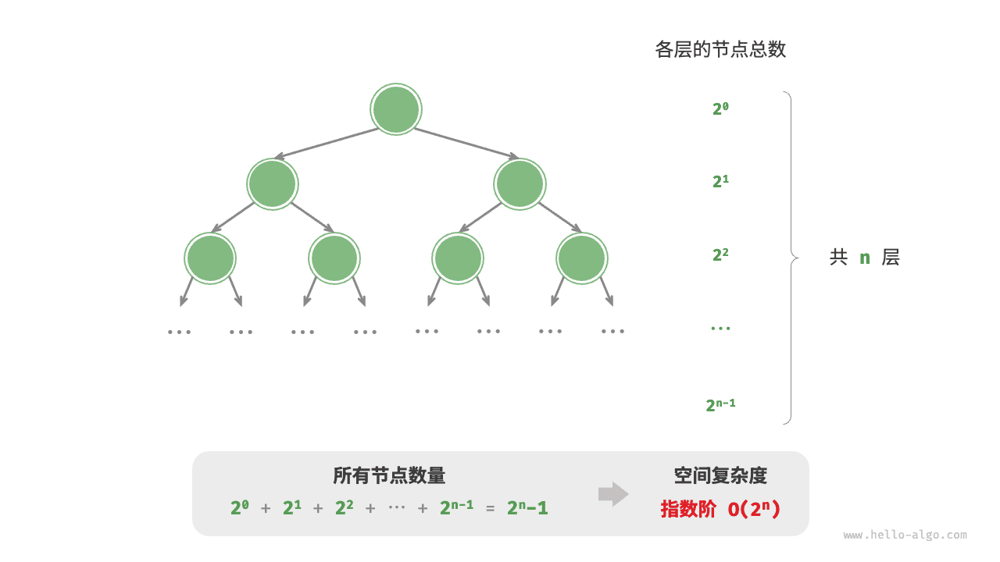

### 对数阶 $O(\log n)$

对数阶常见于分治算法。例如归并排序，输入长度为 $n$ 的数组，每轮递归将数组从中点处划分为两半，形成高度为 $\log n$ 的递归树，使用 $O(\log n)$ 栈帧空间。

再例如将数字转化为字符串，输入一个正整数 $n$ ，它的位数为 $\lfloor \log_{10} n \rfloor + 1$ ，即对应字符串长度为 $\lfloor \log_{10} n \rfloor + 1$ ，因此空间复杂度为 $O(\log_{10} n + 1) = O(\log n)$ 。

## 权衡时间与空间

理想情况下，我们希望算法的时间复杂度和空间复杂度都能达到最优。然而在实际情况中，同时优化时间复杂度和空间复杂度通常非常困难。

**降低时间复杂度通常需要以提升空间复杂度为代价，反之亦然**。我们将牺牲内存空间来提升算法运行速度的思路称为“以空间换时间”；反之，则称为“以时间换空间”。

选择哪种思路取决于我们更看重哪个方面。在大多数情况下，时间比空间更宝贵，因此“以空间换时间”通常是更常用的策略。当然，在数据量很大的情况下，控制空间复杂度也非常重要。

---

# 2.5 &nbsp; 小结

---

# 小结

### 重点回顾

**算法效率评估**

- 时间效率和空间效率是衡量算法优劣的两个主要评价指标。
- 我们可以通过实际测试来评估算法效率，但难以消除测试环境的影响，且会耗费大量计算资源。
- 复杂度分析可以消除实际测试的弊端，分析结果适用于所有运行平台，并且能够揭示算法在不同数据规模下的效率。

**时间复杂度**

- 时间复杂度用于衡量算法运行时间随数据量增长的趋势，可以有效评估算法效率，但在某些情况下可能失效，如在输入的数据量较小或时间复杂度相同时，无法精确对比算法效率的优劣。
- 最差时间复杂度使用大 $O$ 符号表示，对应函数渐近上界，反映当 $n$ 趋向正无穷时，操作数量 $T(n)$ 的增长级别。
- 推算时间复杂度分为两步，首先统计操作数量，然后判断渐近上界。
- 常见时间复杂度从低到高排列有 $O(1)$、$O(\log n)$、$O(n)$、$O(n \log n)$、$O(n^2)$、$O(2^n)$ 和 $O(n!)$ 等。
- 某些算法的时间复杂度非固定，而是与输入数据的分布有关。时间复杂度分为最差、最佳、平均时间复杂度，最佳时间复杂度几乎不用，因为输入数据一般需要满足严格条件才能达到最佳情况。
- 平均时间复杂度反映算法在随机数据输入下的运行效率，最接近实际应用中的算法性能。计算平均时间复杂度需要统计输入数据分布以及综合后的数学期望。

**空间复杂度**

- 空间复杂度的作用类似于时间复杂度，用于衡量算法占用内存空间随数据量增长的趋势。
- 算法运行过程中的相关内存空间可分为输入空间、暂存空间、输出空间。通常情况下，输入空间不纳入空间复杂度计算。暂存空间可分为暂存数据、栈帧空间和指令空间，其中栈帧空间通常仅在递归函数中影响空间复杂度。
- 我们通常只关注最差空间复杂度，即统计算法在最差输入数据和最差运行时刻下的空间复杂度。
- 常见空间复杂度从低到高排列有 $O(1)$、$O(\log n)$、$O(n)$、$O(n^2)$ 和 $O(2^n)$ 等。

### Q & A

**Q**：尾递归的空间复杂度是 $O(1)$ 吗？

理论上，尾递归函数的空间复杂度可以优化至 $O(1)$ 。不过绝大多数编程语言（例如 Java、Python、C++、Go、C# 等）不支持自动优化尾递归，因此通常认为空间复杂度是 $O(n)$ 。

**Q**：函数和方法这两个术语的区别是什么？

<u>函数（function）</u>可以被独立执行，所有参数都以显式传递。<u>方法（method）</u>与一个对象关联，被隐式传递给调用它的对象，能够对类的实例中包含的数据进行操作。

下面以几种常见的编程语言为例来说明。

- C 语言是过程式编程语言，没有面向对象的概念，所以只有函数。但我们可以通过创建结构体（struct）来模拟面向对象编程，与结构体相关联的函数就相当于其他编程语言中的方法。
- Java 和 C# 是面向对象的编程语言，代码块（方法）通常作为某个类的一部分。静态方法的行为类似于函数，因为它被绑定在类上，不能访问特定的实例变量。
- C++ 和 Python 既支持过程式编程（函数），也支持面向对象编程（方法）。

**Q**：图解“常见的空间复杂度类型”反映的是否是占用空间的绝对大小？

不是，该图展示的是空间复杂度，其反映的是增长趋势，而不是占用空间的绝对大小。

假设取 $n = 8$ ，你可能会发现每条曲线的值与函数对应不上。这是因为每条曲线都包含一个常数项，用于将取值范围压缩到一个视觉舒适的范围内。

在实际中，因为我们通常不知道每个方法的“常数项”复杂度是多少，所以一般无法仅凭复杂度来选择 $n = 8$ 之下的最优解法。但对于 $n = 8^5$ 就很好选了，这时增长趋势已经占主导了。

**Q** 是否存在根据实际使用场景，选择牺牲时间（或空间）来设计算法的情况？

在实际应用中，大部分情况会选择牺牲空间换时间。例如数据库索引，我们通常选择建立 B+ 树或哈希索引，占用大量内存空间，以换取 $O(\log n)$ 甚至 $O(1)$ 的高效查询。

在空间资源宝贵的场景，也会选择牺牲时间换空间。例如在嵌入式开发中，设备内存很宝贵，工程师可能会放弃使用哈希表，选择使用数组顺序查找，以节省内存占用，代价是查找变慢。

---

# 2.6 &nbsp; 练习

---

# 练习

## 知识巩固

### 迭代与递归的时间和空间

下面两段代码都计算 $1 + 2 + \dots + n$（设 $n \ge 1$）。请把 `n` 设为 4，
按照程序实际执行的顺序回答问题，然后比较两种写法的效率。

```src
[file]{complexity_exercises}-[class]{}-[func]{sum_iter}
```

<!-- numbered-subquestions -->

1. 输入 `n = 4` 执行迭代函数时，每轮循环结束后，累加变量 `res` 的值分别是多少？
2. 输入 `n = 4` 执行递归函数时，参数 `n` 会依次取哪些值？从最深的一层开始返回时，结果怎样得到？
3. 两种写法的时间复杂度和空间复杂度分别是多少？结合第 1、2 问的执行过程说明理由。

??? success "参考答案"

    1. 循环变量 `i` 依次为 `1、2、3、4`，每轮结束后，`res` 依次变为
        `1、3、6、10`，所以迭代函数返回 10。

    2. 参数 `n` 依次为 `4 → 3 → 2 → 1`。
        最深一层返回 1，随后各层依次得到 `2 + 1 = 3`、`3 + 3 = 6`、`4 + 6 = 10`。
        在最深处，4 次函数调用都尚未结束。

    3. 两段代码都进行与 $n$ 成正比的循环或调用，因此时间复杂度均为 $O(n)$ 。
        空间复杂度不同：迭代版只使用常数个变量，为 $O(1)$ ；
        递归版在到达终止条件前，前面的函数调用都要等待返回结果，因此调用栈中最多同时保存 $n$ 次调用，
        空间复杂度为 $O(n)$。

        分析空间复杂度时，除代码中的变量外，还要考虑递归调用占用的空间。

### 三段代码的时间复杂度

以下三个代码片段的输入均为正整数 $n$ 。请按时间复杂度从低到高排序，并写出各自的复杂度。

```src
[file]{complexity_exercises}-[class]{}-[func]{linear_loop}
```

??? success "参考答案"

    从低到高为：片段三 $O(\log n)$、片段一 $O(n)$、片段二 $O(n^2)$。
    片段三每轮把 $n$ 缩小为原来的一半，约循环 $\log_2 n$ 次。
    片段一的循环恰好执行 $n$ 次。片段二的内层循环次数依次为
    $n,n-1,\dots,1$，总次数为 $n(n+1)/2$，因此属于平方阶。

### 哪种反转更节省空间

要将数组 `nums` 中的元素全部反转，有两种做法：

<!-- numbered-subquestions -->

1. 新建一个等长数组 `res`，倒序复制后返回；
2. 用两个索引 `i` 和 `j` 分别从首、尾向中间移动，逐对交换 `nums[i]` 与 `nums[j]` 。

    两种做法的空间复杂度各是多少？哪种属于“原地”操作？

??? success "参考答案"

    1. 需要与输入等长的辅助数组，空间复杂度 $O(n)$。

    2. 只使用两个索引变量，
        空间复杂度 $O(1)$ ，属于原地操作。

        需要注意：原地反转会修改输入数组，
        仅在允许修改输入时才应优先选用；若需保留原数组，第 1 种做法的复制开销不可避免。

## 编程练习

### 斐波那契数

斐波那契数列满足：$F(0)=0$、$F(1)=1$，并且当 $n\ge2$ 时，
$F(n)=F(n-1)+F(n-2)$。

给定非负整数 `n`，请使用循环计算并返回 $F(n)$，不使用递归。

??? tip "解题提示"

    1. 先单独处理 n 为 0 和 1 的情况
    2. 计算下一项时只需要前两项，无须保存整个数列
    3. 更新两个变量时，注意不要过早覆盖仍会用到的旧值

[LeetCode](https://leetcode.cn/problems/fibonacci-number/){ .rounded-button .exercise-button target="_blank" rel="noopener noreferrer" } [题目解析](https://leetcode.cn/problems/fibonacci-number/solutions/2361746/509-fei-bo-na-qi-shu-dong-tai-gui-hua-qi-so8h/){ .rounded-button .exercise-button target="_blank" rel="noopener noreferrer" }

---

# 第 3 章 &nbsp; 数据结构

---

# 数据结构


!!! abstract

    数据结构如同一副稳固而多样的框架。
    
    它为数据的有序组织提供了蓝图，算法得以在此基础上生动起来。

---

# 3.1 &nbsp; 数据结构分类

---

# 数据结构分类

常见的数据结构包括数组、链表、栈、队列、哈希表、树、堆、图，它们可以从“逻辑结构”和“物理结构”两个维度进行分类。

## 逻辑结构：线性与非线性

**逻辑结构揭示了数据元素之间的逻辑关系**。在数组和链表中，数据按照一定顺序排列，体现了数据之间的线性关系；而在树中，数据从顶部向下按层次排列，表现出“祖先”与“后代”之间的派生关系；图则由节点和边构成，反映了复杂的网络关系。

如下图所示，逻辑结构可分为“线性”和“非线性”两大类。线性结构比较直观，指数据在逻辑关系上呈线性排列；非线性结构则相反，呈非线性排列。

- **线性数据结构**：数组、链表、栈、队列、哈希表，元素之间是一对一的顺序关系。
- **非线性数据结构**：树、堆、图、哈希表。

非线性数据结构可以进一步划分为树形结构和网状结构。

- **树形结构**：树、堆、哈希表，元素之间是一对多的关系。
- **网状结构**：图，元素之间是多对多的关系。

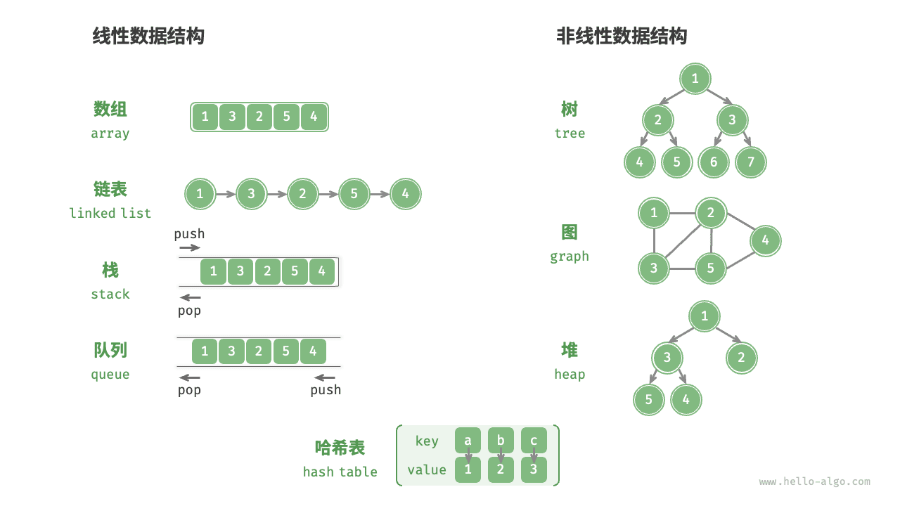

## 物理结构：连续与分散

**当算法程序运行时，正在处理的数据主要存储在内存中**。下图展示了一个计算机内存条，其中每个黑色方块都包含一块内存空间。我们可以将内存想象成一个巨大的 Excel 表格，其中每个单元格都可以存储一定大小的数据。

**系统通过内存地址来访问目标位置的数据**。如下图所示，计算机根据特定规则为表格中的每个单元格分配编号，确保每个内存空间都有唯一的内存地址。有了这些地址，程序便可以访问内存中的数据。

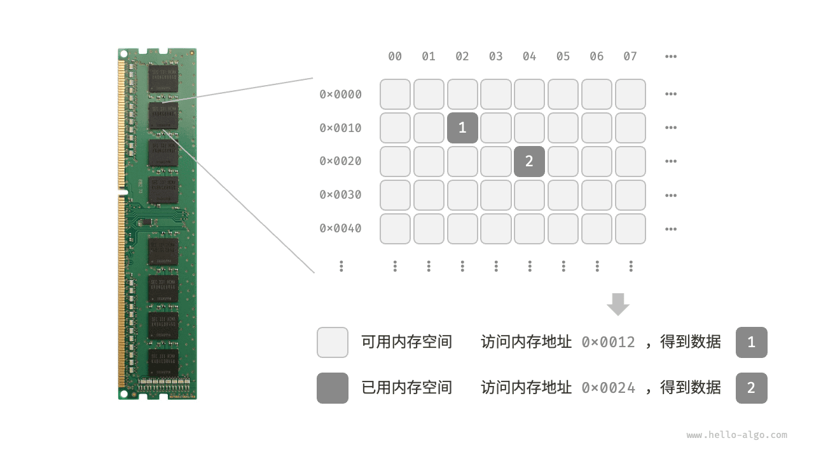

!!! tip

    值得说明的是，将内存比作 Excel 表格是一个简化的类比，实际内存的工作机制比较复杂，涉及地址空间、内存管理、缓存机制、虚拟内存和物理内存等概念。

内存是所有程序的共享资源，当某块内存被某个程序占用时，则通常无法被其他程序同时使用了。**因此在数据结构与算法的设计中，内存资源是一个重要的考虑因素**。比如，算法所占用的内存峰值不应超过系统剩余空闲内存；如果缺少连续大块的内存空间，那么所选用的数据结构必须能够存储在分散的内存空间内。

如下图所示，**物理结构反映了数据在计算机内存中的存储方式**，可分为连续空间存储（数组）和分散空间存储（链表）。物理结构从底层决定了数据的访问、更新、增删等操作方法，两种物理结构在时间效率和空间效率方面呈现出互补的特点。

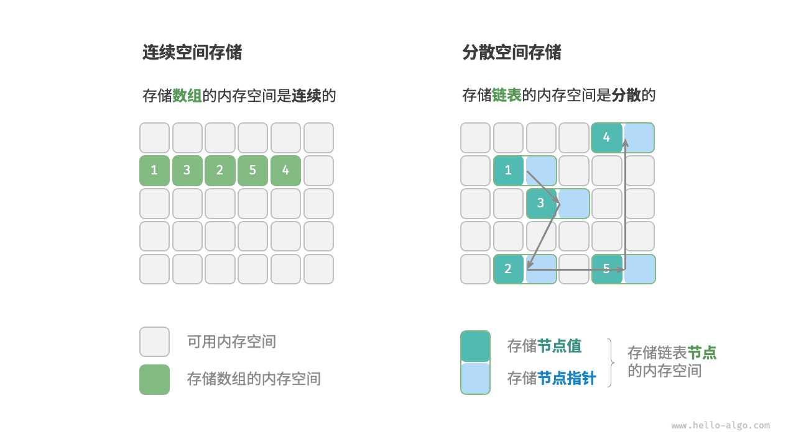

值得说明的是，**所有数据结构都是基于数组、链表或二者的组合实现的**。例如，栈和队列既可以使用数组实现，也可以使用链表实现；而哈希表的实现可能同时包含数组和链表。

- **基于数组可实现**：栈、队列、哈希表、树、堆、图、矩阵、张量（维度 $\geq 3$ 的数组）等。
- **基于链表可实现**：栈、队列、哈希表、树、堆、图等。

链表在初始化后，仍可以在程序运行过程中对其长度进行调整，因此也称“动态数据结构”。数组在初始化后长度不可变，因此也称“静态数据结构”。值得注意的是，数组可通过重新分配内存实现长度变化，从而具备一定的“动态性”。

!!! tip

    如果你感觉物理结构理解起来有困难，建议先阅读下一章，然后再回顾本节内容。

---

# 3.2 &nbsp; 基本数据类型

---

# 基本数据类型

当谈及计算机中的数据时，我们会想到文本、图片、视频、语音、3D 模型等各种形式。尽管这些数据的组织形式各异，但它们都由各种基本数据类型构成。

**基本数据类型是 CPU 可以直接进行运算的类型**，在算法中直接被使用，主要包括以下几种。

- 整数类型 `byte`、`short`、`int`、`long` 。
- 浮点数类型 `float`、`double` ，用于表示小数。
- 字符类型 `char` ，用于表示各种语言的字母、标点符号甚至表情符号等。
- 布尔类型 `bool` ，用于表示“是”与“否”判断。

**基本数据类型以二进制的形式存储在计算机中**。一个二进制位即为 $1$ 比特。在绝大多数现代操作系统中，$1$ 字节（byte）由 $8$ 比特（bit）组成。

基本数据类型的取值范围取决于其占用的空间大小。下面以 Java 为例。

- 整数类型 `byte` 占用 $1$ 字节 = $8$ 比特 ，可以表示 $2^{8}$ 个数字。
- 整数类型 `int` 占用 $4$ 字节 = $32$ 比特 ，可以表示 $2^{32}$ 个数字。

下表列举了 Java 中各种基本数据类型的占用空间、取值范围和默认值。此表格无须死记硬背，大致理解即可，需要时可以通过查表来回忆。

<p align="center"> 表 <id> &nbsp; 基本数据类型的占用空间和取值范围 </p>

| 类型   | 符号     | 占用空间 | 最小值                   | 最大值                  | 默认值         |
| ------ | -------- | -------- | ------------------------ | ----------------------- | -------------- |
| 整数   | `byte`   | 1 字节   | $-2^7$ ($-128$)          | $2^7 - 1$ ($127$)       | $0$            |
|        | `short`  | 2 字节   | $-2^{15}$                | $2^{15} - 1$            | $0$            |
|        | `int`    | 4 字节   | $-2^{31}$                | $2^{31} - 1$            | $0$            |
|        | `long`   | 8 字节   | $-2^{63}$                | $2^{63} - 1$            | $0$            |
| 浮点数 | `float`  | 4 字节   | $1.175 \times 10^{-38}$  | $3.403 \times 10^{38}$  | $0.0\text{f}$  |
|        | `double` | 8 字节   | $2.225 \times 10^{-308}$ | $1.798 \times 10^{308}$ | $0.0$          |
| 字符   | `char`   | 2 字节   | $0$                      | $2^{16} - 1$            | $0$            |
| 布尔   | `bool`   | 1 字节   | $\text{false}$           | $\text{true}$           | $\text{false}$ |

请注意，上表针对的是 Java 的基本数据类型的情况。每种编程语言都有各自的数据类型定义，它们的占用空间、取值范围和默认值可能会有所不同。

- 在 Python 中，整数类型 `int` 可以是任意大小，只受限于可用内存；浮点数 `float` 是双精度 64 位；没有 `char` 类型，单个字符实际上是长度为 1 的字符串 `str` 。
- C 和 C++ 未明确规定基本数据类型的大小，而因实现和平台各异。上表遵循 LP64 [数据模型](https://en.cppreference.com/w/cpp/language/types#Properties)，其用于包括 Linux 和 macOS 在内的 Unix 64 位操作系统。
- 字符 `char` 的大小在 C 和 C++ 中为 1 字节，在大多数编程语言中取决于特定的字符编码方法，详见“字符编码”章节。
- 即使表示布尔量仅需 1 位（$0$ 或 $1$），它在内存中通常也存储为 1 字节。这是因为现代计算机 CPU 通常将 1 字节作为最小寻址内存单元。

那么，基本数据类型与数据结构之间有什么联系呢？我们知道，数据结构是在计算机中组织与存储数据的方式。这句话的主语是“结构”而非“数据”。

如果想表示“一排数字”，我们自然会想到使用数组。这是因为数组的线性结构可以表示数字的相邻关系和顺序关系，但至于存储的内容是整数 `int`、小数 `float` 还是字符 `char` ，则与“数据结构”无关。

换句话说，**基本数据类型提供了数据的“内容类型”，而数据结构提供了数据的“组织方式”**。例如以下代码，我们用相同的数据结构（数组）来存储与表示不同的基本数据类型，包括 `int`、`float`、`char`、`bool` 等。

=== "Python"

    ```python title=""
    # 使用多种基本数据类型来初始化数组
    numbers: list[int] = [0] * 5
    decimals: list[float] = [0.0] * 5
    # Python 的字符实际上是长度为 1 的字符串
    characters: list[str] = ['0'] * 5
    bools: list[bool] = [False] * 5
    # Python 的列表可以自由存储各种基本数据类型和对象引用
    data = [0, 0.0, 'a', False, ListNode(0)]
    ```

=== "C++"

    ```cpp title=""
    // 使用多种基本数据类型来初始化数组
    int numbers[5];
    float decimals[5];
    char characters[5];
    bool bools[5];
    ```

=== "Java"

    ```java title=""
    // 使用多种基本数据类型来初始化数组
    int[] numbers = new int[5];
    float[] decimals = new float[5];
    char[] characters = new char[5];
    boolean[] bools = new boolean[5];
    ```

=== "C#"

    ```csharp title=""
    // 使用多种基本数据类型来初始化数组
    int[] numbers = new int[5];
    float[] decimals = new float[5];
    char[] characters = new char[5];
    bool[] bools = new bool[5];
    ```

=== "Go"

    ```go title=""
    // 使用多种基本数据类型来初始化数组
    var numbers = [5]int{}
    var decimals = [5]float64{}
    var characters = [5]byte{}
    var bools = [5]bool{}
    ```

=== "Swift"

    ```swift title=""
    // 使用多种基本数据类型来初始化数组
    let numbers = Array(repeating: 0, count: 5)
    let decimals = Array(repeating: 0.0, count: 5)
    let characters: [Character] = Array(repeating: "a", count: 5)
    let bools = Array(repeating: false, count: 5)
    ```

=== "JS"

    ```javascript title=""
    // JavaScript 的数组可以自由存储各种基本数据类型和对象
    const array = [0, 0.0, 'a', false];
    ```

=== "TS"

    ```typescript title=""
    // 使用多种基本数据类型来初始化数组
    const numbers: number[] = [];
    const characters: string[] = [];
    const bools: boolean[] = [];
    ```

=== "Dart"

    ```dart title=""
    // 使用多种基本数据类型来初始化数组
    List<int> numbers = List.filled(5, 0);
    List<double> decimals = List.filled(5, 0.0);
    List<String> characters = List.filled(5, 'a');
    List<bool> bools = List.filled(5, false);
    ```

=== "Rust"

    ```rust title=""
    // 使用多种基本数据类型来初始化数组
    let numbers: Vec<i32> = vec![0; 5];
    let decimals: Vec<f32> = vec![0.0; 5];
    let characters: Vec<char> = vec!['0'; 5];
    let bools: Vec<bool> = vec![false; 5];
    ```

=== "C"

    ```c title=""
    // 使用多种基本数据类型来初始化数组
    int numbers[10];
    float decimals[10];
    char characters[10];
    bool bools[10];
    ```

=== "Kotlin"

    ```kotlin title=""
    // 使用多种基本数据类型来初始化数组
    val numbers = IntArray(5)
    val decinals = FloatArray(5)
    val characters = CharArray(5)
    val bools = BooleanArray(5)
    ```

=== "Ruby"

    ```ruby title=""
    # Ruby 的列表可以自由存储各种基本数据类型和对象引用
    data = [0, 0.0, 'a', false, ListNode(0)]
    ```

??? pythontutor "可视化运行"

    https://pythontutor.com/render.html#code=class%20ListNode%3A%0A%20%20%20%20%22%22%22%E9%93%BE%E8%A1%A8%E8%8A%82%E7%82%B9%E7%B1%BB%22%22%22%0A%20%20%20%20def%20__init__%28self,%20val%3A%20int%29%3A%0A%20%20%20%20%20%20%20%20self.val%3A%20int%20%3D%20val%20%20%23%20%E8%8A%82%E7%82%B9%E5%80%BC%0A%20%20%20%20%20%20%20%20self.next%3A%20ListNode%20%7C%20None%20%3D%20None%20%20%23%20%E5%90%8E%E7%BB%A7%E8%8A%82%E7%82%B9%E5%BC%95%E7%94%A8%0A%0A%22%22%22Driver%20Code%22%22%22%0Aif%20__name__%20%3D%3D%20%22__main__%22%3A%0A%20%20%20%20%23%20%E4%BD%BF%E7%94%A8%E5%A4%9A%E7%A7%8D%E5%9F%BA%E6%9C%AC%E6%95%B0%E6%8D%AE%E7%B1%BB%E5%9E%8B%E6%9D%A5%E5%88%9D%E5%A7%8B%E5%8C%96%E6%95%B0%E7%BB%84%0A%20%20%20%20numbers%20%3D%20%5B0%5D%20*%205%0A%20%20%20%20decimals%20%3D%20%5B0.0%5D%20*%205%0A%20%20%20%20%23%20Python%20%E7%9A%84%E5%AD%97%E7%AC%A6%E5%AE%9E%E9%99%85%E4%B8%8A%E6%98%AF%E9%95%BF%E5%BA%A6%E4%B8%BA%201%20%E7%9A%84%E5%AD%97%E7%AC%A6%E4%B8%B2%0A%20%20%20%20characters%20%3D%20%5B'0'%5D%20*%205%0A%20%20%20%20bools%20%3D%20%5BFalse%5D%20*%205%0A%20%20%20%20%23%20Python%20%E7%9A%84%E5%88%97%E8%A1%A8%E5%8F%AF%E4%BB%A5%E8%87%AA%E7%94%B1%E5%AD%98%E5%82%A8%E5%90%84%E7%A7%8D%E5%9F%BA%E6%9C%AC%E6%95%B0%E6%8D%AE%E7%B1%BB%E5%9E%8B%E5%92%8C%E5%AF%B9%E8%B1%A1%E5%BC%95%E7%94%A8%0A%20%20%20%20data%20%3D%20%5B0,%200.0,%20'a',%20False,%20ListNode%280%29%5D&cumulative=false&curInstr=12&heapPrimitives=nevernest&mode=display&origin=opt-frontend.js&py=311&rawInputLstJSON=%5B%5D&textReferences=false

---

# 3.3 &nbsp; 数字编码 *

---

# 数字编码 *

!!! tip

    在本书中，标题带有 * 符号的是选读章节。如果你时间有限或感到理解困难，可以先跳过，等学完必读章节后再单独攻克。

## 原码、反码和补码

在上一节的表格中我们发现，所有整数类型能够表示的负数都比正数多一个，例如 `byte` 的取值范围是 $[-128, 127]$ 。这个现象比较反直觉，它的内在原因涉及原码、反码、补码的相关知识。

首先需要指出，**数字是以“补码”的形式存储在计算机中的**。在分析这样做的原因之前，首先给出三者的定义。

- **原码**：我们将数字的二进制表示的最高位视为符号位，其中 $0$ 表示正数，$1$ 表示负数，其余位表示数字的值。
- **反码**：正数的反码与其原码相同，负数的反码是对其原码除符号位外的所有位取反。
- **补码**：正数的补码与其原码相同，负数的补码是在其反码的基础上加 $1$ 。

下图展示了原码、反码和补码之间的转换方法。

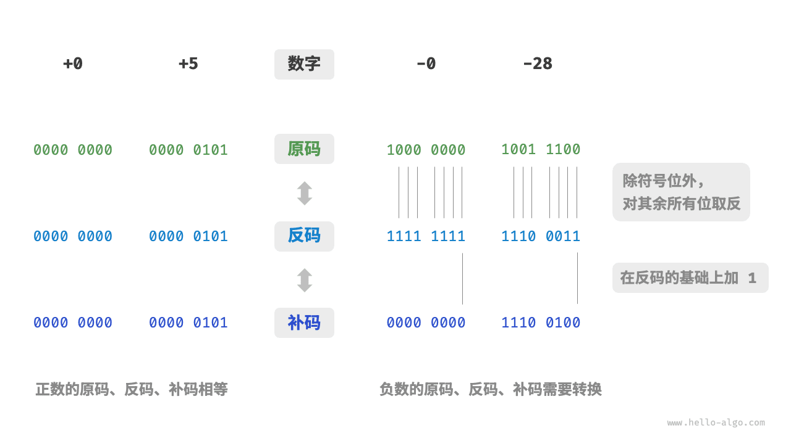

<u>原码（sign-magnitude）</u>虽然最直观，但存在一些局限性。一方面，**负数的原码不能直接用于运算**。例如在原码下计算 $1 + (-2)$ ，得到的结果是 $-3$ ，这显然是不对的。

$$
\begin{aligned}
& 1 + (-2) \newline
& \rightarrow 0000 \; 0001 + 1000 \; 0010 \newline
& = 1000 \; 0011 \newline
& \rightarrow -3
\end{aligned}
$$

为了解决此问题，计算机引入了<u>反码（1's complement）</u>。如果我们先将原码转换为反码，并在反码下计算 $1 + (-2)$ ，最后将结果从反码转换回原码，则可得到正确结果 $-1$ 。

$$
\begin{aligned}
& 1 + (-2) \newline
& \rightarrow 0000 \; 0001 \; \text{(原码)} + 1000 \; 0010 \; \text{(原码)} \newline
& = 0000 \; 0001 \; \text{(反码)} + 1111  \; 1101 \; \text{(反码)} \newline
& = 1111 \; 1110 \; \text{(反码)} \newline
& = 1000 \; 0001 \; \text{(原码)} \newline
& \rightarrow -1
\end{aligned}
$$

另一方面，**数字零的原码有 $+0$ 和 $-0$ 两种表示方式**。这意味着数字零对应两个不同的二进制编码，这可能会带来歧义。比如在条件判断中，如果没有区分正零和负零，则可能会导致判断结果出错。而如果我们想处理正零和负零歧义，则需要引入额外的判断操作，这可能会降低计算机的运算效率。

$$
\begin{aligned}
+0 & \rightarrow 0000 \; 0000 \newline
-0 & \rightarrow 1000 \; 0000
\end{aligned}
$$

与原码一样，反码也存在正负零歧义问题，因此计算机进一步引入了<u>补码（2's complement）</u>。我们先来观察一下负零的原码、反码、补码的转换过程：

$$
\begin{aligned}
-0 \rightarrow \; & 1000 \; 0000 \; \text{(原码)} \newline
= \; & 1111 \; 1111 \; \text{(反码)} \newline
= 1 \; & 0000 \; 0000 \; \text{(补码)} \newline
\end{aligned}
$$

在负零的反码基础上加 $1$ 会产生进位，但 `byte` 类型的长度只有 8 位，因此溢出到第 9 位的 $1$ 会被舍弃。也就是说，**负零的补码为 $0000 \; 0000$ ，与正零的补码相同**。这意味着在补码表示中只存在一个零，正负零歧义从而得到解决。

还剩最后一个疑惑：`byte` 类型的取值范围是 $[-128, 127]$ ，多出来的一个负数 $-128$ 是如何得到的呢？我们注意到，区间 $[-127, +127]$ 内的所有整数都有对应的原码、反码和补码，并且原码和补码之间可以互相转换。

然而，**补码 $1000 \; 0000$ 是一个例外，它并没有对应的原码**。根据转换方法，我们得到该补码的原码为 $0000 \; 0000$ 。这显然是矛盾的，因为该原码表示数字 $0$ ，它的补码应该是自身。计算机规定这个特殊的补码 $1000 \; 0000$ 代表 $-128$ 。实际上，$(-1) + (-127)$ 在补码下的计算结果就是 $-128$ 。

$$
\begin{aligned}
& (-127) + (-1) \newline
& \rightarrow 1111 \; 1111 \; \text{(原码)} + 1000 \; 0001 \; \text{(原码)} \newline
& = 1000 \; 0000 \; \text{(反码)} + 1111  \; 1110 \; \text{(反码)} \newline
& = 1000 \; 0001 \; \text{(补码)} + 1111  \; 1111 \; \text{(补码)} \newline
& = 1000 \; 0000 \; \text{(补码)} \newline
& \rightarrow -128
\end{aligned}
$$

你可能已经发现了，上述所有计算都是加法运算。这暗示着一个重要事实：**计算机内部的硬件电路主要是基于加法运算设计的**。这是因为加法运算相对于其他运算（比如乘法、除法和减法）来说，硬件实现起来更简单，更容易进行并行化处理，运算速度更快。

请注意，这并不意味着计算机只能做加法。**通过将加法与一些基本逻辑运算结合，计算机能够实现各种其他的数学运算**。例如，计算减法 $a - b$ 可以转换为计算加法 $a + (-b)$ ；计算乘法和除法可以转换为计算多次加法或减法。

现在我们可以总结出计算机使用补码的原因：基于补码表示，计算机可以用同样的电路和操作来处理正数和负数的加法，不需要设计特殊的硬件电路来处理减法，并且无须特别处理正负零的歧义问题。这大大简化了硬件设计，提高了运算效率。

补码的设计非常精妙，因篇幅关系我们就先介绍到这里，建议有兴趣的读者进一步深入了解。

## 浮点数编码

细心的你可能会发现：`int` 和 `float` 长度相同，都是 4 字节 ，但为什么 `float` 的取值范围远大于 `int` ？这非常反直觉，因为按理说 `float` 需要表示小数，取值范围应该变小才对。

实际上，**这是因为浮点数 `float` 采用了不同的表示方式**。记一个 32 比特长度的二进制数为：

$$
b_{31} b_{30} b_{29} \ldots b_2 b_1 b_0
$$

根据 IEEE 754 标准，32-bit 长度的 `float` 由以下三个部分构成。

- 符号位 $\mathrm{S}$ ：占 1 位 ，对应 $b_{31}$ 。
- 指数位 $\mathrm{E}$ ：占 8 位 ，对应 $b_{30} b_{29} \ldots b_{23}$ 。
- 分数位 $\mathrm{N}$ ：占 23 位 ，对应 $b_{22} b_{21} \ldots b_0$ 。

二进制数 `float` 对应值的计算方法为：

$$
\text {val} = (-1)^{b_{31}} \times 2^{\left(b_{30} b_{29} \ldots b_{23}\right)_2-127} \times\left(1 . b_{22} b_{21} \ldots b_0\right)_2
$$

转化到十进制下的计算公式为：

$$
\text {val}=(-1)^{\mathrm{S}} \times 2^{\mathrm{E} -127} \times (1 + \mathrm{N})
$$

其中各项的取值范围为：

$$
\begin{aligned}
\mathrm{S} \in & \{ 0, 1\}, \quad \mathrm{E} \in \{ 1, 2, \dots, 254 \} \newline
(1 + \mathrm{N}) = & (1 + \sum_{i=1}^{23} b_{23-i} 2^{-i}) \subset [1, 2 - 2^{-23}]
\end{aligned}
$$

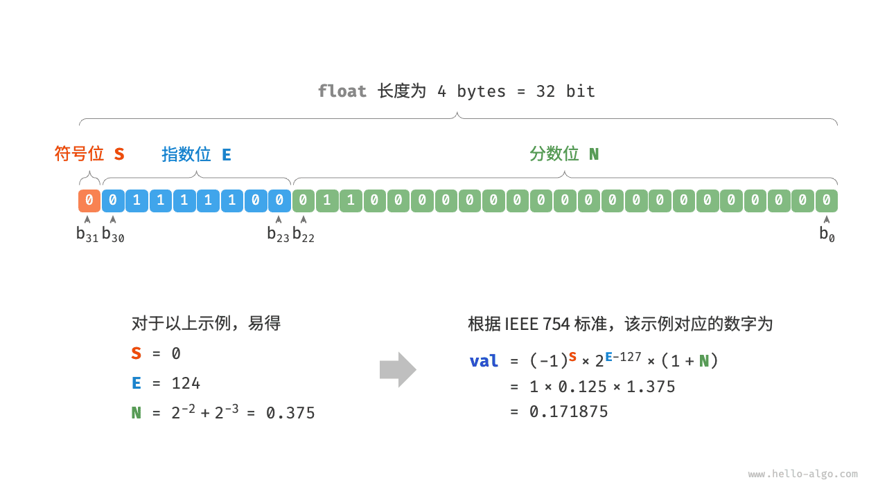

观察上图，给定一个示例数据 $\mathrm{S} = 0$ ， $\mathrm{E} = 124$ ，$\mathrm{N} = 2^{-2} + 2^{-3} = 0.375$ ，则有：

$$
\text { val } = (-1)^0 \times 2^{124 - 127} \times (1 + 0.375) = 0.171875
$$

现在我们可以回答最初的问题：**`float` 的表示方式包含指数位，导致其取值范围远大于 `int`** 。根据以上计算，`float` 可表示的最大正数为 $2^{254 - 127} \times (2 - 2^{-23}) \approx 3.4 \times 10^{38}$ ，切换符号位便可得到最小负数。

**尽管浮点数 `float` 扩展了取值范围，但其副作用是牺牲了精度**。整数类型 `int` 将全部 32 比特用于表示数字，数字是均匀分布的；而由于指数位的存在，浮点数 `float` 的数值越大，相邻两个数字之间的差值就会趋向越大。

如下表所示，指数位 $\mathrm{E} = 0$ 和 $\mathrm{E} = 255$ 具有特殊含义，**用于表示零、无穷大、$\mathrm{NaN}$ 等**。

<p align="center"> 表 <id> &nbsp; 指数位含义 </p>

| 指数位 E           | 分数位 $\mathrm{N} = 0$ | 分数位 $\mathrm{N} \ne 0$ | 计算公式                                                               |
| ------------------ | ----------------------- | ------------------------- | ---------------------------------------------------------------------- |
| $0$                | $\pm 0$                 | 次正规数                  | $(-1)^{\mathrm{S}} \times 2^{-126} \times (0.\mathrm{N})$              |
| $1, 2, \dots, 254$ | 正规数                  | 正规数                    | $(-1)^{\mathrm{S}} \times 2^{(\mathrm{E} -127)} \times (1.\mathrm{N})$ |
| $255$              | $\pm \infty$            | $\mathrm{NaN}$            |                                                                        |

值得说明的是，次正规数显著提升了浮点数的精度。最小正正规数为 $2^{-126}$ ，最小正次正规数为 $2^{-126} \times 2^{-23}$ 。

双精度 `double` 也采用类似于 `float` 的表示方法，在此不做赘述。

---

# 3.4 &nbsp; 字符编码 *

---

# 字符编码 *

在计算机中，所有数据都是以二进制数的形式存储的，字符 `char` 也不例外。为了表示字符，我们需要建立一套“字符集”，规定每个字符和二进制数之间的一一对应关系。有了字符集之后，计算机就可以通过查表完成二进制数到字符的转换。

## ASCII 字符集

<u>ASCII 码</u>是最早出现的字符集，其全称为 American Standard Code for Information Interchange（美国标准信息交换代码）。它使用 7 位二进制数（一个字节的低 7 位）表示一个字符，最多能够表示 128 个不同的字符。如下图所示，ASCII 码包括英文字母的大小写、数字 0 ~ 9、一些标点符号，以及一些控制字符（如换行符和制表符）。

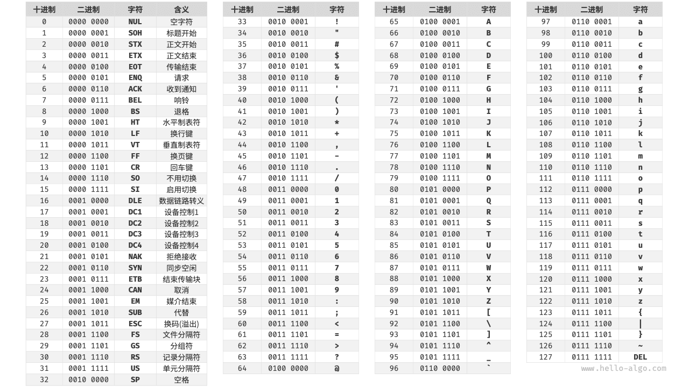

然而，**ASCII 码仅能够表示英文**。随着计算机的全球化，诞生了一种能够表示更多语言的 <u>EASCII</u> 字符集。它在 ASCII 的 7 位基础上扩展到 8 位，能够表示 256 个不同的字符。

在世界范围内，陆续出现了一批适用于不同地区的 EASCII 字符集。这些字符集的前 128 个字符统一为 ASCII 码，后 128 个字符定义不同，以适应不同语言的需求。

## GBK 字符集

后来人们发现，**EASCII 码仍然无法满足许多语言的字符数量要求**。比如汉字有近十万个，光日常使用的就有几千个。中国国家标准总局于 1980 年发布了 <u>GB2312</u> 字符集，其收录了 6763 个汉字，基本满足了汉字的计算机处理需要。

然而，GB2312 无法处理部分罕见字和繁体字。<u>GBK</u> 字符集是在 GB2312 的基础上扩展得到的，它共收录了 21886 个汉字。在 GBK 的编码方案中，ASCII 字符使用一个字节表示，汉字使用两个字节表示。

## Unicode 字符集

随着计算机技术的蓬勃发展，字符集与编码标准百花齐放，而这带来了许多问题。一方面，这些字符集一般只定义了特定语言的字符，无法在多语言环境下正常工作。另一方面，同一种语言存在多种字符集标准，如果两台计算机使用的是不同的编码标准，则在信息传递时就会出现乱码。

那个时代的研究人员就在想：**如果推出一个足够完整的字符集，将世界范围内的所有语言和符号都收录其中，不就可以解决跨语言环境和乱码问题了吗**？在这种想法的驱动下，一个大而全的字符集 Unicode 应运而生。

<u>Unicode</u> 的中文名称为“统一码”，理论上能容纳 100 多万个字符。它致力于将全球范围内的字符纳入统一的字符集之中，提供一种通用的字符集来处理和显示各种语言文字，减少因为编码标准不同而产生的乱码问题。自 1991 年发布以来，Unicode 不断扩充新的语言与字符。截至 2022 年 9 月，Unicode 已经包含 149186 个字符，包括各种语言的字符、符号甚至表情符号等。

Unicode 作为一种通用字符集，本质上是给每个字符分配唯一的“码点”（字符编号），其取值范围为 U+0000 至 U+10FFFF，构成了统一的字符编号空间。然而，**Unicode 并没有规定在计算机中如何存储这些字符码点**。我们不禁会问：当多种长度的 Unicode 码点同时出现在一个文本中时，系统如何解析字符？例如给定一个长度为 2 字节的编码，系统如何确认它是一个 2 字节的字符还是两个 1 字节的字符？

对于以上问题，**一种直接的解决方案是将所有字符存储为等长的编码**。如下图所示，“Hello”中的每个字符占用 1 字节，“算法”中的每个字符占用 2 字节。我们可以通过高位填 0 将“Hello 算法”中的所有字符都编码为 2 字节长度。这样系统就可以每隔 2 字节解析一个字符，恢复这个短语的内容了。

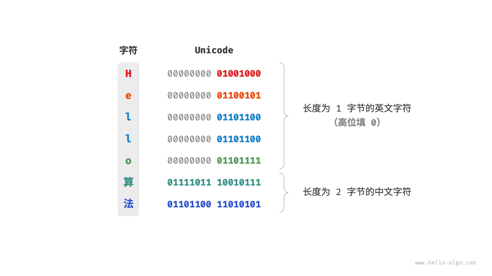

然而 ASCII 码已经向我们证明，编码英文只需 1 字节。若采用上述方案，英文文本占用空间的大小将会是 ASCII 编码下的两倍，非常浪费内存空间。因此，我们需要一种更加高效的 Unicode 编码方法。

## UTF-8 编码

目前，UTF-8 已成为国际上使用最广泛的 Unicode 编码方法。**它是一种可变长度的编码**，使用 1 到 4 字节来表示一个字符，根据字符的复杂性而变。ASCII 字符只需 1 字节，拉丁字母和希腊字母需要 2 字节，常用的中文字符需要 3 字节，其他的一些生僻字符需要 4 字节。

UTF-8 的编码规则并不复杂，分为以下两种情况。

- 对于长度为 1 字节的字符，将最高位设置为 $0$ ，其余 7 位设置为 Unicode 码点。值得注意的是，ASCII 字符在 Unicode 字符集中占据了前 128 个码点。也就是说，**UTF-8 编码可以向下兼容 ASCII 码**。这意味着我们可以使用 UTF-8 来解析年代久远的 ASCII 码文本。
- 对于长度为 $n$ 字节的字符（其中 $n > 1$），将首个字节的高 $n$ 位都设置为 $1$ ，第 $n + 1$ 位设置为 $0$ ；从第二个字节开始，将每个字节的高 2 位都设置为 $10$ ；其余所有位用于填充字符的 Unicode 码点。

下图展示了“Hello算法”对应的 UTF-8 编码。观察发现，由于最高 $n$ 位都设置为 $1$ ，因此系统可以通过读取最高位 $1$ 的个数来解析出字符的长度为 $n$ 。

但为什么要将其余所有字节的高 2 位都设置为 $10$ 呢？实际上，这个 $10$ 能够起到校验符的作用。假设系统从一个错误的字节开始解析文本，字节头部的 $10$ 能够帮助系统快速判断出异常。

之所以将 $10$ 当作校验符，是因为在 UTF-8 编码规则下，不可能有字符的最高两位是 $10$ 。这个结论可以用反证法来证明：假设一个字符的最高两位是 $10$ ，说明该字符的长度为 $1$ ，对应 ASCII 码。而 ASCII 码的最高位应该是 $0$ ，与假设矛盾。

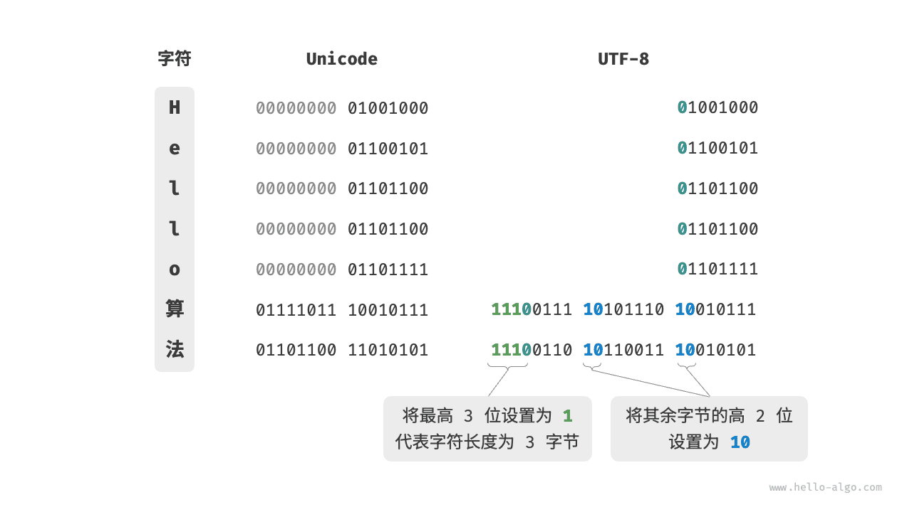

除了 UTF-8 之外，常见的编码方式还包括以下两种。

- **UTF-16 编码**：使用 2 或 4 字节来表示一个字符。所有的 ASCII 字符和常用的非英文字符，都用 2 字节表示；少数字符需要用到 4 字节表示。对于 2 字节的字符，UTF-16 编码与 Unicode 码点相等。
- **UTF-32 编码**：每个字符都使用 4 字节。这意味着 UTF-32 比 UTF-8 和 UTF-16 更占用空间，特别是对于 ASCII 字符占比较高的文本。

从存储空间占用的角度看，使用 UTF-8 表示英文字符非常高效，因为它仅需 1 字节；使用 UTF-16 编码某些非英文字符（例如中文）会更加高效，因为它仅需 2 字节，而 UTF-8 可能需要 3 字节。

从兼容性的角度看，UTF-8 的通用性最佳，许多工具和库优先支持 UTF-8 。

## 编程语言的字符编码

对于以往的大多数编程语言，程序运行中的字符串都采用 UTF-16 或 UTF-32 这类等长编码。在等长编码下，我们可以将字符串看作数组来处理，这种做法具有以下优点。

- **随机访问**：UTF-16 编码的字符串可以很容易地进行随机访问。UTF-8 是一种变长编码，要想找到第 $i$ 个字符，我们需要从字符串的开始处遍历到第 $i$ 个字符，这需要 $O(n)$ 的时间。
- **字符计数**：与随机访问类似，计算 UTF-16 编码的字符串的长度也是 $O(1)$ 的操作。但是，计算 UTF-8 编码的字符串的长度需要遍历整个字符串。
- **字符串操作**：在 UTF-16 编码的字符串上，很多字符串操作（如分割、连接、插入、删除等）更容易进行。在 UTF-8 编码的字符串上，进行这些操作通常需要额外的计算，以确保不会产生无效的 UTF-8 编码。

实际上，编程语言的字符编码方案设计是一个很有趣的话题，涉及许多因素。

- Java 的 `String` 类型使用 UTF-16 编码，每个字符占用 2 字节。这是因为 Java 语言设计之初，人们认为 16 位足以表示所有可能的字符。然而，这是一个不正确的判断。后来 Unicode 规范扩展到了超过 16 位，所以 Java 中的字符现在可能由一对 16 位的值（称为“代理对”）表示。
- JavaScript 和 TypeScript 的字符串使用 UTF-16 编码的原因与 Java 类似。当 1995 年 Netscape 公司首次推出 JavaScript 语言时，Unicode 还处于发展早期，那时候使用 16 位的编码就足以表示所有的 Unicode 字符了。
- C# 使用 UTF-16 编码，主要是因为 .NET 平台是由 Microsoft 设计的，而 Microsoft 的很多技术（包括 Windows 操作系统）都广泛使用 UTF-16 编码。

由于以上编程语言对字符数量的低估，它们不得不采取“代理对”的方式来表示超过 16 位长度的 Unicode 字符。这是一个不得已为之的无奈之举。一方面，包含代理对的字符串中，一个字符可能占用 2 字节或 4 字节，从而丧失了等长编码的优势。另一方面，处理代理对需要额外增加代码，这提高了编程的复杂性和调试难度。

出于以上原因，部分编程语言提出了一些不同的编码方案。

- Python 中的 `str` 使用 Unicode 编码，并采用一种灵活的字符串表示，存储的字符长度取决于字符串中最大的 Unicode 码点。若字符串中全部是 ASCII 字符，则每个字符占用 1 字节；如果有字符超出了 ASCII 范围，但全部在基本多语言平面（BMP）内，则每个字符占用 2 字节；如果有超出 BMP 的字符，则每个字符占用 4 字节。
- Go 语言的 `string` 类型在内部使用 UTF-8 编码。Go 语言还提供了 `rune` 类型，它用于表示单个 Unicode 码点。
- Rust 语言的 `str` 和 `String` 类型在内部使用 UTF-8 编码。Rust 也提供了 `char` 类型，用于表示单个 Unicode 码点。

需要注意的是，以上讨论的都是字符串在编程语言中的存储方式，**这和字符串如何在文件中存储或在网络中传输是不同的问题**。在文件存储或网络传输中，我们通常会将字符串编码为 UTF-8 格式，以达到最优的兼容性和空间效率。

---

# 3.5 &nbsp; 小结

---

# 小结

### 重点回顾

- 数据结构可以从逻辑结构和物理结构两个角度进行分类。逻辑结构描述了数据元素之间的逻辑关系，而物理结构描述了数据在计算机内存中的存储方式。
- 常见的逻辑结构包括线性、树状和网状等。通常我们根据逻辑结构将数据结构分为线性（数组、链表、栈、队列）和非线性（树、图、堆）两种。哈希表的实现可能同时包含线性数据结构和非线性数据结构。
- 当程序运行时，数据被存储在计算机内存中。每个内存空间都拥有对应的内存地址，程序通过这些内存地址访问数据。
- 物理结构主要分为连续空间存储（数组）和分散空间存储（链表）。所有数据结构都是由数组、链表或两者的组合实现的。
- 计算机中的基本数据类型包括整数 `byte`、`short`、`int`、`long` ，浮点数 `float`、`double` ，字符 `char` 和布尔 `bool` 。它们的取值范围取决于占用空间大小和表示方式。
- 原码、反码和补码是在计算机中编码数字的三种方法，它们之间可以相互转换。整数的原码的最高位是符号位，其余位是数字的值。
- 整数在计算机中是以补码的形式存储的。在补码表示下，计算机可以对正数和负数的加法一视同仁，不需要为减法操作单独设计特殊的硬件电路，并且不存在正负零歧义的问题。
- 浮点数的编码由 1 位符号位、8 位指数位和 23 位分数位构成。由于存在指数位，因此浮点数的取值范围远大于整数，代价是牺牲了精度。
- ASCII 码是最早出现的英文字符集，长度为 1 字节，共收录 128 个字符。GBK 字符集是常用的中文字符集，共收录两万多个汉字。Unicode 致力于提供一个完整的字符集标准，收录世界上各种语言的字符，从而解决由于字符编码方法不一致而导致的乱码问题。
- UTF-8 是最受欢迎的 Unicode 编码方法，通用性非常好。它是一种变长的编码方法，具有很好的扩展性，有效提升了存储空间的使用效率。UTF-16 和 UTF-32 是等长的编码方法。在编码中文时，UTF-16 占用的空间比 UTF-8 更小。Java 和 C# 等编程语言默认使用 UTF-16 编码。

### Q & A

**Q**：为什么哈希表同时包含线性数据结构和非线性数据结构？

哈希表底层是数组，而为了解决哈希冲突，我们可能会使用“链式地址”（后续“哈希冲突”章节会讲）：数组中每个桶指向一个链表，当链表长度超过一定阈值时，又可能被转化为树（通常为红黑树）。

从存储的角度来看，哈希表的底层是数组，其中每一个桶槽位可能包含一个值，也可能包含一个链表或一棵树。因此，哈希表可能同时包含线性数据结构（数组、链表）和非线性数据结构（树）。

**Q**：`char` 类型的长度是 1 字节吗？

`char` 类型的长度由编程语言采用的编码方法决定。例如，Java、JavaScript、TypeScript、C# 都采用 UTF-16 编码（保存 Unicode 码点），因此 `char` 类型的长度为 2 字节。

**Q**：基于数组实现的数据结构也称“静态数据结构” 是否有歧义？栈也可以进行出栈和入栈等操作，这些操作都是“动态”的。

栈确实可以实现动态的数据操作，但数据结构仍然是“静态”（长度不可变）的。尽管基于数组的数据结构可以动态地添加或删除元素，但它们的容量是固定的。如果数据量超出了预分配的大小，就需要创建一个新的更大的数组，并将旧数组的内容复制到新数组中。

**Q**：在构建栈（队列）的时候，未指定它的大小，为什么它们是“静态数据结构”呢？

在高级编程语言中，我们无须人工指定栈（队列）的初始容量，这个工作由类内部自动完成。例如，Java 的 `ArrayList` 的初始容量通常为 10。另外，扩容操作也是自动实现的。详见后续的“列表”章节。

**Q**：原码转补码的方法是“先取反后加 1”，那么补码转原码应该是逆运算“先减 1 后取反”，而补码转原码也一样可以通过“先取反后加 1”得到，这是为什么呢？

这是因为原码和补码的相互转换实际上是计算“补数”的过程。我们先给出补数的定义：假设 $a + b = c$ ，那么我们称 $a$ 是 $b$ 到 $c$ 的补数，反之也称 $b$ 是 $a$ 到 $c$ 的补数。

给定一个 $n = 4$ 位长度的二进制数 $0010$ ，如果将这个数字看作原码（不考虑符号位），那么它的补码需通过“先取反后加 1”得到：

$$
0010 \rightarrow 1101 \rightarrow 1110
$$

我们会发现，原码和补码的和是 $0010 + 1110 = 10000$ ，也就是说，补码 $1110$ 是原码 $0010$ 到 $10000$ 的“补数”。**这意味着上述“先取反后加 1”实际上是计算到 $10000$ 的补数的过程**。

那么，补码 $1110$ 到 $10000$ 的“补数”是多少呢？我们依然可以用“先取反后加 1”得到它：

$$
1110 \rightarrow 0001 \rightarrow 0010
$$

换句话说，原码和补码互为对方到 $10000$ 的“补数”，因此“原码转补码”和“补码转原码”可以用相同的操作（先取反后加 1 ）实现。

当然，我们也可以用逆运算来求补码 $1110$ 的原码，即“先减 1 后取反”：

$$
1110 \rightarrow 1101 \rightarrow 0010
$$

总结来看，“先取反后加 1”和“先减 1 后取反”这两种运算都是在计算到 $10000$ 的补数，它们是等价的。

本质上看，“取反”操作实际上是求到 $1111$ 的补数（因为恒有 `原码 + 反码 = 1111`）；而在反码基础上再加 1 得到的补码，就是到 $10000$ 的补数。

上述以 $n = 4$ 为例，其可被推广至任意位数的二进制数。

---

# 3.6 &nbsp; 练习

---

# 练习

## 知识巩固

### 生活场景中的数据关系

请根据数据之间的关系，为下面三个场景选择“线性结构、树形结构、网状结构”中的一种，并说明理由：

<!-- numbered-subquestions -->

1. 同学们排成一列，每人只关心自己前面和后面的人；
2. 学校按“学校 → 年级 → 班级”分层管理；
3. 城市道路连接多个路口，一个路口可以通向多个其他路口，也可能形成环路。

??? success "参考答案"

    1. 是线性结构。除排在最前和最后的人外，每个人都只与前面和后面各一人相邻，关系沿一条线展开。

    2. 是树形结构。每个班级属于一个年级，每个年级又属于学校，关系从上到下分层展开。

    3. 是网状结构。一个路口可以连接多个路口，路线之间还能形成环，不能排成单一顺序或严格层级。

        判断结构时应先观察元素之间的关系，而不是先考虑它在内存中占多少空间。

### 逻辑顺序怎样存进内存

为了保存逻辑顺序 `A → B → C`，现有两种简化的内存安排：

- 方案甲：`A、B、C` 分别放在编号为 `20、21、22` 的内存格中；
- 方案乙：`A、B、C` 分别放在编号为 `20、7、31` 的内存格中，并由 `A` 记录 `B` 的位置、`B` 记录 `C` 的位置。

<!-- numbered-subquestions -->

1. 哪个方案属于连续空间存储？哪个属于分散空间存储？
2. 两个方案分别更接近数组还是链表？
3. 方案乙的内存格编号没有按大小排列，为什么仍能表示 `A → B → C` 的逻辑顺序？

??? success "参考答案"

    1. 方案甲使用连续的内存格，属于连续空间存储；方案乙的节点分散在不同位置，属于分散空间存储。

    2. 方案甲更接近数组，方案乙更接近链表。

    3. 逻辑顺序由节点之间记录的连接关系决定，而不是由内存格编号的大小决定。
        从 `A` 记录的位置可以找到 `B`，再从 `B` 记录的位置找到 `C`，所以仍能依次访问 `A、B、C`。

        这也说明逻辑结构和物理结构是观察同一组数据的两个不同角度。

### 作业记录中的数据类型与结构

某学习小组按座位顺序记录 4 名同学是否交了作业，得到：

`[true, false, true, true]`

<!-- numbered-subquestions -->

1. 每个元素适合使用哪种基本数据类型？
2. 这 4 个元素按座位顺序排成一列，使用了什么逻辑结构？
3. 如果以后改为记录每人的作业分数 `[90, 0, 85, 100]`，改变的是数据的“内容类型”还是“组织方式”？说明理由。

??? success "参考答案"

    1. 每个元素只表示“是”或“否”，适合使用布尔类型 `bool`。

    2. 这些元素按座位顺序排列，形成线性结构，可以用数组保存。

    3. 改变的是内容类型：元素由布尔值变成了整数。组织方式没有改变，
        这些数据仍然按座位顺序排成一列，仍可使用数组这一线性结构。

        基本数据类型描述“存的是什么”，数据结构描述“数据怎样组织”。

## 编程练习

### 统计二进制表示中的 1

给定非负整数 `n`，请统计它的二进制表示中共有多少个 1。

要求使用位运算完成，不把二进制表示转换成字符串，也不使用直接统计 1 的内置函数。

??? tip "解题提示"

    1. n & 1 可以取出 n 的最右边一位，用它判断这一位是否为 1
    2. 右移一位表示丢掉当前最右边的二进制位；多数语言使用运算符 >>
    3. 完成逐位检查并右移的方法后，再观察：n & (n - 1) 会把 n 中最右边的一个 1 变成 0

[LeetCode](https://leetcode.cn/problems/number-of-1-bits/){ .rounded-button .exercise-button target="_blank" rel="noopener noreferrer" } [题目解析](https://leetcode.cn/problems/number-of-1-bits/solutions/2361978/191-wei-1-de-ge-shu-wei-yun-suan-qing-xi-40rw/){ .rounded-button .exercise-button target="_blank" rel="noopener noreferrer" }

---

# 第 4 章 &nbsp; 数组与链表

---

# 数组与链表


!!! abstract

    数据结构的世界如同一堵厚实的砖墙。

    数组的砖块整齐排列，逐个紧贴。链表的砖块分散各处，连接的藤蔓自由地穿梭于砖缝之间。

---

# 4.1 &nbsp; 数组

---

# 数组

<u>数组（array）</u>是一种线性数据结构，其将相同类型的元素存储在连续的内存空间中。我们将元素在数组中的位置称为该元素的<u>索引（index）</u>。下图展示了数组的主要概念和存储方式。

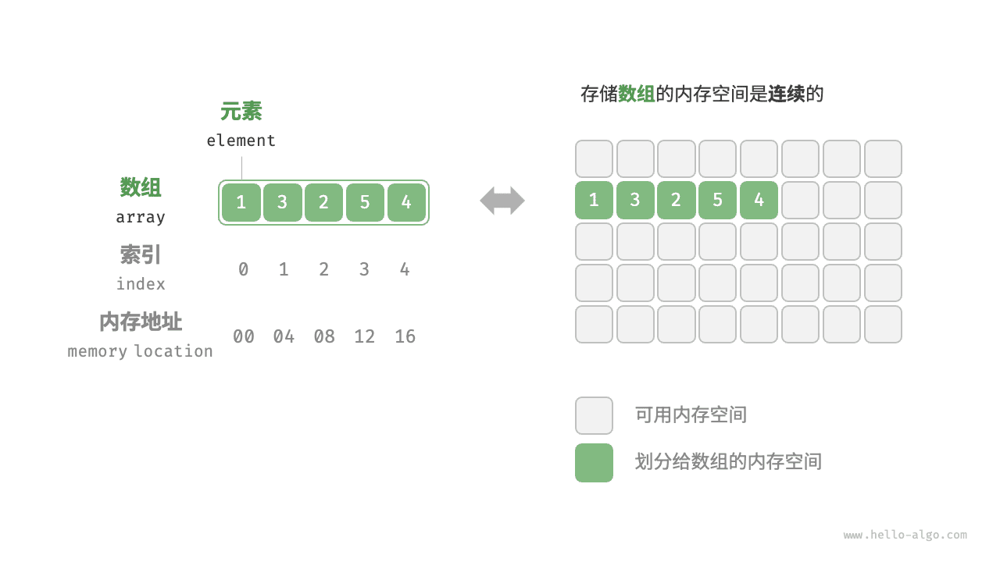

## 数组常用操作

### 初始化数组

我们可以根据需求选用数组的两种初始化方式：无初始值、给定初始值。在未指定初始值的情况下，大多数编程语言会将数组元素初始化为 $0$ ：

=== "Python"

    ```python title="array.py"
    # 初始化数组
    arr: list[int] = [0] * 5  # [ 0, 0, 0, 0, 0 ]
    nums: list[int] = [1, 3, 2, 5, 4]
    ```

=== "C++"

    ```cpp title="array.cpp"
    /* 初始化数组 */
    // 存储在栈上
    int arr[5];
    int nums[5] = { 1, 3, 2, 5, 4 };
    // 存储在堆上（需要手动释放空间）
    int* arr1 = new int[5];
    int* nums1 = new int[5] { 1, 3, 2, 5, 4 };
    ```

=== "Java"

    ```java title="array.java"
    /* 初始化数组 */
    int[] arr = new int[5]; // { 0, 0, 0, 0, 0 }
    int[] nums = { 1, 3, 2, 5, 4 };
    ```

=== "C#"

    ```csharp title="array.cs"
    /* 初始化数组 */
    int[] arr = new int[5]; // [ 0, 0, 0, 0, 0 ]
    int[] nums = [1, 3, 2, 5, 4];
    ```

=== "Go"

    ```go title="array.go"
    /* 初始化数组 */
    var arr [5]int
    // 在 Go 中，指定长度时（[5]int）为数组，不指定长度时（[]int）为切片
    // 由于 Go 的数组被设计为在编译期确定长度，因此只能使用常量来指定长度
    // 为了方便实现扩容 extend() 方法，以下将切片（Slice）看作数组（Array）
    nums := []int{1, 3, 2, 5, 4}
    ```

=== "Swift"

    ```swift title="array.swift"
    /* 初始化数组 */
    let arr = Array(repeating: 0, count: 5) // [0, 0, 0, 0, 0]
    let nums = [1, 3, 2, 5, 4]
    ```

=== "JS"

    ```javascript title="array.js"
    /* 初始化数组 */
    var arr = new Array(5).fill(0);
    var nums = [1, 3, 2, 5, 4];
    ```

=== "TS"

    ```typescript title="array.ts"
    /* 初始化数组 */
    let arr: number[] = new Array(5).fill(0);
    let nums: number[] = [1, 3, 2, 5, 4];
    ```

=== "Dart"

    ```dart title="array.dart"
    /* 初始化数组 */
    List<int> arr = List.filled(5, 0); // [0, 0, 0, 0, 0]
    List<int> nums = [1, 3, 2, 5, 4];
    ```

=== "Rust"

    ```rust title="array.rs"
    /* 初始化数组 */
    let arr: [i32; 5] = [0; 5]; // [0, 0, 0, 0, 0]
    let slice: &[i32] = &[0; 5];
    // 在 Rust 中，指定长度时（[i32; 5]）为数组，不指定长度时（&[i32]）为切片
    // 由于 Rust 的数组被设计为在编译期确定长度，因此只能使用常量来指定长度
    // Vector 是 Rust 一般情况下用作动态数组的类型
    // 为了方便实现扩容 extend() 方法，以下将 vector 看作数组（array）
    let nums: Vec<i32> = vec![1, 3, 2, 5, 4];
    ```

=== "C"

    ```c title="array.c"
    /* 初始化数组 */
    int arr[5] = { 0 }; // { 0, 0, 0, 0, 0 }
    int nums[5] = { 1, 3, 2, 5, 4 };
    ```

=== "Kotlin"

    ```kotlin title="array.kt"
    /* 初始化数组 */
    var arr = IntArray(5) // { 0, 0, 0, 0, 0 }
    var nums = intArrayOf(1, 3, 2, 5, 4)
    ```

=== "Ruby"

    ```ruby title="array.rb"
    # 初始化数组
    arr = Array.new(5, 0)
    nums = [1, 3, 2, 5, 4]
    ```

??? pythontutor "可视化运行"

    https://pythontutor.com/render.html#code=%23%20%E5%88%9D%E5%A7%8B%E5%8C%96%E6%95%B0%E7%BB%84%0Aarr%20%3D%20%5B0%5D%20*%205%20%20%23%20%5B%200,%200,%200,%200,%200%20%5D%0Anums%20%3D%20%5B1,%203,%202,%205,%204%5D&cumulative=false&curInstr=0&heapPrimitives=nevernest&mode=display&origin=opt-frontend.js&py=311&rawInputLstJSON=%5B%5D&textReferences=false

### 访问元素

数组元素被存储在连续的内存空间中，这意味着计算数组元素的内存地址非常容易。给定数组内存地址（首元素内存地址）和某个元素的索引，我们可以使用下图所示的公式计算得到该元素的内存地址，从而直接访问该元素。

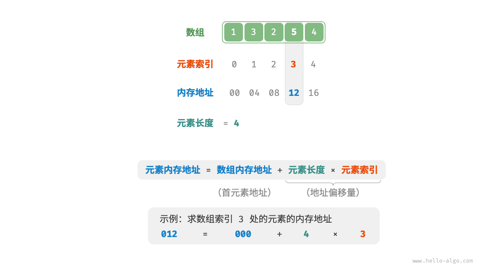

观察上图，我们发现数组首个元素的索引为 $0$ ，这似乎有些反直觉，因为从 $1$ 开始计数会更自然。但从地址计算公式的角度看，**索引本质上是内存地址的偏移量**。首个元素的地址偏移量是 $0$ ，因此它的索引为 $0$ 是合理的。

在数组中访问元素非常高效，我们可以在 $O(1)$ 时间内随机访问数组中的任意一个元素。

```src
[file]{array}-[class]{}-[func]{random_access}
```

### 插入元素

数组元素在内存中是“紧挨着的”，它们之间没有空间再存放任何数据。如下图所示，如果想在数组中间插入一个元素，则需要将该元素之后的所有元素都向后移动一位，之后再把元素赋值给该索引。

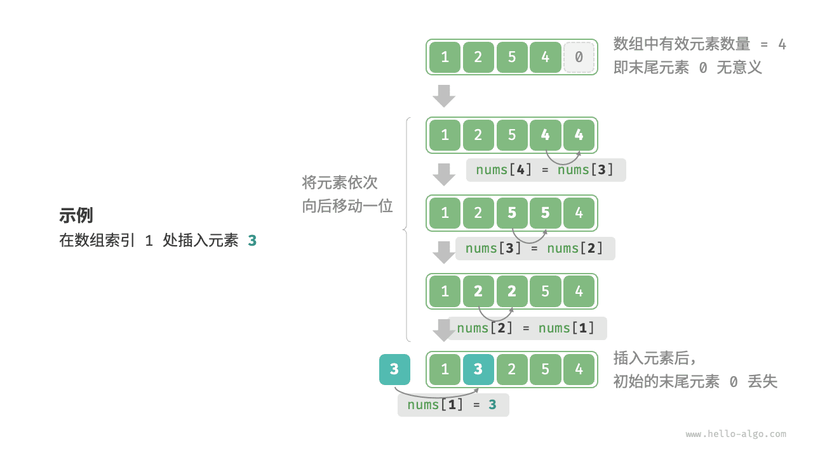

值得注意的是，由于数组的长度是固定的，因此插入一个元素必定会导致数组尾部元素“丢失”。我们将这个问题的解决方案留在“列表”章节中讨论。

```src
[file]{array}-[class]{}-[func]{insert}
```

### 删除元素

同理，如下图所示，若想删除索引 $i$ 处的元素，则需要把索引 $i$ 之后的元素都向前移动一位。

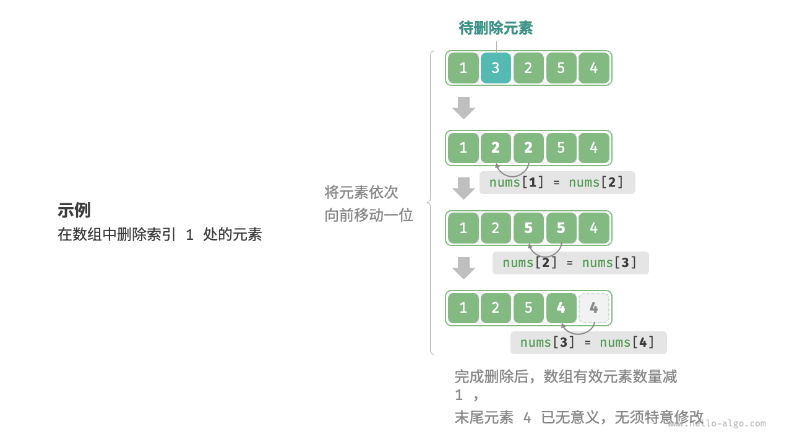

请注意，删除元素完成后，原先末尾的元素变得“无意义”了，所以我们无须特意去修改它。

```src
[file]{array}-[class]{}-[func]{remove}
```

总的来看，数组的插入与删除操作有以下缺点。

- **时间复杂度高**：数组的插入和删除的平均时间复杂度均为 $O(n)$ ，其中 $n$ 为数组长度。
- **丢失元素**：由于数组的长度不可变，因此在插入元素后，超出数组长度范围的元素会丢失。
- **内存浪费**：我们可以初始化一个比较长的数组，只用前面一部分，这样在插入数据时，丢失的末尾元素都是“无意义”的，但这样做会造成部分内存空间浪费。

### 遍历数组

在大多数编程语言中，我们既可以通过索引遍历数组，也可以直接遍历获取数组中的每个元素：

```src
[file]{array}-[class]{}-[func]{traverse}
```

### 查找元素

在数组中查找指定元素需要遍历数组，每轮判断元素值是否匹配，若匹配则输出对应索引。

因为数组是线性数据结构，所以上述查找操作被称为“线性查找”。

```src
[file]{array}-[class]{}-[func]{find}
```

### 扩容数组

在复杂的系统环境中，程序难以保证数组之后的内存空间是可用的，从而无法安全地扩展数组容量。因此在大多数编程语言中，**数组的长度是不可变的**。

如果我们希望扩容数组，则需重新建立一个更大的数组，然后把原数组元素依次复制到新数组。这是一个 $O(n)$ 的操作，在数组很大的情况下非常耗时。代码如下所示：

```src
[file]{array}-[class]{}-[func]{extend}
```

## 数组的优点与局限性

数组存储在连续的内存空间内，且元素类型相同。这种做法包含丰富的先验信息，系统可以利用这些信息来优化数据结构的操作效率。

- **空间效率高**：数组为数据分配了连续的内存块，无须额外的结构开销。
- **支持随机访问**：数组允许在 $O(1)$ 时间内访问任何元素。
- **缓存局部性**：当访问数组元素时，计算机不仅会加载它，还会缓存其周围的其他数据，从而借助高速缓存来提升后续操作的执行速度。

连续空间存储是一把双刃剑，其存在以下局限性。

- **插入与删除效率低**：当数组中元素较多时，插入与删除操作需要移动大量的元素。
- **长度不可变**：数组在初始化后长度就固定了，扩容数组需要将所有数据复制到新数组，开销很大。
- **空间浪费**：如果数组分配的大小超过实际所需，那么多余的空间就被浪费了。

## 数组典型应用

数组是一种基础且常见的数据结构，既频繁应用在各类算法之中，也可用于实现各种复杂数据结构。

- **随机访问**：如果我们想随机抽取一些样本，那么可以用数组存储，并生成一个随机序列，根据索引实现随机抽样。
- **排序和搜索**：数组是排序和搜索算法最常用的数据结构。快速排序、归并排序、二分查找等都主要在数组上进行。
- **查找表**：当需要快速查找一个元素或其对应关系时，可以使用数组作为查找表。假如我们想实现字符到 ASCII 码的映射，则可以将字符的 ASCII 码值作为索引，对应的元素存放在数组中的对应位置。
- **机器学习**：神经网络中大量使用了向量、矩阵、张量之间的线性代数运算，这些数据都是以数组的形式构建的。数组是神经网络编程中最常使用的数据结构。
- **数据结构实现**：数组可以用于实现栈、队列、哈希表、堆、图等数据结构。例如，图的邻接矩阵表示实际上是一个二维数组。

---

# 4.2 &nbsp; 链表

---

# 链表

内存空间是所有程序的公共资源，在一个复杂的系统运行环境下，空闲的内存空间可能散落在内存各处。我们知道，存储数组的内存空间必须是连续的，而当数组非常大时，内存可能无法提供如此大的连续空间。此时链表的灵活性优势就体现出来了。

<u>链表（linked list）</u>是一种线性数据结构，其中的每个元素都是一个节点对象，各个节点通过“引用”相连接。引用记录了下一个节点的内存地址，通过它可以从当前节点访问到下一个节点。

链表的设计使得各个节点可以分散存储在内存各处，它们的内存地址无须连续。

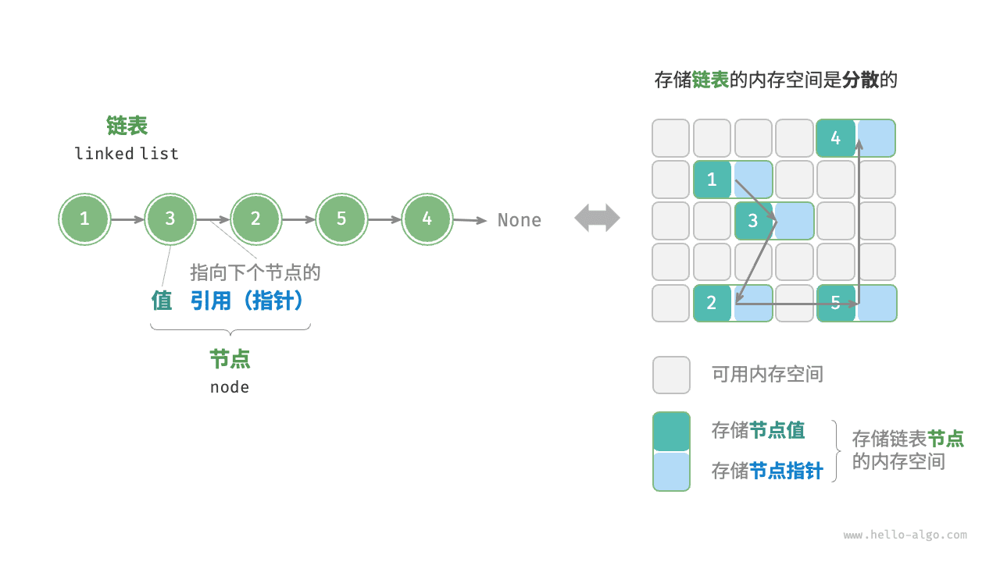

观察上图，链表的组成单位是<u>节点（node）</u>对象。每个节点都包含两项数据：节点的“值”和指向下一节点的“引用”。

- 链表的首个节点被称为“头节点”，最后一个节点被称为“尾节点”。
- 尾节点指向的是“空”，它在 Java、C++ 和 Python 中分别被记为 `null`、`nullptr` 和 `None` 。
- 在 C、C++、Go 和 Rust 等支持指针的语言中，上述“引用”应被替换为“指针”。

如以下代码所示，链表节点 `ListNode` 除了包含值，还需额外保存一个引用（指针）。因此在相同数据量下，**链表比数组占用更多的内存空间**。

=== "Python"

    ```python title=""
    class ListNode:
        """链表节点类"""
        def __init__(self, val: int):
            self.val: int = val               # 节点值
            self.next: ListNode | None = None # 指向下一节点的引用
    ```

=== "C++"

    ```cpp title=""
    /* 链表节点结构体 */
    struct ListNode {
        int val;         // 节点值
        ListNode *next;  // 指向下一节点的指针
        ListNode(int x) : val(x), next(nullptr) {}  // 构造函数
    };
    ```

=== "Java"

    ```java title=""
    /* 链表节点类 */
    class ListNode {
        int val;        // 节点值
        ListNode next;  // 指向下一节点的引用
        ListNode(int x) { val = x; }  // 构造函数
    }
    ```

=== "C#"

    ```csharp title=""
    /* 链表节点类 */
    class ListNode(int x) {  //构造函数
        int val = x;         // 节点值
        ListNode? next;      // 指向下一节点的引用
    }
    ```

=== "Go"

    ```go title=""
    /* 链表节点结构体 */
    type ListNode struct {
        Val  int       // 节点值
        Next *ListNode // 指向下一节点的指针
    }

    // NewListNode 构造函数，创建一个新的链表
    func NewListNode(val int) *ListNode {
        return &ListNode{
            Val:  val,
            Next: nil,
        }
    }
    ```

=== "Swift"

    ```swift title=""
    /* 链表节点类 */
    class ListNode {
        var val: Int // 节点值
        var next: ListNode? // 指向下一节点的引用

        init(x: Int) { // 构造函数
            val = x
        }
    }
    ```

=== "JS"

    ```javascript title=""
    /* 链表节点类 */
    class ListNode {
        constructor(val, next) {
            this.val = (val === undefined ? 0 : val);       // 节点值
            this.next = (next === undefined ? null : next); // 指向下一节点的引用
        }
    }
    ```

=== "TS"

    ```typescript title=""
    /* 链表节点类 */
    class ListNode {
        val: number;
        next: ListNode | null;
        constructor(val?: number, next?: ListNode | null) {
            this.val = val === undefined ? 0 : val;        // 节点值
            this.next = next === undefined ? null : next;  // 指向下一节点的引用
        }
    }
    ```

=== "Dart"

    ```dart title=""
    /* 链表节点类 */
    class ListNode {
      int val; // 节点值
      ListNode? next; // 指向下一节点的引用
      ListNode(this.val, [this.next]); // 构造函数
    }
    ```

=== "Rust"

    ```rust title=""
    use std::rc::Rc;
    use std::cell::RefCell;
    /* 链表节点类 */
    #[derive(Debug)]
    struct ListNode {
        val: i32, // 节点值
        next: Option<Rc<RefCell<ListNode>>>, // 指向下一节点的指针
    }
    ```

=== "C"

    ```c title=""
    /* 链表节点结构体 */
    typedef struct ListNode {
        int val;               // 节点值
        struct ListNode *next; // 指向下一节点的指针
    } ListNode;

    /* 构造函数 */
    ListNode *newListNode(int val) {
        ListNode *node;
        node = (ListNode *) malloc(sizeof(ListNode));
        node->val = val;
        node->next = NULL;
        return node;
    }
    ```

=== "Kotlin"

    ```kotlin title=""
    /* 链表节点类 */
    // 构造方法
    class ListNode(x: Int) {
        val _val: Int = x          // 节点值
        var next: ListNode? = null // 指向下一个节点的引用
    }
    ```

=== "Ruby"

    ```ruby title=""
    # 链表节点类
    class ListNode
      attr_accessor :val  # 节点值
      attr_accessor :next # 指向下一节点的引用

      def initialize(val=0, next_node=nil)
        @val = val
        @next = next_node
      end
    end
    ```

## 链表常用操作

### 初始化链表

建立链表分为两步，第一步是初始化各个节点对象，第二步是构建节点之间的引用关系。初始化完成后，我们就可以从链表的头节点出发，通过引用指向 `next` 依次访问所有节点。

=== "Python"

    ```python title="linked_list.py"
    # 初始化链表 1 -> 3 -> 2 -> 5 -> 4
    # 初始化各个节点
    n0 = ListNode(1)
    n1 = ListNode(3)
    n2 = ListNode(2)
    n3 = ListNode(5)
    n4 = ListNode(4)
    # 构建节点之间的引用
    n0.next = n1
    n1.next = n2
    n2.next = n3
    n3.next = n4
    ```

=== "C++"

    ```cpp title="linked_list.cpp"
    /* 初始化链表 1 -> 3 -> 2 -> 5 -> 4 */
    // 初始化各个节点
    ListNode* n0 = new ListNode(1);
    ListNode* n1 = new ListNode(3);
    ListNode* n2 = new ListNode(2);
    ListNode* n3 = new ListNode(5);
    ListNode* n4 = new ListNode(4);
    // 构建节点之间的引用
    n0->next = n1;
    n1->next = n2;
    n2->next = n3;
    n3->next = n4;
    ```

=== "Java"

    ```java title="linked_list.java"
    /* 初始化链表 1 -> 3 -> 2 -> 5 -> 4 */
    // 初始化各个节点
    ListNode n0 = new ListNode(1);
    ListNode n1 = new ListNode(3);
    ListNode n2 = new ListNode(2);
    ListNode n3 = new ListNode(5);
    ListNode n4 = new ListNode(4);
    // 构建节点之间的引用
    n0.next = n1;
    n1.next = n2;
    n2.next = n3;
    n3.next = n4;
    ```

=== "C#"

    ```csharp title="linked_list.cs"
    /* 初始化链表 1 -> 3 -> 2 -> 5 -> 4 */
    // 初始化各个节点
    ListNode n0 = new(1);
    ListNode n1 = new(3);
    ListNode n2 = new(2);
    ListNode n3 = new(5);
    ListNode n4 = new(4);
    // 构建节点之间的引用
    n0.next = n1;
    n1.next = n2;
    n2.next = n3;
    n3.next = n4;
    ```

=== "Go"

    ```go title="linked_list.go"
    /* 初始化链表 1 -> 3 -> 2 -> 5 -> 4 */
    // 初始化各个节点
    n0 := NewListNode(1)
    n1 := NewListNode(3)
    n2 := NewListNode(2)
    n3 := NewListNode(5)
    n4 := NewListNode(4)
    // 构建节点之间的引用
    n0.Next = n1
    n1.Next = n2
    n2.Next = n3
    n3.Next = n4
    ```

=== "Swift"

    ```swift title="linked_list.swift"
    /* 初始化链表 1 -> 3 -> 2 -> 5 -> 4 */
    // 初始化各个节点
    let n0 = ListNode(x: 1)
    let n1 = ListNode(x: 3)
    let n2 = ListNode(x: 2)
    let n3 = ListNode(x: 5)
    let n4 = ListNode(x: 4)
    // 构建节点之间的引用
    n0.next = n1
    n1.next = n2
    n2.next = n3
    n3.next = n4
    ```

=== "JS"

    ```javascript title="linked_list.js"
    /* 初始化链表 1 -> 3 -> 2 -> 5 -> 4 */
    // 初始化各个节点
    const n0 = new ListNode(1);
    const n1 = new ListNode(3);
    const n2 = new ListNode(2);
    const n3 = new ListNode(5);
    const n4 = new ListNode(4);
    // 构建节点之间的引用
    n0.next = n1;
    n1.next = n2;
    n2.next = n3;
    n3.next = n4;
    ```

=== "TS"

    ```typescript title="linked_list.ts"
    /* 初始化链表 1 -> 3 -> 2 -> 5 -> 4 */
    // 初始化各个节点
    const n0 = new ListNode(1);
    const n1 = new ListNode(3);
    const n2 = new ListNode(2);
    const n3 = new ListNode(5);
    const n4 = new ListNode(4);
    // 构建节点之间的引用
    n0.next = n1;
    n1.next = n2;
    n2.next = n3;
    n3.next = n4;
    ```

=== "Dart"

    ```dart title="linked_list.dart"
    /* 初始化链表 1 -> 3 -> 2 -> 5 -> 4 */\
    // 初始化各个节点
    ListNode n0 = ListNode(1);
    ListNode n1 = ListNode(3);
    ListNode n2 = ListNode(2);
    ListNode n3 = ListNode(5);
    ListNode n4 = ListNode(4);
    // 构建节点之间的引用
    n0.next = n1;
    n1.next = n2;
    n2.next = n3;
    n3.next = n4;
    ```

=== "Rust"

    ```rust title="linked_list.rs"
    /* 初始化链表 1 -> 3 -> 2 -> 5 -> 4 */
    // 初始化各个节点
    let n0 = Rc::new(RefCell::new(ListNode { val: 1, next: None }));
    let n1 = Rc::new(RefCell::new(ListNode { val: 3, next: None }));
    let n2 = Rc::new(RefCell::new(ListNode { val: 2, next: None }));
    let n3 = Rc::new(RefCell::new(ListNode { val: 5, next: None }));
    let n4 = Rc::new(RefCell::new(ListNode { val: 4, next: None }));

    // 构建节点之间的引用
    n0.borrow_mut().next = Some(n1.clone());
    n1.borrow_mut().next = Some(n2.clone());
    n2.borrow_mut().next = Some(n3.clone());
    n3.borrow_mut().next = Some(n4.clone());
    ```

=== "C"

    ```c title="linked_list.c"
    /* 初始化链表 1 -> 3 -> 2 -> 5 -> 4 */
    // 初始化各个节点
    ListNode* n0 = newListNode(1);
    ListNode* n1 = newListNode(3);
    ListNode* n2 = newListNode(2);
    ListNode* n3 = newListNode(5);
    ListNode* n4 = newListNode(4);
    // 构建节点之间的引用
    n0->next = n1;
    n1->next = n2;
    n2->next = n3;
    n3->next = n4;
    ```

=== "Kotlin"

    ```kotlin title="linked_list.kt"
    /* 初始化链表 1 -> 3 -> 2 -> 5 -> 4 */
    // 初始化各个节点
    val n0 = ListNode(1)
    val n1 = ListNode(3)
    val n2 = ListNode(2)
    val n3 = ListNode(5)
    val n4 = ListNode(4)
    // 构建节点之间的引用
    n0.next = n1;
    n1.next = n2;
    n2.next = n3;
    n3.next = n4;
    ```

=== "Ruby"

    ```ruby title="linked_list.rb"
    # 初始化链表 1 -> 3 -> 2 -> 5 -> 4
    # 初始化各个节点
    n0 = ListNode.new(1)
    n1 = ListNode.new(3)
    n2 = ListNode.new(2)
    n3 = ListNode.new(5)
    n4 = ListNode.new(4)
    # 构建节点之间的引用
    n0.next = n1
    n1.next = n2
    n2.next = n3
    n3.next = n4
    ```

??? pythontutor "可视化运行"

    https://pythontutor.com/render.html#code=class%20ListNode%3A%0A%20%20%20%20%22%22%22%E9%93%BE%E8%A1%A8%E8%8A%82%E7%82%B9%E7%B1%BB%22%22%22%0A%20%20%20%20def%20__init__%28self,%20val%3A%20int%29%3A%0A%20%20%20%20%20%20%20%20self.val%3A%20int%20%3D%20val%20%20%23%20%E8%8A%82%E7%82%B9%E5%80%BC%0A%20%20%20%20%20%20%20%20self.next%3A%20ListNode%20%7C%20None%20%3D%20None%20%20%23%20%E5%90%8E%E7%BB%A7%E8%8A%82%E7%82%B9%E5%BC%95%E7%94%A8%0A%0A%22%22%22Driver%20Code%22%22%22%0Aif%20__name__%20%3D%3D%20%22__main__%22%3A%0A%20%20%20%20%23%20%E5%88%9D%E5%A7%8B%E5%8C%96%E9%93%BE%E8%A1%A8%201%20-%3E%203%20-%3E%202%20-%3E%205%20-%3E%204%0A%20%20%20%20%23%20%E5%88%9D%E5%A7%8B%E5%8C%96%E5%90%84%E4%B8%AA%E8%8A%82%E7%82%B9%0A%20%20%20%20n0%20%3D%20ListNode%281%29%0A%20%20%20%20n1%20%3D%20ListNode%283%29%0A%20%20%20%20n2%20%3D%20ListNode%282%29%0A%20%20%20%20n3%20%3D%20ListNode%285%29%0A%20%20%20%20n4%20%3D%20ListNode%284%29%0A%20%20%20%20%23%20%E6%9E%84%E5%BB%BA%E8%8A%82%E7%82%B9%E4%B9%8B%E9%97%B4%E7%9A%84%E5%BC%95%E7%94%A8%0A%20%20%20%20n0.next%20%3D%20n1%0A%20%20%20%20n1.next%20%3D%20n2%0A%20%20%20%20n2.next%20%3D%20n3%0A%20%20%20%20n3.next%20%3D%20n4&cumulative=false&curInstr=3&heapPrimitives=nevernest&mode=display&origin=opt-frontend.js&py=311&rawInputLstJSON=%5B%5D&textReferences=false

数组整体是一个变量，比如数组 `nums` 包含元素 `nums[0]` 和 `nums[1]` 等，而链表是由多个独立的节点对象组成的。**我们通常将头节点当作链表的代称**，比如以上代码中的链表可记作链表 `n0` 。

### 插入节点

在链表中插入节点非常容易。如下图所示，假设我们想在相邻的两个节点 `n0` 和 `n1` 之间插入一个新节点 `P` ，**则只需改变两个节点引用（指针）即可**，时间复杂度为 $O(1)$ 。

相比之下，在数组中插入元素的时间复杂度为 $O(n)$ ，在大数据量下的效率较低。

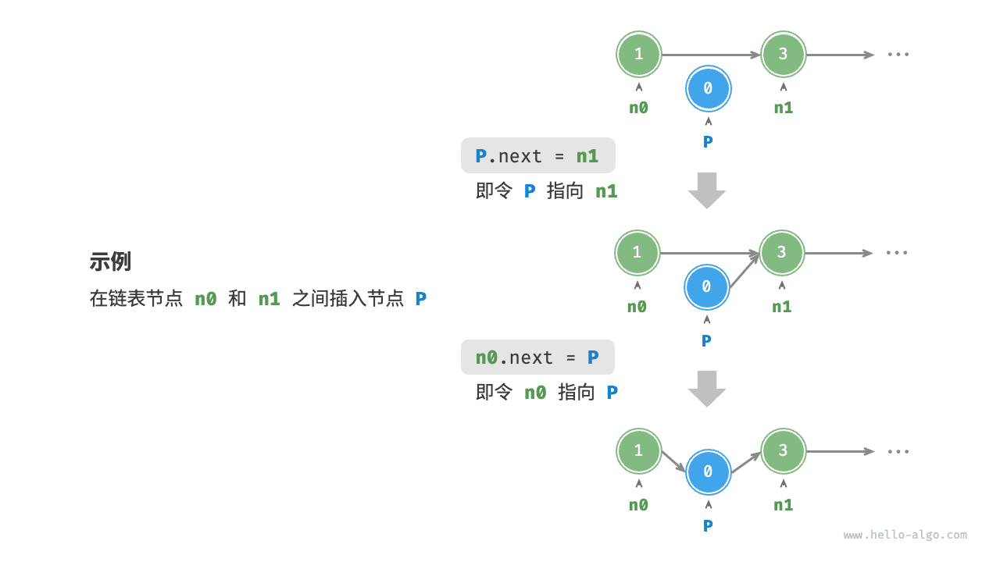

```src
[file]{linked_list}-[class]{}-[func]{insert}
```

### 删除节点

如下图所示，在链表中删除节点也非常方便，**只需改变一个节点的引用（指针）即可**。

请注意，尽管在删除操作完成后节点 `P` 仍然指向 `n1` ，但实际上遍历此链表已经无法访问到 `P` ，这意味着 `P` 已经不再属于该链表了。

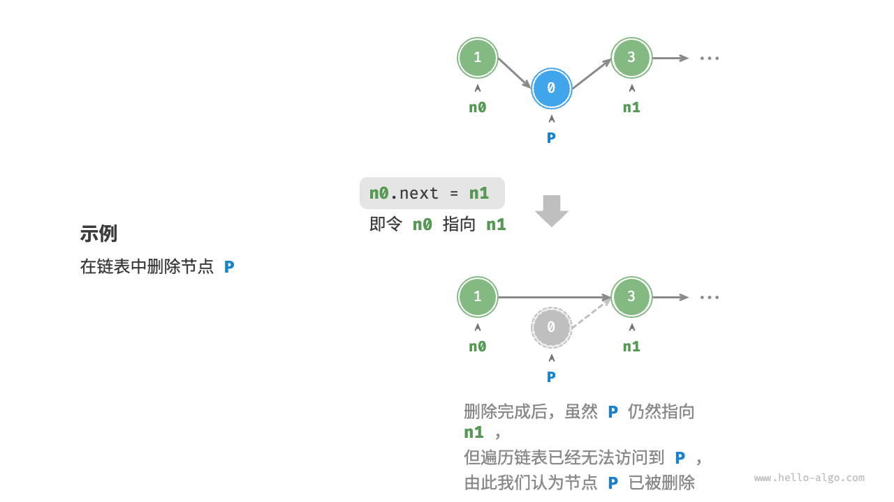

```src
[file]{linked_list}-[class]{}-[func]{remove}
```

### 访问节点

**在链表中访问节点的效率较低**。如上一节所述，我们可以在 $O(1)$ 时间下访问数组中的任意元素。链表则不然，程序需要从头节点出发，逐个向后遍历，直至找到目标节点。也就是说，访问链表的第 $i$ 个节点需要循环 $i - 1$ 轮，时间复杂度为 $O(n)$ 。

```src
[file]{linked_list}-[class]{}-[func]{access}
```

### 查找节点

遍历链表，查找其中值为 `target` 的节点，输出该节点在链表中的索引。此过程也属于线性查找。代码如下所示：

```src
[file]{linked_list}-[class]{}-[func]{find}
```

## 数组 vs. 链表

下表总结了数组和链表的各项特点并对比了操作效率。由于它们采用两种相反的存储策略，因此各种性质和操作效率也呈现对立的特点。

<p align="center"> 表 <id> &nbsp; 数组与链表的效率对比 </p>

|          | 数组                           | 链表           |
| -------- | ------------------------------ | -------------- |
| 存储方式 | 连续内存空间                   | 分散内存空间   |
| 容量扩展 | 长度不可变                     | 可灵活扩展     |
| 内存效率 | 元素占用内存少、但可能浪费空间 | 元素占用内存多 |
| 访问元素 | $O(1)$                         | $O(n)$         |
| 添加元素 | $O(n)$                         | $O(1)$         |
| 删除元素 | $O(n)$                         | $O(1)$         |

## 常见链表类型

如下图所示，常见的链表类型包括三种。

- **单向链表**：即前面介绍的普通链表。单向链表的节点包含值和指向下一节点的引用两项数据。我们将首个节点称为头节点，将最后一个节点称为尾节点，尾节点指向空 `None` 。
- **环形链表**：如果我们令单向链表的尾节点指向头节点（首尾相接），则得到一个环形链表。在环形链表中，任意节点都可以视作头节点。
- **双向链表**：与单向链表相比，双向链表记录了两个方向的引用。双向链表的节点定义同时包含指向后继节点（下一个节点）和前驱节点（上一个节点）的引用（指针）。相较于单向链表，双向链表更具灵活性，可以朝两个方向遍历链表，但相应地也需要占用更多的内存空间。

=== "Python"

    ```python title=""
    class ListNode:
        """双向链表节点类"""
        def __init__(self, val: int):
            self.val: int = val                # 节点值
            self.next: ListNode | None = None  # 指向后继节点的引用
            self.prev: ListNode | None = None  # 指向前驱节点的引用
    ```

=== "C++"

    ```cpp title=""
    /* 双向链表节点结构体 */
    struct ListNode {
        int val;         // 节点值
        ListNode *next;  // 指向后继节点的指针
        ListNode *prev;  // 指向前驱节点的指针
        ListNode(int x) : val(x), next(nullptr), prev(nullptr) {}  // 构造函数
    };
    ```

=== "Java"

    ```java title=""
    /* 双向链表节点类 */
    class ListNode {
        int val;        // 节点值
        ListNode next;  // 指向后继节点的引用
        ListNode prev;  // 指向前驱节点的引用
        ListNode(int x) { val = x; }  // 构造函数
    }
    ```

=== "C#"

    ```csharp title=""
    /* 双向链表节点类 */
    class ListNode(int x) {  // 构造函数
        int val = x;    // 节点值
        ListNode next;  // 指向后继节点的引用
        ListNode prev;  // 指向前驱节点的引用
    }
    ```

=== "Go"

    ```go title=""
    /* 双向链表节点结构体 */
    type DoublyListNode struct {
        Val  int             // 节点值
        Next *DoublyListNode // 指向后继节点的指针
        Prev *DoublyListNode // 指向前驱节点的指针
    }

    // NewDoublyListNode 初始化
    func NewDoublyListNode(val int) *DoublyListNode {
        return &DoublyListNode{
            Val:  val,
            Next: nil,
            Prev: nil,
        }
    }
    ```

=== "Swift"

    ```swift title=""
    /* 双向链表节点类 */
    class ListNode {
        var val: Int // 节点值
        var next: ListNode? // 指向后继节点的引用
        var prev: ListNode? // 指向前驱节点的引用

        init(x: Int) { // 构造函数
            val = x
        }
    }
    ```

=== "JS"

    ```javascript title=""
    /* 双向链表节点类 */
    class ListNode {
        constructor(val, next, prev) {
            this.val = val  ===  undefined ? 0 : val;        // 节点值
            this.next = next  ===  undefined ? null : next;  // 指向后继节点的引用
            this.prev = prev  ===  undefined ? null : prev;  // 指向前驱节点的引用
        }
    }
    ```

=== "TS"

    ```typescript title=""
    /* 双向链表节点类 */
    class ListNode {
        val: number;
        next: ListNode | null;
        prev: ListNode | null;
        constructor(val?: number, next?: ListNode | null, prev?: ListNode | null) {
            this.val = val  ===  undefined ? 0 : val;        // 节点值
            this.next = next  ===  undefined ? null : next;  // 指向后继节点的引用
            this.prev = prev  ===  undefined ? null : prev;  // 指向前驱节点的引用
        }
    }
    ```

=== "Dart"

    ```dart title=""
    /* 双向链表节点类 */
    class ListNode {
        int val;        // 节点值
        ListNode? next;  // 指向后继节点的引用
        ListNode? prev;  // 指向前驱节点的引用
        ListNode(this.val, [this.next, this.prev]);  // 构造函数
    }
    ```

=== "Rust"

    ```rust title=""
    use std::rc::Rc;
    use std::cell::RefCell;

    /* 双向链表节点类型 */
    #[derive(Debug)]
    struct ListNode {
        val: i32, // 节点值
        next: Option<Rc<RefCell<ListNode>>>, // 指向后继节点的指针
        prev: Option<Rc<RefCell<ListNode>>>, // 指向前驱节点的指针
    }

    /* 构造函数 */
    impl ListNode {
        fn new(val: i32) -> Self {
            ListNode {
                val,
                next: None,
                prev: None,
            }
        }
    }
    ```

=== "C"

    ```c title=""
    /* 双向链表节点结构体 */
    typedef struct ListNode {
        int val;               // 节点值
        struct ListNode *next; // 指向后继节点的指针
        struct ListNode *prev; // 指向前驱节点的指针
    } ListNode;

    /* 构造函数 */
    ListNode *newListNode(int val) {
        ListNode *node;
        node = (ListNode *) malloc(sizeof(ListNode));
        node->val = val;
        node->next = NULL;
        node->prev = NULL;
        return node;
    }
    ```

=== "Kotlin"

    ```kotlin title=""
    /* 双向链表节点类 */
    // 构造方法
    class ListNode(x: Int) {
        val _val: Int = x           // 节点值
        var next: ListNode? = null  // 指向后继节点的引用
        var prev: ListNode? = null  // 指向前驱节点的引用
    }
    ```

=== "Ruby"

    ```ruby title=""
    # 双向链表节点类
    class ListNode
      attr_accessor :val    # 节点值
      attr_accessor :next   # 指向后继节点的引用
      attr_accessor :prev   # 指向前驱节点的引用

      def initialize(val=0, next_node=nil, prev_node=nil)
        @val = val
        @next = next_node
        @prev = prev_node
      end
    end
    ```

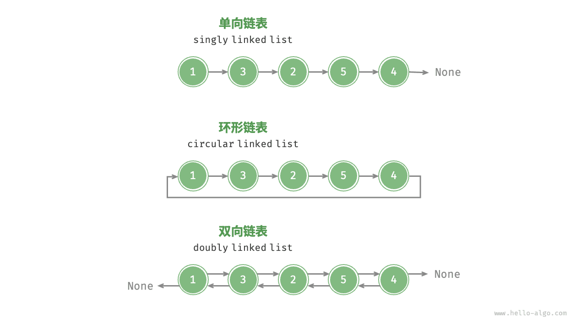

## 链表典型应用

单向链表通常用于实现栈、队列、哈希表和图等数据结构。

- **栈与队列**：当插入和删除操作都在链表的一端进行时，它表现的特性为先进后出，对应栈；当插入操作在链表的一端进行，删除操作在链表的另一端进行，它表现的特性为先进先出，对应队列。
- **哈希表**：链式地址是解决哈希冲突的主流方案之一，在该方案中，所有冲突的元素都会被放到一个链表中。
- **图**：邻接表是表示图的一种常用方式，其中图的每个顶点都与一个链表相关联，链表中的每个元素都代表与该顶点相连的其他顶点。

双向链表常用于需要快速查找前一个和后一个元素的场景。

- **高级数据结构**：比如在红黑树、B 树中，我们需要访问节点的父节点，这可以通过在节点中保存一个指向父节点的引用来实现，类似于双向链表。
- **浏览器历史**：在网页浏览器中，当用户点击前进或后退按钮时，浏览器需要知道用户访问过的前一个和后一个网页。双向链表的特性使得这种操作变得简单。
- **LRU 算法**：在缓存淘汰（LRU）算法中，我们需要快速找到最近最少使用的数据，以及支持快速添加和删除节点。这时候使用双向链表就非常合适。

环形链表常用于需要周期性操作的场景，比如操作系统的资源调度。

- **时间片轮转调度算法**：在操作系统中，时间片轮转调度算法是一种常见的 CPU 调度算法，它需要对一组进程进行循环。每个进程被赋予一个时间片，当时间片用完时，CPU 将切换到下一个进程。这种循环操作可以通过环形链表来实现。
- **数据缓冲区**：在某些数据缓冲区的实现中，也可能会使用环形链表。比如在音频、视频播放器中，数据流可能会被分成多个缓冲块并放入一个环形链表，以便实现无缝播放。

---

# 4.3 &nbsp; 列表

---

# 列表

<u>列表（list）</u>是一个抽象的数据结构概念，它表示元素的有序集合，支持元素访问、修改、添加、删除和遍历等操作，无须使用者考虑容量限制的问题。列表可以基于链表或数组实现。

- 链表天然可以看作一个列表，其支持元素增删查改操作，并且可以灵活动态扩容。
- 数组也支持元素增删查改，但由于其长度不可变，因此只能看作一个具有长度限制的列表。

当使用数组实现列表时，**长度不可变的性质会导致列表的实用性降低**。这是因为我们通常无法事先确定需要存储多少数据，从而难以选择合适的列表长度。若长度过小，则很可能无法满足使用需求；若长度过大，则会造成内存空间浪费。

为解决此问题，我们可以使用<u>动态数组（dynamic array）</u>来实现列表。它继承了数组的各项优点，并且可以在程序运行过程中进行动态扩容。

实际上，**许多编程语言中的标准库提供的列表是基于动态数组实现的**，例如 Python 中的 `list` 、Java 中的 `ArrayList` 、C++ 中的 `vector` 和 C# 中的 `List` 等。在接下来的讨论中，我们将把“列表”和“动态数组”视为等同的概念。

## 列表常用操作

### 初始化列表

我们通常使用“无初始值”和“有初始值”这两种初始化方法：

=== "Python"

    ```python title="list.py"
    # 初始化列表
    # 无初始值
    nums1: list[int] = []
    # 有初始值
    nums: list[int] = [1, 3, 2, 5, 4]
    ```

=== "C++"

    ```cpp title="list.cpp"
    /* 初始化列表 */
    // 需注意，C++ 中 vector 即是本文描述的 nums
    // 无初始值
    vector<int> nums1;
    // 有初始值
    vector<int> nums = { 1, 3, 2, 5, 4 };
    ```

=== "Java"

    ```java title="list.java"
    /* 初始化列表 */
    // 无初始值
    List<Integer> nums1 = new ArrayList<>();
    // 有初始值（注意数组的元素类型需为 int[] 的包装类 Integer[]）
    Integer[] numbers = new Integer[] { 1, 3, 2, 5, 4 };
    List<Integer> nums = new ArrayList<>(Arrays.asList(numbers));
    ```

=== "C#"

    ```csharp title="list.cs"
    /* 初始化列表 */
    // 无初始值
    List<int> nums1 = [];
    // 有初始值
    int[] numbers = [1, 3, 2, 5, 4];
    List<int> nums = [.. numbers];
    ```

=== "Go"

    ```go title="list_test.go"
    /* 初始化列表 */
    // 无初始值
    nums1 := []int{}
    // 有初始值
    nums := []int{1, 3, 2, 5, 4}
    ```

=== "Swift"

    ```swift title="list.swift"
    /* 初始化列表 */
    // 无初始值
    let nums1: [Int] = []
    // 有初始值
    var nums = [1, 3, 2, 5, 4]
    ```

=== "JS"

    ```javascript title="list.js"
    /* 初始化列表 */
    // 无初始值
    const nums1 = [];
    // 有初始值
    const nums = [1, 3, 2, 5, 4];
    ```

=== "TS"

    ```typescript title="list.ts"
    /* 初始化列表 */
    // 无初始值
    const nums1: number[] = [];
    // 有初始值
    const nums: number[] = [1, 3, 2, 5, 4];
    ```

=== "Dart"

    ```dart title="list.dart"
    /* 初始化列表 */
    // 无初始值
    List<int> nums1 = [];
    // 有初始值
    List<int> nums = [1, 3, 2, 5, 4];
    ```

=== "Rust"

    ```rust title="list.rs"
    /* 初始化列表 */
    // 无初始值
    let nums1: Vec<i32> = Vec::new();
    // 有初始值
    let nums: Vec<i32> = vec![1, 3, 2, 5, 4];
    ```

=== "C"

    ```c title="list.c"
    // C 未提供内置动态数组
    ```

=== "Kotlin"

    ```kotlin title="list.kt"
    /* 初始化列表 */
    // 无初始值
    var nums1 = listOf<Int>()
    // 有初始值
    var numbers = arrayOf(1, 3, 2, 5, 4)
    var nums = numbers.toMutableList()
    ```

=== "Ruby"

    ```ruby title="list.rb"
    # 初始化列表
    # 无初始值
    nums1 = []
    # 有初始值
    nums = [1, 3, 2, 5, 4]
    ```

??? pythontutor "可视化运行"

    https://pythontutor.com/render.html#code=%22%22%22Driver%20Code%22%22%22%0Aif%20__name__%20%3D%3D%20%22__main__%22%3A%0A%20%20%20%20%23%20%E5%88%9D%E5%A7%8B%E5%8C%96%E5%88%97%E8%A1%A8%0A%20%20%20%20%23%20%E6%97%A0%E5%88%9D%E5%A7%8B%E5%80%BC%0A%20%20%20%20nums1%20%3D%20%5B%5D%0A%20%20%20%20%23%20%E6%9C%89%E5%88%9D%E5%A7%8B%E5%80%BC%0A%20%20%20%20nums%20%3D%20%5B1,%203,%202,%205,%204%5D&cumulative=false&curInstr=4&heapPrimitives=nevernest&mode=display&origin=opt-frontend.js&py=311&rawInputLstJSON=%5B%5D&textReferences=false

### 访问元素

列表本质上是数组，因此可以在 $O(1)$ 时间内访问和更新元素，效率很高。

=== "Python"

    ```python title="list.py"
    # 访问元素
    num: int = nums[1]  # 访问索引 1 处的元素

    # 更新元素
    nums[1] = 0    # 将索引 1 处的元素更新为 0
    ```

=== "C++"

    ```cpp title="list.cpp"
    /* 访问元素 */
    int num = nums[1];  // 访问索引 1 处的元素

    /* 更新元素 */
    nums[1] = 0;  // 将索引 1 处的元素更新为 0
    ```

=== "Java"

    ```java title="list.java"
    /* 访问元素 */
    int num = nums.get(1);  // 访问索引 1 处的元素

    /* 更新元素 */
    nums.set(1, 0);  // 将索引 1 处的元素更新为 0
    ```

=== "C#"

    ```csharp title="list.cs"
    /* 访问元素 */
    int num = nums[1];  // 访问索引 1 处的元素

    /* 更新元素 */
    nums[1] = 0;  // 将索引 1 处的元素更新为 0
    ```

=== "Go"

    ```go title="list_test.go"
    /* 访问元素 */
    num := nums[1]  // 访问索引 1 处的元素

    /* 更新元素 */
    nums[1] = 0     // 将索引 1 处的元素更新为 0
    ```

=== "Swift"

    ```swift title="list.swift"
    /* 访问元素 */
    let num = nums[1] // 访问索引 1 处的元素

    /* 更新元素 */
    nums[1] = 0 // 将索引 1 处的元素更新为 0
    ```

=== "JS"

    ```javascript title="list.js"
    /* 访问元素 */
    const num = nums[1];  // 访问索引 1 处的元素

    /* 更新元素 */
    nums[1] = 0;  // 将索引 1 处的元素更新为 0
    ```

=== "TS"

    ```typescript title="list.ts"
    /* 访问元素 */
    const num: number = nums[1];  // 访问索引 1 处的元素

    /* 更新元素 */
    nums[1] = 0;  // 将索引 1 处的元素更新为 0
    ```

=== "Dart"

    ```dart title="list.dart"
    /* 访问元素 */
    int num = nums[1];  // 访问索引 1 处的元素

    /* 更新元素 */
    nums[1] = 0;  // 将索引 1 处的元素更新为 0
    ```

=== "Rust"

    ```rust title="list.rs"
    /* 访问元素 */
    let num: i32 = nums[1];  // 访问索引 1 处的元素
    /* 更新元素 */
    nums[1] = 0;             // 将索引 1 处的元素更新为 0
    ```

=== "C"

    ```c title="list.c"
    // C 未提供内置动态数组
    ```

=== "Kotlin"

    ```kotlin title="list.kt"
    /* 访问元素 */
    val num = nums[1]       // 访问索引 1 处的元素
    /* 更新元素 */
    nums[1] = 0             // 将索引 1 处的元素更新为 0
    ```

=== "Ruby"

    ```ruby title="list.rb"
    # 访问元素
    num = nums[1] # 访问索引 1 处的元素
    # 更新元素
    nums[1] = 0 # 将索引 1 处的元素更新为 0
    ```

??? pythontutor "可视化运行"

    https://pythontutor.com/render.html#code=%22%22%22Driver%20Code%22%22%22%0Aif%20__name__%20%3D%3D%20%22__main__%22%3A%0A%20%20%20%20%23%20%E5%88%9D%E5%A7%8B%E5%8C%96%E5%88%97%E8%A1%A8%0A%20%20%20%20nums%20%3D%20%5B1,%203,%202,%205,%204%5D%0A%0A%20%20%20%20%23%20%E8%AE%BF%E9%97%AE%E5%85%83%E7%B4%A0%0A%20%20%20%20num%20%3D%20nums%5B1%5D%20%20%23%20%E8%AE%BF%E9%97%AE%E7%B4%A2%E5%BC%95%201%20%E5%A4%84%E7%9A%84%E5%85%83%E7%B4%A0%0A%0A%20%20%20%20%23%20%E6%9B%B4%E6%96%B0%E5%85%83%E7%B4%A0%0A%20%20%20%20nums%5B1%5D%20%3D%200%20%20%20%20%23%20%E5%B0%86%E7%B4%A2%E5%BC%95%201%20%E5%A4%84%E7%9A%84%E5%85%83%E7%B4%A0%E6%9B%B4%E6%96%B0%E4%B8%BA%200&cumulative=false&curInstr=3&heapPrimitives=nevernest&mode=display&origin=opt-frontend.js&py=311&rawInputLstJSON=%5B%5D&textReferences=false

### 插入与删除元素

相较于数组，列表可以自由地添加与删除元素。在列表尾部添加元素的时间复杂度为 $O(1)$ ，但插入和删除元素的效率仍与数组相同，时间复杂度为 $O(n)$ 。

=== "Python"

    ```python title="list.py"
    # 清空列表
    nums.clear()

    # 在尾部添加元素
    nums.append(1)
    nums.append(3)
    nums.append(2)
    nums.append(5)
    nums.append(4)

    # 在中间插入元素
    nums.insert(3, 6)  # 在索引 3 处插入数字 6

    # 删除元素
    nums.pop(3)        # 删除索引 3 处的元素
    ```

=== "C++"

    ```cpp title="list.cpp"
    /* 清空列表 */
    nums.clear();

    /* 在尾部添加元素 */
    nums.push_back(1);
    nums.push_back(3);
    nums.push_back(2);
    nums.push_back(5);
    nums.push_back(4);

    /* 在中间插入元素 */
    nums.insert(nums.begin() + 3, 6);  // 在索引 3 处插入数字 6

    /* 删除元素 */
    nums.erase(nums.begin() + 3);      // 删除索引 3 处的元素
    ```

=== "Java"

    ```java title="list.java"
    /* 清空列表 */
    nums.clear();

    /* 在尾部添加元素 */
    nums.add(1);
    nums.add(3);
    nums.add(2);
    nums.add(5);
    nums.add(4);

    /* 在中间插入元素 */
    nums.add(3, 6);  // 在索引 3 处插入数字 6

    /* 删除元素 */
    nums.remove(3);  // 删除索引 3 处的元素
    ```

=== "C#"

    ```csharp title="list.cs"
    /* 清空列表 */
    nums.Clear();

    /* 在尾部添加元素 */
    nums.Add(1);
    nums.Add(3);
    nums.Add(2);
    nums.Add(5);
    nums.Add(4);

    /* 在中间插入元素 */
    nums.Insert(3, 6);  // 在索引 3 处插入数字 6

    /* 删除元素 */
    nums.RemoveAt(3);  // 删除索引 3 处的元素
    ```

=== "Go"

    ```go title="list_test.go"
    /* 清空列表 */
    nums = nil

    /* 在尾部添加元素 */
    nums = append(nums, 1)
    nums = append(nums, 3)
    nums = append(nums, 2)
    nums = append(nums, 5)
    nums = append(nums, 4)

    /* 在中间插入元素 */
    nums = append(nums[:3], append([]int{6}, nums[3:]...)...) // 在索引 3 处插入数字 6

    /* 删除元素 */
    nums = append(nums[:3], nums[4:]...) // 删除索引 3 处的元素
    ```

=== "Swift"

    ```swift title="list.swift"
    /* 清空列表 */
    nums.removeAll()

    /* 在尾部添加元素 */
    nums.append(1)
    nums.append(3)
    nums.append(2)
    nums.append(5)
    nums.append(4)

    /* 在中间插入元素 */
    nums.insert(6, at: 3) // 在索引 3 处插入数字 6

    /* 删除元素 */
    nums.remove(at: 3) // 删除索引 3 处的元素
    ```

=== "JS"

    ```javascript title="list.js"
    /* 清空列表 */
    nums.length = 0;

    /* 在尾部添加元素 */
    nums.push(1);
    nums.push(3);
    nums.push(2);
    nums.push(5);
    nums.push(4);

    /* 在中间插入元素 */
    nums.splice(3, 0, 6); // 在索引 3 处插入数字 6

    /* 删除元素 */
    nums.splice(3, 1);  // 删除索引 3 处的元素
    ```

=== "TS"

    ```typescript title="list.ts"
    /* 清空列表 */
    nums.length = 0;

    /* 在尾部添加元素 */
    nums.push(1);
    nums.push(3);
    nums.push(2);
    nums.push(5);
    nums.push(4);

    /* 在中间插入元素 */
    nums.splice(3, 0, 6); // 在索引 3 处插入数字 6

    /* 删除元素 */
    nums.splice(3, 1);  // 删除索引 3 处的元素
    ```

=== "Dart"

    ```dart title="list.dart"
    /* 清空列表 */
    nums.clear();

    /* 在尾部添加元素 */
    nums.add(1);
    nums.add(3);
    nums.add(2);
    nums.add(5);
    nums.add(4);

    /* 在中间插入元素 */
    nums.insert(3, 6); // 在索引 3 处插入数字 6

    /* 删除元素 */
    nums.removeAt(3); // 删除索引 3 处的元素
    ```

=== "Rust"

    ```rust title="list.rs"
    /* 清空列表 */
    nums.clear();

    /* 在尾部添加元素 */
    nums.push(1);
    nums.push(3);
    nums.push(2);
    nums.push(5);
    nums.push(4);

    /* 在中间插入元素 */
    nums.insert(3, 6);  // 在索引 3 处插入数字 6

    /* 删除元素 */
    nums.remove(3);    // 删除索引 3 处的元素
    ```

=== "C"

    ```c title="list.c"
    // C 未提供内置动态数组
    ```

=== "Kotlin"

    ```kotlin title="list.kt"
    /* 清空列表 */
    nums.clear();

    /* 在尾部添加元素 */
    nums.add(1);
    nums.add(3);
    nums.add(2);
    nums.add(5);
    nums.add(4);

    /* 在中间插入元素 */
    nums.add(3, 6);  // 在索引 3 处插入数字 6

    /* 删除元素 */
    nums.remove(3);  // 删除索引 3 处的元素
    ```

=== "Ruby"

    ```ruby title="list.rb"
    # 清空列表
    nums.clear

    # 在尾部添加元素
    nums << 1
    nums << 3
    nums << 2
    nums << 5
    nums << 4

    # 在中间插入元素
    nums.insert(3, 6) # 在索引 3 处插入数字 6

    # 删除元素
    nums.delete_at(3) # 删除索引 3 处的元素
    ```

??? pythontutor "可视化运行"

    https://pythontutor.com/render.html#code=%22%22%22Driver%20Code%22%22%22%0Aif%20__name__%20%3D%3D%20%22__main__%22%3A%0A%20%20%20%20%23%20%E6%9C%89%E5%88%9D%E5%A7%8B%E5%80%BC%0A%20%20%20%20nums%20%3D%20%5B1,%203,%202,%205,%204%5D%0A%20%20%20%20%0A%20%20%20%20%23%20%E6%B8%85%E7%A9%BA%E5%88%97%E8%A1%A8%0A%20%20%20%20nums.clear%28%29%0A%20%20%20%20%0A%20%20%20%20%23%20%E5%9C%A8%E5%B0%BE%E9%83%A8%E6%B7%BB%E5%8A%A0%E5%85%83%E7%B4%A0%0A%20%20%20%20nums.append%281%29%0A%20%20%20%20nums.append%283%29%0A%20%20%20%20nums.append%282%29%0A%20%20%20%20nums.append%285%29%0A%20%20%20%20nums.append%284%29%0A%20%20%20%20%0A%20%20%20%20%23%20%E5%9C%A8%E4%B8%AD%E9%97%B4%E6%8F%92%E5%85%A5%E5%85%83%E7%B4%A0%0A%20%20%20%20nums.insert%283,%206%29%20%20%23%20%E5%9C%A8%E7%B4%A2%E5%BC%95%203%20%E5%A4%84%E6%8F%92%E5%85%A5%E6%95%B0%E5%AD%97%206%0A%20%20%20%20%0A%20%20%20%20%23%20%E5%88%A0%E9%99%A4%E5%85%83%E7%B4%A0%0A%20%20%20%20nums.pop%283%29%20%20%20%20%20%20%20%20%23%20%E5%88%A0%E9%99%A4%E7%B4%A2%E5%BC%95%203%20%E5%A4%84%E7%9A%84%E5%85%83%E7%B4%A0&cumulative=false&curInstr=3&heapPrimitives=nevernest&mode=display&origin=opt-frontend.js&py=311&rawInputLstJSON=%5B%5D&textReferences=false

### 遍历列表

与数组一样，列表可以根据索引遍历，也可以直接遍历各元素。

=== "Python"

    ```python title="list.py"
    # 通过索引遍历列表
    count = 0
    for i in range(len(nums)):
        count += nums[i]

    # 直接遍历列表元素
    for num in nums:
        count += num
    ```

=== "C++"

    ```cpp title="list.cpp"
    /* 通过索引遍历列表 */
    int count = 0;
    for (int i = 0; i < nums.size(); i++) {
        count += nums[i];
    }

    /* 直接遍历列表元素 */
    count = 0;
    for (int num : nums) {
        count += num;
    }
    ```

=== "Java"

    ```java title="list.java"
    /* 通过索引遍历列表 */
    int count = 0;
    for (int i = 0; i < nums.size(); i++) {
        count += nums.get(i);
    }

    /* 直接遍历列表元素 */
    for (int num : nums) {
        count += num;
    }
    ```

=== "C#"

    ```csharp title="list.cs"
    /* 通过索引遍历列表 */
    int count = 0;
    for (int i = 0; i < nums.Count; i++) {
        count += nums[i];
    }

    /* 直接遍历列表元素 */
    count = 0;
    foreach (int num in nums) {
        count += num;
    }
    ```

=== "Go"

    ```go title="list_test.go"
    /* 通过索引遍历列表 */
    count := 0
    for i := 0; i < len(nums); i++ {
        count += nums[i]
    }

    /* 直接遍历列表元素 */
    count = 0
    for _, num := range nums {
        count += num
    }
    ```

=== "Swift"

    ```swift title="list.swift"
    /* 通过索引遍历列表 */
    var count = 0
    for i in nums.indices {
        count += nums[i]
    }

    /* 直接遍历列表元素 */
    count = 0
    for num in nums {
        count += num
    }
    ```

=== "JS"

    ```javascript title="list.js"
    /* 通过索引遍历列表 */
    let count = 0;
    for (let i = 0; i < nums.length; i++) {
        count += nums[i];
    }

    /* 直接遍历列表元素 */
    count = 0;
    for (const num of nums) {
        count += num;
    }
    ```

=== "TS"

    ```typescript title="list.ts"
    /* 通过索引遍历列表 */
    let count = 0;
    for (let i = 0; i < nums.length; i++) {
        count += nums[i];
    }

    /* 直接遍历列表元素 */
    count = 0;
    for (const num of nums) {
        count += num;
    }
    ```

=== "Dart"

    ```dart title="list.dart"
    /* 通过索引遍历列表 */
    int count = 0;
    for (var i = 0; i < nums.length; i++) {
        count += nums[i];
    }

    /* 直接遍历列表元素 */
    count = 0;
    for (var num in nums) {
        count += num;
    }
    ```

=== "Rust"

    ```rust title="list.rs"
    // 通过索引遍历列表
    let mut _count = 0;
    for i in 0..nums.len() {
        _count += nums[i];
    }

    // 直接遍历列表元素
    _count = 0;
    for num in &nums {
        _count += num;
    }
    ```

=== "C"

    ```c title="list.c"
    // C 未提供内置动态数组
    ```

=== "Kotlin"

    ```kotlin title="list.kt"
    /* 通过索引遍历列表 */
    var count = 0
    for (i in nums.indices) {
        count += nums[i]
    }

    /* 直接遍历列表元素 */
    for (num in nums) {
        count += num
    }
    ```

=== "Ruby"

    ```ruby title="list.rb"
    # 通过索引遍历列表
    count = 0
    for i in 0...nums.length
        count += nums[i]
    end

    # 直接遍历列表元素
    count = 0
    for num in nums
        count += num
    end
    ```

??? pythontutor "可视化运行"

    https://pythontutor.com/render.html#code=%22%22%22Driver%20Code%22%22%22%0Aif%20__name__%20%3D%3D%20%22__main__%22%3A%0A%20%20%20%20%23%20%E5%88%9D%E5%A7%8B%E5%8C%96%E5%88%97%E8%A1%A8%0A%20%20%20%20nums%20%3D%20%5B1,%203,%202,%205,%204%5D%0A%20%20%20%20%0A%20%20%20%20%23%20%E9%80%9A%E8%BF%87%E7%B4%A2%E5%BC%95%E9%81%8D%E5%8E%86%E5%88%97%E8%A1%A8%0A%20%20%20%20count%20%3D%200%0A%20%20%20%20for%20i%20in%20range%28len%28nums%29%29%3A%0A%20%20%20%20%20%20%20%20count%20%2B%3D%20nums%5Bi%5D%0A%0A%20%20%20%20%23%20%E7%9B%B4%E6%8E%A5%E9%81%8D%E5%8E%86%E5%88%97%E8%A1%A8%E5%85%83%E7%B4%A0%0A%20%20%20%20for%20num%20in%20nums%3A%0A%20%20%20%20%20%20%20%20count%20%2B%3D%20num&cumulative=false&curInstr=3&heapPrimitives=nevernest&mode=display&origin=opt-frontend.js&py=311&rawInputLstJSON=%5B%5D&textReferences=false

### 拼接列表

给定一个新列表 `nums1` ，我们可以将其拼接到原列表的尾部。

=== "Python"

    ```python title="list.py"
    # 拼接两个列表
    nums1: list[int] = [6, 8, 7, 10, 9]
    nums += nums1  # 将列表 nums1 拼接到 nums 之后
    ```

=== "C++"

    ```cpp title="list.cpp"
    /* 拼接两个列表 */
    vector<int> nums1 = { 6, 8, 7, 10, 9 };
    // 将列表 nums1 拼接到 nums 之后
    nums.insert(nums.end(), nums1.begin(), nums1.end());
    ```

=== "Java"

    ```java title="list.java"
    /* 拼接两个列表 */
    List<Integer> nums1 = new ArrayList<>(Arrays.asList(new Integer[] { 6, 8, 7, 10, 9 }));
    nums.addAll(nums1);  // 将列表 nums1 拼接到 nums 之后
    ```

=== "C#"

    ```csharp title="list.cs"
    /* 拼接两个列表 */
    List<int> nums1 = [6, 8, 7, 10, 9];
    nums.AddRange(nums1);  // 将列表 nums1 拼接到 nums 之后
    ```

=== "Go"

    ```go title="list_test.go"
    /* 拼接两个列表 */
    nums1 := []int{6, 8, 7, 10, 9}
    nums = append(nums, nums1...)  // 将列表 nums1 拼接到 nums 之后
    ```

=== "Swift"

    ```swift title="list.swift"
    /* 拼接两个列表 */
    let nums1 = [6, 8, 7, 10, 9]
    nums.append(contentsOf: nums1) // 将列表 nums1 拼接到 nums 之后
    ```

=== "JS"

    ```javascript title="list.js"
    /* 拼接两个列表 */
    const nums1 = [6, 8, 7, 10, 9];
    nums.push(...nums1);  // 将列表 nums1 拼接到 nums 之后
    ```

=== "TS"

    ```typescript title="list.ts"
    /* 拼接两个列表 */
    const nums1: number[] = [6, 8, 7, 10, 9];
    nums.push(...nums1);  // 将列表 nums1 拼接到 nums 之后
    ```

=== "Dart"

    ```dart title="list.dart"
    /* 拼接两个列表 */
    List<int> nums1 = [6, 8, 7, 10, 9];
    nums.addAll(nums1);  // 将列表 nums1 拼接到 nums 之后
    ```

=== "Rust"

    ```rust title="list.rs"
    /* 拼接两个列表 */
    let nums1: Vec<i32> = vec![6, 8, 7, 10, 9];
    nums.extend(nums1);
    ```

=== "C"

    ```c title="list.c"
    // C 未提供内置动态数组
    ```

=== "Kotlin"

    ```kotlin title="list.kt"
    /* 拼接两个列表 */
    val nums1 = intArrayOf(6, 8, 7, 10, 9).toMutableList()
    nums.addAll(nums1)  // 将列表 nums1 拼接到 nums 之后
    ```

=== "Ruby"

    ```ruby title="list.rb"
    # 拼接两个列表
    nums1 = [6, 8, 7, 10, 9]
    nums += nums1
    ```

??? pythontutor "可视化运行"

    https://pythontutor.com/render.html#code=%22%22%22Driver%20Code%22%22%22%0Aif%20__name__%20%3D%3D%20%22__main__%22%3A%0A%20%20%20%20%23%20%E5%88%9D%E5%A7%8B%E5%8C%96%E5%88%97%E8%A1%A8%0A%20%20%20%20nums%20%3D%20%5B1,%203,%202,%205,%204%5D%0A%20%20%20%20%0A%20%20%20%20%23%20%E6%8B%BC%E6%8E%A5%E4%B8%A4%E4%B8%AA%E5%88%97%E8%A1%A8%0A%20%20%20%20nums1%20%3D%20%5B6,%208,%207,%2010,%209%5D%0A%20%20%20%20nums%20%2B%3D%20nums1%20%20%23%20%E5%B0%86%E5%88%97%E8%A1%A8%20nums1%20%E6%8B%BC%E6%8E%A5%E5%88%B0%20nums%20%E4%B9%8B%E5%90%8E&cumulative=false&curInstr=3&heapPrimitives=nevernest&mode=display&origin=opt-frontend.js&py=311&rawInputLstJSON=%5B%5D&textReferences=false

### 排序列表

完成列表排序后，我们便可以使用在数组类算法题中经常考查的“二分查找”和“双指针”算法。

=== "Python"

    ```python title="list.py"
    # 排序列表
    nums.sort()  # 排序后，列表元素从小到大排列
    ```

=== "C++"

    ```cpp title="list.cpp"
    /* 排序列表 */
    sort(nums.begin(), nums.end());  // 排序后，列表元素从小到大排列
    ```

=== "Java"

    ```java title="list.java"
    /* 排序列表 */
    Collections.sort(nums);  // 排序后，列表元素从小到大排列
    ```

=== "C#"

    ```csharp title="list.cs"
    /* 排序列表 */
    nums.Sort(); // 排序后，列表元素从小到大排列
    ```

=== "Go"

    ```go title="list_test.go"
    /* 排序列表 */
    sort.Ints(nums)  // 排序后，列表元素从小到大排列
    ```

=== "Swift"

    ```swift title="list.swift"
    /* 排序列表 */
    nums.sort() // 排序后，列表元素从小到大排列
    ```

=== "JS"

    ```javascript title="list.js"
    /* 排序列表 */
    nums.sort((a, b) => a - b);  // 排序后，列表元素从小到大排列
    ```

=== "TS"

    ```typescript title="list.ts"
    /* 排序列表 */
    nums.sort((a, b) => a - b);  // 排序后，列表元素从小到大排列
    ```

=== "Dart"

    ```dart title="list.dart"
    /* 排序列表 */
    nums.sort(); // 排序后，列表元素从小到大排列
    ```

=== "Rust"

    ```rust title="list.rs"
    /* 排序列表 */
    nums.sort(); // 排序后，列表元素从小到大排列
    ```

=== "C"

    ```c title="list.c"
    // C 未提供内置动态数组
    ```

=== "Kotlin"

    ```kotlin title="list.kt"
    /* 排序列表 */
    nums.sort() // 排序后，列表元素从小到大排列
    ```

=== "Ruby"

    ```ruby title="list.rb"
    # 排序列表
    nums = nums.sort { |a, b| a <=> b } # 排序后，列表元素从小到大排列
    ```

??? pythontutor "可视化运行"

    https://pythontutor.com/render.html#code=%22%22%22Driver%20Code%22%22%22%0Aif%20__name__%20%3D%3D%20%22__main__%22%3A%0A%20%20%20%20%23%20%E5%88%9D%E5%A7%8B%E5%8C%96%E5%88%97%E8%A1%A8%0A%20%20%20%20nums%20%3D%20%5B1,%203,%202,%205,%204%5D%0A%20%20%20%20%0A%20%20%20%20%23%20%E6%8E%92%E5%BA%8F%E5%88%97%E8%A1%A8%0A%20%20%20%20nums.sort%28%29%20%20%23%20%E6%8E%92%E5%BA%8F%E5%90%8E%EF%BC%8C%E5%88%97%E8%A1%A8%E5%85%83%E7%B4%A0%E4%BB%8E%E5%B0%8F%E5%88%B0%E5%A4%A7%E6%8E%92%E5%88%97&cumulative=false&curInstr=3&heapPrimitives=nevernest&mode=display&origin=opt-frontend.js&py=311&rawInputLstJSON=%5B%5D&textReferences=false

## 列表实现

许多编程语言内置了列表，例如 Java、C++、Python 等。它们的实现比较复杂，各个参数的设定也非常考究，例如初始容量、扩容倍数等。感兴趣的读者可以查阅源码进行学习。

为了加深对列表工作原理的理解，我们尝试实现一个简易版列表，包括以下三个重点设计。

- **初始容量**：选取一个合理的数组初始容量。在本示例中，我们选择 10 作为初始容量。
- **数量记录**：声明一个变量 `size` ，用于记录列表当前元素数量，并随着元素插入和删除实时更新。根据此变量，我们可以定位列表尾部，以及判断是否需要扩容。
- **扩容机制**：若插入元素时列表容量已满，则需要进行扩容。先根据扩容倍数创建一个更大的数组，再将当前数组的所有元素依次移动至新数组。在本示例中，我们规定每次将数组扩容至之前的 2 倍。

```src
[file]{my_list}-[class]{my_list}-[func]{}
```

---

# 4.4 &nbsp; 内存与缓存 *

---

# 内存与缓存 *

在本章的前两节中，我们探讨了数组和链表这两种基础且重要的数据结构，它们分别代表了“连续存储”和“分散存储”两种物理结构。

实际上，**物理结构在很大程度上决定了程序对内存和缓存的使用效率**，进而影响算法程序的整体性能。

## 计算机存储设备

计算机中包括三种类型的存储设备：<u>硬盘（hard disk）</u>、<u>内存（random-access memory, RAM）</u>、<u>缓存（cache memory）</u>。下表展示了它们在计算机系统中的不同角色和性能特点。

<p align="center"> 表 <id> &nbsp; 计算机的存储设备 </p>

|                | 硬盘                                     | 内存                                   | 缓存                                              |
| -------------- | ---------------------------------------- | -------------------------------------- | ------------------------------------------------- |
| 用途           | 长期存储数据，包括操作系统、程序、文件等 | 临时存储当前运行的程序和正在处理的数据 | 存储经常访问的数据和指令，减少 CPU 访问内存的次数 |
| 易失性         | 断电后数据不会丢失                       | 断电后数据会丢失                       | 断电后数据会丢失                                  |
| 容量           | 较大，TB 级别                            | 较小，GB 级别                          | 非常小，MB 级别                                   |
| 速度           | 较慢，几百到几千 MB/s                    | 较快，几十 GB/s                        | 非常快，几十到几百 GB/s                           |
| 价格（人民币） | 较便宜，几毛到几元 / GB                  | 较贵，几十到几百元 / GB                | 非常贵，随 CPU 打包计价                           |

我们可以将计算机存储系统想象为下图所示的金字塔结构。越靠近金字塔顶端的存储设备的速度越快、容量越小、成本越高。这种多层级的设计并非偶然，而是计算机科学家和工程师们经过深思熟虑的结果。

- **硬盘难以被内存取代**。首先，内存中的数据在断电后会丢失，因此它不适合长期存储数据；其次，内存的成本是硬盘的几十倍，这使得它难以在消费者市场普及。
- **缓存的大容量和高速度难以兼得**。随着 L1、L2、L3 缓存的容量逐步增大，其物理尺寸会变大，与 CPU 核心之间的物理距离会变远，从而导致数据传输时间增加，元素访问延迟变高。在当前技术下，多层级的缓存结构是容量、速度和成本之间的最佳平衡点。

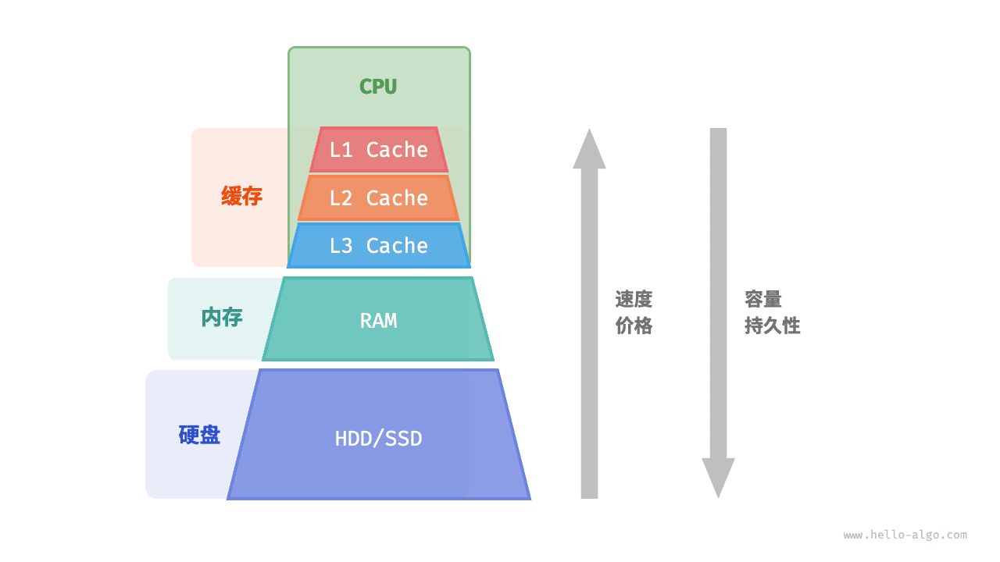

!!! tip

    计算机的存储层次结构体现了速度、容量和成本三者之间的精妙平衡。实际上，这种权衡普遍存在于所有工业领域，它要求我们在不同的优势和限制之间找到最佳平衡点。

总的来说，**硬盘用于长期存储大量数据，内存用于临时存储程序运行中正在处理的数据，而缓存则用于存储经常访问的数据和指令**，以提高程序运行效率。三者共同协作，确保计算机系统高效运行。

如下图所示，在程序运行时，数据会从硬盘中被读取到内存中，供 CPU 计算使用。缓存可以看作 CPU 的一部分，**它通过智能地从内存加载数据**，给 CPU 提供高速的数据读取，从而显著提升程序的执行效率，减少对较慢的内存的依赖。


## 数据结构的内存效率

在内存空间利用方面，数组和链表各自具有优势和局限性。

一方面，**内存是有限的，且同一块内存不能被多个程序共享**，因此我们希望数据结构能够尽可能高效地利用空间。数组的元素紧密排列，不需要额外的空间来存储链表节点间的引用（指针），因此空间效率更高。然而，数组需要一次性分配足够的连续内存空间，这可能导致内存浪费，数组扩容也需要额外的时间和空间成本。相比之下，链表以“节点”为单位进行动态内存分配和回收，提供了更大的灵活性。

另一方面，在程序运行时，**随着反复申请与释放内存，空闲内存的碎片化程度会越来越高**，从而导致内存的利用效率降低。数组由于其连续的存储方式，相对不容易导致内存碎片化。相反，链表的元素是分散存储的，在频繁的插入与删除操作中，更容易导致内存碎片化。

## 数据结构的缓存效率

缓存虽然在空间容量上远小于内存，但它比内存快得多，在程序执行速度上起着至关重要的作用。由于缓存的容量有限，只能存储一小部分频繁访问的数据，因此当 CPU 尝试访问的数据不在缓存中时，就会发生<u>缓存未命中（cache miss）</u>，此时 CPU 不得不从速度较慢的内存中加载所需数据。

显然，**“缓存未命中”越少，CPU 读写数据的效率就越高**，程序性能也就越好。我们将 CPU 从缓存中成功获取数据的比例称为<u>缓存命中率（cache hit rate）</u>，这个指标通常用来衡量缓存效率。

为了尽可能达到更高的效率，缓存会采取以下数据加载机制。

- **缓存行**：缓存不是单个字节地存储与加载数据，而是以缓存行为单位。相比于单个字节的传输，缓存行的传输形式更加高效。
- **预取机制**：处理器会尝试预测数据访问模式（例如顺序访问、固定步长跳跃访问等），并根据特定模式将数据加载至缓存之中，从而提升命中率。
- **空间局部性**：如果一个数据被访问，那么它附近的数据可能近期也会被访问。因此，缓存在加载某一数据时，也会加载其附近的数据，以提高命中率。
- **时间局部性**：如果一个数据被访问，那么它在不久的将来很可能再次被访问。缓存利用这一原理，通过保留最近访问过的数据来提高命中率。

实际上，**数组和链表对缓存的利用效率是不同的**，主要体现在以下几个方面。

- **占用空间**：链表元素比数组元素占用空间更多，导致缓存中容纳的有效数据量更少。
- **缓存行**：链表数据分散在内存各处，而缓存是“按行加载”的，因此加载到无效数据的比例更高。
- **预取机制**：数组比链表的数据访问模式更具“可预测性”，即系统更容易猜出即将被加载的数据。
- **空间局部性**：数组被存储在集中的内存空间中，因此被加载数据附近的数据更有可能即将被访问。

总体而言，**数组具有更高的缓存命中率，因此它在操作效率上通常优于链表**。这使得在解决算法问题时，基于数组实现的数据结构往往更受欢迎。

需要注意的是，**高缓存效率并不意味着数组在所有情况下都优于链表**。实际应用中选择哪种数据结构，应根据具体需求来决定。例如，数组和链表都可以实现“栈”数据结构（下一章会详细介绍），但它们适用于不同场景。

- 在做算法题时，我们会倾向于选择基于数组实现的栈，因为它提供了更高的操作效率和随机访问的能力，代价仅是需要预先为数组分配一定的内存空间。
- 如果数据量非常大、动态性很高、栈的预期大小难以估计，那么基于链表实现的栈更加合适。链表能够将大量数据分散存储于内存的不同部分，并且避免了数组扩容产生的额外开销。

---

# 4.5 &nbsp; 小结

---

# 小结

### 重点回顾

- 数组和链表是两种基本的数据结构，分别代表数据在计算机内存中的两种存储方式：连续空间存储和分散空间存储。两者的特点呈现出互补的特性。
- 数组支持随机访问、占用内存较少；但插入和删除元素效率低，且初始化后长度不可变。
- 链表通过更改引用（指针）实现高效的节点插入与删除，且可以灵活调整长度；但节点访问效率低、占用内存较多。常见的链表类型包括单向链表、环形链表、双向链表。
- 列表是一种支持增删查改的元素有序集合，通常基于动态数组实现。它保留了数组的优势，同时可以灵活调整长度。
- 列表的出现大幅提高了数组的实用性，但可能导致部分内存空间浪费。
- 程序运行时，数据主要存储在内存中。数组可提供更高的内存空间效率，而链表则在内存使用上更加灵活。
- 缓存通过缓存行、预取机制以及空间局部性和时间局部性等数据加载机制，为 CPU 提供快速数据访问，显著提升程序的执行效率。
- 由于数组具有更高的缓存命中率，因此它通常比链表更高效。在选择数据结构时，应根据具体需求和场景做出恰当选择。

### Q & A

**Q**：数组存储在栈上和存储在堆上，对时间效率和空间效率是否有影响？

存储在栈上和堆上的数组都被存储在连续内存空间内，数据操作效率基本一致。然而，栈和堆具有各自的特点，从而导致以下不同点。

1. 分配和释放效率：栈是一块较小的内存，分配由编译器自动完成；而堆内存相对更大，可以在代码中动态分配，更容易碎片化。因此，堆上的分配和释放操作通常比栈上的慢。
2. 大小限制：栈内存相对较小，堆的大小一般受限于可用内存。因此堆更加适合存储大型数组。
3. 灵活性：栈上的数组的大小需要在编译时确定，而堆上的数组的大小可以在运行时动态确定。

**Q**：为什么数组要求相同类型的元素，而在链表中却没有强调相同类型呢？

链表由节点组成，节点之间通过引用（指针）连接，各个节点可以存储不同类型的数据，例如 `int`、`double`、`string`、`object` 等。

相对地，数组元素则必须是相同类型的，这样才能通过计算偏移量来获取对应元素位置。例如，数组同时包含 `int` 和 `long` 两种类型，单个元素分别占用 4 字节和 8 字节 ，此时就不能用以下公式计算偏移量了，因为数组中包含了两种“元素长度”。

```shell
# 元素内存地址 = 数组内存地址（首元素内存地址） + 元素长度 * 元素索引
```

**Q**：删除节点 `P` 后，是否需要把 `P.next` 设为 `None` 呢？

不修改 `P.next` 也可以。从该链表的角度看，从头节点遍历到尾节点已经不会遇到 `P` 了。这意味着节点 `P` 已经从链表中删除了，此时节点 `P` 指向哪里都不会对该链表产生影响。

从数据结构与算法（做题）的角度看，不断开没有关系，只要保证程序的逻辑是正确的就行。从标准库的角度看，断开更加安全、逻辑更加清晰。如果不断开，假设被删除节点未被正常回收，那么它会影响后继节点的内存回收。

**Q**：在链表中插入和删除操作的时间复杂度是 $O(1)$ 。但是增删之前都需要 $O(n)$ 的时间查找元素，那为什么时间复杂度不是 $O(n)$ 呢？

如果是先查找元素、再删除元素，时间复杂度确实是 $O(n)$ 。然而，链表的 $O(1)$ 增删的优势可以在其他应用上得到体现。例如，双向队列适合使用链表实现，我们维护一个指针变量始终指向头节点、尾节点，每次插入与删除操作都是 $O(1)$ 。

**Q**：图“链表定义与存储方式”中，浅蓝色的存储节点指针是占用一块内存地址吗？还是和节点值各占一半呢？

该示意图只是定性表示，定量表示需要根据具体情况进行分析。

- 不同类型的节点值占用的空间是不同的，比如 `int`、`long`、`double` 和实例对象等。
- 指针变量占用的内存空间大小根据所使用的操作系统及编译环境而定，大多为 8 字节或 4 字节。

**Q**：在列表末尾添加元素是否时时刻刻都为 $O(1)$ ？

如果添加元素时超出列表长度，则需要先扩容列表再添加。系统会申请一块新的内存，并将原列表的所有元素搬运过去，这时候时间复杂度就会是 $O(n)$ 。

**Q**：“列表的出现极大地提高了数组的实用性，但可能导致部分内存空间浪费”，这里的空间浪费是指额外增加的变量如容量、长度、扩容倍数所占的内存吗？

这里的空间浪费主要有两方面含义：一方面，列表都会设定一个初始长度，我们不一定需要用这么多；另一方面，为了防止频繁扩容，扩容一般会乘以一个系数，比如 $\times 1.5$ 。这样一来，也会出现很多空位，我们通常不能完全填满它们。

**Q**：在 Python 中初始化 `n = [1, 2, 3]` 后，这 3 个元素的地址是相连的，但是初始化 `m = [2, 1, 3]` 会发现它们每个元素的 id 并不是连续的，而是分别跟 `n` 中的相同。这些元素的地址不连续，那么 `m` 还是数组吗？

假如把列表元素换成链表节点 `n = [n1, n2, n3, n4, n5]` ，通常情况下这 5 个节点对象也分散存储在内存各处。然而，给定一个列表索引，我们仍然可以在 $O(1)$ 时间内获取节点内存地址，从而访问到对应的节点。这是因为数组中存储的是节点的引用，而非节点本身。

与许多语言不同，Python 中的数字也被包装为对象，列表中存储的不是数字本身，而是对数字的引用。因此，我们会发现两个数组中的相同数字拥有同一个 id ，并且这些数字的内存地址无须连续。

**Q**：C++ STL 里面的 `std::list` 已经实现了双向链表，但好像一些算法书上不怎么直接使用它，是不是因为有什么局限性呢？

一方面，我们往往更青睐使用数组实现算法，而只在必要时才使用链表，主要有两个原因。

- 空间开销：由于每个元素需要两个额外的指针（一个用于前一个元素，一个用于后一个元素），所以 `std::list` 通常比 `std::vector` 更占用空间。
- 缓存不友好：由于数据不是连续存放的，因此 `std::list` 对缓存的利用率较低。一般情况下，`std::vector` 的性能会更好。

另一方面，必要使用链表的情况主要是二叉树和图。栈和队列往往会使用编程语言提供的 `stack` 和 `queue` ，而非链表。

**Q**：操作 `res = [[0]] * n` 生成了一个二维列表，其中每一个 `[0]` 都是独立的吗？

不是独立的。此二维列表中，所有的 `[0]` 实际上是同一个对象的引用。如果我们修改其中一个元素，会发现所有的对应元素都会随之改变。

如果希望二维列表中的每个 `[0]` 都是独立的，可以使用 `res = [[0] for _ in range(n)]` 来实现。这种方式的原理是初始化了 $n$ 个独立的 `[0]` 列表对象。

**Q**：操作 `res = [0] * n` 生成了一个列表，其中每一个整数 0 都是独立的吗？

在该列表中，所有整数 0 都是同一个对象的引用。这是因为 Python 对小整数（通常是 -5 到 256）采用了缓存池机制，以便最大化对象复用，从而提升性能。

虽然它们指向同一个对象，但我们仍然可以独立修改列表中的每个元素，这是因为 Python 的整数是“不可变对象”。当我们修改某个元素时，实际上是切换为另一个对象的引用，而不是改变原有对象本身。

然而，当列表元素是“可变对象”时（例如列表、字典或类实例等），修改某个元素会直接改变该对象本身，所有引用该对象的元素都会产生相同变化。

---

# 4.6 &nbsp; 练习

---

# 练习

## 知识巩固

### 数组和链表怎样找到元素

数组和单向链表中都按顺序保存了 `[A, B, C, D, E]`。现在要读取第 4 个元素 `D`：

<!-- numbered-subquestions -->

1. 数组可以直接使用哪个索引？
2. 单向链表从头节点 `A` 开始，要沿着 `next` 依次经过哪些节点？
3. 当要读取的元素位置越来越靠后时，两种结构所需的步骤会怎样变化？哪一种更适合反复按位置读取？为什么？

??? success "参考答案"

    1. 若索引从 0 开始，第 4 个元素的索引是 3，数组可直接读取 `arr[3]`。

    2. 单向链表必须从头开始，访问路径为 `A → B → C → D`，需要沿 `next` 前进 3 次。

    3. 数组可以根据首地址和索引直接定位元素，按位置访问的时间复杂度为 $O(1)$。
        单向链表访问第 $k$ 个节点时，必须从头节点开始，沿着 `next` 前进 $k-1$ 次，
        最坏需要 $O(n)$ 时间。

        这里只比较按位置读取，不表示链表在所有操作上都更慢。

### 数组和链表怎样插入元素

数组和单向链表中都保存了 `A、B、C、D`。现在要在 `B` 后面插入 `X`：

- 数组容量为 5，当前状态是 `[A, B, C, D, _]`；
- 链表为 `A → B → C → D`，并且已经拿到了指向节点 `B` 的引用。

<!-- numbered-subquestions -->

1. 数组需要移动哪些元素？写出插入后的数组。
2. 链表应按什么顺序修改 `X.next` 和 `B.next`？写出插入后的链表。
3. 为什么比较插入效率时，要特别说明“已经拿到了节点 B 的引用”？

??? success "参考答案"

    1. 数组要先把 `D` 向右移动一格，再把 `C` 向右移动一格，最后把 `X` 放入索引 2，
        得到 `[A, B, X, C, D]`。

    2. `B.next` 原本指向 `C`。应先令 `X.next = B.next`，让 `X` 指向 `C`；
        再令 `B.next = X`。结果为 `A → B → X → C → D`。
        如果先覆盖 `B.next` 又没有保存原来的连接，就可能找不到 `C`。

    3. 已知 `B` 的位置后，链表插入只需修改两个连接，可以在 $O(1)$ 时间完成。
        如果还要从头查找 `B`，查找过程本身可能需要 $O(n)$ 时间。

### 列表容量是怎样增长的

一个基于数组实现的列表当前内容为 `[A, B, C]`，长度 `size = 3`，容量 `capacity = 4`。
规定容量不足时，新数组的容量扩大为原来的 2 倍。

<!-- numbered-subquestions -->

1. 追加 `D` 后，列表的长度和容量分别是多少？是否需要扩容？
2. 接着追加 `E` 时，容量会变为多少？需要复制几个原有元素？
3. 底层数组的长度不可变，为什么列表的容量看起来却可以增长？

??? success "参考答案"

    1. `D` 可以放入最后一个空位。此时内容为 `[A, B, C, D]`，
        `size = 4`、`capacity = 4`，不需要扩容。

    2. 再追加 `E` 时已经没有空位，需要创建容量为 8 的新数组，
        将 `A、B、C、D` 共 4 个原有元素复制过去，再加入 `E`。
        此时 `size = 5`、`capacity = 8`。

    3. 原来的数组本身没有变长。列表创建了一个更大的新数组，复制原有元素，
        再改用新数组作为底层存储，因此对使用者来说容量增长了。

## 编程练习

### 数组表示的大整数加一

数组 `digits` 从左到右保存一个非负整数的各位数字，例如 `[3, 0, 8]` 表示 308。
数字 0 用 `[0]` 表示；其他输入的第一位均不为 0。

请模拟一次十进制竖式加法，将这个整数增加 1，并把结果仍按相同的数组形式返回。
可以直接修改 `digits`；若最前面产生新的进位，可以返回一个更长的数组。

??? tip "解题提示"

    1. 像做竖式加法一样，从数组最后一位开始
    2. 当前位小于 9 时加一后即可立即返回
    3. 当前位等于 9 时把它改成 0；若所有位都是 9，需要在最前面补 1

[LeetCode](https://leetcode.cn/problems/plus-one/){ .rounded-button .exercise-button target="_blank" rel="noopener noreferrer" }

### 反转单向链表

给定一个单向链表的头节点 `head`。每个节点包含一个值和指向下一节点的 `next`。

请使用迭代方法反转所有节点之间的连接，并返回反转后的头节点。
要求不创建新的链表节点。

??? tip "解题提示"

    1. 先在纸上画出三个相连的节点和 prev、cur 两个指针
    2. 改写 cur.next 前，必须先用 nxt 保存原来的下一个节点
    3. 反转 cur.next 后，令 prev = cur，再令 cur = nxt，继续处理原链表中的下一个节点

[LeetCode](https://leetcode.cn/problems/reverse-linked-list/){ .rounded-button .exercise-button target="_blank" rel="noopener noreferrer" } [题目解析](https://leetcode.cn/problems/reverse-linked-list/solutions/2361282/206-fan-zhuan-lian-biao-shuang-zhi-zhen-r1jel/){ .rounded-button .exercise-button target="_blank" rel="noopener noreferrer" }

---

# 第 5 章 &nbsp; 栈与队列

---

# 栈与队列


!!! abstract

    栈如同叠猫猫，而队列就像猫猫排队。
    
    两者分别代表先入后出和先入先出的逻辑关系。

---

# 5.1 &nbsp; 栈

---

# 栈

<u>栈（stack）</u>是一种遵循先入后出逻辑的线性数据结构。

我们可以将栈类比为桌面上的一摞盘子，规定每次只能移动一个盘子，那么想取出底部的盘子，则需要先将上面的盘子依次移走。我们将盘子替换为各种类型的元素（如整数、字符、对象等），就得到了栈这种数据结构。

如下图所示，我们把堆叠元素的顶部称为“栈顶”，底部称为“栈底”。将把元素添加到栈顶的操作叫作“入栈”，删除栈顶元素的操作叫作“出栈”。


## 栈的常用操作

栈的常用操作如下表所示，具体的方法名需要根据所使用的编程语言来确定。在此，我们以常见的 `push()`、`pop()`、`peek()` 命名为例。

<p align="center"> 表 <id> &nbsp; 栈的操作效率 </p>

| 方法     | 描述                   | 时间复杂度 |
| -------- | ---------------------- | ---------- |
| `push()` | 元素入栈（添加至栈顶） | $O(1)$     |
| `pop()`  | 栈顶元素出栈           | $O(1)$     |
| `peek()` | 访问栈顶元素           | $O(1)$     |

通常情况下，我们可以直接使用编程语言内置的栈类。然而，某些语言可能没有专门提供栈类，这时我们可以将该语言的“数组”或“链表”当作栈来使用，并在程序逻辑上忽略与栈无关的操作。

=== "Python"

    ```python title="stack.py"
    # 初始化栈
    # Python 没有内置的栈类，可以把 list 当作栈来使用
    stack: list[int] = []

    # 元素入栈
    stack.append(1)
    stack.append(3)
    stack.append(2)
    stack.append(5)
    stack.append(4)

    # 访问栈顶元素
    peek: int = stack[-1]

    # 元素出栈
    pop: int = stack.pop()

    # 获取栈的长度
    size: int = len(stack)

    # 判断是否为空
    is_empty: bool = len(stack) == 0
    ```

=== "C++"

    ```cpp title="stack.cpp"
    /* 初始化栈 */
    stack<int> stack;

    /* 元素入栈 */
    stack.push(1);
    stack.push(3);
    stack.push(2);
    stack.push(5);
    stack.push(4);

    /* 访问栈顶元素 */
    int top = stack.top();

    /* 元素出栈 */
    stack.pop(); // 无返回值

    /* 获取栈的长度 */
    int size = stack.size();

    /* 判断是否为空 */
    bool empty = stack.empty();
    ```

=== "Java"

    ```java title="stack.java"
    /* 初始化栈 */
    Stack<Integer> stack = new Stack<>();

    /* 元素入栈 */
    stack.push(1);
    stack.push(3);
    stack.push(2);
    stack.push(5);
    stack.push(4);

    /* 访问栈顶元素 */
    int peek = stack.peek();

    /* 元素出栈 */
    int pop = stack.pop();

    /* 获取栈的长度 */
    int size = stack.size();

    /* 判断是否为空 */
    boolean isEmpty = stack.isEmpty();
    ```

=== "C#"

    ```csharp title="stack.cs"
    /* 初始化栈 */
    Stack<int> stack = new();

    /* 元素入栈 */
    stack.Push(1);
    stack.Push(3);
    stack.Push(2);
    stack.Push(5);
    stack.Push(4);

    /* 访问栈顶元素 */
    int peek = stack.Peek();

    /* 元素出栈 */
    int pop = stack.Pop();

    /* 获取栈的长度 */
    int size = stack.Count;

    /* 判断是否为空 */
    bool isEmpty = stack.Count == 0;
    ```

=== "Go"

    ```go title="stack_test.go"
    /* 初始化栈 */
    // 在 Go 中，推荐将 Slice 当作栈来使用
    var stack []int

    /* 元素入栈 */
    stack = append(stack, 1)
    stack = append(stack, 3)
    stack = append(stack, 2)
    stack = append(stack, 5)
    stack = append(stack, 4)

    /* 访问栈顶元素 */
    peek := stack[len(stack)-1]

    /* 元素出栈 */
    pop := stack[len(stack)-1]
    stack = stack[:len(stack)-1]

    /* 获取栈的长度 */
    size := len(stack)

    /* 判断是否为空 */
    isEmpty := len(stack) == 0
    ```

=== "Swift"

    ```swift title="stack.swift"
    /* 初始化栈 */
    // Swift 没有内置的栈类，可以把 Array 当作栈来使用
    var stack: [Int] = []

    /* 元素入栈 */
    stack.append(1)
    stack.append(3)
    stack.append(2)
    stack.append(5)
    stack.append(4)

    /* 访问栈顶元素 */
    let peek = stack.last!

    /* 元素出栈 */
    let pop = stack.removeLast()

    /* 获取栈的长度 */
    let size = stack.count

    /* 判断是否为空 */
    let isEmpty = stack.isEmpty
    ```

=== "JS"

    ```javascript title="stack.js"
    /* 初始化栈 */
    // JavaScript 没有内置的栈类，可以把 Array 当作栈来使用
    const stack = [];

    /* 元素入栈 */
    stack.push(1);
    stack.push(3);
    stack.push(2);
    stack.push(5);
    stack.push(4);

    /* 访问栈顶元素 */
    const peek = stack[stack.length-1];

    /* 元素出栈 */
    const pop = stack.pop();

    /* 获取栈的长度 */
    const size = stack.length;

    /* 判断是否为空 */
    const is_empty = stack.length === 0;
    ```

=== "TS"

    ```typescript title="stack.ts"
    /* 初始化栈 */
    // TypeScript 没有内置的栈类，可以把 Array 当作栈来使用
    const stack: number[] = [];

    /* 元素入栈 */
    stack.push(1);
    stack.push(3);
    stack.push(2);
    stack.push(5);
    stack.push(4);

    /* 访问栈顶元素 */
    const peek = stack[stack.length - 1];

    /* 元素出栈 */
    const pop = stack.pop();

    /* 获取栈的长度 */
    const size = stack.length;

    /* 判断是否为空 */
    const is_empty = stack.length === 0;
    ```

=== "Dart"

    ```dart title="stack.dart"
    /* 初始化栈 */
    // Dart 没有内置的栈类，可以把 List 当作栈来使用
    List<int> stack = [];

    /* 元素入栈 */
    stack.add(1);
    stack.add(3);
    stack.add(2);
    stack.add(5);
    stack.add(4);

    /* 访问栈顶元素 */
    int peek = stack.last;

    /* 元素出栈 */
    int pop = stack.removeLast();

    /* 获取栈的长度 */
    int size = stack.length;

    /* 判断是否为空 */
    bool isEmpty = stack.isEmpty;
    ```

=== "Rust"

    ```rust title="stack.rs"
    /* 初始化栈 */
    // 把 Vec 当作栈来使用
    let mut stack: Vec<i32> = Vec::new();

    /* 元素入栈 */
    stack.push(1);
    stack.push(3);
    stack.push(2);
    stack.push(5);
    stack.push(4);

    /* 访问栈顶元素 */
    let top = stack.last().unwrap();

    /* 元素出栈 */
    let pop = stack.pop().unwrap();

    /* 获取栈的长度 */
    let size = stack.len();

    /* 判断是否为空 */
    let is_empty = stack.is_empty();
    ```

=== "C"

    ```c title="stack.c"
    // C 未提供内置栈
    ```

=== "Kotlin"

    ```kotlin title="stack.kt"
    /* 初始化栈 */
    val stack = Stack<Int>()

    /* 元素入栈 */
    stack.push(1)
    stack.push(3)
    stack.push(2)
    stack.push(5)
    stack.push(4)

    /* 访问栈顶元素 */
    val peek = stack.peek()

    /* 元素出栈 */
    val pop = stack.pop()

    /* 获取栈的长度 */
    val size = stack.size

    /* 判断是否为空 */
    val isEmpty = stack.isEmpty()
    ```

=== "Ruby"

    ```ruby title="stack.rb"
    # 初始化栈
    # Ruby 没有内置的栈类，可以把 Array 当作栈来使用
    stack = []

    # 元素入栈
    stack << 1
    stack << 3
    stack << 2
    stack << 5
    stack << 4

    # 访问栈顶元素
    peek = stack.last

    # 元素出栈
    pop = stack.pop

    # 获取栈的长度
    size = stack.length

    # 判断是否为空
    is_empty = stack.empty?
    ```

??? pythontutor "可视化运行"

    https://pythontutor.com/render.html#code=%22%22%22Driver%20Code%22%22%22%0Aif%20__name__%20%3D%3D%20%22__main__%22%3A%0A%20%20%20%20%23%20%E5%88%9D%E5%A7%8B%E5%8C%96%E6%A0%88%0A%20%20%20%20%23%20Python%20%E6%B2%A1%E6%9C%89%E5%86%85%E7%BD%AE%E7%9A%84%E6%A0%88%E7%B1%BB%EF%BC%8C%E5%8F%AF%E4%BB%A5%E6%8A%8A%20list%20%E5%BD%93%E4%BD%9C%E6%A0%88%E6%9D%A5%E4%BD%BF%E7%94%A8%0A%20%20%20%20stack%20%3D%20%5B%5D%0A%0A%20%20%20%20%23%20%E5%85%83%E7%B4%A0%E5%85%A5%E6%A0%88%0A%20%20%20%20stack.append%281%29%0A%20%20%20%20stack.append%283%29%0A%20%20%20%20stack.append%282%29%0A%20%20%20%20stack.append%285%29%0A%20%20%20%20stack.append%284%29%0A%20%20%20%20print%28%22%E6%A0%88%20stack%20%3D%22,%20stack%29%0A%0A%20%20%20%20%23%20%E8%AE%BF%E9%97%AE%E6%A0%88%E9%A1%B6%E5%85%83%E7%B4%A0%0A%20%20%20%20peek%20%3D%20stack%5B-1%5D%0A%20%20%20%20print%28%22%E6%A0%88%E9%A1%B6%E5%85%83%E7%B4%A0%20peek%20%3D%22,%20peek%29%0A%0A%20%20%20%20%23%20%E5%85%83%E7%B4%A0%E5%87%BA%E6%A0%88%0A%20%20%20%20pop%20%3D%20stack.pop%28%29%0A%20%20%20%20print%28%22%E5%87%BA%E6%A0%88%E5%85%83%E7%B4%A0%20pop%20%3D%22,%20pop%29%0A%20%20%20%20print%28%22%E5%87%BA%E6%A0%88%E5%90%8E%20stack%20%3D%22,%20stack%29%0A%0A%20%20%20%20%23%20%E8%8E%B7%E5%8F%96%E6%A0%88%E7%9A%84%E9%95%BF%E5%BA%A6%0A%20%20%20%20size%20%3D%20len%28stack%29%0A%20%20%20%20print%28%22%E6%A0%88%E7%9A%84%E9%95%BF%E5%BA%A6%20size%20%3D%22,%20size%29%0A%0A%20%20%20%20%23%20%E5%88%A4%E6%96%AD%E6%98%AF%E5%90%A6%E4%B8%BA%E7%A9%BA%0A%20%20%20%20is_empty%20%3D%20len%28stack%29%20%3D%3D%200%0A%20%20%20%20print%28%22%E6%A0%88%E6%98%AF%E5%90%A6%E4%B8%BA%E7%A9%BA%20%3D%22,%20is_empty%29&cumulative=false&curInstr=2&heapPrimitives=nevernest&mode=display&origin=opt-frontend.js&py=311&rawInputLstJSON=%5B%5D&textReferences=false

## 栈的实现

为了深入了解栈的运行机制，我们来尝试自己实现一个栈类。

栈遵循先入后出的原则，因此我们只能在栈顶添加或删除元素。然而，数组和链表都可以在任意位置添加和删除元素，**因此栈可以视为一种受限制的数组或链表**。换句话说，我们可以“屏蔽”数组或链表的部分无关操作，使其对外表现的逻辑符合栈的特性。

### 基于链表的实现

使用链表实现栈时，我们可以将链表的头节点视为栈顶，尾节点视为栈底。

如下图所示，对于入栈操作，我们只需将元素插入链表头部，这种节点插入方法被称为“头插法”。而对于出栈操作，只需将头节点从链表中删除即可。

=== "<1>"
    

=== "<2>"
    

=== "<3>"
    

以下是基于链表实现栈的示例代码：

```src
[file]{linkedlist_stack}-[class]{linked_list_stack}-[func]{}
```

### 基于数组的实现

使用数组实现栈时，我们可以将数组的尾部作为栈顶。如下图所示，入栈与出栈操作分别对应在数组尾部添加元素与删除元素，时间复杂度都为 $O(1)$ 。

=== "<1>"
    

=== "<2>"
    

=== "<3>"
    

由于入栈的元素可能会源源不断地增加，因此我们可以使用动态数组，这样就无须自行处理数组扩容问题。以下为示例代码：

```src
[file]{array_stack}-[class]{array_stack}-[func]{}
```

## 两种实现对比

**支持操作**

两种实现都支持栈定义中的各项操作。数组实现额外支持随机访问，但这已超出了栈的定义范畴，因此一般不会用到。

**时间效率**

在基于数组的实现中，入栈和出栈操作都在预先分配好的连续内存中进行，具有很好的缓存本地性，因此效率较高。然而，如果入栈时超出数组容量，会触发扩容机制，导致该次入栈操作的时间复杂度变为 $O(n)$ 。

在基于链表的实现中，链表的扩容非常灵活，不存在上述数组扩容时效率降低的问题。但是，入栈操作需要初始化节点对象并修改指针，因此效率相对较低。不过，如果入栈元素本身就是节点对象，那么可以省去初始化步骤，从而提高效率。

综上所述，当入栈与出栈操作的元素是基本数据类型时，例如 `int` 或 `double` ，我们可以得出以下结论。

- 基于数组实现的栈在触发扩容时效率会降低，但由于扩容是低频操作，因此平均效率更高。
- 基于链表实现的栈可以提供更加稳定的效率表现。

**空间效率**

在初始化列表时，系统会为列表分配“初始容量”，该容量可能超出实际需求；并且，扩容机制通常是按照特定倍率（例如 2 倍）进行扩容的，扩容后的容量也可能超出实际需求。因此，**基于数组实现的栈可能造成一定的空间浪费**。

然而，由于链表节点需要额外存储指针，**因此链表节点占用的空间相对较大**。

综上，我们不能简单地确定哪种实现更加节省内存，需要针对具体情况进行分析。

## 栈的典型应用

- **浏览器中的后退与前进、软件中的撤销与反撤销**。每当我们打开新的网页，浏览器就会对上一个网页执行入栈，这样我们就可以通过后退操作回到上一个网页。后退操作实际上是在执行出栈。如果要同时支持后退和前进，那么需要两个栈来配合实现。
- **程序内存管理**。每次调用函数时，系统都会在栈顶添加一个栈帧，用于记录函数的上下文信息。在递归函数中，向下递推阶段会不断执行入栈操作，而向上回溯阶段则会不断执行出栈操作。

---

# 5.2 &nbsp; 队列

---

# 队列

<u>队列（queue）</u>是一种遵循先入先出规则的线性数据结构。顾名思义，队列模拟了排队现象，即新来的人不断加入队列尾部，而位于队列头部的人逐个离开。

如下图所示，我们将队列头部称为“队首”，尾部称为“队尾”，将把元素加入队尾的操作称为“入队”，删除队首元素的操作称为“出队”。


## 队列常用操作

队列的常见操作如下表所示。需要注意的是，不同编程语言的方法名称可能会有所不同。我们在此采用与栈相同的方法命名。

<p align="center"> 表 <id> &nbsp; 队列操作效率 </p>

| 方法名   | 描述                         | 时间复杂度 |
| -------- | ---------------------------- | ---------- |
| `push()` | 元素入队，即将元素添加至队尾 | $O(1)$     |
| `pop()`  | 队首元素出队                 | $O(1)$     |
| `peek()` | 访问队首元素                 | $O(1)$     |

我们可以直接使用编程语言中现成的队列类：

=== "Python"

    ```python title="queue.py"
    from collections import deque

    # 初始化队列
    # 在 Python 中，我们一般将双向队列类 deque 当作队列使用
    # 虽然 queue.Queue() 是纯正的队列类，但不太好用，因此不推荐
    que: deque[int] = deque()

    # 元素入队
    que.append(1)
    que.append(3)
    que.append(2)
    que.append(5)
    que.append(4)

    # 访问队首元素
    front: int = que[0]

    # 元素出队
    pop: int = que.popleft()

    # 获取队列的长度
    size: int = len(que)

    # 判断队列是否为空
    is_empty: bool = len(que) == 0
    ```

=== "C++"

    ```cpp title="queue.cpp"
    /* 初始化队列 */
    queue<int> queue;

    /* 元素入队 */
    queue.push(1);
    queue.push(3);
    queue.push(2);
    queue.push(5);
    queue.push(4);

    /* 访问队首元素 */
    int front = queue.front();

    /* 元素出队 */
    queue.pop();

    /* 获取队列的长度 */
    int size = queue.size();

    /* 判断队列是否为空 */
    bool empty = queue.empty();
    ```

=== "Java"

    ```java title="queue.java"
    /* 初始化队列 */
    Queue<Integer> queue = new LinkedList<>();

    /* 元素入队 */
    queue.offer(1);
    queue.offer(3);
    queue.offer(2);
    queue.offer(5);
    queue.offer(4);

    /* 访问队首元素 */
    int peek = queue.peek();

    /* 元素出队 */
    int pop = queue.poll();

    /* 获取队列的长度 */
    int size = queue.size();

    /* 判断队列是否为空 */
    boolean isEmpty = queue.isEmpty();
    ```

=== "C#"

    ```csharp title="queue.cs"
    /* 初始化队列 */
    Queue<int> queue = new();

    /* 元素入队 */
    queue.Enqueue(1);
    queue.Enqueue(3);
    queue.Enqueue(2);
    queue.Enqueue(5);
    queue.Enqueue(4);

    /* 访问队首元素 */
    int peek = queue.Peek();

    /* 元素出队 */
    int pop = queue.Dequeue();

    /* 获取队列的长度 */
    int size = queue.Count;

    /* 判断队列是否为空 */
    bool isEmpty = queue.Count == 0;
    ```

=== "Go"

    ```go title="queue_test.go"
    /* 初始化队列 */
    // 在 Go 中，将 list 作为队列来使用
    queue := list.New()

    /* 元素入队 */
    queue.PushBack(1)
    queue.PushBack(3)
    queue.PushBack(2)
    queue.PushBack(5)
    queue.PushBack(4)

    /* 访问队首元素 */
    peek := queue.Front()

    /* 元素出队 */
    pop := queue.Front()
    queue.Remove(pop)

    /* 获取队列的长度 */
    size := queue.Len()

    /* 判断队列是否为空 */
    isEmpty := queue.Len() == 0
    ```

=== "Swift"

    ```swift title="queue.swift"
    /* 初始化队列 */
    // Swift 没有内置的队列类，可以把 Array 当作队列来使用
    var queue: [Int] = []

    /* 元素入队 */
    queue.append(1)
    queue.append(3)
    queue.append(2)
    queue.append(5)
    queue.append(4)

    /* 访问队首元素 */
    let peek = queue.first!

    /* 元素出队 */
    // 由于是数组，因此 removeFirst 的复杂度为 O(n)
    let pop = queue.removeFirst()

    /* 获取队列的长度 */
    let size = queue.count

    /* 判断队列是否为空 */
    let isEmpty = queue.isEmpty
    ```

=== "JS"

    ```javascript title="queue.js"
    /* 初始化队列 */
    // JavaScript 没有内置的队列，可以把 Array 当作队列来使用
    const queue = [];

    /* 元素入队 */
    queue.push(1);
    queue.push(3);
    queue.push(2);
    queue.push(5);
    queue.push(4);

    /* 访问队首元素 */
    const peek = queue[0];

    /* 元素出队 */
    // 底层是数组，因此 shift() 方法的时间复杂度为 O(n)
    const pop = queue.shift();

    /* 获取队列的长度 */
    const size = queue.length;

    /* 判断队列是否为空 */
    const empty = queue.length === 0;
    ```

=== "TS"

    ```typescript title="queue.ts"
    /* 初始化队列 */
    // TypeScript 没有内置的队列，可以把 Array 当作队列来使用
    const queue: number[] = [];

    /* 元素入队 */
    queue.push(1);
    queue.push(3);
    queue.push(2);
    queue.push(5);
    queue.push(4);

    /* 访问队首元素 */
    const peek = queue[0];

    /* 元素出队 */
    // 底层是数组，因此 shift() 方法的时间复杂度为 O(n)
    const pop = queue.shift();

    /* 获取队列的长度 */
    const size = queue.length;

    /* 判断队列是否为空 */
    const empty = queue.length === 0;
    ```

=== "Dart"

    ```dart title="queue.dart"
    /* 初始化队列 */
    // 在 Dart 中，队列类 Queue 是双向队列，也可作为队列使用
    Queue<int> queue = Queue();

    /* 元素入队 */
    queue.add(1);
    queue.add(3);
    queue.add(2);
    queue.add(5);
    queue.add(4);

    /* 访问队首元素 */
    int peek = queue.first;

    /* 元素出队 */
    int pop = queue.removeFirst();

    /* 获取队列的长度 */
    int size = queue.length;

    /* 判断队列是否为空 */
    bool isEmpty = queue.isEmpty;
    ```

=== "Rust"

    ```rust title="queue.rs"
    /* 初始化双向队列 */
    // 在 Rust 中使用双向队列作为普通队列来使用
    let mut deque: VecDeque<u32> = VecDeque::new();

    /* 元素入队 */
    deque.push_back(1);
    deque.push_back(3);
    deque.push_back(2);
    deque.push_back(5);
    deque.push_back(4);

    /* 访问队首元素 */
    if let Some(front) = deque.front() {
    }

    /* 元素出队 */
    if let Some(pop) = deque.pop_front() {
    }

    /* 获取队列的长度 */
    let size = deque.len();

    /* 判断队列是否为空 */
    let is_empty = deque.is_empty();
    ```

=== "C"

    ```c title="queue.c"
    // C 未提供内置队列
    ```

=== "Kotlin"

    ```kotlin title="queue.kt"
    /* 初始化队列 */
    val queue = LinkedList<Int>()

    /* 元素入队 */
    queue.offer(1)
    queue.offer(3)
    queue.offer(2)
    queue.offer(5)
    queue.offer(4)

    /* 访问队首元素 */
    val peek = queue.peek()

    /* 元素出队 */
    val pop = queue.poll()

    /* 获取队列的长度 */
    val size = queue.size

    /* 判断队列是否为空 */
    val isEmpty = queue.isEmpty()
    ```

=== "Ruby"

    ```ruby title="queue.rb"
    # 初始化队列
    # Ruby 内置的队列（Thread::Queue) 没有 peek 和遍历方法，可以把 Array 当作队列来使用
    queue = []

    # 元素入队
    queue.push(1)
    queue.push(3)
    queue.push(2)
    queue.push(5)
    queue.push(4)

    # 访问队列元素
    peek = queue.first

    # 元素出队
    # 清注意，由于是数组，Array#shift 方法时间复杂度为 O(n)
    pop = queue.shift

    # 获取队列的长度
    size = queue.length

    # 判断队列是否为空
    is_empty = queue.empty?
    ```

??? pythontutor "可视化运行"

    https://pythontutor.com/render.html#code=from%20collections%20import%20deque%0A%0A%22%22%22Driver%20Code%22%22%22%0Aif%20__name__%20%3D%3D%20%22__main__%22%3A%0A%20%20%20%20%23%20%E5%88%9D%E5%A7%8B%E5%8C%96%E9%98%9F%E5%88%97%0A%20%20%20%20%23%20%E5%9C%A8%20Python%20%E4%B8%AD%EF%BC%8C%E6%88%91%E4%BB%AC%E4%B8%80%E8%88%AC%E5%B0%86%E5%8F%8C%E5%90%91%E9%98%9F%E5%88%97%E7%B1%BB%20deque%20%E7%9C%8B%E4%BD%9C%E9%98%9F%E5%88%97%E4%BD%BF%E7%94%A8%0A%20%20%20%20%23%20%E8%99%BD%E7%84%B6%20queue.Queue%28%29%20%E6%98%AF%E7%BA%AF%E6%AD%A3%E7%9A%84%E9%98%9F%E5%88%97%E7%B1%BB%EF%BC%8C%E4%BD%86%E4%B8%8D%E5%A4%AA%E5%A5%BD%E7%94%A8%0A%20%20%20%20que%20%3D%20deque%28%29%0A%0A%20%20%20%20%23%20%E5%85%83%E7%B4%A0%E5%85%A5%E9%98%9F%0A%20%20%20%20que.append%281%29%0A%20%20%20%20que.append%283%29%0A%20%20%20%20que.append%282%29%0A%20%20%20%20que.append%285%29%0A%20%20%20%20que.append%284%29%0A%20%20%20%20print%28%22%E9%98%9F%E5%88%97%20que%20%3D%22,%20que%29%0A%0A%20%20%20%20%23%20%E8%AE%BF%E9%97%AE%E9%98%9F%E9%A6%96%E5%85%83%E7%B4%A0%0A%20%20%20%20front%20%3D%20que%5B0%5D%0A%20%20%20%20print%28%22%E9%98%9F%E9%A6%96%E5%85%83%E7%B4%A0%20front%20%3D%22,%20front%29%0A%0A%20%20%20%20%23%20%E5%85%83%E7%B4%A0%E5%87%BA%E9%98%9F%0A%20%20%20%20pop%20%3D%20que.popleft%28%29%0A%20%20%20%20print%28%22%E5%87%BA%E9%98%9F%E5%85%83%E7%B4%A0%20pop%20%3D%22,%20pop%29%0A%20%20%20%20print%28%22%E5%87%BA%E9%98%9F%E5%90%8E%20que%20%3D%22,%20que%29%0A%0A%20%20%20%20%23%20%E8%8E%B7%E5%8F%96%E9%98%9F%E5%88%97%E7%9A%84%E9%95%BF%E5%BA%A6%0A%20%20%20%20size%20%3D%20len%28que%29%0A%20%20%20%20print%28%22%E9%98%9F%E5%88%97%E9%95%BF%E5%BA%A6%20size%20%3D%22,%20size%29%0A%0A%20%20%20%20%23%20%E5%88%A4%E6%96%AD%E9%98%9F%E5%88%97%E6%98%AF%E5%90%A6%E4%B8%BA%E7%A9%BA%0A%20%20%20%20is_empty%20%3D%20len%28que%29%20%3D%3D%200%0A%20%20%20%20print%28%22%E9%98%9F%E5%88%97%E6%98%AF%E5%90%A6%E4%B8%BA%E7%A9%BA%20%3D%22,%20is_empty%29&cumulative=false&curInstr=3&heapPrimitives=nevernest&mode=display&origin=opt-frontend.js&py=311&rawInputLstJSON=%5B%5D&textReferences=false

## 队列实现

为了实现队列，我们需要一种数据结构，可以在一端添加元素，并在另一端删除元素，链表和数组都符合要求。

### 基于链表的实现

如下图所示，我们可以将链表的“头节点”和“尾节点”分别视为“队首”和“队尾”，规定队尾仅可添加节点，队首仅可删除节点。

=== "<1>"
    

=== "<2>"
    

=== "<3>"
    

以下是用链表实现队列的代码：

```src
[file]{linkedlist_queue}-[class]{linked_list_queue}-[func]{}
```

### 基于数组的实现

在数组中删除首元素的时间复杂度为 $O(n)$ ，这会导致出队操作效率较低。然而，我们可以采用以下巧妙方法来避免这个问题。

我们可以使用一个变量 `front` 指向队首元素的索引，并维护一个变量 `size` 用于记录队列长度。定义 `rear = front + size` ，这个公式计算出的 `rear` 指向队尾元素之后的下一个位置。

基于此设计，**数组中包含元素的有效区间为 `[front, rear - 1]`**，各种操作的实现方法如下图所示。

- 入队操作：将输入元素赋值给 `rear` 索引处，并将 `size` 增加 1 。
- 出队操作：只需将 `front` 增加 1 ，并将 `size` 减少 1 。

可以看到，入队和出队操作都只需进行一次操作，时间复杂度均为 $O(1)$ 。

=== "<1>"
    

=== "<2>"
    

=== "<3>"
    

你可能会发现一个问题：在不断进行入队和出队的过程中，`front` 和 `rear` 都在向右移动，**当它们到达数组尾部时就无法继续移动了**。为了解决此问题，我们可以将数组视为首尾相接的“环形数组”。

对于环形数组，我们需要让 `front` 或 `rear` 在越过数组尾部时，直接回到数组头部继续遍历。这种周期性规律可以通过“取余操作”来实现，代码如下所示：

```src
[file]{array_queue}-[class]{array_queue}-[func]{}
```

以上实现的队列仍然具有局限性：其长度不可变。然而，这个问题不难解决，我们可以将数组替换为动态数组，从而引入扩容机制。有兴趣的读者可以尝试自行实现。

两种实现的对比结论与栈一致，在此不再赘述。

## 队列典型应用

- **淘宝订单**。购物者下单后，订单将加入队列中，系统随后会根据顺序处理队列中的订单。在双十一期间，短时间内会产生海量订单，高并发成为工程师们需要重点攻克的问题。
- **各类待办事项**。任何需要实现“先来后到”功能的场景，例如打印机的任务队列、餐厅的出餐队列等，队列在这些场景中可以有效地维护处理顺序。

---

# 5.3 &nbsp; 双向队列

---

# 双向队列

在队列中，我们仅能删除头部元素或在尾部添加元素。如下图所示，<u>双向队列（double-ended queue）</u>提供了更高的灵活性，允许在头部和尾部执行元素的添加或删除操作。


## 双向队列常用操作

双向队列的常用操作如下表所示，具体的方法名称需要根据所使用的编程语言来确定。

<p align="center"> 表 <id> &nbsp; 双向队列操作效率 </p>

| 方法名         | 描述             | 时间复杂度 |
| -------------- | ---------------- | ---------- |
| `push_first()` | 将元素添加至队首 | $O(1)$     |
| `push_last()`  | 将元素添加至队尾 | $O(1)$     |
| `pop_first()`  | 删除队首元素     | $O(1)$     |
| `pop_last()`   | 删除队尾元素     | $O(1)$     |
| `peek_first()` | 访问队首元素     | $O(1)$     |
| `peek_last()`  | 访问队尾元素     | $O(1)$     |

同样地，我们可以直接使用编程语言中已实现的双向队列类：

=== "Python"

    ```python title="deque.py"
    from collections import deque

    # 初始化双向队列
    deq: deque[int] = deque()

    # 元素入队
    deq.append(2)      # 添加至队尾
    deq.append(5)
    deq.append(4)
    deq.appendleft(3)  # 添加至队首
    deq.appendleft(1)

    # 访问元素
    front: int = deq[0]  # 队首元素
    rear: int = deq[-1]  # 队尾元素

    # 元素出队
    pop_front: int = deq.popleft()  # 队首元素出队
    pop_rear: int = deq.pop()       # 队尾元素出队

    # 获取双向队列的长度
    size: int = len(deq)

    # 判断双向队列是否为空
    is_empty: bool = len(deq) == 0
    ```

=== "C++"

    ```cpp title="deque.cpp"
    /* 初始化双向队列 */
    deque<int> deque;

    /* 元素入队 */
    deque.push_back(2);   // 添加至队尾
    deque.push_back(5);
    deque.push_back(4);
    deque.push_front(3);  // 添加至队首
    deque.push_front(1);

    /* 访问元素 */
    int front = deque.front(); // 队首元素
    int back = deque.back();   // 队尾元素

    /* 元素出队 */
    deque.pop_front();  // 队首元素出队
    deque.pop_back();   // 队尾元素出队

    /* 获取双向队列的长度 */
    int size = deque.size();

    /* 判断双向队列是否为空 */
    bool empty = deque.empty();
    ```

=== "Java"

    ```java title="deque.java"
    /* 初始化双向队列 */
    Deque<Integer> deque = new LinkedList<>();

    /* 元素入队 */
    deque.offerLast(2);   // 添加至队尾
    deque.offerLast(5);
    deque.offerLast(4);
    deque.offerFirst(3);  // 添加至队首
    deque.offerFirst(1);

    /* 访问元素 */
    int peekFirst = deque.peekFirst();  // 队首元素
    int peekLast = deque.peekLast();    // 队尾元素

    /* 元素出队 */
    int popFirst = deque.pollFirst();  // 队首元素出队
    int popLast = deque.pollLast();    // 队尾元素出队

    /* 获取双向队列的长度 */
    int size = deque.size();

    /* 判断双向队列是否为空 */
    boolean isEmpty = deque.isEmpty();
    ```

=== "C#"

    ```csharp title="deque.cs"
    /* 初始化双向队列 */
    // 在 C# 中，将链表 LinkedList 看作双向队列来使用
    LinkedList<int> deque = new();

    /* 元素入队 */
    deque.AddLast(2);   // 添加至队尾
    deque.AddLast(5);
    deque.AddLast(4);
    deque.AddFirst(3);  // 添加至队首
    deque.AddFirst(1);

    /* 访问元素 */
    int peekFirst = deque.First.Value;  // 队首元素
    int peekLast = deque.Last.Value;    // 队尾元素

    /* 元素出队 */
    deque.RemoveFirst();  // 队首元素出队
    deque.RemoveLast();   // 队尾元素出队

    /* 获取双向队列的长度 */
    int size = deque.Count;

    /* 判断双向队列是否为空 */
    bool isEmpty = deque.Count == 0;
    ```

=== "Go"

    ```go title="deque_test.go"
    /* 初始化双向队列 */
    // 在 Go 中，将 list 作为双向队列使用
    deque := list.New()

    /* 元素入队 */
    deque.PushBack(2)      // 添加至队尾
    deque.PushBack(5)
    deque.PushBack(4)
    deque.PushFront(3)     // 添加至队首
    deque.PushFront(1)

    /* 访问元素 */
    front := deque.Front() // 队首元素
    rear := deque.Back()   // 队尾元素

    /* 元素出队 */
    deque.Remove(front)    // 队首元素出队
    deque.Remove(rear)     // 队尾元素出队

    /* 获取双向队列的长度 */
    size := deque.Len()

    /* 判断双向队列是否为空 */
    isEmpty := deque.Len() == 0
    ```

=== "Swift"

    ```swift title="deque.swift"
    /* 初始化双向队列 */
    // Swift 没有内置的双向队列类，可以把 Array 当作双向队列来使用
    var deque: [Int] = []

    /* 元素入队 */
    deque.append(2) // 添加至队尾
    deque.append(5)
    deque.append(4)
    deque.insert(3, at: 0) // 添加至队首
    deque.insert(1, at: 0)

    /* 访问元素 */
    let peekFirst = deque.first! // 队首元素
    let peekLast = deque.last! // 队尾元素

    /* 元素出队 */
    // 使用 Array 模拟时 popFirst 的复杂度为 O(n)
    let popFirst = deque.removeFirst() // 队首元素出队
    let popLast = deque.removeLast() // 队尾元素出队

    /* 获取双向队列的长度 */
    let size = deque.count

    /* 判断双向队列是否为空 */
    let isEmpty = deque.isEmpty
    ```

=== "JS"

    ```javascript title="deque.js"
    /* 初始化双向队列 */
    // JavaScript 没有内置的双端队列，只能把 Array 当作双端队列来使用
    const deque = [];

    /* 元素入队 */
    deque.push(2);
    deque.push(5);
    deque.push(4);
    // 请注意，由于是数组，unshift() 方法的时间复杂度为 O(n)
    deque.unshift(3);
    deque.unshift(1);

    /* 访问元素 */
    const peekFirst = deque[0];
    const peekLast = deque[deque.length - 1];

    /* 元素出队 */
    // 请注意，由于是数组，shift() 方法的时间复杂度为 O(n)
    const popFront = deque.shift();
    const popBack = deque.pop();

    /* 获取双向队列的长度 */
    const size = deque.length;

    /* 判断双向队列是否为空 */
    const isEmpty = size === 0;
    ```

=== "TS"

    ```typescript title="deque.ts"
    /* 初始化双向队列 */
    // TypeScript 没有内置的双端队列，只能把 Array 当作双端队列来使用
    const deque: number[] = [];

    /* 元素入队 */
    deque.push(2);
    deque.push(5);
    deque.push(4);
    // 请注意，由于是数组，unshift() 方法的时间复杂度为 O(n)
    deque.unshift(3);
    deque.unshift(1);

    /* 访问元素 */
    const peekFirst: number = deque[0];
    const peekLast: number = deque[deque.length - 1];

    /* 元素出队 */
    // 请注意，由于是数组，shift() 方法的时间复杂度为 O(n)
    const popFront: number = deque.shift() as number;
    const popBack: number = deque.pop() as number;

    /* 获取双向队列的长度 */
    const size: number = deque.length;

    /* 判断双向队列是否为空 */
    const isEmpty: boolean = size === 0;
    ```

=== "Dart"

    ```dart title="deque.dart"
    /* 初始化双向队列 */
    // 在 Dart 中，Queue 被定义为双向队列
    Queue<int> deque = Queue<int>();

    /* 元素入队 */
    deque.addLast(2);  // 添加至队尾
    deque.addLast(5);
    deque.addLast(4);
    deque.addFirst(3); // 添加至队首
    deque.addFirst(1);

    /* 访问元素 */
    int peekFirst = deque.first; // 队首元素
    int peekLast = deque.last;   // 队尾元素

    /* 元素出队 */
    int popFirst = deque.removeFirst(); // 队首元素出队
    int popLast = deque.removeLast();   // 队尾元素出队

    /* 获取双向队列的长度 */
    int size = deque.length;

    /* 判断双向队列是否为空 */
    bool isEmpty = deque.isEmpty;
    ```

=== "Rust"

    ```rust title="deque.rs"
    /* 初始化双向队列 */
    let mut deque: VecDeque<u32> = VecDeque::new();

    /* 元素入队 */
    deque.push_back(2);  // 添加至队尾
    deque.push_back(5);
    deque.push_back(4);
    deque.push_front(3); // 添加至队首
    deque.push_front(1);

    /* 访问元素 */
    if let Some(front) = deque.front() { // 队首元素
    }
    if let Some(rear) = deque.back() {   // 队尾元素
    }

    /* 元素出队 */
    if let Some(pop_front) = deque.pop_front() { // 队首元素出队
    }
    if let Some(pop_rear) = deque.pop_back() {   // 队尾元素出队
    }

    /* 获取双向队列的长度 */
    let size = deque.len();

    /* 判断双向队列是否为空 */
    let is_empty = deque.is_empty();
    ```

=== "C"

    ```c title="deque.c"
    // C 未提供内置双向队列
    ```

=== "Kotlin"

    ```kotlin title="deque.kt"
    /* 初始化双向队列 */
    val deque = LinkedList<Int>()

    /* 元素入队 */
    deque.offerLast(2)  // 添加至队尾
    deque.offerLast(5)
    deque.offerLast(4)
    deque.offerFirst(3) // 添加至队首
    deque.offerFirst(1)

    /* 访问元素 */
    val peekFirst = deque.peekFirst() // 队首元素
    val peekLast = deque.peekLast()   // 队尾元素

    /* 元素出队 */
    val popFirst = deque.pollFirst() // 队首元素出队
    val popLast = deque.pollLast()   // 队尾元素出队

    /* 获取双向队列的长度 */
    val size = deque.size

    /* 判断双向队列是否为空 */
    val isEmpty = deque.isEmpty()
    ```

=== "Ruby"

    ```ruby title="deque.rb"
    # 初始化双向队列
    # Ruby 没有内直的双端队列，只能把 Array 当作双端队列来使用
    deque = []

    # 元素如队
    deque << 2
    deque << 5
    deque << 4
    # 请注意，由于是数组，Array#unshift 方法的时间复杂度为 O(n)
    deque.unshift(3)
    deque.unshift(1)

    # 访问元素
    peek_first = deque.first
    peek_last = deque.last

    # 元素出队
    # 请注意，由于是数组， Array#shift 方法的时间复杂度为 O(n)
    pop_front = deque.shift
    pop_back = deque.pop

    # 获取双向队列的长度
    size = deque.length

    # 判断双向队列是否为空
    is_empty = size.zero?
    ```

??? pythontutor "可视化运行"

    https://pythontutor.com/render.html#code=from%20collections%20import%20deque%0A%0A%22%22%22Driver%20Code%22%22%22%0Aif%20__name__%20%3D%3D%20%22__main__%22%3A%0A%20%20%20%20%23%20%E5%88%9D%E5%A7%8B%E5%8C%96%E5%8F%8C%E5%90%91%E9%98%9F%E5%88%97%0A%20%20%20%20deq%20%3D%20deque%28%29%0A%0A%20%20%20%20%23%20%E5%85%83%E7%B4%A0%E5%85%A5%E9%98%9F%0A%20%20%20%20deq.append%282%29%20%20%23%20%E6%B7%BB%E5%8A%A0%E8%87%B3%E9%98%9F%E5%B0%BE%0A%20%20%20%20deq.append%285%29%0A%20%20%20%20deq.append%284%29%0A%20%20%20%20deq.appendleft%283%29%20%20%23%20%E6%B7%BB%E5%8A%A0%E8%87%B3%E9%98%9F%E9%A6%96%0A%20%20%20%20deq.appendleft%281%29%0A%20%20%20%20print%28%22%E5%8F%8C%E5%90%91%E9%98%9F%E5%88%97%20deque%20%3D%22,%20deq%29%0A%0A%20%20%20%20%23%20%E8%AE%BF%E9%97%AE%E5%85%83%E7%B4%A0%0A%20%20%20%20front%20%3D%20deq%5B0%5D%20%20%23%20%E9%98%9F%E9%A6%96%E5%85%83%E7%B4%A0%0A%20%20%20%20print%28%22%E9%98%9F%E9%A6%96%E5%85%83%E7%B4%A0%20front%20%3D%22,%20front%29%0A%20%20%20%20rear%20%3D%20deq%5B-1%5D%20%20%23%20%E9%98%9F%E5%B0%BE%E5%85%83%E7%B4%A0%0A%20%20%20%20print%28%22%E9%98%9F%E5%B0%BE%E5%85%83%E7%B4%A0%20rear%20%3D%22,%20rear%29%0A%0A%20%20%20%20%23%20%E5%85%83%E7%B4%A0%E5%87%BA%E9%98%9F%0A%20%20%20%20pop_front%20%3D%20deq.popleft%28%29%20%20%23%20%E9%98%9F%E9%A6%96%E5%85%83%E7%B4%A0%E5%87%BA%E9%98%9F%0A%20%20%20%20print%28%22%E9%98%9F%E9%A6%96%E5%87%BA%E9%98%9F%E5%85%83%E7%B4%A0%20%20pop_front%20%3D%22,%20pop_front%29%0A%20%20%20%20print%28%22%E9%98%9F%E9%A6%96%E5%87%BA%E9%98%9F%E5%90%8E%20deque%20%3D%22,%20deq%29%0A%20%20%20%20pop_rear%20%3D%20deq.pop%28%29%20%20%23%20%E9%98%9F%E5%B0%BE%E5%85%83%E7%B4%A0%E5%87%BA%E9%98%9F%0A%20%20%20%20print%28%22%E9%98%9F%E5%B0%BE%E5%87%BA%E9%98%9F%E5%85%83%E7%B4%A0%20%20pop_rear%20%3D%22,%20pop_rear%29%0A%20%20%20%20print%28%22%E9%98%9F%E5%B0%BE%E5%87%BA%E9%98%9F%E5%90%8E%20deque%20%3D%22,%20deq%29%0A%0A%20%20%20%20%23%20%E8%8E%B7%E5%8F%96%E5%8F%8C%E5%90%91%E9%98%9F%E5%88%97%E7%9A%84%E9%95%BF%E5%BA%A6%0A%20%20%20%20size%20%3D%20len%28deq%29%0A%20%20%20%20print%28%22%E5%8F%8C%E5%90%91%E9%98%9F%E5%88%97%E9%95%BF%E5%BA%A6%20size%20%3D%22,%20size%29%0A%0A%20%20%20%20%23%20%E5%88%A4%E6%96%AD%E5%8F%8C%E5%90%91%E9%98%9F%E5%88%97%E6%98%AF%E5%90%A6%E4%B8%BA%E7%A9%BA%0A%20%20%20%20is_empty%20%3D%20len%28deq%29%20%3D%3D%200%0A%20%20%20%20print%28%22%E5%8F%8C%E5%90%91%E9%98%9F%E5%88%97%E6%98%AF%E5%90%A6%E4%B8%BA%E7%A9%BA%20%3D%22,%20is_empty%29&cumulative=false&curInstr=3&heapPrimitives=nevernest&mode=display&origin=opt-frontend.js&py=311&rawInputLstJSON=%5B%5D&textReferences=false

## 双向队列实现 *

双向队列的实现与队列类似，可以选择链表或数组作为底层数据结构。

### 基于双向链表的实现

回顾上一节内容，我们使用普通单向链表来实现队列，因为它可以方便地删除头节点（对应出队操作）和在尾节点后添加新节点（对应入队操作）。

对于双向队列而言，头部和尾部都可以执行入队和出队操作。换句话说，双向队列需要实现另一个对称方向的操作。为此，我们采用“双向链表”作为双向队列的底层数据结构。

如下图所示，我们将双向链表的头节点和尾节点视为双向队列的队首和队尾，同时实现在两端添加和删除节点的功能。

=== "<1>"
    

=== "<2>"
    

=== "<3>"
    

=== "<4>"
    

=== "<5>"
    

实现代码如下所示：

```src
[file]{linkedlist_deque}-[class]{linked_list_deque}-[func]{}
```

### 基于数组的实现

如下图所示，与基于数组实现队列类似，我们也可以使用环形数组来实现双向队列。

=== "<1>"
    

=== "<2>"
    

=== "<3>"
    

=== "<4>"
    

=== "<5>"
    

在队列的实现基础上，仅需增加“队首入队”和“队尾出队”的方法：

```src
[file]{array_deque}-[class]{array_deque}-[func]{}
```

## 双向队列应用

双向队列兼具栈与队列的逻辑，**因此它可以实现这两者的所有应用场景，同时提供更高的自由度**。

我们知道，软件的“撤销”功能通常使用栈来实现：系统将每次更改操作 `push` 到栈中，然后通过 `pop` 实现撤销。然而，考虑到系统资源的限制，软件通常会限制撤销的步数（例如仅允许保存 $50$ 步）。当栈的长度超过 $50$ 时，软件需要在栈底（队首）执行删除操作。**但栈无法实现该功能，此时就需要使用双向队列来替代栈**。请注意，“撤销”的核心逻辑仍然遵循栈的先入后出原则，只是双向队列能够更加灵活地实现一些额外逻辑。

---

# 5.4 &nbsp; 小结

---

# 小结

### 重点回顾

- 栈是一种遵循先入后出原则的数据结构，可通过数组或链表来实现。
- 在时间效率方面，栈的数组实现具有较高的平均效率，但在扩容过程中，单次入栈操作的时间复杂度会劣化至 $O(n)$ 。相比之下，栈的链表实现具有更为稳定的效率表现。
- 在空间效率方面，栈的数组实现可能导致一定程度的空间浪费。但需要注意的是，链表节点所占用的内存空间比数组元素更大。
- 队列是一种遵循先入先出原则的数据结构，同样可以通过数组或链表来实现。在时间效率和空间效率的对比上，队列的结论与前述栈的结论相似。
- 双向队列是一种具有更高自由度的队列，它允许在两端进行元素的添加和删除操作。

### Q & A

**Q**：浏览器的前进后退是否是双向链表实现？

浏览器的前进后退功能本质上是“栈”的体现。当用户访问一个新页面时，该页面会被添加到栈顶；当用户点击后退按钮时，该页面会从栈顶弹出。使用双向队列可以方便地实现一些额外操作，这个在“双向队列”章节有提到。

**Q**：在出栈后，是否需要释放出栈节点的内存？

如果后续仍需要使用弹出节点，则不需要释放内存。若之后不需要用到，`Java` 和 `Python` 等语言拥有自动垃圾回收机制，因此不需要手动释放内存；在 `C` 和 `C++` 中需要手动释放内存。

**Q**：双向队列像是两个栈拼接在了一起，它的用途是什么？

双向队列就像是栈和队列的组合或两个栈拼在了一起。它表现的是栈 + 队列的逻辑，因此可以实现栈与队列的所有应用，并且更加灵活。

**Q**：撤销（undo）和反撤销（redo）具体是如何实现的？

使用两个栈，栈 `A` 用于撤销，栈 `B` 用于反撤销。

1. 每当用户执行一个操作，将这个操作压入栈 `A` ，并清空栈 `B` 。
2. 当用户执行“撤销”时，从栈 `A` 中弹出最近的操作，并将其压入栈 `B` 。
3. 当用户执行“反撤销”时，从栈 `B` 中弹出最近的操作，并将其压入栈 `A` 。

---

# 5.5 &nbsp; 练习

---

# 练习

## 知识巩固

### 栈和队列会先取出谁

准备一个空栈 `S` 和一个空队列 `Q`，分别对它们执行下面同一组操作：

步骤 1：加入 `A`；
步骤 2：加入 `B`；
步骤 3：移除一个元素并记录；
步骤 4：加入 `C`；
步骤 5：不断移除并记录，直到容器为空。

请分别写出 `S` 和 `Q` 中元素被移除的顺序，并用“先入后出”或“先入先出”解释差异。

??? success "参考答案"

    栈 `S` 的移除顺序是 `B、C、A`：加入 `A、B` 后先弹出最近加入的 `B`，再加入 `C`，
    此后依次弹出 `C、A`，体现“先入后出”。

    队列 `Q` 的移除顺序是 `A、B、C`：加入 `A、B` 后先移除最早加入的 `A`，
    再加入 `C`，此后依次移除 `B、C`，体现“先入先出”。

### 队尾越过数组末尾怎么办

用长度为 5 的环形数组实现队列，数组索引为 `0～4`。
当前 `front = 3`、`size = 2`，队列中的 `A、B` 分别位于索引 3、4。

<!-- numbered-subquestions -->

1. 执行“`C` 入队”时，`C` 应放在哪个索引？入队后 `size` 是多少？
2. 接着执行一次出队，弹出哪个元素？新的 `front` 和 `size` 分别是多少？
3. 此时从队首到队尾的逻辑顺序是什么？出队时是否需要移动数组中的其他元素？为什么？

??? success "参考答案"

    1. 新元素的位置为
        `(front + size) % 5 = (3 + 2) % 5 = 0`，
        所以 `C` 放在索引 0。入队后 `size = 3`。

    2. 出队弹出当前队首 `A`。新的队首索引为
        `(3 + 1) % 5 = 4`，因此 `front = 4`、`size = 2`。

    3. 有效元素的逻辑顺序为 `B、C`，其中 `B` 位于索引 4，`C` 位于索引 0。
        出队时只需移动 `front` 并修改 `size`，环形数组用取余让索引回到开头，
        因此无须把其他元素整体向前移动。

### 双向队列的两端操作

这里规定：`push_first` 表示从队首加入，`push_last` 表示从队尾加入，
`pop_first` 表示从队首弹出，`pop_last` 表示从队尾弹出。

对一个空的双向队列 `deq` 依次执行：

1. `push_last(A)`
2. `push_last(B)`
3. `push_first(C)`
4. `pop_last()`
5. `push_last(D)`
6. `pop_first()`

<!-- numbered-subquestions -->

1. 两次弹出的元素分别是什么？
2. 全部操作完成后，从队首到队尾还剩哪些元素？
3. 检查这 6 步操作：只允许从队尾加入、从队首删除的队列能否全部完成？如果不能，请指出无法完成的操作；再说明双向队列能否完成及其原因。

??? success "参考答案"

    前三步后，双向队列从队首到队尾为 `[C, A, B]`。

    <!-- numbered-subquestions -->

    1. `pop_last()` 弹出 `B`；加入 `D` 后队列为 `[C, A, D]`，
        `pop_first()` 再弹出 `C`。

    2. 最后剩下 `[A, D]`。

    3. 只允许在队尾添加、在队首删除的队列不能完成全部操作：
        第 3 步 `push_first(C)` 要求从队首加入，第 4 步 `pop_last()` 要求从队尾删除，都超出了这种队列的操作范围。
        双向队列的两端都可以添加和删除，因此能够完成这 6 步操作。

## 编程练习

### 检查括号序列

给定一个只包含 `()`、`[]`、`{}` 这三类括号的字符串 `s`，请使用栈判断它是否合法。

合法序列须同时满足：每个右括号都必须与最近一个尚未配对的左括号类型匹配，
并且遍历结束后没有未配对的左括号。返回布尔值表示判断结果。

??? tip "解题提示"

    1. 可以建立“右括号到对应左括号”的映射
    2. 遇到右括号时，先检查栈是否为空，再检查栈顶是否匹配
    3. 遍历结束后，栈也必须为空

[LeetCode](https://leetcode.cn/problems/valid-parentheses/){ .rounded-button .exercise-button target="_blank" rel="noopener noreferrer" } [题目解析](https://leetcode.cn/problems/valid-parentheses/solutions/9185/valid-parentheses-fu-zhu-zhan-fa-by-jin407891080/){ .rounded-button .exercise-button target="_blank" rel="noopener noreferrer" }

---

# 第 6 章 &nbsp; 哈希表

---

# 哈希表


!!! abstract

    在计算机世界中，哈希表如同一位聪慧的图书管理员。
    
    他知道如何计算索书号，从而可以快速找到目标图书。

---

# 6.1 &nbsp; 哈希表

---

# 哈希表

<u>哈希表（hash table）</u>，又称<u>散列表</u>，它通过建立键 `key` 与值 `value` 之间的映射，实现高效的元素查询。具体而言，我们向哈希表中输入一个键 `key` ，则可以在 $O(1)$ 时间内获取对应的值 `value` 。

如下图所示，给定 $n$ 个学生，每个学生都有“姓名”和“学号”两项数据。假如我们希望实现“输入一个学号，返回对应的姓名”的查询功能，则可以采用下图所示的哈希表来实现。


除哈希表外，数组和链表也可以实现查询功能，它们的效率对比如下表所示。

- **添加元素**：仅需将元素添加至数组（链表）的尾部即可，使用 $O(1)$ 时间。
- **查询元素**：由于数组（链表）是乱序的，因此需要遍历其中的所有元素，使用 $O(n)$ 时间。
- **删除元素**：需要先查询到元素，再从数组（链表）中删除，使用 $O(n)$ 时间。

<p align="center"> 表 <id> &nbsp; 元素查询效率对比 </p>

|          | 数组   | 链表   | 哈希表 |
| -------- | ------ | ------ | ------ |
| 查找元素 | $O(n)$ | $O(n)$ | $O(1)$ |
| 添加元素 | $O(1)$ | $O(1)$ | $O(1)$ |
| 删除元素 | $O(n)$ | $O(n)$ | $O(1)$ |

观察发现，**在哈希表中进行增删查改的时间复杂度都是 $O(1)$** ，非常高效。

## 哈希表常用操作

哈希表的常见操作包括：初始化、查询操作、添加键值对和删除键值对等，示例代码如下：

=== "Python"

    ```python title="hash_map.py"
    # 初始化哈希表
    hmap: dict = {}

    # 添加操作
    # 在哈希表中添加键值对 (key, value)
    hmap[12836] = "小哈"
    hmap[15937] = "小啰"
    hmap[16750] = "小算"
    hmap[13276] = "小法"
    hmap[10583] = "小鸭"

    # 查询操作
    # 向哈希表中输入键 key ，得到值 value
    name: str = hmap[15937]

    # 删除操作
    # 在哈希表中删除键值对 (key, value)
    hmap.pop(10583)
    ```

=== "C++"

    ```cpp title="hash_map.cpp"
    /* 初始化哈希表 */
    unordered_map<int, string> map;

    /* 添加操作 */
    // 在哈希表中添加键值对 (key, value)
    map[12836] = "小哈";
    map[15937] = "小啰";
    map[16750] = "小算";
    map[13276] = "小法";
    map[10583] = "小鸭";

    /* 查询操作 */
    // 向哈希表中输入键 key ，得到值 value
    string name = map[15937];

    /* 删除操作 */
    // 在哈希表中删除键值对 (key, value)
    map.erase(10583);
    ```

=== "Java"

    ```java title="hash_map.java"
    /* 初始化哈希表 */
    Map<Integer, String> map = new HashMap<>();

    /* 添加操作 */
    // 在哈希表中添加键值对 (key, value)
    map.put(12836, "小哈");
    map.put(15937, "小啰");
    map.put(16750, "小算");
    map.put(13276, "小法");
    map.put(10583, "小鸭");

    /* 查询操作 */
    // 向哈希表中输入键 key ，得到值 value
    String name = map.get(15937);

    /* 删除操作 */
    // 在哈希表中删除键值对 (key, value)
    map.remove(10583);
    ```

=== "C#"

    ```csharp title="hash_map.cs"
    /* 初始化哈希表 */
    Dictionary<int, string> map = new() {
        /* 添加操作 */
        // 在哈希表中添加键值对 (key, value)
        { 12836, "小哈" },
        { 15937, "小啰" },
        { 16750, "小算" },
        { 13276, "小法" },
        { 10583, "小鸭" }
    };

    /* 查询操作 */
    // 向哈希表中输入键 key ，得到值 value
    string name = map[15937];

    /* 删除操作 */
    // 在哈希表中删除键值对 (key, value)
    map.Remove(10583);
    ```

=== "Go"

    ```go title="hash_map_test.go"
    /* 初始化哈希表 */
    hmap := make(map[int]string)

    /* 添加操作 */
    // 在哈希表中添加键值对 (key, value)
    hmap[12836] = "小哈"
    hmap[15937] = "小啰"
    hmap[16750] = "小算"
    hmap[13276] = "小法"
    hmap[10583] = "小鸭"

    /* 查询操作 */
    // 向哈希表中输入键 key ，得到值 value
    name := hmap[15937]

    /* 删除操作 */
    // 在哈希表中删除键值对 (key, value)
    delete(hmap, 10583)
    ```

=== "Swift"

    ```swift title="hash_map.swift"
    /* 初始化哈希表 */
    var map: [Int: String] = [:]

    /* 添加操作 */
    // 在哈希表中添加键值对 (key, value)
    map[12836] = "小哈"
    map[15937] = "小啰"
    map[16750] = "小算"
    map[13276] = "小法"
    map[10583] = "小鸭"

    /* 查询操作 */
    // 向哈希表中输入键 key ，得到值 value
    let name = map[15937]!

    /* 删除操作 */
    // 在哈希表中删除键值对 (key, value)
    map.removeValue(forKey: 10583)
    ```

=== "JS"

    ```javascript title="hash_map.js"
    /* 初始化哈希表 */
    const map = new Map();
    /* 添加操作 */
    // 在哈希表中添加键值对 (key, value)
    map.set(12836, '小哈');
    map.set(15937, '小啰');
    map.set(16750, '小算');
    map.set(13276, '小法');
    map.set(10583, '小鸭');

    /* 查询操作 */
    // 向哈希表中输入键 key ，得到值 value
    let name = map.get(15937);

    /* 删除操作 */
    // 在哈希表中删除键值对 (key, value)
    map.delete(10583);
    ```

=== "TS"

    ```typescript title="hash_map.ts"
    /* 初始化哈希表 */
    const map = new Map<number, string>();
    /* 添加操作 */
    // 在哈希表中添加键值对 (key, value)
    map.set(12836, '小哈');
    map.set(15937, '小啰');
    map.set(16750, '小算');
    map.set(13276, '小法');
    map.set(10583, '小鸭');
    console.info('\n添加完成后，哈希表为\nKey -> Value');
    console.info(map);

    /* 查询操作 */
    // 向哈希表中输入键 key ，得到值 value
    let name = map.get(15937);
    console.info('\n输入学号 15937 ，查询到姓名 ' + name);

    /* 删除操作 */
    // 在哈希表中删除键值对 (key, value)
    map.delete(10583);
    console.info('\n删除 10583 后，哈希表为\nKey -> Value');
    console.info(map);
    ```

=== "Dart"

    ```dart title="hash_map.dart"
    /* 初始化哈希表 */
    Map<int, String> map = {};

    /* 添加操作 */
    // 在哈希表中添加键值对 (key, value)
    map[12836] = "小哈";
    map[15937] = "小啰";
    map[16750] = "小算";
    map[13276] = "小法";
    map[10583] = "小鸭";

    /* 查询操作 */
    // 向哈希表中输入键 key ，得到值 value
    String name = map[15937];

    /* 删除操作 */
    // 在哈希表中删除键值对 (key, value)
    map.remove(10583);
    ```

=== "Rust"

    ```rust title="hash_map.rs"
    use std::collections::HashMap;

    /* 初始化哈希表 */
    let mut map: HashMap<i32, String> = HashMap::new();

    /* 添加操作 */
    // 在哈希表中添加键值对 (key, value)
    map.insert(12836, "小哈".to_string());
    map.insert(15937, "小啰".to_string());
    map.insert(16750, "小算".to_string());
    map.insert(13279, "小法".to_string());
    map.insert(10583, "小鸭".to_string());

    /* 查询操作 */
    // 向哈希表中输入键 key ，得到值 value
    let _name: Option<&String> = map.get(&15937);

    /* 删除操作 */
    // 在哈希表中删除键值对 (key, value)
    let _removed_value: Option<String> = map.remove(&10583);
    ```

=== "C"

    ```c title="hash_map.c"
    // C 未提供内置哈希表
    ```

=== "Kotlin"

    ```kotlin title="hash_map.kt"
    /* 初始化哈希表 */
    val map = HashMap<Int,String>()

    /* 添加操作 */
    // 在哈希表中添加键值对 (key, value)
    map[12836] = "小哈"
    map[15937] = "小啰"
    map[16750] = "小算"
    map[13276] = "小法"
    map[10583] = "小鸭"

    /* 查询操作 */
    // 向哈希表中输入键 key ，得到值 value
    val name = map[15937]

    /* 删除操作 */
    // 在哈希表中删除键值对 (key, value)
    map.remove(10583)
    ```

=== "Ruby"

    ```ruby title="hash_map.rb"
    # 初始化哈希表
    hmap = {}

    # 添加操作
    # 在哈希表中添加键值对 (key, value)
    hmap[12836] = "小哈"
    hmap[15937] = "小啰"
    hmap[16750] = "小算"
    hmap[13276] = "小法"
    hmap[10583] = "小鸭"

    # 查询操作
    # 向哈希表中输入键 key ，得到值 value
    name = hmap[15937]

    # 删除操作
    # 在哈希表中删除键值对 (key, value)
    hmap.delete(10583)
    ```

??? pythontutor "可视化运行"

    https://pythontutor.com/render.html#code=%22%22%22Driver%20Code%22%22%22%0Aif%20__name__%20%3D%3D%20%22__main__%22%3A%0A%20%20%20%20%23%20%E5%88%9D%E5%A7%8B%E5%8C%96%E5%93%88%E5%B8%8C%E8%A1%A8%0A%20%20%20%20hmap%20%3D%20%7B%7D%0A%20%20%20%20%0A%20%20%20%20%23%20%E6%B7%BB%E5%8A%A0%E6%93%8D%E4%BD%9C%0A%20%20%20%20%23%20%E5%9C%A8%E5%93%88%E5%B8%8C%E8%A1%A8%E4%B8%AD%E6%B7%BB%E5%8A%A0%E9%94%AE%E5%80%BC%E5%AF%B9%20%28key,%20value%29%0A%20%20%20%20hmap%5B12836%5D%20%3D%20%22%E5%B0%8F%E5%93%88%22%0A%20%20%20%20hmap%5B15937%5D%20%3D%20%22%E5%B0%8F%E5%95%B0%22%0A%20%20%20%20hmap%5B16750%5D%20%3D%20%22%E5%B0%8F%E7%AE%97%22%0A%20%20%20%20hmap%5B13276%5D%20%3D%20%22%E5%B0%8F%E6%B3%95%22%0A%20%20%20%20hmap%5B10583%5D%20%3D%20%22%E5%B0%8F%E9%B8%AD%22%0A%20%20%20%20%0A%20%20%20%20%23%20%E6%9F%A5%E8%AF%A2%E6%93%8D%E4%BD%9C%0A%20%20%20%20%23%20%E5%90%91%E5%93%88%E5%B8%8C%E8%A1%A8%E4%B8%AD%E8%BE%93%E5%85%A5%E9%94%AE%20key%20%EF%BC%8C%E5%BE%97%E5%88%B0%E5%80%BC%20value%0A%20%20%20%20name%20%3D%20hmap%5B15937%5D%0A%20%20%20%20%0A%20%20%20%20%23%20%E5%88%A0%E9%99%A4%E6%93%8D%E4%BD%9C%0A%20%20%20%20%23%20%E5%9C%A8%E5%93%88%E5%B8%8C%E8%A1%A8%E4%B8%AD%E5%88%A0%E9%99%A4%E9%94%AE%E5%80%BC%E5%AF%B9%20%28key,%20value%29%0A%20%20%20%20hmap.pop%2810583%29&cumulative=false&curInstr=2&heapPrimitives=nevernest&mode=display&origin=opt-frontend.js&py=311&rawInputLstJSON=%5B%5D&textReferences=false

哈希表有三种常用的遍历方式：遍历键值对、遍历键和遍历值。示例代码如下：

=== "Python"

    ```python title="hash_map.py"
    # 遍历哈希表
    # 遍历键值对 key->value
    for key, value in hmap.items():
        print(key, "->", value)
    # 单独遍历键 key
    for key in hmap.keys():
        print(key)
    # 单独遍历值 value
    for value in hmap.values():
        print(value)
    ```

=== "C++"

    ```cpp title="hash_map.cpp"
    /* 遍历哈希表 */
    // 遍历键值对 key->value
    for (auto kv: map) {
        cout << kv.first << " -> " << kv.second << endl;
    }
    // 使用迭代器遍历 key->value
    for (auto iter = map.begin(); iter != map.end(); iter++) {
        cout << iter->first << "->" << iter->second << endl;
    }
    ```

=== "Java"

    ```java title="hash_map.java"
    /* 遍历哈希表 */
    // 遍历键值对 key->value
    for (Map.Entry <Integer, String> kv: map.entrySet()) {
        System.out.println(kv.getKey() + " -> " + kv.getValue());
    }
    // 单独遍历键 key
    for (int key: map.keySet()) {
        System.out.println(key);
    }
    // 单独遍历值 value
    for (String val: map.values()) {
        System.out.println(val);
    }
    ```

=== "C#"

    ```csharp title="hash_map.cs"
    /* 遍历哈希表 */
    // 遍历键值对 Key->Value
    foreach (var kv in map) {
        Console.WriteLine(kv.Key + " -> " + kv.Value);
    }
    // 单独遍历键 key
    foreach (int key in map.Keys) {
        Console.WriteLine(key);
    }
    // 单独遍历值 value
    foreach (string val in map.Values) {
        Console.WriteLine(val);
    }
    ```

=== "Go"

    ```go title="hash_map_test.go"
    /* 遍历哈希表 */
    // 遍历键值对 key->value
    for key, value := range hmap {
        fmt.Println(key, "->", value)
    }
    // 单独遍历键 key
    for key := range hmap {
        fmt.Println(key)
    }
    // 单独遍历值 value
    for _, value := range hmap {
        fmt.Println(value)
    }
    ```

=== "Swift"

    ```swift title="hash_map.swift"
    /* 遍历哈希表 */
    // 遍历键值对 Key->Value
    for (key, value) in map {
        print("\(key) -> \(value)")
    }
    // 单独遍历键 Key
    for key in map.keys {
        print(key)
    }
    // 单独遍历值 Value
    for value in map.values {
        print(value)
    }
    ```

=== "JS"

    ```javascript title="hash_map.js"
    /* 遍历哈希表 */
    console.info('\n遍历键值对 Key->Value');
    for (const [k, v] of map.entries()) {
        console.info(k + ' -> ' + v);
    }
    console.info('\n单独遍历键 Key');
    for (const k of map.keys()) {
        console.info(k);
    }
    console.info('\n单独遍历值 Value');
    for (const v of map.values()) {
        console.info(v);
    }
    ```

=== "TS"

    ```typescript title="hash_map.ts"
    /* 遍历哈希表 */
    console.info('\n遍历键值对 Key->Value');
    for (const [k, v] of map.entries()) {
        console.info(k + ' -> ' + v);
    }
    console.info('\n单独遍历键 Key');
    for (const k of map.keys()) {
        console.info(k);
    }
    console.info('\n单独遍历值 Value');
    for (const v of map.values()) {
        console.info(v);
    }
    ```

=== "Dart"

    ```dart title="hash_map.dart"
    /* 遍历哈希表 */
    // 遍历键值对 Key->Value
    map.forEach((key, value) {
      print('$key -> $value');
    });

    // 单独遍历键 Key
    map.keys.forEach((key) {
      print(key);
    });

    // 单独遍历值 Value
    map.values.forEach((value) {
      print(value);
    });
    ```

=== "Rust"

    ```rust title="hash_map.rs"
    /* 遍历哈希表 */
    // 遍历键值对 Key->Value
    for (key, value) in &map {
        println!("{key} -> {value}");
    }

    // 单独遍历键 Key
    for key in map.keys() {
        println!("{key}");
    }

    // 单独遍历值 Value
    for value in map.values() {
        println!("{value}");
    }
    ```

=== "C"

    ```c title="hash_map.c"
    // C 未提供内置哈希表
    ```

=== "Kotlin"

    ```kotlin title="hash_map.kt"
    /* 遍历哈希表 */
    // 遍历键值对 key->value
    for ((key, value) in map) {
        println("$key -> $value")
    }
    // 单独遍历键 key
    for (key in map.keys) {
        println(key)
    }
    // 单独遍历值 value
    for (_val in map.values) {
        println(_val)
    }
    ```

=== "Ruby"

    ```ruby title="hash_map.rb"
    # 遍历哈希表
    # 遍历键值对 key->value
    hmap.entries.each { |key, value| puts "#{key} -> #{value}" }

    # 单独遍历键 key
    hmap.keys.each { |key| puts key }

    # 单独遍历值 value
    hmap.values.each { |val| puts val }
    ```

??? pythontutor "可视化运行"

    https://pythontutor.com/render.html#code=%22%22%22Driver%20Code%22%22%22%0Aif%20__name__%20%3D%3D%20%22__main__%22%3A%0A%20%20%20%20%23%20%E5%88%9D%E5%A7%8B%E5%8C%96%E5%93%88%E5%B8%8C%E8%A1%A8%0A%20%20%20%20hmap%20%3D%20%7B%7D%0A%20%20%20%20%0A%20%20%20%20%23%20%E6%B7%BB%E5%8A%A0%E6%93%8D%E4%BD%9C%0A%20%20%20%20%23%20%E5%9C%A8%E5%93%88%E5%B8%8C%E8%A1%A8%E4%B8%AD%E6%B7%BB%E5%8A%A0%E9%94%AE%E5%80%BC%E5%AF%B9%20%28key,%20value%29%0A%20%20%20%20hmap%5B12836%5D%20%3D%20%22%E5%B0%8F%E5%93%88%22%0A%20%20%20%20hmap%5B15937%5D%20%3D%20%22%E5%B0%8F%E5%95%B0%22%0A%20%20%20%20hmap%5B16750%5D%20%3D%20%22%E5%B0%8F%E7%AE%97%22%0A%20%20%20%20hmap%5B13276%5D%20%3D%20%22%E5%B0%8F%E6%B3%95%22%0A%20%20%20%20hmap%5B10583%5D%20%3D%20%22%E5%B0%8F%E9%B8%AD%22%0A%20%20%20%20%0A%20%20%20%20%23%20%E9%81%8D%E5%8E%86%E5%93%88%E5%B8%8C%E8%A1%A8%0A%20%20%20%20%23%20%E9%81%8D%E5%8E%86%E9%94%AE%E5%80%BC%E5%AF%B9%20key-%3Evalue%0A%20%20%20%20for%20key,%20value%20in%20hmap.items%28%29%3A%0A%20%20%20%20%20%20%20%20print%28key,%20%22-%3E%22,%20value%29%0A%20%20%20%20%23%20%E5%8D%95%E7%8B%AC%E9%81%8D%E5%8E%86%E9%94%AE%20key%0A%20%20%20%20for%20key%20in%20hmap.keys%28%29%3A%0A%20%20%20%20%20%20%20%20print%28key%29%0A%20%20%20%20%23%20%E5%8D%95%E7%8B%AC%E9%81%8D%E5%8E%86%E5%80%BC%20value%0A%20%20%20%20for%20value%20in%20hmap.values%28%29%3A%0A%20%20%20%20%20%20%20%20print%28value%29&cumulative=false&curInstr=8&heapPrimitives=nevernest&mode=display&origin=opt-frontend.js&py=311&rawInputLstJSON=%5B%5D&textReferences=false

## 哈希表简单实现

我们先考虑最简单的情况，**仅用一个数组来实现哈希表**。在哈希表中，我们将数组中的每个空位称为<u>桶（bucket）</u>，每个桶可存储一个键值对。因此，查询操作就是找到 `key` 对应的桶，并在桶中获取 `value` 。

那么，如何基于 `key` 定位对应的桶呢？这是通过<u>哈希函数（hash function）</u>实现的。哈希函数的作用是将一个较大的输入空间映射到一个较小的输出空间。在哈希表中，输入空间是所有 `key` ，输出空间是所有桶（数组索引）。换句话说，输入一个 `key` ，**我们可以通过哈希函数得到该 `key` 对应的键值对在数组中的存储位置**。

输入一个 `key` ，哈希函数的计算过程分为以下两步。

1. 通过某种哈希算法 `hash()` 计算得到哈希值。
2. 将哈希值对桶数量（数组长度）`capacity` 取模，从而获取该 `key` 对应的桶（数组索引）`index` 。

```shell
index = hash(key) % capacity
```

随后，我们就可以利用 `index` 在哈希表中访问对应的桶，从而获取 `value` 。

设数组长度 `capacity = 100`、哈希算法 `hash(key) = key` ，易得哈希函数为 `key % 100` 。下图以 `key` 学号和 `value` 姓名为例，展示了哈希函数的工作原理。


以下代码实现了一个简单哈希表。其中，我们将 `key` 和 `value` 封装成一个类 `Pair` ，以表示键值对。

```src
[file]{array_hash_map}-[class]{array_hash_map}-[func]{}
```

## 哈希冲突与扩容

从本质上看，哈希函数的作用是将所有 `key` 构成的输入空间映射到数组所有索引构成的输出空间，而输入空间往往远大于输出空间。因此，**理论上一定存在“多个输入对应相同输出”的情况**。

对于上述示例中的哈希函数，当输入的 `key` 后两位相同时，哈希函数的输出结果也相同。例如，查询学号为 12836 和 20336 的两个学生时，我们得到：

```shell
12836 % 100 = 36
20336 % 100 = 36
```

如下图所示，两个学号指向了同一个姓名，这显然是不对的。我们将这种多个输入对应同一输出的情况称为<u>哈希冲突（hash collision）</u>。


容易想到，哈希表容量 $n$ 越大，多个 `key` 被分配到同一个桶中的概率就越低，冲突就越少。因此，**我们可以通过扩容哈希表来减少哈希冲突**。

如下图所示，扩容前键值对 `(136, A)` 和 `(236, D)` 发生冲突，扩容后冲突消失。


类似于数组扩容，哈希表扩容需将所有键值对从原哈希表迁移至新哈希表，非常耗时；并且由于哈希表容量 `capacity` 改变，我们需要通过哈希函数来重新计算所有键值对的存储位置，这进一步增加了扩容过程的计算开销。为此，编程语言通常会预留足够大的哈希表容量，防止频繁扩容。

<u>负载因子（load factor）</u>是哈希表的一个重要概念，其定义为哈希表的元素数量除以桶数量，用于衡量哈希冲突的严重程度，**也常作为哈希表扩容的触发条件**。例如在 Java 中，当负载因子超过 $0.75$ 时，系统会将哈希表扩容至原先的 $2$ 倍。

---

# 6.2 &nbsp; 哈希冲突

---

# 哈希冲突

上一节提到，**通常情况下哈希函数的输入空间远大于输出空间**，因此理论上哈希冲突是不可避免的。比如，输入空间为全体整数，输出空间为数组容量大小，则必然有多个整数映射至同一桶索引。

哈希冲突会导致查询结果错误，严重影响哈希表的可用性。为了解决该问题，每当遇到哈希冲突时，我们就进行哈希表扩容，直至冲突消失为止。此方法简单粗暴且有效，但效率太低，因为哈希表扩容需要进行大量的数据搬运与哈希值计算。为了提升效率，我们可以采用以下策略。

1. 改良哈希表数据结构，**使得哈希表可以在出现哈希冲突时正常工作**。
2. 仅在必要时，即当哈希冲突比较严重时，才执行扩容操作。

哈希表的结构改良方法主要包括“链式地址”和“开放寻址”。

## 链式地址

在原始哈希表中，每个桶仅能存储一个键值对。<u>链式地址（separate chaining）</u>将单个元素转换为链表，将键值对作为链表节点，将所有发生冲突的键值对都存储在同一链表中。下图展示了一个链式地址哈希表的例子。


基于链式地址实现的哈希表的操作方法发生了以下变化。

- **查询元素**：输入 `key` ，经过哈希函数得到桶索引，即可访问链表头节点，然后遍历链表并对比 `key` 以查找目标键值对。
- **添加元素**：首先通过哈希函数访问链表头节点，然后将节点（键值对）添加到链表中。
- **删除元素**：根据哈希函数的结果访问链表头部，接着遍历链表以查找目标节点并将其删除。

链式地址存在以下局限性。

- **占用空间增大**：链表包含节点指针，它相比数组更加耗费内存空间。
- **查询效率降低**：因为需要线性遍历链表来查找对应元素。

以下代码给出了链式地址哈希表的简单实现，需要注意两点。

- 使用列表（动态数组）代替链表，从而简化代码。在这种设定下，哈希表（数组）包含多个桶，每个桶都是一个列表。
- 以下实现包含哈希表扩容方法。当负载因子超过 $\frac{2}{3}$ 时，我们将哈希表扩容至原先的 $2$ 倍。

```src
[file]{hash_map_chaining}-[class]{hash_map_chaining}-[func]{}
```

值得注意的是，当链表很长时，查询效率 $O(n)$ 很差。**此时可以将链表转换为“AVL 树”或“红黑树”**，从而将查询操作的时间复杂度优化至 $O(\log n)$ 。

## 开放寻址

<u>开放寻址（open addressing）</u>不引入额外的数据结构，而是通过“多次探测”来处理哈希冲突，探测方式主要包括线性探测、平方探测和多次哈希等。

下面以线性探测为例，介绍开放寻址哈希表的工作机制。

### 线性探测

线性探测采用固定步长的线性搜索来进行探测，其操作方法与普通哈希表有所不同。

- **插入元素**：通过哈希函数计算桶索引，若发现桶内已有元素，则从冲突位置向后线性遍历（步长通常为 $1$ ），直至找到空桶，将元素插入其中。
- **查找元素**：若发现哈希冲突，则使用相同步长向后进行线性遍历，直到找到对应元素，返回 `value` 即可；如果遇到空桶，说明目标元素不在哈希表中，返回 `None` 。

下图展示了开放寻址（线性探测）哈希表的键值对分布。根据此哈希函数，最后两位相同的 `key` 都会被映射到相同的桶。而通过线性探测，它们被依次存储在该桶以及之下的桶中。


然而，**线性探测容易产生“聚集现象”**。具体来说，数组中连续被占用的位置越长，这些连续位置发生哈希冲突的可能性越大，从而进一步促使该位置的聚堆生长，形成恶性循环，最终导致增删查改操作效率劣化。

值得注意的是，**我们不能在开放寻址哈希表中直接删除元素**。这是因为删除元素会在数组内产生一个空桶 `None` ，而当查询元素时，线性探测到该空桶就会返回，因此在该空桶之下的元素都无法再被访问到，程序可能误判这些元素不存在，如下图所示。


为了解决该问题，我们可以采用<u>懒删除（lazy deletion）</u>机制：它不直接从哈希表中移除元素，**而是利用一个常量 `TOMBSTONE` 来标记这个桶**。在该机制下，`None` 和 `TOMBSTONE` 都代表空桶，都可以放置键值对。但不同的是，线性探测到 `TOMBSTONE` 时应该继续遍历，因为其之下可能还存在键值对。

然而，**懒删除可能会加速哈希表的性能退化**。这是因为每次删除操作都会产生一个删除标记，随着 `TOMBSTONE` 的增加，搜索时间也会增加，因为线性探测可能需要跳过多个 `TOMBSTONE` 才能找到目标元素。

为此，考虑在线性探测中记录遇到的首个 `TOMBSTONE` 的索引，并将搜索到的目标元素与该 `TOMBSTONE` 交换位置。这样做的好处是当每次查询或添加元素时，元素会被移动至距离理想位置（探测起始点）更近的桶，从而优化查询效率。

以下代码实现了一个包含懒删除的开放寻址（线性探测）哈希表。为了更加充分地使用哈希表的空间，我们将哈希表看作一个“环形数组”，当越过数组尾部时，回到头部继续遍历。

```src
[file]{hash_map_open_addressing}-[class]{hash_map_open_addressing}-[func]{}
```

### 平方探测

平方探测与线性探测类似，都是开放寻址的常见策略之一。当发生冲突时，平方探测不是简单地跳过一个固定的步数，而是跳过“探测次数的平方”的步数，即 $1, 4, 9, \dots$ 步。

平方探测主要具有以下优势。

- 平方探测通过跳过探测次数平方的距离，试图缓解线性探测的聚集效应。
- 平方探测会跳过更大的距离来寻找空位置，有助于数据分布得更加均匀。

然而，平方探测并不是完美的。

- 仍然存在聚集现象，即某些位置比其他位置更容易被占用。
- 由于平方的增长，平方探测可能不会探测整个哈希表，这意味着即使哈希表中有空桶，平方探测也可能无法访问到它。

### 多次哈希

顾名思义，多次哈希方法使用多个哈希函数 $f_1(x)$、$f_2(x)$、$f_3(x)$、$\dots$ 进行探测。

- **插入元素**：若哈希函数 $f_1(x)$ 出现冲突，则尝试 $f_2(x)$ ，以此类推，直到找到空位后插入元素。
- **查找元素**：在相同的哈希函数顺序下进行查找，直到找到目标元素时返回；若遇到空位或已尝试所有哈希函数，说明哈希表中不存在该元素，则返回 `None` 。

与线性探测相比，多次哈希方法不易产生聚集，但多个哈希函数会带来额外的计算量。

!!! tip

    请注意，开放寻址（线性探测、平方探测和多次哈希）哈希表都存在“不能直接删除元素”的问题。

## 编程语言的选择

各种编程语言采取了不同的哈希表实现策略，下面举几个例子。

- Python 采用开放寻址。字典 `dict` 使用伪随机数进行探测。
- Java 采用链式地址。自 JDK 1.8 以来，当 `HashMap` 内数组长度达到 64 且链表长度达到 8 时，链表会转换为红黑树以提升查找性能。
- Go 采用链式地址。Go 规定每个桶最多存储 8 个键值对，超出容量则连接一个溢出桶；当溢出桶过多时，会执行一次特殊的等量扩容操作，以确保性能。

---

# 6.3 &nbsp; 哈希算法

---

# 哈希算法

前两节介绍了哈希表的工作原理和哈希冲突的处理方法。然而无论是开放寻址还是链式地址，**它们只能保证哈希表可以在发生冲突时正常工作，而无法减少哈希冲突的发生**。

如果哈希冲突过于频繁，哈希表的性能则会急剧劣化。如下图所示，对于链式地址哈希表，理想情况下键值对均匀分布在各个桶中，达到最佳查询效率；最差情况下所有键值对都存储到同一个桶中，时间复杂度退化至 $O(n)$ 。


**键值对的分布情况由哈希函数决定**。回忆哈希函数的计算步骤，先计算哈希值，再对数组长度取模：

```shell
index = hash(key) % capacity
```

观察以上公式，当哈希表容量 `capacity` 固定时，**哈希算法 `hash()` 决定了输出值**，进而决定了键值对在哈希表中的分布情况。

这意味着，为了降低哈希冲突的发生概率，我们应当将注意力集中在哈希算法 `hash()` 的设计上。

## 哈希算法的目标

为了实现“既快又稳”的哈希表数据结构，哈希算法应具备以下特点。

- **确定性**：对于相同的输入，哈希算法应始终产生相同的输出。这样才能确保哈希表是可靠的。
- **效率高**：计算哈希值的过程应该足够快。计算开销越小，哈希表的实用性越高。
- **均匀分布**：哈希算法应使得键值对均匀分布在哈希表中。分布越均匀，哈希冲突的概率就越低。

实际上，哈希算法除了可以用于实现哈希表，还广泛应用于其他领域中。

- **密码存储**：为了保护用户密码的安全，系统通常不会直接存储用户的明文密码，而是存储密码的哈希值。当用户输入密码时，系统会对输入的密码计算哈希值，然后与存储的哈希值进行比较。如果两者匹配，那么密码就被视为正确。
- **数据完整性检查**：数据发送方可以计算数据的哈希值并将其一同发送；接收方可以重新计算接收到的数据的哈希值，并与接收到的哈希值进行比较。如果两者匹配，那么数据就被视为完整。

对于密码学的相关应用，为了防止从哈希值推导出原始密码等逆向工程，哈希算法需要具备更高等级的安全特性。

- **单向性**：无法通过哈希值反推出关于输入数据的任何信息。
- **抗碰撞性**：应当极难找到两个不同的输入，使得它们的哈希值相同。
- **雪崩效应**：输入的微小变化应当导致输出的显著且不可预测的变化。

请注意，**“均匀分布”与“抗碰撞性”是两个独立的概念**，满足均匀分布不一定满足抗碰撞性。例如，在随机输入 `key` 下，哈希函数 `key % 100` 可以产生均匀分布的输出。然而该哈希算法过于简单，所有后两位相等的 `key` 的输出都相同，因此我们可以很容易地从哈希值反推出可用的 `key` ，从而破解密码。

## 哈希算法的设计

哈希算法的设计是一个需要考虑许多因素的复杂问题。然而对于某些要求不高的场景，我们也能设计一些简单的哈希算法。

- **加法哈希**：对输入的每个字符的 ASCII 码进行相加，将得到的总和作为哈希值。
- **乘法哈希**：利用乘法的不相关性，每轮乘以一个常数，将各个字符的 ASCII 码累积到哈希值中。
- **异或哈希**：将输入数据的每个元素通过异或操作累积到一个哈希值中。
- **旋转哈希**：将每个字符的 ASCII 码累积到一个哈希值中，每次累积之前都会对哈希值进行旋转操作。

```src
[file]{simple_hash}-[class]{}-[func]{rot_hash}
```

观察发现，每种哈希算法的最后一步都是对大质数 $1000000007$ 取模，以确保哈希值在合适的范围内。值得思考的是，为什么要强调对质数取模，或者说对合数取模的弊端是什么？这是一个有趣的问题。

先给出结论：**使用大质数作为模数，可以最大化地保证哈希值的均匀分布**。因为质数不与其他数字存在公约数，可以减少因取模操作而产生的周期性模式，从而避免哈希冲突。

举个例子，假设我们选择合数 $9$ 作为模数，它可以被 $3$ 整除，那么所有可以被 $3$ 整除的 `key` 都会被映射到 $0$、$3$、$6$ 这三个哈希值。

$$
\begin{aligned}
\text{modulus} & = 9 \newline
\text{key} & = \{ 0, 3, 6, 9, 12, 15, 18, 21, 24, 27, 30, 33, \dots \} \newline
\text{hash} & = \{ 0, 3, 6, 0, 3, 6, 0, 3, 6, 0, 3, 6,\dots \}
\end{aligned}
$$

如果输入 `key` 恰好满足这种等差数列的数据分布，那么哈希值就会出现聚堆，从而加重哈希冲突。现在，假设将 `modulus` 替换为质数 $13$ ，由于 `key` 和 `modulus` 之间不存在公约数，因此输出的哈希值的均匀性会明显提升。

$$
\begin{aligned}
\text{modulus} & = 13 \newline
\text{key} & = \{ 0, 3, 6, 9, 12, 15, 18, 21, 24, 27, 30, 33, \dots \} \newline
\text{hash} & = \{ 0, 3, 6, 9, 12, 2, 5, 8, 11, 1, 4, 7, \dots \}
\end{aligned}
$$

值得说明的是，如果能够保证 `key` 是随机均匀分布的，那么选择质数或者合数作为模数都可以，它们都能输出均匀分布的哈希值。而当 `key` 的分布存在某种周期性时，对合数取模更容易出现聚集现象。

总而言之，我们通常选取质数作为模数，并且这个质数最好足够大，以尽可能消除周期性模式，提升哈希算法的稳健性。

## 常见哈希算法

不难发现，以上介绍的简单哈希算法都比较“脆弱”，远远没有达到哈希算法的设计目标。例如，由于加法和异或满足交换律，因此加法哈希和异或哈希无法区分内容相同但顺序不同的字符串，这可能会加剧哈希冲突，并引起一些安全问题。

在实际中，我们通常会用一些标准哈希算法，例如 MD5、SHA-1、SHA-2 和 SHA-3 等。它们可以将任意长度的输入数据映射到恒定长度的哈希值。

近一个世纪以来，哈希算法处在不断升级与优化的过程中。一部分研究人员努力提升哈希算法的性能，另一部分研究人员和黑客则致力于寻找哈希算法的安全性问题。下表展示了在实际应用中常见的哈希算法。

- MD5 和 SHA-1 已多次被成功攻击，因此它们被各类安全应用弃用。
- SHA-2 系列中的 SHA-256 是最安全的哈希算法之一，仍未出现成功的攻击案例，因此常用在各类安全应用与协议中。
- SHA-3 相较 SHA-2 的实现开销更低、计算效率更高，但目前使用覆盖度不如 SHA-2 系列。

<p align="center"> 表 <id> &nbsp; 常见的哈希算法 </p>

|          | MD5                            | SHA-1            | SHA-2                        | SHA-3               |
| -------- | ------------------------------ | ---------------- | ---------------------------- | ------------------- |
| 推出时间 | 1992                           | 1995             | 2002                         | 2008                |
| 输出长度 | 128 bit                        | 160 bit          | 256/512 bit                  | 224/256/384/512 bit |
| 哈希冲突 | 较多                           | 较多             | 很少                         | 很少                |
| 安全等级 | 低，已被成功攻击               | 低，已被成功攻击 | 高                           | 高                  |
| 应用     | 已被弃用，仍用于数据完整性检查 | 已被弃用         | 加密货币交易验证、数字签名等 | 可用于替代 SHA-2    |

## 数据结构的哈希值

我们知道，哈希表的 `key` 可以是整数、小数或字符串等数据类型。编程语言通常会为这些数据类型提供内置的哈希算法，用于计算哈希表中的桶索引。以 Python 为例，我们可以调用 `hash()` 函数来计算各种数据类型的哈希值。

- 整数和布尔量的哈希值就是其本身。
- 浮点数和字符串的哈希值计算较为复杂，有兴趣的读者请自行学习。
- 元组的哈希值是对其中每一个元素进行哈希，然后将这些哈希值组合起来，得到单一的哈希值。
- 对象的哈希值基于其内存地址生成。通过重写对象的哈希方法，可实现基于内容生成哈希值。

!!! tip

    请注意，不同编程语言的内置哈希值计算函数的定义和方法不同。

=== "Python"

    ```python title="built_in_hash.py"
    num = 3
    hash_num = hash(num)
    # 整数 3 的哈希值为 3

    bol = True
    hash_bol = hash(bol)
    # 布尔量 True 的哈希值为 1

    dec = 3.14159
    hash_dec = hash(dec)
    # 小数 3.14159 的哈希值为 326484311674566659

    str = "Hello 算法"
    hash_str = hash(str)
    # 字符串“Hello 算法”的哈希值为 4617003410720528961

    tup = (12836, "小哈")
    hash_tup = hash(tup)
    # 元组 (12836, '小哈') 的哈希值为 1029005403108185979

    obj = ListNode(0)
    hash_obj = hash(obj)
    # 节点对象 <ListNode object at 0x1058fd810> 的哈希值为 274267521
    ```

=== "C++"

    ```cpp title="built_in_hash.cpp"
    int num = 3;
    size_t hashNum = hash<int>()(num);
    // 整数 3 的哈希值为 3

    bool bol = true;
    size_t hashBol = hash<bool>()(bol);
    // 布尔量 1 的哈希值为 1

    double dec = 3.14159;
    size_t hashDec = hash<double>()(dec);
    // 小数 3.14159 的哈希值为 4614256650576692846

    string str = "Hello 算法";
    size_t hashStr = hash<string>()(str);
    // 字符串“Hello 算法”的哈希值为 15466937326284535026

    // 在 C++ 中，内置 std::hash() 仅提供基本数据类型的哈希值计算
    // 数组、对象的哈希值计算需要自行实现
    ```

=== "Java"

    ```java title="built_in_hash.java"
    int num = 3;
    int hashNum = Integer.hashCode(num);
    // 整数 3 的哈希值为 3

    boolean bol = true;
    int hashBol = Boolean.hashCode(bol);
    // 布尔量 true 的哈希值为 1231

    double dec = 3.14159;
    int hashDec = Double.hashCode(dec);
    // 小数 3.14159 的哈希值为 -1340954729

    String str = "Hello 算法";
    int hashStr = str.hashCode();
    // 字符串“Hello 算法”的哈希值为 -727081396

    Object[] arr = { 12836, "小哈" };
    int hashTup = Arrays.hashCode(arr);
    // 数组 [12836, 小哈] 的哈希值为 1151158

    ListNode obj = new ListNode(0);
    int hashObj = obj.hashCode();
    // 节点对象 utils.ListNode@7dc5e7b4 的哈希值为 2110121908
    ```

=== "C#"

    ```csharp title="built_in_hash.cs"
    int num = 3;
    int hashNum = num.GetHashCode();
    // 整数 3 的哈希值为 3;

    bool bol = true;
    int hashBol = bol.GetHashCode();
    // 布尔量 true 的哈希值为 1;

    double dec = 3.14159;
    int hashDec = dec.GetHashCode();
    // 小数 3.14159 的哈希值为 -1340954729;

    string str = "Hello 算法";
    int hashStr = str.GetHashCode();
    // 字符串“Hello 算法”的哈希值为 -586107568;

    object[] arr = [12836, "小哈"];
    int hashTup = arr.GetHashCode();
    // 数组 [12836, 小哈] 的哈希值为 42931033;

    ListNode obj = new(0);
    int hashObj = obj.GetHashCode();
    // 节点对象 0 的哈希值为 39053774;
    ```

=== "Go"

    ```go title="built_in_hash.go"
    // Go 未提供内置 hash code 函数
    ```

=== "Swift"

    ```swift title="built_in_hash.swift"
    let num = 3
    let hashNum = num.hashValue
    // 整数 3 的哈希值为 9047044699613009734

    let bol = true
    let hashBol = bol.hashValue
    // 布尔量 true 的哈希值为 -4431640247352757451

    let dec = 3.14159
    let hashDec = dec.hashValue
    // 小数 3.14159 的哈希值为 -2465384235396674631

    let str = "Hello 算法"
    let hashStr = str.hashValue
    // 字符串“Hello 算法”的哈希值为 -7850626797806988787

    let arr = [AnyHashable(12836), AnyHashable("小哈")]
    let hashTup = arr.hashValue
    // 数组 [AnyHashable(12836), AnyHashable("小哈")] 的哈希值为 -2308633508154532996

    let obj = ListNode(x: 0)
    let hashObj = obj.hashValue
    // 节点对象 utils.ListNode 的哈希值为 -2434780518035996159
    ```

=== "JS"

    ```javascript title="built_in_hash.js"
    // JavaScript 未提供内置 hash code 函数
    ```

=== "TS"

    ```typescript title="built_in_hash.ts"
    // TypeScript 未提供内置 hash code 函数
    ```

=== "Dart"

    ```dart title="built_in_hash.dart"
    int num = 3;
    int hashNum = num.hashCode;
    // 整数 3 的哈希值为 34803

    bool bol = true;
    int hashBol = bol.hashCode;
    // 布尔值 true 的哈希值为 1231

    double dec = 3.14159;
    int hashDec = dec.hashCode;
    // 小数 3.14159 的哈希值为 2570631074981783

    String str = "Hello 算法";
    int hashStr = str.hashCode;
    // 字符串“Hello 算法”的哈希值为 468167534

    List arr = [12836, "小哈"];
    int hashArr = arr.hashCode;
    // 数组 [12836, 小哈] 的哈希值为 976512528

    ListNode obj = new ListNode(0);
    int hashObj = obj.hashCode;
    // 节点对象 Instance of 'ListNode' 的哈希值为 1033450432
    ```

=== "Rust"

    ```rust title="built_in_hash.rs"
    use std::collections::hash_map::DefaultHasher;
    use std::hash::{Hash, Hasher};

    let num = 3;
    let mut num_hasher = DefaultHasher::new();
    num.hash(&mut num_hasher);
    let hash_num = num_hasher.finish();
    // 整数 3 的哈希值为 568126464209439262

    let bol = true;
    let mut bol_hasher = DefaultHasher::new();
    bol.hash(&mut bol_hasher);
    let hash_bol = bol_hasher.finish();
    // 布尔量 true 的哈希值为 4952851536318644461

    let dec: f32 = 3.14159;
    let mut dec_hasher = DefaultHasher::new();
    dec.to_bits().hash(&mut dec_hasher);
    let hash_dec = dec_hasher.finish();
    // 小数 3.14159 的哈希值为 2566941990314602357

    let str = "Hello 算法";
    let mut str_hasher = DefaultHasher::new();
    str.hash(&mut str_hasher);
    let hash_str = str_hasher.finish();
    // 字符串“Hello 算法”的哈希值为 16092673739211250988

    let arr = (&12836, &"小哈");
    let mut tup_hasher = DefaultHasher::new();
    arr.hash(&mut tup_hasher);
    let hash_tup = tup_hasher.finish();
    // 元组 (12836, "小哈") 的哈希值为 1885128010422702749

    let node = ListNode::new(42);
    let mut hasher = DefaultHasher::new();
    node.borrow().val.hash(&mut hasher);
    let hash = hasher.finish();
    // 节点对象 RefCell { value: ListNode { val: 42, next: None } } 的哈希值为15387811073369036852
    ```

=== "C"

    ```c title="built_in_hash.c"
    // C 未提供内置 hash code 函数
    ```

=== "Kotlin"

    ```kotlin title="built_in_hash.kt"
    val num = 3
    val hashNum = num.hashCode()
    // 整数 3 的哈希值为 3

    val bol = true
    val hashBol = bol.hashCode()
    // 布尔量 true 的哈希值为 1231

    val dec = 3.14159
    val hashDec = dec.hashCode()
    // 小数 3.14159 的哈希值为 -1340954729

    val str = "Hello 算法"
    val hashStr = str.hashCode()
    // 字符串“Hello 算法”的哈希值为 -727081396

    val arr = arrayOf<Any>(12836, "小哈")
    val hashTup = arr.hashCode()
    // 数组 [12836, 小哈] 的哈希值为 189568618

    val obj = ListNode(0)
    val hashObj = obj.hashCode()
    // 节点对象 utils.ListNode@1d81eb93 的哈希值为 495053715
    ```

=== "Ruby"

    ```ruby title="built_in_hash.rb"
    num = 3
    hash_num = num.hash
    # 整数 3 的哈希值为 -4385856518450339636

    bol = true
    hash_bol = bol.hash
    # 布尔量 true 的哈希值为 -1617938112149317027

    dec = 3.14159
    hash_dec = dec.hash
    # 小数 3.14159 的哈希值为 -1479186995943067893

    str = "Hello 算法"
    hash_str = str.hash
    # 字符串“Hello 算法”的哈希值为 -4075943250025831763

    tup = [12836, '小哈']
    hash_tup = tup.hash
    # 元组 (12836, '小哈') 的哈希值为 1999544809202288822

    obj = ListNode.new(0)
    hash_obj = obj.hash
    # 节点对象 #<ListNode:0x000078133140ab70> 的哈希值为 4302940560806366381
    ```

??? pythontutor "可视化运行"

    https://pythontutor.com/render.html#code=class%20ListNode%3A%0A%20%20%20%20%22%22%22%E9%93%BE%E8%A1%A8%E8%8A%82%E7%82%B9%E7%B1%BB%22%22%22%0A%20%20%20%20def%20__init__%28self,%20val%3A%20int%29%3A%0A%20%20%20%20%20%20%20%20self.val%3A%20int%20%3D%20val%20%20%23%20%E8%8A%82%E7%82%B9%E5%80%BC%0A%20%20%20%20%20%20%20%20self.next%3A%20ListNode%20%7C%20None%20%3D%20None%20%20%23%20%E5%90%8E%E7%BB%A7%E8%8A%82%E7%82%B9%E5%BC%95%E7%94%A8%0A%0A%22%22%22Driver%20Code%22%22%22%0Aif%20__name__%20%3D%3D%20%22__main__%22%3A%0A%20%20%20%20num%20%3D%203%0A%20%20%20%20hash_num%20%3D%20hash%28num%29%0A%20%20%20%20%23%20%E6%95%B4%E6%95%B0%203%20%E7%9A%84%E5%93%88%E5%B8%8C%E5%80%BC%E4%B8%BA%203%0A%0A%20%20%20%20bol%20%3D%20True%0A%20%20%20%20hash_bol%20%3D%20hash%28bol%29%0A%20%20%20%20%23%20%E5%B8%83%E5%B0%94%E9%87%8F%20True%20%E7%9A%84%E5%93%88%E5%B8%8C%E5%80%BC%E4%B8%BA%201%0A%0A%20%20%20%20dec%20%3D%203.14159%0A%20%20%20%20hash_dec%20%3D%20hash%28dec%29%0A%20%20%20%20%23%20%E5%B0%8F%E6%95%B0%203.14159%20%E7%9A%84%E5%93%88%E5%B8%8C%E5%80%BC%E4%B8%BA%20326484311674566659%0A%0A%20%20%20%20str%20%3D%20%22Hello%20%E7%AE%97%E6%B3%95%22%0A%20%20%20%20hash_str%20%3D%20hash%28str%29%0A%20%20%20%20%23%20%E5%AD%97%E7%AC%A6%E4%B8%B2%E2%80%9CHello%20%E7%AE%97%E6%B3%95%E2%80%9D%E7%9A%84%E5%93%88%E5%B8%8C%E5%80%BC%E4%B8%BA%204617003410720528961%0A%0A%20%20%20%20tup%20%3D%20%2812836,%20%22%E5%B0%8F%E5%93%88%22%29%0A%20%20%20%20hash_tup%20%3D%20hash%28tup%29%0A%20%20%20%20%23%20%E5%85%83%E7%BB%84%20%2812836,%20'%E5%B0%8F%E5%93%88'%29%20%E7%9A%84%E5%93%88%E5%B8%8C%E5%80%BC%E4%B8%BA%201029005403108185979%0A%0A%20%20%20%20obj%20%3D%20ListNode%280%29%0A%20%20%20%20hash_obj%20%3D%20hash%28obj%29%0A%20%20%20%20%23%20%E8%8A%82%E7%82%B9%E5%AF%B9%E8%B1%A1%20%3CListNode%20object%20at%200x1058fd810%3E%20%E7%9A%84%E5%93%88%E5%B8%8C%E5%80%BC%E4%B8%BA%20274267521&cumulative=false&curInstr=19&heapPrimitives=nevernest&mode=display&origin=opt-frontend.js&py=311&rawInputLstJSON=%5B%5D&textReferences=false

在许多编程语言中，**只有不可变对象才可作为哈希表的 `key`** 。假如我们将列表（动态数组）作为 `key` ，当列表的内容发生变化时，它的哈希值也随之改变，我们就无法在哈希表中查询到原先的 `value` 了。

虽然自定义对象（比如链表节点）的成员变量是可变的，但它是可哈希的。**这是因为对象的哈希值通常是基于内存地址生成的**，即使对象的内容发生了变化，但它的内存地址不变，哈希值仍然是不变的。

细心的你可能发现在不同控制台中运行程序时，输出的哈希值是不同的。**这是因为 Python 解释器在每次启动时，都会为字符串哈希函数加入一个随机的盐（salt）值**。这种做法可以有效防止 HashDoS 攻击，提升哈希算法的安全性。

---

# 6.4 &nbsp; 小结

---

# 小结

### 重点回顾

- 输入 `key` ，哈希表能够在 $O(1)$ 时间内查询到 `value` ，效率非常高。
- 常见的哈希表操作包括查询、添加键值对、删除键值对和遍历哈希表等。
- 哈希函数将 `key` 映射为数组索引，从而访问对应桶并获取 `value` 。
- 两个不同的 `key` 可能在经过哈希函数后得到相同的数组索引，导致查询结果出错，这种现象被称为哈希冲突。
- 哈希表容量越大，哈希冲突的概率就越低。因此可以通过扩容哈希表来缓解哈希冲突。与数组扩容类似，哈希表扩容操作的开销很大。
- 负载因子定义为哈希表中元素数量除以桶数量，反映了哈希冲突的严重程度，常用作触发哈希表扩容的条件。
- 链式地址通过将单个元素转化为链表，将所有冲突元素存储在同一个链表中。然而，链表过长会降低查询效率，可以通过进一步将链表转换为红黑树来提高效率。
- 开放寻址通过多次探测来处理哈希冲突。线性探测使用固定步长，缺点是不能删除元素，且容易产生聚集。多次哈希使用多个哈希函数进行探测，相较线性探测更不易产生聚集，但多个哈希函数增加了计算量。
- 不同编程语言采取了不同的哈希表实现。例如，Java 的 `HashMap` 使用链式地址，而 Python 的 `dict` 采用开放寻址。
- 在哈希表中，我们希望哈希算法具有确定性、高效率和均匀分布的特点。在密码学中，哈希算法还应该具备抗碰撞性和雪崩效应。
- 哈希算法通常采用大质数作为模数，以最大化地保证哈希值均匀分布，减少哈希冲突。
- 常见的哈希算法包括 MD5、SHA-1、SHA-2 和 SHA-3 等。MD5 常用于校验文件完整性，SHA-2 常用于安全应用与协议。
- 编程语言通常会为数据类型提供内置哈希算法，用于计算哈希表中的桶索引。通常情况下，只有不可变对象是可哈希的。

### Q & A

**Q**：哈希表的时间复杂度在什么情况下是 $O(n)$ ？

当哈希冲突比较严重时，哈希表的时间复杂度会退化至 $O(n)$ 。当哈希函数设计得比较好、容量设置比较合理、冲突比较平均时，时间复杂度是 $O(1)$ 。我们使用编程语言内置的哈希表时，通常认为时间复杂度是 $O(1)$ 。

**Q**：为什么不使用哈希函数 $f(x) = x$ 呢？这样就不会有冲突了。

在 $f(x) = x$ 哈希函数下，每个元素对应唯一的桶索引，这与数组等价。然而，输入空间通常远大于输出空间（数组长度），因此哈希函数的最后一步往往是对数组长度取模。换句话说，哈希表的目标是将一个较大的状态空间映射到一个较小的空间，并提供 $O(1)$ 的查询效率。

**Q**：哈希表底层实现是数组、链表、二叉树，但为什么效率可以比它们更高呢？

首先，哈希表的时间效率变高，但空间效率变低了。哈希表有相当一部分内存未使用。

其次，只是在特定使用场景下时间效率变高了。如果一个功能能够在相同的时间复杂度下使用数组或链表实现，那么通常比哈希表更快。这是因为哈希函数计算需要开销，时间复杂度的常数项更大。

最后，哈希表的时间复杂度可能发生劣化。例如在链式地址中，我们采取在链表或红黑树中执行查找操作，仍然有退化至 $O(n)$ 时间的风险。

**Q**：多次哈希有不能直接删除元素的缺陷吗？标记为已删除的空间还能再次使用吗？

多次哈希是开放寻址的一种，开放寻址法都有不能直接删除元素的缺陷，需要通过标记删除。标记为已删除的空间可以再次使用。当将新元素插入哈希表，并且通过哈希函数找到标记为已删除的位置时，该位置可以被新元素使用。这样做既能保持哈希表的探测序列不变，又能保证哈希表的空间使用率。

**Q**：为什么在线性探测中，查找元素的时候会出现哈希冲突呢？

查找的时候通过哈希函数找到对应的桶和键值对，发现 `key` 不匹配，这就代表有哈希冲突。因此，线性探测法会根据预先设定的步长依次向下查找，直至找到正确的键值对或无法找到跳出为止。

**Q**：为什么哈希表扩容能够缓解哈希冲突？

哈希函数的最后一步往往是对数组长度 $n$ 取模（取余），让输出值落在数组索引范围内；在扩容后，数组长度 $n$ 发生变化，而 `key` 对应的索引也可能发生变化。原先落在同一个桶的多个 `key` ，在扩容后可能会被分配到多个桶中，从而实现哈希冲突的缓解。

**Q**：如果为了高效的存取，那么直接使用数组不就好了吗？

当数据的 `key` 是连续的小范围整数时，直接用数组即可，简单高效。但当 `key` 是其他类型（例如字符串）时，就需要借助哈希函数将 `key` 映射为数组索引，再通过桶数组存储元素，这样的结构就是哈希表。

---

# 6.5 &nbsp; 练习

---

# 练习

## 知识巩固

### 发生哈希冲突后怎样查找

一个哈希表有 5 个桶，哈希函数为 $h(x)=x \bmod 5$，冲突时把元素依次放进该桶的列表中。
依次插入 `[1, 6, 11, 7]`：

<!-- numbered-subquestions -->

1. 写出 0～4 号桶中的内容；
2. 查找 6 时会先进入哪个桶，并依次检查哪些元素？
3. 根据第 1 问写出的桶内容，后插入的元素是否覆盖了先插入的元素？结合这种冲突处理方式说明理由。

??? success "参考答案"

    1. 因为 $1\bmod5=6\bmod5=11\bmod5=1$，而 $7\bmod5=2$，各桶为：

        ```text
        0: []
        1: [1, 6, 11]
        2: [7]
        3: []
        4: []
        ```

    2. 查找 6 时先进入 1 号桶，再依次比较 1、6，第二次比较时找到目标。

    3. 哈希值相同只表示它们落入同一个桶，并不表示这些元素相等。链式地址把冲突元素都保存在桶内，
        查询时再逐个比较，因此 1、6、11 不会互相覆盖。

### 哈希表扩容后元素去哪儿

一个使用链式地址的哈希表原有 5 个桶，哈希函数为 $h(x)=x\bmod5$。
键 `[1, 6, 11]` 都在 1 号桶中。

现在把哈希表扩容为 7 个桶，哈希函数相应变为 $h(x)=x\bmod7$：

<!-- numbered-subquestions -->

1. 分别计算 1、6、11 的新桶号。
2. 扩容后哪些桶中有元素？
3. 扩容时能否把原来 1 号桶中的列表原样复制到新的 1 号桶？结合第 1、2 问的结果说明理由。

??? success "参考答案"

    1. 新桶号分别为：

        - $1\bmod7=1$；
        - $6\bmod7=6$；
        - $11\bmod7=4$。

    2. 1 号桶保存 1，4 号桶保存 11，6 号桶保存 6。三个键不再挤在同一个桶中。

    3. 不能原样复制。桶号由“键对桶数取余”得到。桶数从 5 变成 7 后，同一个键的新桶号可能改变，
        因此必须重新计算每个键的位置。若把旧的 1 号桶原样复制过去，之后按新公式查找 6 和 11 时，
        会分别前往 6 号桶和 4 号桶，从而找不到它们。

### 删除 6 后还能找到 11 吗

一个哈希表有 5 个位置，索引为 `0～4`，哈希函数为 $h(x)=x\bmod5$。
发生冲突时，从哈希函数算出的索引开始，向右寻找第一个空位。

依次插入 `[1, 6, 11]`：

<!-- numbered-subquestions -->

1. 三个数最终分别放在哪个索引？
2. 查找 11 时，会依次检查哪些索引？
3. 如果删除 6 时直接把它的位置改成“从未使用的空位”，而查找遇到空位就停止，
    再查找 11 时会发生什么？这个查找结果是否正确？如果有问题，应怎样避免？

??? success "参考答案"

    1. 1 放在索引 1。6 也映射到索引 1，发生冲突后放在索引 2。
        11 同样从索引 1 开始，依次跳过已占用的索引 1、2，最终放在索引 3。

    2. 查找 11 时依次检查索引 `1、2、3`，在索引 3 找到它。

    3. 如果把索引 2 改成表示“从未使用”的空位，查找 11 时检查索引 1 后就会在索引 2 停止，
        从而错误地认为 11 不存在。删除时应留下“已删除”标记：
        查找遇到该标记时继续检查下一个索引（越过索引 4 后回到索引 0），而以后的插入仍可重新使用这个位置。

## 编程练习

### 比较两个字符串的字符组成

给定两个只含小写英文字母的字符串 `s` 和 `t`。
可以任意调整 `s` 中字符的位置，但不能添加、删除或替换字符。

请判断调整后能否得到 `t`；可以则返回 `true`，否则返回 `false`。
请使用哈希表记录各字母的出现次数，不对字符串中的字符排序。

??? tip "解题提示"

    1. 两个字符串长度不同，它们的字符组成一定不同
    2. 用哈希表记录每种字母的数量；扫描 s 时把对应计数加 1
    3. 扫描 t 时把对应计数减 1；所有计数最终都为 0，字符组成才相同

[LeetCode](https://leetcode.cn/problems/valid-anagram/){ .rounded-button .exercise-button target="_blank" rel="noopener noreferrer" } [题目解析](https://leetcode.cn/problems/valid-anagram/solutions/2362065/242-you-xiao-de-zi-mu-yi-wei-ci-ha-xi-bi-cch7/){ .rounded-button .exercise-button target="_blank" rel="noopener noreferrer" }

---

# 第 7 章 &nbsp; 树

---

# 树


!!! abstract

    参天大树充满生命力，根深叶茂，分枝扶疏。
    
    它为我们展现了数据分治的生动形态。

---

# 7.1 &nbsp; 二叉树

---

# 二叉树

<u>二叉树（binary tree）</u>是一种非线性数据结构，代表“祖先”与“后代”之间的派生关系，体现了“一分为二”的分治逻辑。与链表类似，二叉树的基本单元是节点，每个节点包含值、左子节点引用和右子节点引用。

=== "Python"

    ```python title=""
    class TreeNode:
        """二叉树节点类"""
        def __init__(self, val: int):
            self.val: int = val                # 节点值
            self.left: TreeNode | None = None  # 左子节点引用
            self.right: TreeNode | None = None # 右子节点引用
    ```

=== "C++"

    ```cpp title=""
    /* 二叉树节点结构体 */
    struct TreeNode {
        int val;          // 节点值
        TreeNode *left;   // 左子节点指针
        TreeNode *right;  // 右子节点指针
        TreeNode(int x) : val(x), left(nullptr), right(nullptr) {}
    };
    ```

=== "Java"

    ```java title=""
    /* 二叉树节点类 */
    class TreeNode {
        int val;         // 节点值
        TreeNode left;   // 左子节点引用
        TreeNode right;  // 右子节点引用
        TreeNode(int x) { val = x; }
    }
    ```

=== "C#"

    ```csharp title=""
    /* 二叉树节点类 */
    class TreeNode(int? x) {
        public int? val = x;    // 节点值
        public TreeNode? left;  // 左子节点引用
        public TreeNode? right; // 右子节点引用
    }
    ```

=== "Go"

    ```go title=""
    /* 二叉树节点结构体 */
    type TreeNode struct {
        Val   int
        Left  *TreeNode
        Right *TreeNode
    }
    /* 构造方法 */
    func NewTreeNode(v int) *TreeNode {
        return &TreeNode{
            Left:  nil, // 左子节点指针
            Right: nil, // 右子节点指针
            Val:   v,   // 节点值
        }
    }
    ```

=== "Swift"

    ```swift title=""
    /* 二叉树节点类 */
    class TreeNode {
        var val: Int // 节点值
        var left: TreeNode? // 左子节点引用
        var right: TreeNode? // 右子节点引用

        init(x: Int) {
            val = x
        }
    }
    ```

=== "JS"

    ```javascript title=""
    /* 二叉树节点类 */
    class TreeNode {
        val; // 节点值
        left; // 左子节点指针
        right; // 右子节点指针
        constructor(val, left, right) {
            this.val = val === undefined ? 0 : val;
            this.left = left === undefined ? null : left;
            this.right = right === undefined ? null : right;
        }
    }
    ```

=== "TS"

    ```typescript title=""
    /* 二叉树节点类 */
    class TreeNode {
        val: number;
        left: TreeNode | null;
        right: TreeNode | null;

        constructor(val?: number, left?: TreeNode | null, right?: TreeNode | null) {
            this.val = val === undefined ? 0 : val; // 节点值
            this.left = left === undefined ? null : left; // 左子节点引用
            this.right = right === undefined ? null : right; // 右子节点引用
        }
    }
    ```

=== "Dart"

    ```dart title=""
    /* 二叉树节点类 */
    class TreeNode {
      int val;         // 节点值
      TreeNode? left;  // 左子节点引用
      TreeNode? right; // 右子节点引用
      TreeNode(this.val, [this.left, this.right]);
    }
    ```

=== "Rust"

    ```rust title=""
    use std::rc::Rc;
    use std::cell::RefCell;

    /* 二叉树节点结构体 */
    struct TreeNode {
        val: i32,                               // 节点值
        left: Option<Rc<RefCell<TreeNode>>>,    // 左子节点引用
        right: Option<Rc<RefCell<TreeNode>>>,   // 右子节点引用
    }

    impl TreeNode {
        /* 构造方法 */
        fn new(val: i32) -> Rc<RefCell<Self>> {
            Rc::new(RefCell::new(Self {
                val,
                left: None,
                right: None
            }))
        }
    }
    ```

=== "C"

    ```c title=""
    /* 二叉树节点结构体 */
    typedef struct TreeNode {
        int val;                // 节点值
        int height;             // 节点高度
        struct TreeNode *left;  // 左子节点指针
        struct TreeNode *right; // 右子节点指针
    } TreeNode;

    /* 构造函数 */
    TreeNode *newTreeNode(int val) {
        TreeNode *node;

        node = (TreeNode *)malloc(sizeof(TreeNode));
        node->val = val;
        node->height = 0;
        node->left = NULL;
        node->right = NULL;
        return node;
    }
    ```

=== "Kotlin"

    ```kotlin title=""
    /* 二叉树节点类 */
    class TreeNode(val _val: Int) {  // 节点值
        var left: TreeNode? = null   // 左子节点引用
        var right: TreeNode? = null  // 右子节点引用
    }
    ```

=== "Ruby"

    ```ruby title=""
    ### 二叉树节点类 ###
    class TreeNode
      attr_accessor :val    # 节点值
      attr_accessor :left   # 左子节点引用
      attr_accessor :right  # 右子节点引用

      def initialize(val)
        @val = val
      end
    end
    ```

每个节点都有两个引用（指针），分别指向<u>左子节点（left-child node）</u>和<u>右子节点（right-child node）</u>，该节点被称为这两个子节点的<u>父节点（parent node）</u>。当给定一个二叉树的节点时，我们将该节点的左子节点及其以下节点形成的树称为该节点的<u>左子树（left subtree）</u>，同理可得<u>右子树（right subtree）</u>。

**在二叉树中，除叶节点外，其他所有节点都包含子节点和非空子树**。如下图所示，如果将“节点 2”视为父节点，则其左子节点和右子节点分别是“节点 4”和“节点 5”，左子树是“节点 4 及其以下节点形成的树”，右子树是“节点 5 及其以下节点形成的树”。


## 二叉树常见术语

二叉树的常用术语如下图所示。

- <u>根节点（root node）</u>：位于二叉树顶层的节点，没有父节点。
- <u>叶节点（leaf node）</u>：没有子节点的节点，其两个指针均指向 `None` 。
- <u>边（edge）</u>：连接两个节点的线段，即节点引用（指针）。
- 节点所在的<u>层（level）</u>：从顶至底递增，根节点所在层为 1 。
- 节点的<u>度（degree）</u>：节点的子节点的数量。在二叉树中，度的取值范围是 0、1、2 。
- 二叉树的<u>高度（height）</u>：从根节点到最远叶节点所经过的边的数量。
- 节点的<u>深度（depth）</u>：从根节点到该节点所经过的边的数量。
- 节点的<u>高度（height）</u>：从距离该节点最远的叶节点到该节点所经过的边的数量。


!!! tip

    请注意，我们通常将“高度”和“深度”定义为“经过的边的数量”，但有些题目或教材可能会将其定义为“经过的节点的数量”。在这种情况下，高度和深度都需要加 1 。

## 二叉树基本操作

### 初始化二叉树

与链表类似，首先初始化节点，然后构建引用（指针）。

=== "Python"

    ```python title="binary_tree.py"
    # 初始化二叉树
    # 初始化节点
    n1 = TreeNode(val=1)
    n2 = TreeNode(val=2)
    n3 = TreeNode(val=3)
    n4 = TreeNode(val=4)
    n5 = TreeNode(val=5)
    # 构建节点之间的引用（指针）
    n1.left = n2
    n1.right = n3
    n2.left = n4
    n2.right = n5
    ```

=== "C++"

    ```cpp title="binary_tree.cpp"
    /* 初始化二叉树 */
    // 初始化节点
    TreeNode* n1 = new TreeNode(1);
    TreeNode* n2 = new TreeNode(2);
    TreeNode* n3 = new TreeNode(3);
    TreeNode* n4 = new TreeNode(4);
    TreeNode* n5 = new TreeNode(5);
    // 构建节点之间的引用（指针）
    n1->left = n2;
    n1->right = n3;
    n2->left = n4;
    n2->right = n5;
    ```

=== "Java"

    ```java title="binary_tree.java"
    // 初始化节点
    TreeNode n1 = new TreeNode(1);
    TreeNode n2 = new TreeNode(2);
    TreeNode n3 = new TreeNode(3);
    TreeNode n4 = new TreeNode(4);
    TreeNode n5 = new TreeNode(5);
    // 构建节点之间的引用（指针）
    n1.left = n2;
    n1.right = n3;
    n2.left = n4;
    n2.right = n5;
    ```

=== "C#"

    ```csharp title="binary_tree.cs"
    /* 初始化二叉树 */
    // 初始化节点
    TreeNode n1 = new(1);
    TreeNode n2 = new(2);
    TreeNode n3 = new(3);
    TreeNode n4 = new(4);
    TreeNode n5 = new(5);
    // 构建节点之间的引用（指针）
    n1.left = n2;
    n1.right = n3;
    n2.left = n4;
    n2.right = n5;
    ```

=== "Go"

    ```go title="binary_tree.go"
    /* 初始化二叉树 */
    // 初始化节点
    n1 := NewTreeNode(1)
    n2 := NewTreeNode(2)
    n3 := NewTreeNode(3)
    n4 := NewTreeNode(4)
    n5 := NewTreeNode(5)
    // 构建节点之间的引用（指针）
    n1.Left = n2
    n1.Right = n3
    n2.Left = n4
    n2.Right = n5
    ```

=== "Swift"

    ```swift title="binary_tree.swift"
    // 初始化节点
    let n1 = TreeNode(x: 1)
    let n2 = TreeNode(x: 2)
    let n3 = TreeNode(x: 3)
    let n4 = TreeNode(x: 4)
    let n5 = TreeNode(x: 5)
    // 构建节点之间的引用（指针）
    n1.left = n2
    n1.right = n3
    n2.left = n4
    n2.right = n5
    ```

=== "JS"

    ```javascript title="binary_tree.js"
    /* 初始化二叉树 */
    // 初始化节点
    let n1 = new TreeNode(1),
        n2 = new TreeNode(2),
        n3 = new TreeNode(3),
        n4 = new TreeNode(4),
        n5 = new TreeNode(5);
    // 构建节点之间的引用（指针）
    n1.left = n2;
    n1.right = n3;
    n2.left = n4;
    n2.right = n5;
    ```

=== "TS"

    ```typescript title="binary_tree.ts"
    /* 初始化二叉树 */
    // 初始化节点
    let n1 = new TreeNode(1),
        n2 = new TreeNode(2),
        n3 = new TreeNode(3),
        n4 = new TreeNode(4),
        n5 = new TreeNode(5);
    // 构建节点之间的引用（指针）
    n1.left = n2;
    n1.right = n3;
    n2.left = n4;
    n2.right = n5;
    ```

=== "Dart"

    ```dart title="binary_tree.dart"
    /* 初始化二叉树 */
    // 初始化节点
    TreeNode n1 = new TreeNode(1);
    TreeNode n2 = new TreeNode(2);
    TreeNode n3 = new TreeNode(3);
    TreeNode n4 = new TreeNode(4);
    TreeNode n5 = new TreeNode(5);
    // 构建节点之间的引用（指针）
    n1.left = n2;
    n1.right = n3;
    n2.left = n4;
    n2.right = n5;
    ```

=== "Rust"

    ```rust title="binary_tree.rs"
    // 初始化节点
    let n1 = TreeNode::new(1);
    let n2 = TreeNode::new(2);
    let n3 = TreeNode::new(3);
    let n4 = TreeNode::new(4);
    let n5 = TreeNode::new(5);
    // 构建节点之间的引用（指针）
    n1.borrow_mut().left = Some(n2.clone());
    n1.borrow_mut().right = Some(n3);
    n2.borrow_mut().left = Some(n4);
    n2.borrow_mut().right = Some(n5);
    ```

=== "C"

    ```c title="binary_tree.c"
    /* 初始化二叉树 */
    // 初始化节点
    TreeNode *n1 = newTreeNode(1);
    TreeNode *n2 = newTreeNode(2);
    TreeNode *n3 = newTreeNode(3);
    TreeNode *n4 = newTreeNode(4);
    TreeNode *n5 = newTreeNode(5);
    // 构建节点之间的引用（指针）
    n1->left = n2;
    n1->right = n3;
    n2->left = n4;
    n2->right = n5;
    ```

=== "Kotlin"

    ```kotlin title="binary_tree.kt"
    // 初始化节点
    val n1 = TreeNode(1)
    val n2 = TreeNode(2)
    val n3 = TreeNode(3)
    val n4 = TreeNode(4)
    val n5 = TreeNode(5)
    // 构建节点之间的引用（指针）
    n1.left = n2
    n1.right = n3
    n2.left = n4
    n2.right = n5
    ```

=== "Ruby"

    ```ruby title="binary_tree.rb"
    # 初始化二叉树
    # 初始化节点
    n1 = TreeNode.new(1)
    n2 = TreeNode.new(2)
    n3 = TreeNode.new(3)
    n4 = TreeNode.new(4)
    n5 = TreeNode.new(5)
    # 构建节点之间的引用（指针）
    n1.left = n2
    n1.right = n3
    n2.left = n4
    n2.right = n5
    ```

??? pythontutor "可视化运行"

    https://pythontutor.com/render.html#code=class%20TreeNode%3A%0A%20%20%20%20%22%22%22%E4%BA%8C%E5%8F%89%E6%A0%91%E8%8A%82%E7%82%B9%E7%B1%BB%22%22%22%0A%20%20%20%20def%20__init__%28self,%20val%3A%20int%29%3A%0A%20%20%20%20%20%20%20%20self.val%3A%20int%20%3D%20val%20%20%20%20%20%20%20%20%20%20%20%20%20%20%20%20%23%20%E8%8A%82%E7%82%B9%E5%80%BC%0A%20%20%20%20%20%20%20%20self.left%3A%20TreeNode%20%7C%20None%20%3D%20None%20%20%23%20%E5%B7%A6%E5%AD%90%E8%8A%82%E7%82%B9%E5%BC%95%E7%94%A8%0A%20%20%20%20%20%20%20%20self.right%3A%20TreeNode%20%7C%20None%20%3D%20None%20%23%20%E5%8F%B3%E5%AD%90%E8%8A%82%E7%82%B9%E5%BC%95%E7%94%A8%0A%0A%22%22%22Driver%20Code%22%22%22%0Aif%20__name__%20%3D%3D%20%22__main__%22%3A%0A%20%20%20%20%23%20%E5%88%9D%E5%A7%8B%E5%8C%96%E4%BA%8C%E5%8F%89%E6%A0%91%0A%20%20%20%20%23%20%E5%88%9D%E5%A7%8B%E5%8C%96%E8%8A%82%E7%82%B9%0A%20%20%20%20n1%20%3D%20TreeNode%28val%3D1%29%0A%20%20%20%20n2%20%3D%20TreeNode%28val%3D2%29%0A%20%20%20%20n3%20%3D%20TreeNode%28val%3D3%29%0A%20%20%20%20n4%20%3D%20TreeNode%28val%3D4%29%0A%20%20%20%20n5%20%3D%20TreeNode%28val%3D5%29%0A%20%20%20%20%23%20%E6%9E%84%E5%BB%BA%E8%8A%82%E7%82%B9%E4%B9%8B%E9%97%B4%E7%9A%84%E5%BC%95%E7%94%A8%EF%BC%88%E6%8C%87%E9%92%88%EF%BC%89%0A%20%20%20%20n1.left%20%3D%20n2%0A%20%20%20%20n1.right%20%3D%20n3%0A%20%20%20%20n2.left%20%3D%20n4%0A%20%20%20%20n2.right%20%3D%20n5&cumulative=false&curInstr=3&heapPrimitives=nevernest&mode=display&origin=opt-frontend.js&py=311&rawInputLstJSON=%5B%5D&textReferences=false

### 插入与删除节点

与链表类似，在二叉树中插入与删除节点可以通过修改指针来实现。下图给出了一个示例。


=== "Python"

    ```python title="binary_tree.py"
    # 插入与删除节点
    p = TreeNode(0)
    # 在 n1 -> n2 中间插入节点 P
    n1.left = p
    p.left = n2
    # 删除节点 P
    n1.left = n2
    ```

=== "C++"

    ```cpp title="binary_tree.cpp"
    /* 插入与删除节点 */
    TreeNode* P = new TreeNode(0);
    // 在 n1 -> n2 中间插入节点 P
    n1->left = P;
    P->left = n2;
    // 删除节点 P
    n1->left = n2;
    // 释放内存
    delete P;
    ```

=== "Java"

    ```java title="binary_tree.java"
    TreeNode P = new TreeNode(0);
    // 在 n1 -> n2 中间插入节点 P
    n1.left = P;
    P.left = n2;
    // 删除节点 P
    n1.left = n2;
    ```

=== "C#"

    ```csharp title="binary_tree.cs"
    /* 插入与删除节点 */
    TreeNode P = new(0);
    // 在 n1 -> n2 中间插入节点 P
    n1.left = P;
    P.left = n2;
    // 删除节点 P
    n1.left = n2;
    ```

=== "Go"

    ```go title="binary_tree.go"
    /* 插入与删除节点 */
    // 在 n1 -> n2 中间插入节点 P
    p := NewTreeNode(0)
    n1.Left = p
    p.Left = n2
    // 删除节点 P
    n1.Left = n2
    ```

=== "Swift"

    ```swift title="binary_tree.swift"
    let P = TreeNode(x: 0)
    // 在 n1 -> n2 中间插入节点 P
    n1.left = P
    P.left = n2
    // 删除节点 P
    n1.left = n2
    ```

=== "JS"

    ```javascript title="binary_tree.js"
    /* 插入与删除节点 */
    let P = new TreeNode(0);
    // 在 n1 -> n2 中间插入节点 P
    n1.left = P;
    P.left = n2;
    // 删除节点 P
    n1.left = n2;
    ```

=== "TS"

    ```typescript title="binary_tree.ts"
    /* 插入与删除节点 */
    const P = new TreeNode(0);
    // 在 n1 -> n2 中间插入节点 P
    n1.left = P;
    P.left = n2;
    // 删除节点 P
    n1.left = n2;
    ```

=== "Dart"

    ```dart title="binary_tree.dart"
    /* 插入与删除节点 */
    TreeNode P = new TreeNode(0);
    // 在 n1 -> n2 中间插入节点 P
    n1.left = P;
    P.left = n2;
    // 删除节点 P
    n1.left = n2;
    ```

=== "Rust"

    ```rust title="binary_tree.rs"
    let p = TreeNode::new(0);
    // 在 n1 -> n2 中间插入节点 P
    n1.borrow_mut().left = Some(p.clone());
    p.borrow_mut().left = Some(n2.clone());
    // 删除节点 p
    n1.borrow_mut().left = Some(n2);
    ```

=== "C"

    ```c title="binary_tree.c"
    /* 插入与删除节点 */
    TreeNode *P = newTreeNode(0);
    // 在 n1 -> n2 中间插入节点 P
    n1->left = P;
    P->left = n2;
    // 删除节点 P
    n1->left = n2;
    // 释放内存
    free(P);
    ```

=== "Kotlin"

    ```kotlin title="binary_tree.kt"
    val P = TreeNode(0)
    // 在 n1 -> n2 中间插入节点 P
    n1.left = P
    P.left = n2
    // 删除节点 P
    n1.left = n2
    ```

=== "Ruby"

    ```ruby title="binary_tree.rb"
    # 插入与删除节点
    _p = TreeNode.new(0)
    # 在 n1 -> n2 中间插入节点 _p
    n1.left = _p
    _p.left = n2
    # 删除节点
    n1.left = n2
    ```

??? pythontutor "可视化运行"

    https://pythontutor.com/render.html#code=class%20TreeNode%3A%0A%20%20%20%20%22%22%22%E4%BA%8C%E5%8F%89%E6%A0%91%E8%8A%82%E7%82%B9%E7%B1%BB%22%22%22%0A%20%20%20%20def%20__init__%28self,%20val%3A%20int%29%3A%0A%20%20%20%20%20%20%20%20self.val%3A%20int%20%3D%20val%20%20%20%20%20%20%20%20%20%20%20%20%20%20%20%20%23%20%E8%8A%82%E7%82%B9%E5%80%BC%0A%20%20%20%20%20%20%20%20self.left%3A%20TreeNode%20%7C%20None%20%3D%20None%20%20%23%20%E5%B7%A6%E5%AD%90%E8%8A%82%E7%82%B9%E5%BC%95%E7%94%A8%0A%20%20%20%20%20%20%20%20self.right%3A%20TreeNode%20%7C%20None%20%3D%20None%20%23%20%E5%8F%B3%E5%AD%90%E8%8A%82%E7%82%B9%E5%BC%95%E7%94%A8%0A%0A%22%22%22Driver%20Code%22%22%22%0Aif%20__name__%20%3D%3D%20%22__main__%22%3A%0A%20%20%20%20%23%20%E5%88%9D%E5%A7%8B%E5%8C%96%E4%BA%8C%E5%8F%89%E6%A0%91%0A%20%20%20%20%23%20%E5%88%9D%E5%A7%8B%E5%8C%96%E8%8A%82%E7%82%B9%0A%20%20%20%20n1%20%3D%20TreeNode%28val%3D1%29%0A%20%20%20%20n2%20%3D%20TreeNode%28val%3D2%29%0A%20%20%20%20n3%20%3D%20TreeNode%28val%3D3%29%0A%20%20%20%20n4%20%3D%20TreeNode%28val%3D4%29%0A%20%20%20%20n5%20%3D%20TreeNode%28val%3D5%29%0A%20%20%20%20%23%20%E6%9E%84%E5%BB%BA%E8%8A%82%E7%82%B9%E4%B9%8B%E9%97%B4%E7%9A%84%E5%BC%95%E7%94%A8%EF%BC%88%E6%8C%87%E9%92%88%EF%BC%89%0A%20%20%20%20n1.left%20%3D%20n2%0A%20%20%20%20n1.right%20%3D%20n3%0A%20%20%20%20n2.left%20%3D%20n4%0A%20%20%20%20n2.right%20%3D%20n5%0A%0A%20%20%20%20%23%20%E6%8F%92%E5%85%A5%E4%B8%8E%E5%88%A0%E9%99%A4%E8%8A%82%E7%82%B9%0A%20%20%20%20p%20%3D%20TreeNode%280%29%0A%20%20%20%20%23%20%E5%9C%A8%20n1%20-%3E%20n2%20%E4%B8%AD%E9%97%B4%E6%8F%92%E5%85%A5%E8%8A%82%E7%82%B9%20P%0A%20%20%20%20n1.left%20%3D%20p%0A%20%20%20%20p.left%20%3D%20n2%0A%20%20%20%20%23%20%E5%88%A0%E9%99%A4%E8%8A%82%E7%82%B9%20P%0A%20%20%20%20n1.left%20%3D%20n2&cumulative=false&curInstr=37&heapPrimitives=nevernest&mode=display&origin=opt-frontend.js&py=311&rawInputLstJSON=%5B%5D&textReferences=false

!!! tip

    需要注意的是，插入节点可能会改变二叉树的原有逻辑结构，而删除节点通常意味着删除该节点及其所有子树。因此，在二叉树中，插入与删除通常是由一套操作配合完成的，以实现有实际意义的操作。

## 常见二叉树类型

### 完美二叉树

如下图所示，<u>完美二叉树（perfect binary tree）</u>所有层的节点都被完全填满。在完美二叉树中，叶节点的度为 $0$ ，其余所有节点的度都为 $2$ ；若树的高度为 $h$ ，则节点总数为 $2^{h+1} - 1$ ，呈现标准的指数级关系，反映了自然界中常见的细胞分裂现象。

!!! tip

    请注意，在中文社区中，完美二叉树常被称为<u>满二叉树</u>。


### 完全二叉树

如下图所示，<u>完全二叉树（complete binary tree）</u>仅允许最底层的节点不完全填满，且最底层的节点必须从左至右依次连续填充。请注意，完美二叉树也是一棵完全二叉树。


### 完满二叉树

如下图所示，<u>完满二叉树（full binary tree）</u>除了叶节点之外，其余所有节点都有两个子节点。


### 平衡二叉树

如下图所示，<u>平衡二叉树（balanced binary tree）</u>中任意节点的左子树和右子树的高度之差的绝对值不超过 1 。


## 二叉树的退化

下图展示了二叉树的理想结构与退化结构。当二叉树的每层节点都被填满时，达到“完美二叉树”；而当所有节点都偏向一侧时，二叉树退化为“链表”。

- 完美二叉树是理想情况，可以充分发挥二叉树“分治”的优势。
- 链表则是另一个极端，各项操作都变为线性操作，时间复杂度退化至 $O(n)$ 。


如下表所示，在最佳结构和最差结构下，二叉树的叶节点数量、节点总数、高度等达到极大值或极小值。

<p align="center"> 表 <id> &nbsp; 二叉树的最佳结构与最差结构 </p>

|                             | 完美二叉树         | 链表    |
| --------------------------- | ------------------ | ------- |
| 第 $i$ 层的节点数量         | $2^{i-1}$          | $1$     |
| 高度为 $h$ 的树的叶节点数量 | $2^h$              | $1$     |
| 高度为 $h$ 的树的节点总数   | $2^{h+1} - 1$      | $h + 1$ |
| 节点总数为 $n$ 的树的高度   | $\log_2 (n+1) - 1$ | $n - 1$ |

---

# 7.2 &nbsp; 二叉树遍历

---

# 二叉树遍历

从物理结构的角度来看，树是一种基于链表的数据结构，因此其遍历方式是通过指针逐个访问节点。然而，树是一种非线性数据结构，这使得遍历树比遍历链表更加复杂，需要借助搜索算法来实现。

二叉树常见的遍历方式包括层序遍历、前序遍历、中序遍历和后序遍历等。

## 层序遍历

如下图所示，<u>层序遍历（level-order traversal）</u>从顶部到底部逐层遍历二叉树，并在每一层按照从左到右的顺序访问节点。

层序遍历本质上属于<u>广度优先遍历（breadth-first traversal）</u>，也称<u>广度优先搜索（breadth-first search, BFS）</u>，它体现了一种“一圈一圈向外扩展”的逐层遍历方式。


### 代码实现

广度优先遍历通常借助“队列”来实现。队列遵循“先进先出”的规则，而广度优先遍历则遵循“逐层推进”的规则，两者背后的思想是一致的。实现代码如下：

```src
[file]{binary_tree_bfs}-[class]{}-[func]{level_order}
```

### 复杂度分析

- **时间复杂度为 $O(n)$** ：所有节点被访问一次，使用 $O(n)$ 时间，其中 $n$ 为节点数量。
- **空间复杂度为 $O(n)$** ：在最差情况下，即满二叉树时，遍历到最底层之前，队列中最多同时存在 $(n + 1) / 2$ 个节点，占用 $O(n)$ 空间。

## 前序、中序、后序遍历

相应地，前序、中序和后序遍历都属于<u>深度优先遍历（depth-first traversal）</u>，也称<u>深度优先搜索（depth-first search, DFS）</u>，它体现了一种“先走到尽头，再回溯继续”的遍历方式。

下图展示了对二叉树进行深度优先遍历的工作原理。**深度优先遍历就像是绕着整棵二叉树的外围“走”一圈**，在每个节点都会遇到三个位置，分别对应前序遍历、中序遍历和后序遍历。


### 代码实现

深度优先搜索通常基于递归实现：

```src
[file]{binary_tree_dfs}-[class]{}-[func]{post_order}
```

!!! tip

    深度优先搜索也可以基于迭代实现，有兴趣的读者可以自行研究。

下图展示了前序遍历二叉树的递归过程，其可分为“递”和“归”两个逆向的部分。

1. “递”表示开启新方法，程序在此过程中访问下一个节点。
2. “归”表示函数返回，代表当前节点已经访问完毕。

=== "<1>"
    

=== "<2>"
    

=== "<3>"
    

=== "<4>"
    

=== "<5>"
    

=== "<6>"
    

=== "<7>"
    

=== "<8>"
    

=== "<9>"
    

=== "<10>"
    

=== "<11>"
    

### 复杂度分析

- **时间复杂度为 $O(n)$** ：所有节点被访问一次，使用 $O(n)$ 时间。
- **空间复杂度为 $O(n)$** ：在最差情况下，即树退化为链表时，递归深度达到 $n$ ，系统占用 $O(n)$ 栈帧空间。

---

# 7.3 &nbsp; 二叉树数组表示

---

# 二叉树数组表示

在链表表示下，二叉树的存储单元为节点 `TreeNode` ，节点之间通过指针相连接。上一节介绍了链表表示下的二叉树的各项基本操作。

那么，我们能否用数组来表示二叉树呢？答案是肯定的。

## 表示完美二叉树

先分析一个简单案例。给定一棵完美二叉树，我们将所有节点按照层序遍历的顺序存储在一个数组中，则每个节点都对应唯一的数组索引。

根据层序遍历的特性，我们可以推导出父节点索引与子节点索引之间的“映射公式”：**若某节点的索引为 $i$ ，则该节点的左子节点索引为 $2i + 1$ ，右子节点索引为 $2i + 2$** 。下图展示了各个节点索引之间的映射关系。


**映射公式的角色相当于链表中的节点引用（指针）**。给定数组中的任意一个节点，我们都可以通过映射公式来访问它的左（右）子节点。

## 表示任意二叉树

完美二叉树是一个特例，在二叉树的中间层通常存在许多 `None` 。由于层序遍历序列并不包含这些 `None` ，因此我们无法仅凭该序列来推测 `None` 的数量和分布位置。**这意味着存在多种二叉树结构都符合该层序遍历序列**。

如下图所示，给定一棵非完美二叉树，上述数组表示方法已经失效。


为了解决此问题，**我们可以考虑在层序遍历序列中显式地写出所有 `None`** 。如下图所示，这样处理后，层序遍历序列就可以唯一表示二叉树了。示例代码如下：

=== "Python"

    ```python title=""
    # 二叉树的数组表示
    # 使用 None 来表示空位
    tree = [1, 2, 3, 4, None, 6, 7, 8, 9, None, None, 12, None, None, 15]
    ```

=== "C++"

    ```cpp title=""
    /* 二叉树的数组表示 */
    // 使用 int 最大值 INT_MAX 标记空位
    vector<int> tree = {1, 2, 3, 4, INT_MAX, 6, 7, 8, 9, INT_MAX, INT_MAX, 12, INT_MAX, INT_MAX, 15};
    ```

=== "Java"

    ```java title=""
    /* 二叉树的数组表示 */
    // 使用 int 的包装类 Integer ，就可以使用 null 来标记空位
    Integer[] tree = { 1, 2, 3, 4, null, 6, 7, 8, 9, null, null, 12, null, null, 15 };
    ```

=== "C#"

    ```csharp title=""
    /* 二叉树的数组表示 */
    // 使用 int? 可空类型 ，就可以使用 null 来标记空位
    int?[] tree = [1, 2, 3, 4, null, 6, 7, 8, 9, null, null, 12, null, null, 15];
    ```

=== "Go"

    ```go title=""
    /* 二叉树的数组表示 */
    // 使用 any 类型的切片, 就可以使用 nil 来标记空位
    tree := []any{1, 2, 3, 4, nil, 6, 7, 8, 9, nil, nil, 12, nil, nil, 15}
    ```

=== "Swift"

    ```swift title=""
    /* 二叉树的数组表示 */
    // 使用 Int? 可空类型 ，就可以使用 nil 来标记空位
    let tree: [Int?] = [1, 2, 3, 4, nil, 6, 7, 8, 9, nil, nil, 12, nil, nil, 15]
    ```

=== "JS"

    ```javascript title=""
    /* 二叉树的数组表示 */
    // 使用 null 来表示空位
    let tree = [1, 2, 3, 4, null, 6, 7, 8, 9, null, null, 12, null, null, 15];
    ```

=== "TS"

    ```typescript title=""
    /* 二叉树的数组表示 */
    // 使用 null 来表示空位
    let tree: (number | null)[] = [1, 2, 3, 4, null, 6, 7, 8, 9, null, null, 12, null, null, 15];
    ```

=== "Dart"

    ```dart title=""
    /* 二叉树的数组表示 */
    // 使用 int? 可空类型 ，就可以使用 null 来标记空位
    List<int?> tree = [1, 2, 3, 4, null, 6, 7, 8, 9, null, null, 12, null, null, 15];
    ```

=== "Rust"

    ```rust title=""
    /* 二叉树的数组表示 */
    // 使用 None 来标记空位
    let tree = [Some(1), Some(2), Some(3), Some(4), None, Some(6), Some(7), Some(8), Some(9), None, None, Some(12), None, None, Some(15)];
    ```

=== "C"

    ```c title=""
    /* 二叉树的数组表示 */
    // 使用 int 最大值标记空位，因此要求节点值不能为 INT_MAX
    int tree[] = {1, 2, 3, 4, INT_MAX, 6, 7, 8, 9, INT_MAX, INT_MAX, 12, INT_MAX, INT_MAX, 15};
    ```

=== "Kotlin"

    ```kotlin title=""
    /* 二叉树的数组表示 */
    // 使用 null 来表示空位
    val tree = arrayOf( 1, 2, 3, 4, null, 6, 7, 8, 9, null, null, 12, null, null, 15 )
    ```

=== "Ruby"

    ```ruby title=""
    ### 二叉树的数组表示 ###
    # 使用 nil 来表示空位
    tree = [1, 2, 3, 4, nil, 6, 7, 8, 9, nil, nil, 12, nil, nil, 15]
    ```


值得说明的是，**完全二叉树非常适合使用数组来表示**。回顾完全二叉树的定义，`None` 只出现在最底层且靠右的位置，**因此所有 `None` 一定出现在层序遍历序列的末尾**。

这意味着使用数组表示完全二叉树时，可以省略存储所有 `None` ，非常方便。下图给出了一个例子。


以下代码实现了一棵基于数组表示的二叉树，包括以下几种操作。

- 给定某节点，获取它的值、左（右）子节点、父节点。
- 获取前序遍历、中序遍历、后序遍历、层序遍历序列。

```src
[file]{array_binary_tree}-[class]{array_binary_tree}-[func]{}
```

## 优点与局限性

二叉树的数组表示主要有以下优点。

- 数组存储在连续的内存空间中，对缓存友好，访问与遍历速度较快。
- 不需要存储指针，比较节省空间。
- 允许随机访问节点。

然而，数组表示也存在一些局限性。

- 数组存储需要连续内存空间，因此不适合存储数据量过大的树。
- 增删节点需要通过数组插入与删除操作实现，效率较低。
- 当二叉树中存在大量 `None` 时，数组中包含的节点数据比重较低，空间利用率较低。

---

# 7.4 &nbsp; 二叉搜索树

---

# 二叉搜索树

如下图所示，<u>二叉搜索树（binary search tree）</u>满足以下条件。

1. 对于根节点，左子树中所有节点的值 $<$ 根节点的值 $<$ 右子树中所有节点的值。
2. 任意节点的左、右子树也是二叉搜索树，即同样满足条件 `1.` 。


## 二叉搜索树的操作

我们将二叉搜索树封装为一个类 `BinarySearchTree` ，并声明一个成员变量 `root` ，指向树的根节点。

### 查找节点

给定目标节点值 `num` ，可以根据二叉搜索树的性质来查找。如下图所示，我们声明一个节点 `cur` ，从二叉树的根节点 `root` 出发，循环比较节点值 `cur.val` 和 `num` 之间的大小关系。

- 若 `cur.val < num` ，说明目标节点在 `cur` 的右子树中，因此执行 `cur = cur.right` 。
- 若 `cur.val > num` ，说明目标节点在 `cur` 的左子树中，因此执行 `cur = cur.left` 。
- 若 `cur.val = num` ，说明找到目标节点，跳出循环并返回该节点。

=== "<1>"
    

=== "<2>"
    

=== "<3>"
    

=== "<4>"
    

二叉搜索树的查找操作与二分查找算法的工作原理一致，都是每轮排除一半情况。循环次数最多为二叉树的高度，当二叉树平衡时，使用 $O(\log n)$ 时间。示例代码如下：

```src
[file]{binary_search_tree}-[class]{binary_search_tree}-[func]{search}
```

### 插入节点

给定一个待插入元素 `num` ，为了保持二叉搜索树“左子树 < 根节点 < 右子树”的性质，插入操作流程如下图所示。

1. **查找插入位置**：与查找操作相似，从根节点出发，根据当前节点值和 `num` 的大小关系循环向下搜索，直到越过叶节点（遍历至 `None` ）时跳出循环。
2. **在该位置插入节点**：初始化节点 `num` ，将该节点置于 `None` 的位置。


在代码实现中，需要注意以下两点。

- 二叉搜索树不允许存在重复节点，否则将违反其定义。因此，若待插入节点在树中已存在，则不执行插入，直接返回。
- 为了实现插入节点，我们需要借助节点 `pre` 保存上一轮循环的节点。这样在遍历至 `None` 时，我们可以获取到其父节点，从而完成节点插入操作。

```src
[file]{binary_search_tree}-[class]{binary_search_tree}-[func]{insert}
```

与查找节点相同，插入节点使用 $O(\log n)$ 时间。

### 删除节点

先在二叉树中查找到目标节点，再将其删除。与插入节点类似，我们需要保证在删除操作完成后，二叉搜索树的“左子树 < 根节点 < 右子树”的性质仍然满足。因此，我们根据目标节点的子节点数量，分 0、1 和 2 三种情况，执行对应的删除节点操作。

如下图所示，当待删除节点的度为 $0$ 时，表示该节点是叶节点，可以直接删除。


如下图所示，当待删除节点的度为 $1$ 时，将待删除节点替换为其子节点即可。


当待删除节点的度为 $2$ 时，我们无法直接删除它，而需要使用一个节点替换该节点。由于要保持二叉搜索树“左子树 $<$ 根节点 $<$ 右子树”的性质，**因此这个节点可以是右子树的最小节点或左子树的最大节点**。

假设我们选择右子树的最小节点（中序遍历的下一个节点），则删除操作流程如下图所示。

1. 找到待删除节点在“中序遍历序列”中的下一个节点，记为 `tmp` 。
2. 用 `tmp` 的值覆盖待删除节点的值，并在树中递归删除节点 `tmp` 。

=== "<1>"
    

=== "<2>"
    

=== "<3>"
    

=== "<4>"
    

删除节点操作同样使用 $O(\log n)$ 时间，其中查找待删除节点需要 $O(\log n)$ 时间，获取中序遍历后继节点需要 $O(\log n)$ 时间。示例代码如下：

```src
[file]{binary_search_tree}-[class]{binary_search_tree}-[func]{remove}
```

### 中序遍历有序

如下图所示，二叉树的中序遍历遵循“左 $\rightarrow$ 根 $\rightarrow$ 右”的遍历顺序，而二叉搜索树满足“左子节点 $<$ 根节点 $<$ 右子节点”的大小关系。

这意味着在二叉搜索树中进行中序遍历时，总是会优先遍历下一个最小节点，从而得出一个重要性质：**二叉搜索树的中序遍历序列是升序的**。

利用中序遍历升序的性质，我们在二叉搜索树中获取有序数据仅需 $O(n)$ 时间，无须进行额外的排序操作，非常高效。


## 二叉搜索树的效率

给定一组数据，我们考虑使用数组或二叉搜索树存储。观察下表，二叉搜索树的各项操作的时间复杂度都是对数阶，具有稳定且高效的性能。只有在高频添加、低频查找删除数据的场景下，数组比二叉搜索树的效率更高。

<p align="center"> 表 <id> &nbsp; 数组与搜索树的效率对比 </p>

|          | 无序数组 | 二叉搜索树  |
| -------- | -------- | ----------- |
| 查找元素 | $O(n)$   | $O(\log n)$ |
| 插入元素 | $O(1)$   | $O(\log n)$ |
| 删除元素 | $O(n)$   | $O(\log n)$ |

在理想情况下，二叉搜索树是“平衡”的，这样就可以在 $\log n$ 轮循环内查找任意节点。

然而，如果我们在二叉搜索树中不断地插入和删除节点，可能导致二叉树退化为下图所示的链表，这时各种操作的时间复杂度也会退化为 $O(n)$ 。


## 二叉搜索树常见应用

- 用作系统中的多级索引，实现高效的查找、插入、删除操作。
- 作为某些搜索算法的底层数据结构。
- 用于存储数据流，以保持其有序状态。

---

# 7.5 &nbsp; AVL 树 *

---

# AVL 树 *

在“二叉搜索树”章节中我们提到，在多次插入和删除操作后，二叉搜索树可能退化为链表。在这种情况下，所有操作的时间复杂度将从 $O(\log n)$ 劣化为 $O(n)$ 。

如下图所示，经过两次删除节点操作，这棵二叉搜索树便会退化为链表。


再例如，在下图所示的完美二叉树中插入两个节点后，树将严重向左倾斜，查找操作的时间复杂度也随之劣化。


1962 年 G. M. Adelson-Velsky 和 E. M. Landis 在论文“An algorithm for the organization of information”中提出了 <u>AVL 树</u>。论文中详细描述了一系列操作，确保在持续添加和删除节点后，AVL 树不会退化，从而使得各种操作的时间复杂度保持在 $O(\log n)$ 级别。换句话说，在需要频繁进行增删查改操作的场景中，AVL 树能始终保持高效的数据操作性能，具有很好的应用价值。

## AVL 树常见术语

AVL 树既是二叉搜索树，也是平衡二叉树，同时满足这两类二叉树的所有性质，因此是一种<u>平衡二叉搜索树（balanced binary search tree）</u>。

### 节点高度

由于 AVL 树的相关操作需要获取节点高度，因此我们需要为节点类添加 `height` 变量：

=== "Python"

    ```python title=""
    class TreeNode:
        """AVL 树节点类"""
        def __init__(self, val: int):
            self.val: int = val                 # 节点值
            self.height: int = 0                # 节点高度
            self.left: TreeNode | None = None   # 左子节点引用
            self.right: TreeNode | None = None  # 右子节点引用
    ```

=== "C++"

    ```cpp title=""
    /* AVL 树节点类 */
    struct TreeNode {
        int val{};          // 节点值
        int height = 0;     // 节点高度
        TreeNode *left{};   // 左子节点
        TreeNode *right{};  // 右子节点
        TreeNode() = default;
        explicit TreeNode(int x) : val(x){}
    };
    ```

=== "Java"

    ```java title=""
    /* AVL 树节点类 */
    class TreeNode {
        public int val;        // 节点值
        public int height;     // 节点高度
        public TreeNode left;  // 左子节点
        public TreeNode right; // 右子节点
        public TreeNode(int x) { val = x; }
    }
    ```

=== "C#"

    ```csharp title=""
    /* AVL 树节点类 */
    class TreeNode(int? x) {
        public int? val = x;    // 节点值
        public int height;      // 节点高度
        public TreeNode? left;  // 左子节点引用
        public TreeNode? right; // 右子节点引用
    }
    ```

=== "Go"

    ```go title=""
    /* AVL 树节点结构体 */
    type TreeNode struct {
        Val    int       // 节点值
        Height int       // 节点高度
        Left   *TreeNode // 左子节点引用
        Right  *TreeNode // 右子节点引用
    }
    ```

=== "Swift"

    ```swift title=""
    /* AVL 树节点类 */
    class TreeNode {
        var val: Int // 节点值
        var height: Int // 节点高度
        var left: TreeNode? // 左子节点
        var right: TreeNode? // 右子节点

        init(x: Int) {
            val = x
            height = 0
        }
    }
    ```

=== "JS"

    ```javascript title=""
    /* AVL 树节点类 */
    class TreeNode {
        val; // 节点值
        height; //节点高度
        left; // 左子节点指针
        right; // 右子节点指针
        constructor(val, left, right, height) {
            this.val = val === undefined ? 0 : val;
            this.height = height === undefined ? 0 : height;
            this.left = left === undefined ? null : left;
            this.right = right === undefined ? null : right;
        }
    }
    ```

=== "TS"

    ```typescript title=""
    /* AVL 树节点类 */
    class TreeNode {
        val: number;            // 节点值
        height: number;         // 节点高度
        left: TreeNode | null;  // 左子节点指针
        right: TreeNode | null; // 右子节点指针
        constructor(val?: number, height?: number, left?: TreeNode | null, right?: TreeNode | null) {
            this.val = val === undefined ? 0 : val;
            this.height = height === undefined ? 0 : height;
            this.left = left === undefined ? null : left;
            this.right = right === undefined ? null : right;
        }
    }
    ```

=== "Dart"

    ```dart title=""
    /* AVL 树节点类 */
    class TreeNode {
      int val;         // 节点值
      int height;      // 节点高度
      TreeNode? left;  // 左子节点
      TreeNode? right; // 右子节点
      TreeNode(this.val, [this.height = 0, this.left, this.right]);
    }
    ```

=== "Rust"

    ```rust title=""
    use std::rc::Rc;
    use std::cell::RefCell;

    /* AVL 树节点结构体 */
    struct TreeNode {
        val: i32,                               // 节点值
        height: i32,                            // 节点高度
        left: Option<Rc<RefCell<TreeNode>>>,    // 左子节点
        right: Option<Rc<RefCell<TreeNode>>>,   // 右子节点
    }

    impl TreeNode {
        /* 构造方法 */
        fn new(val: i32) -> Rc<RefCell<Self>> {
            Rc::new(RefCell::new(Self {
                val,
                height: 0,
                left: None,
                right: None
            }))
        }
    }
    ```

=== "C"

    ```c title=""
    /* AVL 树节点结构体 */
    typedef struct TreeNode {
        int val;
        int height;
        struct TreeNode *left;
        struct TreeNode *right;
    } TreeNode;

    /* 构造函数 */
    TreeNode *newTreeNode(int val) {
        TreeNode *node;

        node = (TreeNode *)malloc(sizeof(TreeNode));
        node->val = val;
        node->height = 0;
        node->left = NULL;
        node->right = NULL;
        return node;
    }
    ```

=== "Kotlin"

    ```kotlin title=""
    /* AVL 树节点类 */
    class TreeNode(val _val: Int) {  // 节点值
        var height: Int = 0          // 节点高度
        var left: TreeNode? = null   // 左子节点
        var right: TreeNode? = null  // 右子节点
    }
    ```

=== "Ruby"

    ```ruby title=""
    ### AVL 树节点类 ###
    class TreeNode
      attr_accessor :val    # 节点值
      attr_accessor :height # 节点高度
      attr_accessor :left   # 左子节点引用
      attr_accessor :right  # 右子节点引用

      def initialize(val)
        @val = val
        @height = 0
      end
    end
    ```

“节点高度”是指从该节点到它的最远叶节点的距离，即所经过的“边”的数量。需要特别注意的是，叶节点的高度为 $0$ ，而空节点的高度为 $-1$ 。我们将创建两个工具函数，分别用于获取和更新节点的高度：

```src
[file]{avl_tree}-[class]{avl_tree}-[func]{update_height}
```

### 节点平衡因子

节点的<u>平衡因子（balance factor）</u>定义为节点左子树的高度减去右子树的高度，同时规定空节点的平衡因子为 $0$ 。我们同样将获取节点平衡因子的功能封装成函数，方便后续使用：

```src
[file]{avl_tree}-[class]{avl_tree}-[func]{balance_factor}
```

!!! tip

    设平衡因子为 $f$ ，则一棵 AVL 树的任意节点的平衡因子皆满足 $-1 \le f \le 1$ 。

## AVL 树旋转

AVL 树的特点在于“旋转”操作，它能够在不影响二叉树的中序遍历序列的前提下，使失衡节点重新恢复平衡。换句话说，**旋转操作既能保持“二叉搜索树”的性质，也能使树重新变为“平衡二叉树”**。

我们将平衡因子绝对值 $> 1$ 的节点称为“失衡节点”。根据节点失衡情况的不同，旋转操作分为四种：右旋、左旋、先右旋后左旋、先左旋后右旋。下面详细介绍这些旋转操作。

### 右旋

如下图所示，节点下方为平衡因子。从底至顶看，二叉树中首个失衡节点是“节点 3”。我们关注以该失衡节点为根节点的子树，将该节点记为 `node` ，其左子节点记为 `child` ，执行“右旋”操作。完成右旋后，子树恢复平衡，并且仍然保持二叉搜索树的性质。

=== "<1>"
    

=== "<2>"
    

=== "<3>"
    

=== "<4>"
    

如下图所示，当节点 `child` 有右子节点（记为 `grand_child` ）时，需要在右旋中添加一步：将 `grand_child` 作为 `node` 的左子节点。


“向右旋转”是一种形象化的说法，实际上需要通过修改节点指针来实现，代码如下所示：

```src
[file]{avl_tree}-[class]{avl_tree}-[func]{right_rotate}
```

### 左旋

相应地，如果考虑上述失衡二叉树的“镜像”，则需要执行下图所示的“左旋”操作。


同理，如下图所示，当节点 `child` 有左子节点（记为 `grand_child` ）时，需要在左旋中添加一步：将 `grand_child` 作为 `node` 的右子节点。


可以观察到，**右旋和左旋操作在逻辑上是镜像对称的，它们分别解决的两种失衡情况也是对称的**。基于对称性，我们只需将右旋的实现代码中的所有的 `left` 替换为 `right` ，将所有的 `right` 替换为 `left` ，即可得到左旋的实现代码：

```src
[file]{avl_tree}-[class]{avl_tree}-[func]{left_rotate}
```

### 先左旋后右旋

对于下图中的失衡节点 3 ，仅使用左旋或右旋都无法使子树恢复平衡。此时需要先对 `child` 执行“左旋”，再对 `node` 执行“右旋”。


### 先右旋后左旋

如下图所示，对于上述失衡二叉树的镜像情况，需要先对 `child` 执行“右旋”，再对 `node` 执行“左旋”。


### 旋转的选择

下图展示的四种失衡情况与上述案例逐个对应，分别需要采用右旋、先左旋后右旋、先右旋后左旋、左旋的操作。


如下表所示，我们通过判断失衡节点的平衡因子以及较高一侧子节点的平衡因子的正负号，来确定失衡节点属于上图中的哪种情况。

<p align="center"> 表 <id> &nbsp; 四种旋转情况的选择条件 </p>

| 失衡节点的平衡因子 | 子节点的平衡因子 | 应采用的旋转方法 |
| ------------------ | ---------------- | ---------------- |
| $> 1$ （左偏树）   | $\geq 0$         | 右旋             |
| $> 1$ （左偏树）   | $<0$             | 先左旋后右旋     |
| $< -1$ （右偏树）  | $\leq 0$         | 左旋             |
| $< -1$ （右偏树）  | $>0$             | 先右旋后左旋     |

为了便于使用，我们将旋转操作封装成一个函数。**有了这个函数，我们就能对各种失衡情况进行旋转，使失衡节点重新恢复平衡**。代码如下所示：

```src
[file]{avl_tree}-[class]{avl_tree}-[func]{rotate}
```

## AVL 树常用操作

### 插入节点

AVL 树的节点插入操作与二叉搜索树在主体上类似。唯一的区别在于，在 AVL 树中插入节点后，从该节点到根节点的路径上可能会出现一系列失衡节点。因此，**我们需要从这个节点开始，自底向上执行旋转操作，使所有失衡节点恢复平衡**。代码如下所示：

```src
[file]{avl_tree}-[class]{avl_tree}-[func]{insert_helper}
```

### 删除节点

类似地，在二叉搜索树的删除节点方法的基础上，需要从底至顶执行旋转操作，使所有失衡节点恢复平衡。代码如下所示：

```src
[file]{avl_tree}-[class]{avl_tree}-[func]{remove_helper}
```

### 查找节点

AVL 树的节点查找操作与二叉搜索树一致，在此不再赘述。

## AVL 树典型应用

- 组织和存储大型数据，适用于高频查找、低频增删的场景。
- 用于构建数据库中的索引系统。
- 红黑树也是一种常见的平衡二叉搜索树。相较于 AVL 树，红黑树的平衡条件更宽松，插入与删除节点所需的旋转操作更少，节点增删操作的平均效率更高。

---

# 7.6 &nbsp; 小结

---

# 小结

### 重点回顾

- 二叉树是一种非线性数据结构，体现“一分为二”的分治逻辑。每个二叉树节点包含一个值以及两个指针，分别指向其左子节点和右子节点。
- 对于二叉树中的某个节点，其左（右）子节点及其以下形成的树被称为该节点的左（右）子树。
- 二叉树的相关术语包括根节点、叶节点、层、度、边、高度和深度等。
- 二叉树的初始化、节点插入和节点删除操作与链表操作方法类似。
- 常见的二叉树类型有完美二叉树、完全二叉树、完满二叉树和平衡二叉树。完美二叉树是最理想的状态，而链表是退化后的最差状态。
- 二叉树可以用数组表示，方法是将节点值和空位按层序遍历顺序排列，并根据父节点与子节点之间的索引映射关系来实现指针。
- 二叉树的层序遍历是一种广度优先搜索方法，它体现了“一圈一圈向外扩展”的逐层遍历方式，通常通过队列来实现。
- 前序、中序、后序遍历皆属于深度优先搜索，它们体现了“先走到尽头，再回溯继续”的遍历方式，通常使用递归来实现。
- 二叉搜索树是一种高效的元素查找数据结构，其查找、插入和删除操作的时间复杂度均为 $O(\log n)$ 。当二叉搜索树退化为链表时，各项时间复杂度会劣化至 $O(n)$ 。
- AVL 树，也称平衡二叉搜索树，它通过旋转操作确保在不断插入和删除节点后树仍然保持平衡。
- AVL 树的旋转操作包括右旋、左旋、先右旋再左旋、先左旋再右旋。在插入或删除节点后，AVL 树会从底向顶执行旋转操作，使树重新恢复平衡。

### Q & A

**Q**：对于只有一个节点的二叉树，树的高度和根节点的深度都是 $0$ 吗？

是的，因为高度和深度通常定义为“经过的边的数量”。

**Q**：二叉树中的插入与删除一般由一套操作配合完成，这里的“一套操作”指什么呢？可以理解为资源的子节点的资源释放吗？

拿二叉搜索树来举例，删除节点操作要分三种情况处理，其中每种情况都需要进行多个步骤的节点操作。

**Q**：为什么 DFS 遍历二叉树有前、中、后三种顺序，分别有什么用呢？

与顺序和逆序遍历数组类似，前序、中序、后序遍历是三种二叉树遍历方法，我们可以使用它们得到一个特定顺序的遍历结果。例如在二叉搜索树中，由于节点大小满足 `左子节点值 < 根节点值 < 右子节点值` ，因此我们只要按照“左 $\rightarrow$ 根 $\rightarrow$ 右”的优先级遍历树，就可以获得有序的节点序列。

**Q**：右旋操作是处理失衡节点 `node`、`child`、`grand_child` 之间的关系，那 `node` 的父节点和 `node` 原来的连接不需要维护吗？右旋操作后岂不是断掉了？

我们需要从递归的视角来看这个问题。右旋操作 `right_rotate(root)` 传入的是子树的根节点，最终 `return child` 返回旋转之后的子树的根节点。子树的根节点和其父节点的连接是在该函数返回后完成的，不属于右旋操作的维护范围。

**Q**：在 C++ 中，函数被划分到 `private` 和 `public` 中，这方面有什么考量吗？为什么要将 `height()` 函数和 `updateHeight()` 函数分别放在 `public` 和 `private` 中呢？

主要看方法的使用范围，如果方法只在类内部使用，那么就设计为 `private` 。例如，用户单独调用 `updateHeight()` 是没有意义的，它只是插入、删除操作中的一步。而 `height()` 是访问节点高度，类似于 `vector.size()` ，因此设置成 `public` 以便使用。

**Q**：如何从一组输入数据构建一棵二叉搜索树？根节点的选择是不是很重要？

是的，构建树的方法已在二叉搜索树代码中的 `build_tree()` 方法中给出。至于根节点的选择，我们通常会将输入数据排序，然后将中点元素作为根节点，再递归地构建左右子树。这样做可以最大程度保证树的平衡性。

**Q**：在 Java 中，字符串对比是否一定要用 `equals()` 方法？

在 Java 中，对于基本数据类型，`==` 用于对比两个变量的值是否相等。对于引用类型，两种符号的工作原理是不同的。

- `==` ：用来比较两个变量是否指向同一个对象，即它们在内存中的位置是否相同。
- `equals()`：用来对比两个对象的值是否相等。

因此，如果要对比值，我们应该使用 `equals()` 。然而，通过 `String a = "hi"; String b = "hi";` 初始化的字符串都存储在字符串常量池中，它们指向同一个对象，因此也可以用 `a == b` 来比较两个字符串的内容。

**Q**：广度优先遍历到最底层之前，队列中的节点数量是 $2^h$ 吗？

是的，例如高度 $h = 2$ 的满二叉树，其节点总数 $n = 7$ ，则底层节点数量 $4 = 2^h = (n + 1) / 2$ 。

---

# 7.7 &nbsp; 练习

---

# 练习

## 知识巩固

### 完全、完满与完美二叉树

下面两个数组按层序表示二叉树，`None` 表示空位：

- 树 A：`[1, 2, 3, 4, 5, 6]`
- 树 B：`[1, 2, 3, None, None, 6, 7]`

<!-- numbered-subquestions -->

1. 哪一棵是完全二叉树？
2. 哪一棵是完满二叉树，即每个非叶节点都有两个子节点？
3. 两棵树中是否有完美二叉树？分别说明理由。

??? success "参考答案"

    1. 树 A 是完全二叉树。它只有最底层未填满，并且节点从左到右连续排列。
        树 B 不是完全二叉树，因为最底层左侧已有空位，右侧却仍有节点。

    2. 树 B 是完满二叉树：节点 1 和节点 3 各有两个子节点，其余节点都是叶节点。
        树 A 不是完满二叉树，因为节点 3 只有左子节点 6。

    3. 两棵都不是完美二叉树，因为它们的最底层都没有完全填满。

### 同一棵树的三种遍历顺序

将数组 `[1, 2, 3, 4, 5, 6, 7]` 按层序存入一棵完全二叉树。

<!-- numbered-subquestions -->

1. 画出这棵树。
2. 写出它的前序、中序、后序遍历序列。
3. 在中序序列中，根节点 1 左侧和右侧的两段序列，分别对应树的哪一部分？

??? success "参考答案"

    1. 这棵树为：

        ```text
              1
            /   \
           2     3
          / \   / \
         4   5 6   7
        ```

    2. 前序遍历为 `1, 2, 4, 5, 3, 6, 7`；
        中序遍历为 `4, 2, 5, 1, 6, 3, 7`；
        后序遍历为 `4, 5, 2, 6, 7, 3, 1`。

    3. 根节点 1 左侧的 `4, 2, 5` 是左子树的中序遍历序列；
        右侧的 `6, 3, 7` 是右子树的中序遍历序列。

### 比较两棵二叉搜索树

将下面两组序列从左到右依次插入空的二叉搜索树：

- 序列 A：`[4, 2, 6, 1, 3, 5, 7]`
- 序列 B：`[1, 2, 3, 4, 5, 6, 7]`

<!-- numbered-subquestions -->

1. 分别写出查找数字 7 时经过的节点。
2. 若高度按根节点到最远叶节点经过的边数计算，两棵树的高度分别是多少？
3. 根据前两问，你认为两棵树查找数字 7 时的效率是否相同？请结合两棵树的形状和查找路径说明理由。

??? success "参考答案"

    1. 序列 A 建成的树中，查找路径为 `4 → 6 → 7`；
        序列 B 建成的树中，查找路径为 `1 → 2 → 3 → 4 → 5 → 6 → 7`。

    2. 第一棵树的每一层都填满，高度为 2；第二棵树只有右孩子，高度为 6。

    3. 两棵树查找 7 时的效率不同。插入顺序改变了二叉搜索树的形状和高度。查找 7 时，第一棵树只经过 3 个节点，
        第二棵树则要依次经过 7 个节点；树越高，最坏情况下需要沿路径比较的节点就越多。

## 编程练习

### 二叉树的最大深度

给定一棵二叉树的根节点 `root`。每个节点都包含一个整数值，以及指向左、右子节点的引用。

把从根节点到最远叶节点经过的**节点数**称为二叉树的最大深度。请返回这棵树的最大深度；空树的最大深度为 0。
请使用递归完成。

??? tip "解题提示"

    1. 本题按节点数计算深度：只有一个根节点时，最大深度为 1
    2. 让递归函数返回以当前节点为根的子树的最大深度
    3. 空节点返回 0，非空节点返回 max(depth(left), depth(right)) + 1

[LeetCode](https://leetcode.cn/problems/maximum-depth-of-binary-tree/){ .rounded-button .exercise-button target="_blank" rel="noopener noreferrer" } [题目解析](https://leetcode.cn/problems/maximum-depth-of-binary-tree/solutions/2361697/104-er-cha-shu-de-zui-da-shen-du-hou-xu-txzrx/){ .rounded-button .exercise-button target="_blank" rel="noopener noreferrer" }

### 按层遍历二叉树

给定一棵二叉树的根节点 `root`。请使用队列从上到下逐层访问所有节点，同一层内按照从左到右的顺序访问。

返回一个二维数组：第一个子数组保存根节点所在层的节点值，第二个子数组保存下一层的节点值，依此类推。
若二叉树为空，返回空数组。

??? tip "解题提示"

    1. 层序遍历需要先进入的节点先访问，因此使用队列
    2. 一轮开始时队列中的节点正好属于同一层
    3. 先记录队列长度，再弹出这么多个节点并加入它们的孩子

[LeetCode](https://leetcode.cn/problems/binary-tree-level-order-traversal/){ .rounded-button .exercise-button target="_blank" rel="noopener noreferrer" } [题目解析](https://leetcode.cn/problems/binary-tree-level-order-traversal/solutions/2361604/102-er-cha-shu-de-ceng-xu-bian-li-yan-du-dyf7/){ .rounded-button .exercise-button target="_blank" rel="noopener noreferrer" }

### 二叉搜索树中的第 k 小元素

一棵二叉搜索树共有 `n` 个节点，各节点值互不相同。
将所有节点值从小到大排列后，位置从 1 开始编号。

给定根节点 `root` 和满足 `1 <= k <= n` 的整数 `k`，请返回排在第 `k` 位的节点值。
请在中序遍历过程中直接寻找答案，不先收集全部节点值。

??? tip "解题提示"

    1. 二叉搜索树的中序遍历会按从小到大的顺序访问节点值
    2. 中序遍历依次处理左子树、当前节点和右子树；访问当前节点时把计数加 1
    3. 当计数第一次等于 k 时，当前节点值就是答案，此后无须继续遍历

[LeetCode](https://leetcode.cn/problems/kth-smallest-element-in-a-bst/){ .rounded-button .exercise-button target="_blank" rel="noopener noreferrer" } [题目解析](https://leetcode.cn/problems/kth-smallest-element-in-a-bst/solutions/2361685/230-er-cha-sou-suo-shu-zhong-di-k-xiao-d-n3he/){ .rounded-button .exercise-button target="_blank" rel="noopener noreferrer" }

---

# 第 8 章 &nbsp; 堆

---

# 堆


!!! abstract

    堆就像是山岳峰峦，层叠起伏、形态各异。
    
    座座山峰高低错落，而最高的山峰总是最先映入眼帘。

---

# 8.1 &nbsp; 堆

---

# 堆

<u>堆（heap）</u>是一种满足特定条件的完全二叉树，主要可分为两种类型，如下图所示。

- <u>小顶堆（min heap）</u>：任意节点的值 $\leq$ 其子节点的值。
- <u>大顶堆（max heap）</u>：任意节点的值 $\geq$ 其子节点的值。


堆作为完全二叉树的一个特例，具有以下特性。

- 最底层节点靠左填充，其他层的节点都被填满。
- 我们将二叉树的根节点称为“堆顶”，将底层最靠右的节点称为“堆底”。
- 对于大顶堆（小顶堆），堆顶元素（根节点）的值是最大（最小）的。

## 堆的常用操作

需要指出的是，许多编程语言提供的是<u>优先队列（priority queue）</u>，这是一种抽象的数据结构，定义为具有优先级排序的队列。

实际上，**堆通常用于实现优先队列，大顶堆相当于元素按从大到小的顺序出队的优先队列**。从使用角度来看，我们可以将“优先队列”和“堆”看作等价的数据结构。因此，本书对两者不做特别区分，统一称作“堆”。

堆的常用操作见下表，方法名需要根据编程语言来确定。

<p align="center"> 表 <id> &nbsp; 堆的操作效率 </p>

| 方法名      | 描述                                             | 时间复杂度  |
| ----------- | ------------------------------------------------ | ----------- |
| `push()`    | 元素入堆                                         | $O(\log n)$ |
| `pop()`     | 堆顶元素出堆                                     | $O(\log n)$ |
| `peek()`    | 访问堆顶元素（对于大 / 小顶堆分别为最大 / 小值） | $O(1)$      |
| `size()`    | 获取堆的元素数量                                 | $O(1)$      |
| `isEmpty()` | 判断堆是否为空                                   | $O(1)$      |

在实际应用中，我们可以直接使用编程语言提供的堆类（或优先队列类）。

类似于排序算法中的“从小到大排列”和“从大到小排列”，我们可以通过设置一个 `flag` 或修改 `Comparator` 实现“小顶堆”与“大顶堆”之间的转换。代码如下所示：

=== "Python"

    ```python title="heap.py"
    # 初始化小顶堆
    min_heap, flag = [], 1
    # 初始化大顶堆
    max_heap, flag = [], -1

    # Python 的 heapq 模块默认实现小顶堆
    # 考虑将“元素取负”后再入堆，这样就可以将大小关系颠倒，从而实现大顶堆
    # 在本示例中，flag = 1 时对应小顶堆，flag = -1 时对应大顶堆

    # 元素入堆
    heapq.heappush(max_heap, flag * 1)
    heapq.heappush(max_heap, flag * 3)
    heapq.heappush(max_heap, flag * 2)
    heapq.heappush(max_heap, flag * 5)
    heapq.heappush(max_heap, flag * 4)

    # 获取堆顶元素
    peek: int = flag * max_heap[0] # 5

    # 堆顶元素出堆
    # 出堆元素会形成一个从大到小的序列
    val = flag * heapq.heappop(max_heap) # 5
    val = flag * heapq.heappop(max_heap) # 4
    val = flag * heapq.heappop(max_heap) # 3
    val = flag * heapq.heappop(max_heap) # 2
    val = flag * heapq.heappop(max_heap) # 1

    # 获取堆大小
    size: int = len(max_heap)

    # 判断堆是否为空
    is_empty: bool = not max_heap

    # 输入列表并建堆
    min_heap: list[int] = [1, 3, 2, 5, 4]
    heapq.heapify(min_heap)
    ```

=== "C++"

    ```cpp title="heap.cpp"
    /* 初始化堆 */
    // 初始化小顶堆
    priority_queue<int, vector<int>, greater<int>> minHeap;
    // 初始化大顶堆
    priority_queue<int, vector<int>, less<int>> maxHeap;

    /* 元素入堆 */
    maxHeap.push(1);
    maxHeap.push(3);
    maxHeap.push(2);
    maxHeap.push(5);
    maxHeap.push(4);

    /* 获取堆顶元素 */
    int peek = maxHeap.top(); // 5

    /* 堆顶元素出堆 */
    // 出堆元素会形成一个从大到小的序列
    maxHeap.pop(); // 5
    maxHeap.pop(); // 4
    maxHeap.pop(); // 3
    maxHeap.pop(); // 2
    maxHeap.pop(); // 1

    /* 获取堆大小 */
    int size = maxHeap.size();

    /* 判断堆是否为空 */
    bool isEmpty = maxHeap.empty();

    /* 输入列表并建堆 */
    vector<int> input{1, 3, 2, 5, 4};
    priority_queue<int, vector<int>, greater<int>> minHeap(input.begin(), input.end());
    ```

=== "Java"

    ```java title="heap.java"
    /* 初始化堆 */
    // 初始化小顶堆
    Queue<Integer> minHeap = new PriorityQueue<>();
    // 初始化大顶堆（使用 lambda 表达式修改 Comparator 即可）
    Queue<Integer> maxHeap = new PriorityQueue<>((a, b) -> b - a);

    /* 元素入堆 */
    maxHeap.offer(1);
    maxHeap.offer(3);
    maxHeap.offer(2);
    maxHeap.offer(5);
    maxHeap.offer(4);

    /* 获取堆顶元素 */
    int peek = maxHeap.peek(); // 5

    /* 堆顶元素出堆 */
    // 出堆元素会形成一个从大到小的序列
    peek = maxHeap.poll(); // 5
    peek = maxHeap.poll(); // 4
    peek = maxHeap.poll(); // 3
    peek = maxHeap.poll(); // 2
    peek = maxHeap.poll(); // 1

    /* 获取堆大小 */
    int size = maxHeap.size();

    /* 判断堆是否为空 */
    boolean isEmpty = maxHeap.isEmpty();

    /* 输入列表并建堆 */
    minHeap = new PriorityQueue<>(Arrays.asList(1, 3, 2, 5, 4));
    ```

=== "C#"

    ```csharp title="heap.cs"
    /* 初始化堆 */
    // 初始化小顶堆
    PriorityQueue<int, int> minHeap = new();
    // 初始化大顶堆（使用 lambda 表达式修改 Comparer 即可）
    PriorityQueue<int, int> maxHeap = new(Comparer<int>.Create((x, y) => y.CompareTo(x)));

    /* 元素入堆 */
    maxHeap.Enqueue(1, 1);
    maxHeap.Enqueue(3, 3);
    maxHeap.Enqueue(2, 2);
    maxHeap.Enqueue(5, 5);
    maxHeap.Enqueue(4, 4);

    /* 获取堆顶元素 */
    int peek = maxHeap.Peek();//5

    /* 堆顶元素出堆 */
    // 出堆元素会形成一个从大到小的序列
    peek = maxHeap.Dequeue();  // 5
    peek = maxHeap.Dequeue();  // 4
    peek = maxHeap.Dequeue();  // 3
    peek = maxHeap.Dequeue();  // 2
    peek = maxHeap.Dequeue();  // 1

    /* 获取堆大小 */
    int size = maxHeap.Count;

    /* 判断堆是否为空 */
    bool isEmpty = maxHeap.Count == 0;

    /* 输入列表并建堆 */
    minHeap = new PriorityQueue<int, int>([(1, 1), (3, 3), (2, 2), (5, 5), (4, 4)]);
    ```

=== "Go"

    ```go title="heap.go"
    // Go 语言中可以通过实现 heap.Interface 来构建整数大顶堆
    // 实现 heap.Interface 需要同时实现 sort.Interface
    type intHeap []any

    // Push heap.Interface 的方法，实现推入元素到堆
    func (h *intHeap) Push(x any) {
        // Push 和 Pop 使用 pointer receiver 作为参数
        // 因为它们不仅会对切片的内容进行调整，还会修改切片的长度。
        *h = append(*h, x.(int))
    }

    // Pop heap.Interface 的方法，实现弹出堆顶元素
    func (h *intHeap) Pop() any {
        // 待出堆元素存放在最后
        last := (*h)[len(*h)-1]
        *h = (*h)[:len(*h)-1]
        return last
    }

    // Len sort.Interface 的方法
    func (h *intHeap) Len() int {
        return len(*h)
    }

    // Less sort.Interface 的方法
    func (h *intHeap) Less(i, j int) bool {
        // 如果实现小顶堆，则需要调整为小于号
        return (*h)[i].(int) > (*h)[j].(int)
    }

    // Swap sort.Interface 的方法
    func (h *intHeap) Swap(i, j int) {
        (*h)[i], (*h)[j] = (*h)[j], (*h)[i]
    }

    // Top 获取堆顶元素
    func (h *intHeap) Top() any {
        return (*h)[0]
    }

    /* Driver Code */
    func TestHeap(t *testing.T) {
        /* 初始化堆 */
        // 初始化大顶堆
        maxHeap := &intHeap{}
        heap.Init(maxHeap)
        /* 元素入堆 */
        // 调用 heap.Interface 的方法，来添加元素
        heap.Push(maxHeap, 1)
        heap.Push(maxHeap, 3)
        heap.Push(maxHeap, 2)
        heap.Push(maxHeap, 4)
        heap.Push(maxHeap, 5)

        /* 获取堆顶元素 */
        top := maxHeap.Top()
        fmt.Printf("堆顶元素为 %d\n", top)

        /* 堆顶元素出堆 */
        // 调用 heap.Interface 的方法，来移除元素
        heap.Pop(maxHeap) // 5
        heap.Pop(maxHeap) // 4
        heap.Pop(maxHeap) // 3
        heap.Pop(maxHeap) // 2
        heap.Pop(maxHeap) // 1

        /* 获取堆大小 */
        size := len(*maxHeap)
        fmt.Printf("堆元素数量为 %d\n", size)

        /* 判断堆是否为空 */
        isEmpty := len(*maxHeap) == 0
        fmt.Printf("堆是否为空 %t\n", isEmpty)
    }
    ```

=== "Swift"

    ```swift title="heap.swift"
    /* 初始化堆 */
    // Swift 的 Heap 类型同时支持最大堆和最小堆，且需要引入 swift-collections
    var heap = Heap<Int>()

    /* 元素入堆 */
    heap.insert(1)
    heap.insert(3)
    heap.insert(2)
    heap.insert(5)
    heap.insert(4)

    /* 获取堆顶元素 */
    var peek = heap.max()!

    /* 堆顶元素出堆 */
    peek = heap.removeMax() // 5
    peek = heap.removeMax() // 4
    peek = heap.removeMax() // 3
    peek = heap.removeMax() // 2
    peek = heap.removeMax() // 1

    /* 获取堆大小 */
    let size = heap.count

    /* 判断堆是否为空 */
    let isEmpty = heap.isEmpty

    /* 输入列表并建堆 */
    let heap2 = Heap([1, 3, 2, 5, 4])
    ```

=== "JS"

    ```javascript title="heap.js"
    // JavaScript 未提供内置 Heap 类
    ```

=== "TS"

    ```typescript title="heap.ts"
    // TypeScript 未提供内置 Heap 类
    ```

=== "Dart"

    ```dart title="heap.dart"
    // Dart 未提供内置 Heap 类
    ```

=== "Rust"

    ```rust title="heap.rs"
    use std::collections::BinaryHeap;
    use std::cmp::Reverse;

    /* 初始化堆 */
    // 初始化小顶堆
    let mut min_heap = BinaryHeap::<Reverse<i32>>::new();
    // 初始化大顶堆
    let mut max_heap = BinaryHeap::new();

    /* 元素入堆 */
    max_heap.push(1);
    max_heap.push(3);
    max_heap.push(2);
    max_heap.push(5);
    max_heap.push(4);

    /* 获取堆顶元素 */
    let peek = max_heap.peek().unwrap();  // 5

    /* 堆顶元素出堆 */
    // 出堆元素会形成一个从大到小的序列
    let peek = max_heap.pop().unwrap();   // 5
    let peek = max_heap.pop().unwrap();   // 4
    let peek = max_heap.pop().unwrap();   // 3
    let peek = max_heap.pop().unwrap();   // 2
    let peek = max_heap.pop().unwrap();   // 1

    /* 获取堆大小 */
    let size = max_heap.len();

    /* 判断堆是否为空 */
    let is_empty = max_heap.is_empty();

    /* 输入列表并建堆 */
    let min_heap = BinaryHeap::from(vec![Reverse(1), Reverse(3), Reverse(2), Reverse(5), Reverse(4)]);
    ```

=== "C"

    ```c title="heap.c"
    // C 未提供内置 Heap 类
    ```

=== "Kotlin"

    ```kotlin title="heap.kt"
    /* 初始化堆 */
    // 初始化小顶堆
    var minHeap = PriorityQueue<Int>()
    // 初始化大顶堆（使用 lambda 表达式修改 Comparator 即可）
    val maxHeap = PriorityQueue { a: Int, b: Int -> b - a }

    /* 元素入堆 */
    maxHeap.offer(1)
    maxHeap.offer(3)
    maxHeap.offer(2)
    maxHeap.offer(5)
    maxHeap.offer(4)

    /* 获取堆顶元素 */
    var peek = maxHeap.peek() // 5

    /* 堆顶元素出堆 */
    // 出堆元素会形成一个从大到小的序列
    peek = maxHeap.poll() // 5
    peek = maxHeap.poll() // 4
    peek = maxHeap.poll() // 3
    peek = maxHeap.poll() // 2
    peek = maxHeap.poll() // 1

    /* 获取堆大小 */
    val size = maxHeap.size

    /* 判断堆是否为空 */
    val isEmpty = maxHeap.isEmpty()

    /* 输入列表并建堆 */
    minHeap = PriorityQueue(mutableListOf(1, 3, 2, 5, 4))
    ```

=== "Ruby"

    ```ruby title="heap.rb"
    # Ruby 未提供内置 Heap 类
    ```

??? pythontutor "可视化运行"

    https://pythontutor.com/render.html#code=import%20heapq%0A%0A%22%22%22Driver%20Code%22%22%22%0Aif%20__name__%20%3D%3D%20%22__main__%22%3A%0A%20%20%20%20%23%20%E5%88%9D%E5%A7%8B%E5%8C%96%E5%B0%8F%E9%A1%B6%E5%A0%86%0A%20%20%20%20min_heap,%20flag%20%3D%20%5B%5D,%201%0A%20%20%20%20%23%20%E5%88%9D%E5%A7%8B%E5%8C%96%E5%A4%A7%E9%A1%B6%E5%A0%86%0A%20%20%20%20max_heap,%20flag%20%3D%20%5B%5D,%20-1%0A%20%20%20%20%0A%20%20%20%20%23%20Python%20%E7%9A%84%20heapq%20%E6%A8%A1%E5%9D%97%E9%BB%98%E8%AE%A4%E5%AE%9E%E7%8E%B0%E5%B0%8F%E9%A1%B6%E5%A0%86%0A%20%20%20%20%23%20%E8%80%83%E8%99%91%E5%B0%86%E2%80%9C%E5%85%83%E7%B4%A0%E5%8F%96%E8%B4%9F%E2%80%9D%E5%90%8E%E5%86%8D%E5%85%A5%E5%A0%86%EF%BC%8C%E8%BF%99%E6%A0%B7%E5%B0%B1%E5%8F%AF%E4%BB%A5%E5%B0%86%E5%A4%A7%E5%B0%8F%E5%85%B3%E7%B3%BB%E9%A2%A0%E5%80%92%EF%BC%8C%E4%BB%8E%E8%80%8C%E5%AE%9E%E7%8E%B0%E5%A4%A7%E9%A1%B6%E5%A0%86%0A%20%20%20%20%23%20%E5%9C%A8%E6%9C%AC%E7%A4%BA%E4%BE%8B%E4%B8%AD%EF%BC%8Cflag%20%3D%201%20%E6%97%B6%E5%AF%B9%E5%BA%94%E5%B0%8F%E9%A1%B6%E5%A0%86%EF%BC%8Cflag%20%3D%20-1%20%E6%97%B6%E5%AF%B9%E5%BA%94%E5%A4%A7%E9%A1%B6%E5%A0%86%0A%20%20%20%20%0A%20%20%20%20%23%20%E5%85%83%E7%B4%A0%E5%85%A5%E5%A0%86%0A%20%20%20%20heapq.heappush%28max_heap,%20flag%20*%201%29%0A%20%20%20%20heapq.heappush%28max_heap,%20flag%20*%203%29%0A%20%20%20%20heapq.heappush%28max_heap,%20flag%20*%202%29%0A%20%20%20%20heapq.heappush%28max_heap,%20flag%20*%205%29%0A%20%20%20%20heapq.heappush%28max_heap,%20flag%20*%204%29%0A%20%20%20%20%0A%20%20%20%20%23%20%E8%8E%B7%E5%8F%96%E5%A0%86%E9%A1%B6%E5%85%83%E7%B4%A0%0A%20%20%20%20peek%20%3D%20flag%20*%20max_heap%5B0%5D%20%23%205%0A%20%20%20%20%0A%20%20%20%20%23%20%E5%A0%86%E9%A1%B6%E5%85%83%E7%B4%A0%E5%87%BA%E5%A0%86%0A%20%20%20%20%23%20%E5%87%BA%E5%A0%86%E5%85%83%E7%B4%A0%E4%BC%9A%E5%BD%A2%E6%88%90%E4%B8%80%E4%B8%AA%E4%BB%8E%E5%A4%A7%E5%88%B0%E5%B0%8F%E7%9A%84%E5%BA%8F%E5%88%97%0A%20%20%20%20val%20%3D%20flag%20*%20heapq.heappop%28max_heap%29%20%23%205%0A%20%20%20%20val%20%3D%20flag%20*%20heapq.heappop%28max_heap%29%20%23%204%0A%20%20%20%20val%20%3D%20flag%20*%20heapq.heappop%28max_heap%29%20%23%203%0A%20%20%20%20val%20%3D%20flag%20*%20heapq.heappop%28max_heap%29%20%23%202%0A%20%20%20%20val%20%3D%20flag%20*%20heapq.heappop%28max_heap%29%20%23%201%0A%20%20%20%20%0A%20%20%20%20%23%20%E8%8E%B7%E5%8F%96%E5%A0%86%E5%A4%A7%E5%B0%8F%0A%20%20%20%20size%20%3D%20len%28max_heap%29%0A%20%20%20%20%0A%20%20%20%20%23%20%E5%88%A4%E6%96%AD%E5%A0%86%E6%98%AF%E5%90%A6%E4%B8%BA%E7%A9%BA%0A%20%20%20%20is_empty%20%3D%20not%20max_heap%0A%20%20%20%20%0A%20%20%20%20%23%20%E8%BE%93%E5%85%A5%E5%88%97%E8%A1%A8%E5%B9%B6%E5%BB%BA%E5%A0%86%0A%20%20%20%20min_heap%20%3D%20%5B1,%203,%202,%205,%204%5D%0A%20%20%20%20heapq.heapify%28min_heap%29&cumulative=false&curInstr=3&heapPrimitives=nevernest&mode=display&origin=opt-frontend.js&py=311&rawInputLstJSON=%5B%5D&textReferences=false

## 堆的实现

下文实现的是大顶堆。若要将其转换为小顶堆，只需将所有大小逻辑判断进行逆转（例如，将 $\geq$ 替换为 $\leq$ ）。感兴趣的读者可以自行实现。

### 堆的存储与表示

“二叉树”章节讲过，完全二叉树非常适合用数组来表示。由于堆正是一种完全二叉树，**因此我们将采用数组来存储堆**。

当使用数组表示二叉树时，元素代表节点值，索引代表节点在二叉树中的位置。**节点指针通过索引映射公式来实现**。

如下图所示，给定索引 $i$ ，其左子节点的索引为 $2i + 1$ ，右子节点的索引为 $2i + 2$ ，父节点的索引为 $(i - 1) / 2$（向下整除）。当索引越界时，表示空节点或节点不存在。


我们可以将索引映射公式封装成函数，方便后续使用：

```src
[file]{my_heap}-[class]{max_heap}-[func]{parent}
```

### 访问堆顶元素

堆顶元素即为二叉树的根节点，也就是列表的首个元素：

```src
[file]{my_heap}-[class]{max_heap}-[func]{peek}
```

### 元素入堆

给定元素 `val` ，我们首先将其添加到堆底。添加之后，由于 `val` 可能大于堆中其他元素，堆的成立条件可能已被破坏，**因此需要修复从插入节点到根节点的路径上的各个节点**，这个操作被称为<u>堆化（heapify）</u>。

考虑从入堆节点开始，**从底至顶执行堆化**。如下图所示，我们比较插入节点与其父节点的值，如果插入节点更大，则将它们交换。然后继续执行此操作，从底至顶修复堆中的各个节点，直至越过根节点或遇到无须交换的节点时结束。

=== "<1>"
    

=== "<2>"
    

=== "<3>"
    

=== "<4>"
    

=== "<5>"
    

=== "<6>"
    

=== "<7>"
    

=== "<8>"
    

=== "<9>"
    

设节点总数为 $n$ ，则树的高度为 $O(\log n)$ 。由此可知，堆化操作的循环轮数最多为 $O(\log n)$ ，**元素入堆操作的时间复杂度为 $O(\log n)$** 。代码如下所示：

```src
[file]{my_heap}-[class]{max_heap}-[func]{sift_up}
```

### 堆顶元素出堆

堆顶元素是二叉树的根节点，即列表首元素。如果我们直接从列表中删除首元素，那么二叉树中所有节点的索引都会发生变化，这将使得后续使用堆化进行修复变得困难。为了尽量减少元素索引的变动，我们采用以下操作步骤。

1. 交换堆顶元素与堆底元素（交换根节点与最右叶节点）。
2. 交换完成后，将堆底从列表中删除（注意，由于已经交换，因此实际上删除的是原来的堆顶元素）。
3. 从根节点开始，**从顶至底执行堆化**。

如下图所示，**“从顶至底堆化”的操作方向与“从底至顶堆化”相反**，我们将根节点的值与其两个子节点的值进行比较，将最大的子节点与根节点交换。然后循环执行此操作，直到越过叶节点或遇到无须交换的节点时结束。

=== "<1>"
    

=== "<2>"
    

=== "<3>"
    

=== "<4>"
    

=== "<5>"
    

=== "<6>"
    

=== "<7>"
    

=== "<8>"
    

=== "<9>"
    

=== "<10>"
    

与元素入堆操作相似，堆顶元素出堆操作的时间复杂度也为 $O(\log n)$ 。代码如下所示：

```src
[file]{my_heap}-[class]{max_heap}-[func]{sift_down}
```

## 堆的常见应用

- **优先队列**：堆通常作为实现优先队列的首选数据结构，其入队和出队操作的时间复杂度均为 $O(\log n)$ ，而建堆操作为 $O(n)$ ，这些操作都非常高效。
- **堆排序**：给定一组数据，我们可以用它们建立一个堆，然后不断地执行元素出堆操作，从而得到有序数据。然而，我们通常会使用一种更优雅的方式实现堆排序，详见“堆排序”章节。
- **获取最大的 $k$ 个元素**：这是一个经典的算法问题，同时也是一种典型应用，例如选择热度前 10 的新闻作为微博热搜，选取销量前 10 的商品等。

---

# 8.2 &nbsp; 建堆操作

---

# 建堆操作

在某些情况下，我们希望使用一个列表的所有元素来构建一个堆，这个过程被称为“建堆操作”。

## 借助入堆操作实现

我们首先创建一个空堆，然后遍历列表，依次对每个元素执行“入堆操作”，即先将元素添加至堆的尾部，再对该元素执行“从底至顶”堆化。

每当一个元素入堆，堆的长度就加一。由于节点是从顶到底依次被添加进二叉树的，因此堆是“自上而下”构建的。

设元素数量为 $n$ ，每个元素的入堆操作使用 $O(\log{n})$ 时间，因此该建堆方法的时间复杂度为 $O(n \log n)$ 。

## 通过遍历堆化实现

实际上，我们可以实现一种更为高效的建堆方法，共分为两步。

1. 将列表所有元素原封不动地添加到堆中，此时堆的性质尚未得到满足。
2. 倒序遍历堆（层序遍历的倒序），依次对每个非叶节点执行“从顶至底堆化”。

**每当堆化一个节点后，以该节点为根节点的子树就形成一个合法的子堆**。而由于是倒序遍历，因此堆是“自下而上”构建的。

之所以选择倒序遍历，是因为这样能够保证当前节点之下的子树已经是合法的子堆，这样堆化当前节点才是有效的。

值得说明的是，**由于叶节点没有子节点，因此它们天然就是合法的子堆，无须堆化**。如以下代码所示，最后一个非叶节点是最后一个节点的父节点，我们从它开始倒序遍历并执行堆化：

```src
[file]{my_heap}-[class]{max_heap}-[func]{__init__}
```

## 复杂度分析

下面，我们来尝试推算第二种建堆方法的时间复杂度。

- 假设完全二叉树的节点数量为 $n$ ，则叶节点数量为 $(n + 1) / 2$ ，其中 $/$ 为向下整除。因此需要堆化的节点数量为 $n / 2$ 。
- 在从顶至底堆化的过程中，每个节点最多堆化到叶节点，因此最大迭代次数为二叉树高度 $\log n$ 。

将上述两者相乘，可得到建堆过程的时间复杂度为 $O(n \log n)$ 。**但这个估算结果并不准确，因为我们没有考虑到二叉树底层节点数量远多于顶层节点的性质**。

接下来我们来进行更为准确的计算。为了降低计算难度，假设给定一个节点数量为 $n$ 、高度为 $h$ 的“完美二叉树”，该假设不会影响计算结果的正确性。


如上图所示，节点“从顶至底堆化”的最大迭代次数等于该节点到叶节点的距离，而该距离正是“节点高度”。因此，我们可以对各层的“节点数量 $\times$ 节点高度”求和，**得到所有节点的堆化迭代次数的总和**。

$$
T(h) = 2^0h + 2^1(h-1) + 2^2(h-2) + \dots + 2^{(h-1)}\times1
$$

化简上式需要借助中学的数列知识，先将 $T(h)$ 乘以 $2$ ，得到：

$$
\begin{aligned}
T(h) & = 2^0h + 2^1(h-1) + 2^2(h-2) + \dots + 2^{h-1}\times1 \newline
2 T(h) & = 2^1h + 2^2(h-1) + 2^3(h-2) + \dots + 2^{h}\times1 \newline
\end{aligned}
$$

使用错位相减法，用下式 $2 T(h)$ 减去上式 $T(h)$ ，可得：

$$
2T(h) - T(h) = T(h) = -2^0h + 2^1 + 2^2 + \dots + 2^{h-1} + 2^h
$$

观察上式，发现 $T(h)$ 是一个等比数列，可直接使用求和公式，得到时间复杂度为：

$$
\begin{aligned}
T(h) & = 2 \frac{1 - 2^h}{1 - 2} - h \newline
& = 2^{h+1} - h - 2 \newline
& = O(2^h)
\end{aligned}
$$

进一步，高度为 $h$ 的完美二叉树的节点数量为 $n = 2^{h+1} - 1$ ，易得复杂度为 $O(2^h) = O(n)$ 。以上推算表明，**输入列表并建堆的时间复杂度为 $O(n)$ ，非常高效**。

---

# 8.3 &nbsp; Top-k 问题

---

# Top-k 问题

!!! question

    给定一个长度为 $n$ 的无序数组 `nums` ，请返回数组中最大的 $k$ 个元素。

对于该问题，我们先介绍两种思路比较直接的解法，再介绍效率更高的堆解法。

## 方法一：遍历选择

我们可以进行下图所示的 $k$ 轮遍历，分别在每轮中提取第 $1$、$2$、$\dots$、$k$ 大的元素，时间复杂度为 $O(nk)$ 。

此方法只适用于 $k \ll n$ 的情况，因为当 $k$ 与 $n$ 比较接近时，其时间复杂度趋向于 $O(n^2)$ ，非常耗时。


!!! tip

    当 $k = n$ 时，我们可以得到完整的有序序列，此时等价于“选择排序”算法。

## 方法二：排序

如下图所示，我们可以先对数组 `nums` 进行排序，再返回最右边的 $k$ 个元素，时间复杂度为 $O(n \log n)$ 。

显然，该方法“超额”完成任务了，因为我们只需找出最大的 $k$ 个元素即可，而不需要排序其他元素。


## 方法三：堆

我们可以基于堆更加高效地解决 Top-k 问题，流程如下图所示。

1. 初始化一个小顶堆，其堆顶元素最小。
2. 先将数组的前 $k$ 个元素依次入堆。
3. 从第 $k + 1$ 个元素开始，若当前元素大于堆顶元素，则将堆顶元素出堆，并将当前元素入堆。
4. 遍历完成后，堆中保存的就是最大的 $k$ 个元素。

=== "<1>"
    

=== "<2>"
    

=== "<3>"
    

=== "<4>"
    

=== "<5>"
    

=== "<6>"
    

=== "<7>"
    

=== "<8>"
    

=== "<9>"
    

示例代码如下：

```src
[file]{top_k}-[class]{}-[func]{top_k_heap}
```

总共执行了 $n$ 轮入堆和出堆，堆的最大长度为 $k$ ，因此时间复杂度为 $O(n \log k)$ 。该方法的效率很高，当 $k$ 较小时，时间复杂度趋向 $O(n)$ ；当 $k$ 较大时，时间复杂度不会超过 $O(n \log n)$ 。

另外，该方法适用于动态数据流的使用场景。在不断加入数据时，我们可以持续维护堆内的元素，从而实现最大的 $k$ 个元素的动态更新。

---

# 8.4 &nbsp; 小结

---

# 小结

### 重点回顾

- 堆是一棵完全二叉树，根据成立条件可分为大顶堆和小顶堆。大（小）顶堆的堆顶元素是最大（小）的。
- 优先队列的定义是具有出队优先级的队列，通常使用堆来实现。
- 堆的常用操作及其对应的时间复杂度包括：元素入堆 $O(\log n)$、堆顶元素出堆 $O(\log n)$ 和访问堆顶元素 $O(1)$ 等。
- 完全二叉树非常适合用数组表示，因此我们通常使用数组来存储堆。
- 堆化操作用于维护堆的性质，在入堆和出堆操作中都会用到。
- 输入 $n$ 个元素并建堆的时间复杂度可以优化至 $O(n)$ ，非常高效。
- Top-k 是一个经典算法问题，可以使用堆数据结构高效解决，时间复杂度为 $O(n \log k)$ 。

### Q & A

**Q**：数据结构的“堆”与内存管理的“堆”是同一个概念吗？

两者不是同一个概念，只是碰巧都叫“堆”。计算机系统内存中的堆是动态内存分配的一部分，程序在运行时可以使用它来存储数据。程序可以请求一定量的堆内存，用于存储如对象和数组等复杂结构。当这些数据不再需要时，程序需要释放这些内存，以防止内存泄漏。相较于栈内存，堆内存的管理和使用需要更谨慎，使用不当可能会导致内存泄漏和野指针等问题。

---

# 8.5 &nbsp; 练习

---

# 练习

## 知识巩固

### 数字 10 入堆后怎样调整

数组 `[9, 7, 8, 3, 5]` 表示一个大顶堆。现在将数字 10 入堆。

<!-- numbered-subquestions -->

1. 先把 10 添加到数组末尾，它的父节点值是多少？
2. 从新节点开始向上堆化，写出每次交换后的数组。
3. 最终的堆顶元素是什么？一共交换了几次？

??? success "参考答案"

    1. 10 添加后的索引为 5，其父节点索引为
        $\lfloor(5-1)/2\rfloor=2$，父节点值为 8。

    2. 10 大于 8，第一次交换后为 `[9, 7, 10, 3, 5, 8]`；
        10 又大于父节点 9，第二次交换后为 `[10, 7, 9, 3, 5, 8]`。
        此时 10 已到达根节点，堆化结束。

    3. 最终堆顶为 10，共交换 2 次。

### 检查小顶堆的父子关系

数组 `[1, 4, 3, 7, 6, 2]` 表示一棵完全二叉树。小顶堆要求每个父节点都不大于它的孩子。
对索引 $i$，左、右孩子索引分别为 $2i+1$ 和 $2i+2$。

<!-- numbered-subquestions -->

1. 索引 2 的孩子索引和值分别是什么？
2. 索引 2 处的节点值为 3，它与孩子节点之间是否违反小顶堆规则？如果违反，应交换哪两个元素？
3. 根据第 2 问的判断：若违反规则，写出交换后的数组；若不违反，说明无须交换。最后检查其余父子关系。

??? success "参考答案"

    1. 索引 2 的左孩子索引是 5、值为 2；右孩子索引是 6，但数组长度为 6，因此右孩子不存在。

    2. 父节点值 3 大于孩子值 2，违反小顶堆规则，应交换索引 2 和索引 5 的元素。

    3. 交换后得到 `[1, 4, 2, 7, 6, 3]`。逐一检查：
        `1 ≤ 4`、`1 ≤ 2`；`4 ≤ 7`、`4 ≤ 6`；`2 ≤ 3`。
        所有父节点都不大于自己的孩子，因此现在满足小顶堆规则。

### 用小顶堆保留最大的三个数

要从数据流 `[4, 1, 7, 3, 8]` 中保留最大的 3 个数，可以维护一个大小不超过 3 的小顶堆。

先把前 3 个数依次放入小顶堆。堆满后，每读入一个新数：
如果它大于堆顶，就删除堆顶并放入新数；否则堆保持不变。

请写出每次读入数字后堆中保留的数字和堆顶。
只需把保留的数字写成集合，不要求写出它们在堆数组中的排列。

??? success "参考答案"

    每次读入数字后的结果如下：

    | 读入数字 | 保留的数字 | 堆顶 |
    | --- | --- | --- |
    | 4 | `{4}` | 4 |
    | 1 | `{1, 4}` | 1 |
    | 7 | `{1, 4, 7}` | 1 |
    | 3 | `{3, 4, 7}` | 3 |
    | 8 | `{4, 7, 8}` | 4 |

    堆满后，堆顶是当前保留数字中最小的一个。只有新数字大于堆顶时，
    才用新数字替换堆顶。最终保留的 `{4, 7, 8}` 正是最大的 3 个数。

## 编程练习

### 寻找数组中的第 k 大元素

给定整数数组 `nums` 和整数 $k$，其中 $1 \le k \le n$，$n$ 是数组长度。把数组按从大到小排列后，请返回第 $k$ 个位置上的元素。

重复元素需要分别计数。例如，`[5, 5, 2]` 的第 2 大元素仍是 5。请使用一个大小不超过 $k$ 的小顶堆完成。

??? tip "解题提示"

    1. 第 k 大元素是最大的 k 个数中最小的那个
    2. 每个数先入小顶堆，大小超过 k 时弹出最小值
    3. 遍历结束时堆中保留最大的 k 个数，堆顶就是答案

[LeetCode](https://leetcode.cn/problems/kth-largest-element-in-an-array/){ .rounded-button .exercise-button target="_blank" rel="noopener noreferrer" } [题目解析](https://leetcode.cn/problems/kth-largest-element-in-an-array/solutions/2361969/215-shu-zu-zhong-de-di-k-ge-zui-da-yuan-d786p/){ .rounded-button .exercise-button target="_blank" rel="noopener noreferrer" }

> **说明：** 链接中的题解讲解了快速排序和快速选择，没有使用堆；本练习请按照正文 8.3 节使用大小不超过 k 的小顶堆完成

---

# 第 9 章 &nbsp; 图

---

# 图


!!! abstract

    在生命旅途中，我们就像是一个个节点，被无数看不见的边相连。
    
    每一次的相识与相离，都在这张巨大的网络图中留下独特的印记。

---

# 9.1 &nbsp; 图

---

# 图

<u>图（graph）</u>是一种非线性数据结构，由<u>顶点（vertex）</u>和<u>边（edge）</u>组成。我们可以将图 $G$ 抽象地表示为一组顶点 $V$ 和一组边 $E$ 的集合。以下示例展示了一个包含 5 个顶点和 7 条边的图。

$$
\begin{aligned}
V & = \{ 1, 2, 3, 4, 5 \} \newline
E & = \{ (1,2), (1,3), (1,5), (2,3), (2,4), (2,5), (4,5) \} \newline
G & = \{ V, E \} \newline
\end{aligned}
$$

如果将顶点看作节点，将边看作连接各个节点的引用（指针），我们就可以将图看作一种从链表拓展而来的数据结构。如下图所示，**相较于线性关系（链表）和分治关系（树），网络关系（图）的自由度更高**，因而更为复杂。


## 图的常见类型与术语

根据边是否具有方向，可分为<u>无向图（undirected graph）</u>和<u>有向图（directed graph）</u>，如下图所示。

- 在无向图中，边表示两顶点之间的“双向”连接关系，例如微信或 QQ 中的“好友关系”。
- 在有向图中，边具有方向性，即 $A \rightarrow B$ 和 $A \leftarrow B$ 两个方向的边是相互独立的，例如微博或抖音上的“关注”与“被关注”关系。


根据所有顶点是否连通，可分为<u>连通图（connected graph）</u>和<u>非连通图（disconnected graph）</u>，如下图所示。

- 对于连通图，从某个顶点出发，可以到达其余任意顶点。
- 对于非连通图，从某个顶点出发，至少有一个顶点无法到达。


我们还可以为边添加“权重”变量，从而得到如下图所示的<u>有权图（weighted graph）</u>。例如在《王者荣耀》等手游中，系统会根据共同游戏时间来计算玩家之间的“亲密度”，这种亲密度网络就可以用有权图来表示。


图数据结构包含以下常用术语。

- <u>邻接（adjacency）</u>：当两顶点之间存在边相连时，称这两顶点“邻接”。在上图中，顶点 1 的邻接顶点为顶点 2、3、5。
- <u>路径（path）</u>：从顶点 A 到顶点 B 经过的边构成的序列被称为从 A 到 B 的“路径”。在上图中，边序列 1-5-2-4 是顶点 1 到顶点 4 的一条路径。
- <u>度（degree）</u>：一个顶点拥有的边数。对于有向图，<u>入度（in-degree）</u>表示有多少条边指向该顶点，<u>出度（out-degree）</u>表示有多少条边从该顶点指出。

## 图的表示

图的常用表示方式包括“邻接矩阵”和“邻接表”。以下使用无向图进行举例。

### 邻接矩阵

设图的顶点数量为 $n$ ，<u>邻接矩阵（adjacency matrix）</u>使用一个 $n \times n$ 大小的矩阵来表示图，每一行（列）代表一个顶点，矩阵元素代表边，用 $1$ 或 $0$ 表示两个顶点之间是否存在边。

如下图所示，设邻接矩阵为 $M$、顶点列表为 $V$ ，那么矩阵元素 $M[i, j] = 1$ 表示顶点 $V[i]$ 到顶点 $V[j]$ 之间存在边，反之 $M[i, j] = 0$ 表示两顶点之间无边。


邻接矩阵具有以下特性。

- 在简单图中，顶点不能与自身相连，此时邻接矩阵主对角线元素没有意义。
- 对于无向图，两个方向的边等价，此时邻接矩阵关于主对角线对称。
- 将邻接矩阵的元素从 $1$ 和 $0$ 替换为权重，则可表示有权图。

使用邻接矩阵表示图时，我们可以直接访问矩阵元素以获取边，因此增删查改操作的效率很高，时间复杂度均为 $O(1)$ 。然而，矩阵的空间复杂度为 $O(n^2)$ ，内存占用较多。

### 邻接表

<u>邻接表（adjacency list）</u>使用 $n$ 个链表来表示图，链表节点表示顶点。第 $i$ 个链表对应顶点 $i$ ，其中存储了该顶点的所有邻接顶点（与该顶点相连的顶点）。下图展示了一个使用邻接表存储的图的示例。


邻接表仅存储实际存在的边，而边的总数通常远小于 $n^2$ ，因此它更加节省空间。然而，在邻接表中需要通过遍历链表来查找边，因此其时间效率不如邻接矩阵。

观察上图，**邻接表结构与哈希表中的“链式地址”非常相似，因此我们也可以采用类似的方法来优化效率**。比如当链表较长时，可以将链表转化为 AVL 树或红黑树，从而将时间效率从 $O(n)$ 优化至 $O(\log n)$ ；还可以把链表转换为哈希表，从而将时间复杂度降至 $O(1)$ 。

## 图的常见应用

如下表所示，许多现实系统可以用图来建模，相应的问题也可以约化为图计算问题。

<p align="center"> 表 <id> &nbsp; 现实生活中常见的图 </p>

|          | 顶点 | 边                   | 图计算问题   |
| -------- | ---- | -------------------- | ------------ |
| 社交网络 | 用户 | 好友关系             | 潜在好友推荐 |
| 地铁线路 | 站点 | 站点间的连通性       | 最短路线推荐 |
| 太阳系   | 星体 | 星体间的万有引力作用 | 行星轨道计算 |

---

# 9.2 &nbsp; 图基础操作

---

# 图的基础操作

图的基础操作可分为对“边”的操作和对“顶点”的操作。在“邻接矩阵”和“邻接表”两种表示方法下，实现方式有所不同。

## 基于邻接矩阵的实现

给定一个顶点数量为 $n$ 的无向图，则各种操作的实现方式如下图所示。

- **添加或删除边**：直接在邻接矩阵中修改指定的边即可，使用 $O(1)$ 时间。而由于是无向图，因此需要同时更新两个方向的边。
- **添加顶点**：在邻接矩阵的尾部添加一行一列，并全部填 $0$ 即可，使用 $O(n)$ 时间。
- **删除顶点**：在邻接矩阵中删除一行一列。当删除首行首列时达到最差情况，需要将 $(n-1)^2$ 个元素“向左上移动”，从而使用 $O(n^2)$ 时间。
- **初始化**：传入 $n$ 个顶点，初始化长度为 $n$ 的顶点列表 `vertices` ，使用 $O(n)$ 时间；初始化 $n \times n$ 大小的邻接矩阵 `adjMat` ，使用 $O(n^2)$ 时间。

=== "<1>"
    

=== "<2>"
    

=== "<3>"
    

=== "<4>"
    

=== "<5>"
    

以下是基于邻接矩阵表示图的实现代码：

```src
[file]{graph_adjacency_matrix}-[class]{graph_adj_mat}-[func]{}
```

## 基于邻接表的实现

设无向图的顶点总数为 $n$、边总数为 $m$ ，则可根据下图所示的方法实现各种操作。

- **添加边**：在顶点对应链表的末尾添加边即可，使用 $O(1)$ 时间。因为是无向图，所以需要同时添加两个方向的边。
- **删除边**：在顶点对应链表中查找并删除指定边，使用 $O(m)$ 时间。在无向图中，需要同时删除两个方向的边。
- **添加顶点**：在邻接表中添加一个链表，并将新增顶点作为链表头节点，使用 $O(1)$ 时间。
- **删除顶点**：需遍历整个邻接表，删除包含指定顶点的所有边，使用 $O(n + m)$ 时间。
- **初始化**：在邻接表中创建 $n$ 个顶点和 $2m$ 条边，使用 $O(n + m)$ 时间。

=== "<1>"
    

=== "<2>"
    

=== "<3>"
    

=== "<4>"
    

=== "<5>"
    

以下是邻接表的代码实现。对比上图，实际代码有以下不同。

- 为了方便添加与删除顶点，以及简化代码，我们使用列表（动态数组）来代替链表。
- 使用哈希表来存储邻接表，`key` 为顶点实例，`value` 为该顶点的邻接顶点列表（链表）。

另外，我们在邻接表中使用 `Vertex` 类来表示顶点，这样做的原因是：如果与邻接矩阵一样，用列表索引来区分不同顶点，那么假设要删除索引为 $i$ 的顶点，则需遍历整个邻接表，将所有大于 $i$ 的索引全部减 $1$ ，效率很低。而如果每个顶点都是唯一的 `Vertex` 实例，删除某一顶点之后就无须改动其他顶点了。

```src
[file]{graph_adjacency_list}-[class]{graph_adj_list}-[func]{}
```

## 效率对比

设图中共有 $n$ 个顶点和 $m$ 条边，下表对比了邻接矩阵和邻接表的时间效率和空间效率。请注意，邻接表（链表）对应本文实现，而邻接表（哈希表）专指将所有链表替换为哈希表后的实现。

<p align="center"> 表 <id> &nbsp; 邻接矩阵与邻接表对比 </p>

|              | 邻接矩阵 | 邻接表（链表） | 邻接表（哈希表） |
| ------------ | -------- | -------------- | ---------------- |
| 判断是否邻接 | $O(1)$   | $O(n)$         | $O(1)$           |
| 添加边       | $O(1)$   | $O(1)$         | $O(1)$           |
| 删除边       | $O(1)$   | $O(n)$         | $O(1)$           |
| 添加顶点     | $O(n)$   | $O(1)$         | $O(1)$           |
| 删除顶点     | $O(n^2)$ | $O(n + m)$     | $O(n)$           |
| 内存空间占用 | $O(n^2)$ | $O(n + m)$     | $O(n + m)$       |

观察上表，似乎邻接表（哈希表）的时间效率与空间效率最优。但实际上，在邻接矩阵中操作边的效率更高，只需一次数组访问或赋值操作即可。综合来看，邻接矩阵体现了“以空间换时间”的原则，而邻接表体现了“以时间换空间”的原则。

---

# 9.3 &nbsp; 图的遍历

---

# 图的遍历

树代表的是“一对多”的关系，而图则具有更高的自由度，可以表示任意的“多对多”关系。因此，我们可以把树看作图的一种特例。显然，**树的遍历操作也是图的遍历操作的一种特例**。

图和树都需要应用搜索算法来实现遍历操作。图的遍历方式也可分为两种：<u>广度优先遍历</u>和<u>深度优先遍历</u>。

## 广度优先遍历

**广度优先遍历是一种由近及远的遍历方式，从某个节点出发，始终优先访问距离最近的顶点，并一层层向外扩张**。如下图所示，从左上角顶点出发，首先遍历该顶点的所有邻接顶点，然后遍历下一个顶点的所有邻接顶点，以此类推，直至所有顶点访问完毕。


### 算法实现

BFS 通常借助队列来实现，代码如下所示。队列具有“先入先出”的性质，这与 BFS 的“由近及远”的思想异曲同工。

1. 将遍历起始顶点 `startVet` 加入队列，并开启循环。
2. 在循环的每轮迭代中，弹出队首顶点并记录访问，然后将该顶点的所有邻接顶点加入到队列尾部。
3. 循环步骤 `2.` ，直到所有顶点被访问完毕后结束。

为了防止重复遍历顶点，我们需要借助一个哈希集合 `visited` 来记录哪些节点已被访问。

!!! tip

    哈希集合可以看作一个只存储 `key` 而不存储 `value` 的哈希表，它可以在 $O(1)$ 时间复杂度下进行 `key` 的增删查改操作。根据 `key` 的唯一性，哈希集合通常用于数据去重等场景。

```src
[file]{graph_bfs}-[class]{}-[func]{graph_bfs}
```

代码相对抽象，建议对照下图来加深理解。

=== "<1>"
    

=== "<2>"
    

=== "<3>"
    

=== "<4>"
    

=== "<5>"
    

=== "<6>"
    

=== "<7>"
    

=== "<8>"
    

=== "<9>"
    

=== "<10>"
    

=== "<11>"
    

!!! question "广度优先遍历的序列是否唯一？"

    不唯一。广度优先遍历只要求按“由近及远”的顺序遍历，**而多个相同距离的顶点的遍历顺序允许被任意打乱**。以上图为例，顶点 $1$、$3$ 的访问顺序可以交换，顶点 $2$、$4$、$6$ 的访问顺序也可以任意交换。

### 复杂度分析

**时间复杂度**：所有顶点都会入队并出队一次，使用 $O(|V|)$ 时间；在遍历邻接顶点的过程中，由于是无向图，因此所有边都会被访问 $2$ 次，使用 $O(2|E|)$ 时间；总体使用 $O(|V| + |E|)$ 时间。

**空间复杂度**：列表 `res` ，哈希集合 `visited` ，队列 `que` 中的顶点数量最多为 $|V|$ ，使用 $O(|V|)$ 空间。

## 深度优先遍历

**深度优先遍历是一种优先走到底、无路可走再回头的遍历方式**。如下图所示，从左上角顶点出发，访问当前顶点的某个邻接顶点，直到走到尽头时返回，再继续走到尽头并返回，以此类推，直至所有顶点遍历完成。


### 算法实现

这种“走到尽头再返回”的算法范式通常基于递归来实现。与广度优先遍历类似，在深度优先遍历中，我们也需要借助一个哈希集合 `visited` 来记录已被访问的顶点，以避免重复访问顶点。

```src
[file]{graph_dfs}-[class]{}-[func]{graph_dfs}
```

深度优先遍历的算法流程如下图所示。

- **直虚线代表向下递推**，表示开启了一个新的递归方法来访问新顶点。
- **曲虚线代表向上回溯**，表示此递归方法已经返回，回溯到了开启此方法的位置。

为了加深理解，建议将下图与代码结合起来，在脑中模拟（或者用笔画下来）整个 DFS 过程，包括每个递归方法何时开启、何时返回。

=== "<1>"
    

=== "<2>"
    

=== "<3>"
    

=== "<4>"
    

=== "<5>"
    

=== "<6>"
    

=== "<7>"
    

=== "<8>"
    

=== "<9>"
    

=== "<10>"
    

=== "<11>"
    

!!! question "深度优先遍历的序列是否唯一？"

    与广度优先遍历类似，深度优先遍历序列的顺序也不是唯一的。给定某顶点，先往哪个方向探索都可以，即邻接顶点的顺序可以任意打乱，都是深度优先遍历。
    
    以树的遍历为例，“根 $\rightarrow$ 左 $\rightarrow$ 右”“左 $\rightarrow$ 根 $\rightarrow$ 右”“左 $\rightarrow$ 右 $\rightarrow$ 根”分别对应前序、中序、后序遍历，它们展示了三种遍历优先级，然而这三者都属于深度优先遍历。

### 复杂度分析

**时间复杂度**：所有顶点都会被访问 $1$ 次，使用 $O(|V|)$ 时间；所有边都会被访问 $2$ 次，使用 $O(2|E|)$ 时间；总体使用 $O(|V| + |E|)$ 时间。

**空间复杂度**：列表 `res` ，哈希集合 `visited` 顶点数量最多为 $|V|$ ，递归深度最大为 $|V|$ ，因此使用 $O(|V|)$ 空间。

---

# 9.4 &nbsp; 小结

---

# 小结

### 重点回顾

- 图由顶点和边组成，可以表示为一组顶点和一组边构成的集合。
- 相较于线性关系（链表）和分治关系（树），网络关系（图）具有更高的自由度，因而更为复杂。
- 有向图的边具有方向性，连通图中的任意顶点均可达，有权图的每条边都包含权重变量。
- 邻接矩阵利用矩阵来表示图，每一行（列）代表一个顶点，矩阵元素代表边，用 $1$ 或 $0$ 表示两个顶点之间有边或无边。邻接矩阵在增删查改操作上效率很高，但空间占用较多。
- 邻接表使用多个链表来表示图，第 $i$ 个链表对应顶点 $i$ ，其中存储了该顶点的所有邻接顶点。邻接表相对于邻接矩阵更加节省空间，但由于需要遍历链表来查找边，因此时间效率较低。
- 当邻接表中的链表过长时，可以将其转换为红黑树或哈希表，从而提升查询效率。
- 从算法思想的角度分析，邻接矩阵体现了“以空间换时间”，邻接表体现了“以时间换空间”。
- 图可用于建模各类现实系统，如社交网络、地铁线路等。
- 树是图的一种特例，树的遍历也是图的遍历的一种特例。
- 图的广度优先遍历是一种由近及远、层层扩张的搜索方式，通常借助队列实现。
- 图的深度优先遍历是一种优先走到底、无路可走时再回溯的搜索方式，常基于递归来实现。

### Q & A

**Q**：路径的定义是顶点序列还是边序列？

维基百科上不同语言版本的定义不一致：英文版是“路径是一个边序列”，而中文版是“路径是一个顶点序列”。以下是英文版原文：In graph theory, a path in a graph is a finite or infinite sequence of edges which joins a sequence of vertices.

在本文中，路径被视为一个边序列，而不是一个顶点序列。这是因为两个顶点之间可能存在多条边连接，此时每条边都对应一条路径。

**Q**：非连通图中是否会有无法遍历到的点？

在非连通图中，从某个顶点出发，至少有一个顶点无法到达。遍历非连通图需要设置多个起点，以遍历到图的所有连通分量。

**Q**：在邻接表中，“与该顶点相连的所有顶点”的顶点顺序是否有要求？

可以是任意顺序。但在实际应用中，可能需要按照指定规则来排序，比如按照顶点添加的次序，或者按照顶点值大小的顺序等，这样有助于快速查找“带有某种极值”的顶点。

---

# 9.5 &nbsp; 练习

---

# 练习

## 知识巩固

### 用两种方式表示同一张图

一个无向图有 4 个顶点 `A、B、C、D`，边为
`A-B、A-C、B-C、C-D`。

<!-- numbered-subquestions -->

1. 写出它的邻接表；
2. 填写只含 0 和 1 的邻接矩阵；
3. 如果要判断 `A` 和 `D` 是否直接相连，哪种图的表示方法只需查看一个存储条目？
4. 如果图的顶点很多但边很少，哪种表示通常更节省空间？

??? success "参考答案"

    1. 邻接表为：

        ```text
        A: B, C
        B: A, C
        C: A, B, D
        D: C
        ```

    2. 邻接矩阵为：

        | | A | B | C | D |
        | --- | --- | --- | --- | --- |
        | A | 0 | 1 | 1 | 0 |
        | B | 1 | 0 | 1 | 0 |
        | C | 1 | 1 | 0 | 1 |
        | D | 0 | 0 | 1 | 0 |

    3. 邻接矩阵可直接查看第 `A` 行、第 `D` 列，因此很适合判断任意两点是否直接相连。

    4. 顶点很多但边很少时，邻接表只记录实际存在的边，通常比为每一对顶点都预留位置的邻接矩阵更节省空间。

### 广度优先与深度优先访问顺序

一个无向图的顶点为 `A、B、C、D、E`，边为
`A-B、A-C、B-D、C-D、D-E`。

从 A 出发，并规定遇到多个未访问邻接顶点时按字母顺序选择：

<!-- numbered-subquestions -->

1. 写出广度优先遍历（BFS）的访问顺序；
2. 写出递归深度优先遍历（DFS）的访问顺序；
3. 为什么两种遍历都需要记录已经访问过的顶点？

??? success "参考答案"

    1. BFS 的访问顺序为 `A, B, C, D, E`。它先访问离 A 一条边的 B、C，
        再访问更远的 D、E。

    2. DFS 的访问顺序为 `A, B, D, C, E`。它依次进入当前顶点的未访问邻接顶点，
        因此先走过 `A → B → D → C`；C 没有新的邻接顶点时回到 D，再访问 E。

    3. 图中存在环，例如 `A-B-D-C-A`。如果不记录已访问顶点，
        遍历可能反复沿环访问同一批顶点，无法正常结束。

### 一次 BFS 能访问整张图吗

一个无向图有顶点 `A、B、C、D、E、F`，边只有
`A-B、B-C、D-E`。

<!-- numbered-subquestions -->

1. 从 A 开始进行一次 BFS，可以访问哪些顶点？
2. 根据第 1 问，这一次 BFS 是否已经访问图中的所有顶点？为什么？
3. 若按字母顺序扫描所有顶点，每遇到一个未访问顶点就重新开始 BFS，
    各次 BFS 的起点是什么？这个图被分成几个互不连通的部分（连通分量）？

??? success "参考答案"

    1. 从 A 出发只能访问 `A、B、C`。

    2. 没有访问所有顶点。`D、E` 组成另一个互相连通的部分，F 是单独的顶点；
        它们与 A 之间都没有路径，因此从 A 出发无法到达。

    3. 三次 BFS 的起点依次为 `A、D、F`，分别访问
        `{A, B, C}`、`{D, E}` 和 `{F}`。因此这个图有 3 个连通分量。

## 编程练习

### 判断无向图中是否存在路径

给定一个含有 $n$ 个顶点的无向图，顶点编号为 $0$ 到 $n-1$。数组 `edges` 中的每一项 `[u, v]` 表示顶点 `u` 和 `v` 之间有一条无向边。

再给定起点 `source` 和终点 `destination`。请先根据 `edges` 建立邻接表，再使用 BFS 或 DFS
判断是否存在一条从 `source` 到 `destination` 的路径：存在则返回 `true`，否则返回 `false`。
图中可能有环，也可能不连通。

??? tip "解题提示"

    1. 每条无向边需要同时加入两个方向
    2. 图中可能有环，必须记录已经访问过的节点
    3. 从 source 出发，遇到 destination 返回 true，遍历结束仍未遇到则返回 false

[LeetCode](https://leetcode.cn/problems/find-if-path-exists-in-graph/){ .rounded-button .exercise-button target="_blank" rel="noopener noreferrer" }

---

# 第 10 章 &nbsp; 搜索

---

# 搜索


!!! abstract

    搜索是一场未知的冒险，我们或许需要走遍神秘空间的每个角落，又或许可以快速锁定目标。
    
    在这场寻觅之旅中，每一次探索都可能得到一个未曾料想的答案。

---

# 10.1 &nbsp; 二分查找

---

# 二分查找

<u>二分查找（binary search）</u>是一种基于分治策略的高效搜索算法。它利用数据的有序性，每轮缩小一半搜索范围，直至找到目标元素或搜索区间为空为止。

!!! question

    给定一个长度为 $n$ 的数组 `nums` ，元素按从小到大的顺序排列且不重复。请查找并返回元素 `target` 在该数组中的索引。若数组不包含该元素，则返回 $-1$ 。示例如下图所示。


如下图所示，我们先初始化指针 $i = 0$ 和 $j = n - 1$ ，分别指向数组首元素和尾元素，代表搜索区间 $[0, n - 1]$ 。请注意，中括号表示闭区间，其包含边界值本身。

接下来，循环执行以下两步。

1. 计算中点索引 $m = \lfloor {(i + j) / 2} \rfloor$ ，其中 $\lfloor \: \rfloor$ 表示向下取整操作。
2. 判断 `nums[m]` 和 `target` 的大小关系，分为以下三种情况。
    1. 当 `nums[m] < target` 时，说明 `target` 在区间 $[m + 1, j]$ 中，因此执行 $i = m + 1$ 。
    2. 当 `nums[m] > target` 时，说明 `target` 在区间 $[i, m - 1]$ 中，因此执行 $j = m - 1$ 。
    3. 当 `nums[m] = target` 时，说明找到 `target` ，因此返回索引 $m$ 。

若数组不包含目标元素，搜索区间最终会缩小为空。此时返回 $-1$ 。

=== "<1>"
    

=== "<2>"
    

=== "<3>"
    

=== "<4>"
    

=== "<5>"
    

=== "<6>"
    

=== "<7>"
    

值得注意的是，由于 $i$ 和 $j$ 都是 `int` 类型，**因此 $i + j$ 可能会超出 `int` 类型的取值范围**。为了避免大数越界，我们通常采用公式 $m = \lfloor {i + (j - i) / 2} \rfloor$ 来计算中点。

代码如下所示：

```src
[file]{binary_search}-[class]{}-[func]{binary_search}
```

**时间复杂度为 $O(\log n)$** ：在二分循环中，区间每轮缩小一半，因此循环次数为 $\log_2 n$ 。

**空间复杂度为 $O(1)$** ：指针 $i$ 和 $j$ 使用常数大小空间。

## 区间表示方法

除了上述双闭区间外，常见的区间表示还有“左闭右开”区间，定义为 $[0, n)$ ，即左边界包含自身，右边界不包含自身。在该表示下，区间 $[i, j)$ 在 $i = j$ 时为空。

我们可以基于该表示实现具有相同功能的二分查找算法：

```src
[file]{binary_search}-[class]{}-[func]{binary_search_lcro}
```

如下图所示，在两种区间表示下，二分查找算法的初始化、循环条件和缩小区间操作皆有所不同。

由于“双闭区间”表示中的左右边界都被定义为闭区间，因此通过指针 $i$ 和指针 $j$ 缩小区间的操作也是对称的。这样更不容易出错，**因此一般建议采用“双闭区间”的写法**。


## 优点与局限性

二分查找在时间和空间方面都有较好的性能。

- 二分查找的时间效率高。在大数据量下，对数阶的时间复杂度具有显著优势。例如，当数据大小 $n = 2^{20}$ 时，线性查找需要 $2^{20} = 1048576$ 轮循环，而二分查找仅需 $\log_2 2^{20} = 20$ 轮循环。
- 二分查找无须额外空间。相较于需要借助额外空间的搜索算法（例如哈希查找），二分查找更加节省空间。

然而，二分查找并非适用于所有情况，主要有以下原因。

- 二分查找仅适用于有序数据。若输入数据无序，为了使用二分查找而专门进行排序，得不偿失。因为排序算法的时间复杂度通常为 $O(n \log n)$ ，比线性查找和二分查找都更高。对于频繁插入元素的场景，为保持数组有序性，需要将元素插入到特定位置，时间复杂度为 $O(n)$ ，也是非常昂贵的。
- 二分查找仅适用于数组。二分查找需要跳跃式（非连续地）访问元素，而在链表中执行跳跃式访问的效率较低，因此不适合应用在链表或基于链表实现的数据结构。
- 小数据量下，线性查找性能更佳。在线性查找中，每轮只需 1 次判断操作；而在二分查找中，需要 1 次加法、1 次除法、1 ~ 3 次判断操作、1 次加法（减法），共 4 ~ 6 个单元操作；因此，当数据量 $n$ 较小时，线性查找反而比二分查找更快。

---

# 10.2 &nbsp; 二分查找插入点

---

# 二分查找插入点

二分查找不仅可用于搜索目标元素，还可用于解决许多变种问题，比如搜索目标元素的插入位置。

## 无重复元素的情况

!!! question

    给定一个长度为 $n$ 的有序数组 `nums` 和一个元素 `target` ，数组不存在重复元素。现将 `target` 插入数组 `nums` 中，并保持其有序性。若数组中已存在元素 `target` ，则插入到其左方。请返回插入后 `target` 在数组中的索引。示例如下图所示。


如果想复用上一节的二分查找代码，则需要回答以下两个问题。

**问题一**：当数组中包含 `target` 时，插入点的索引是否是该元素的索引？

题目要求将 `target` 插入到相等元素的左边，这意味着新插入的 `target` 替换了原来 `target` 的位置。也就是说，**当数组包含 `target` 时，插入点的索引就是该 `target` 的索引**。

**问题二**：当数组中不存在 `target` 时，插入点是哪个元素的索引？

进一步思考二分查找过程：当 `nums[m] < target` 时 $i$ 移动，这意味着指针 $i$ 在向大于等于 `target` 的元素靠近。同理，指针 $j$ 始终在向小于等于 `target` 的元素靠近。

因此二分结束时一定有：$i$ 指向首个大于 `target` 的元素，$j$ 指向最右一个小于 `target` 的元素。**易得当数组不包含 `target` 时，插入索引为 $i$** 。代码如下所示：

```src
[file]{binary_search_insertion}-[class]{}-[func]{binary_search_insertion_simple}
```

## 存在重复元素的情况

!!! question

    在上一题的基础上，规定数组可能包含重复元素，其余不变。

假设数组中存在多个 `target` ，则普通二分查找只能返回其中一个 `target` 的索引，**而无法确定该元素的左边和右边还有多少 `target`**。

题目要求将目标元素插入到最左边，**所以我们需要查找数组中最左一个 `target` 的索引**。初步考虑通过下图所示的步骤实现。

1. 执行二分查找，得到任意一个 `target` 的索引，记为 $k$ 。
2. 从索引 $k$ 开始，向左进行线性遍历，当找到最左边的 `target` 时返回。


此方法虽然可用，但其包含线性查找，因此时间复杂度为 $O(n)$ 。当数组中存在很多重复的 `target` 时，该方法效率很低。

现考虑拓展二分查找代码。如下图所示，整体流程保持不变，每轮先计算中点索引 $m$ ，再判断 `target` 和 `nums[m]` 的大小关系，分为以下几种情况。

- 当 `nums[m] < target` 或 `nums[m] > target` 时，说明还没有找到 `target` ，因此采用普通二分查找的缩小区间操作，**从而使指针 $i$ 和 $j$ 向 `target` 靠近**。
- 当 `nums[m] == target` 时，说明小于 `target` 的元素在区间 $[i, m - 1]$ 中，因此采用 $j = m - 1$ 来缩小区间，**从而使指针 $j$ 向小于 `target` 的元素靠近**。

循环完成后，$i$ 指向最左边的 `target` ，$j$ 指向最右一个小于 `target` 的元素，**因此索引 $i$ 就是插入点**。

=== "<1>"
    

=== "<2>"
    

=== "<3>"
    

=== "<4>"
    

=== "<5>"
    

=== "<6>"
    

=== "<7>"
    

=== "<8>"
    

观察以下代码，判断分支 `nums[m] > target` 和 `nums[m] == target` 的操作相同，因此两者可以合并。

即便如此，我们仍然可以将判断条件保持展开，因为其逻辑更加清晰、可读性更好。

```src
[file]{binary_search_insertion}-[class]{}-[func]{binary_search_insertion}
```

!!! tip

    本节的代码都是“双闭区间”写法。有兴趣的读者可以自行实现“左闭右开”写法。

总的来看，二分查找无非就是给指针 $i$ 和 $j$ 分别设定搜索目标，目标可能是一个具体的元素（例如 `target` ），也可能是一个元素范围（例如小于 `target` 的元素）。

在不断的循环二分中，指针 $i$ 和 $j$ 都逐渐逼近预先设定的目标。最终，它们或是成功找到答案，或是越过边界后停止。

---

# 10.3 &nbsp; 二分查找边界

---

# 二分查找边界

## 查找左边界

!!! question

    给定一个长度为 $n$ 的有序数组 `nums` ，其中可能包含重复元素。请返回数组中最左一个元素 `target` 的索引。若数组中不包含该元素，则返回 $-1$ 。

回忆二分查找插入点的方法，搜索完成后 $i$ 指向最左一个 `target` ，**因此查找插入点本质上是在查找最左一个 `target` 的索引**。

考虑通过查找插入点的函数实现查找左边界。请注意，数组中可能不包含 `target` ，这种情况可能导致以下两种结果。

- 插入点的索引 $i$ 越界。
- 元素 `nums[i]` 与 `target` 不相等。

当遇到以上两种情况时，直接返回 $-1$ 即可。代码如下所示：

```src
[file]{binary_search_edge}-[class]{}-[func]{binary_search_left_edge}
```

## 查找右边界

那么如何查找最右一个 `target` 呢？最直接的方式是修改代码，替换在 `nums[m] == target` 情况下的指针收缩操作。代码在此省略，有兴趣的读者可以自行实现。

下面我们介绍两种更加取巧的方法。

### 复用查找左边界

实际上，我们可以利用查找最左元素的函数来查找最右元素，具体方法为：**将查找最右一个 `target` 转化为查找最左一个 `target + 1`**。

如下图所示，查找完成后，指针 $i$ 指向最左一个 `target + 1`（如果存在），而 $j$ 指向最右一个 `target` ，**因此返回 $j$ 即可**。


请注意，返回的插入点是 $i$ ，因此需要将其减 $1$ ，从而获得 $j$ ：

```src
[file]{binary_search_edge}-[class]{}-[func]{binary_search_right_edge}
```

### 转化为查找元素

我们知道，当数组不包含 `target` 时，最终 $i$ 和 $j$ 会分别指向首个大于 `target` 的元素和最右一个小于 `target` 的元素。

因此，如下图所示，我们可以构造一个数组中不存在的元素，用于查找左右边界。

- 查找最左一个 `target` ：可以转化为查找 `target - 0.5` ，并返回指针 $i$ 。
- 查找最右一个 `target` ：可以转化为查找 `target + 0.5` ，并返回指针 $j$ 。


代码在此省略，以下两点值得注意。

- 给定数组不包含小数，这意味着我们无须关心如何处理相等的情况。
- 因为该方法引入了小数，所以需要将函数中的变量 `target` 改为浮点数类型（Python 无须改动）。

---

# 10.4 &nbsp; 哈希优化策略

---

# 哈希优化策略

在算法题中，**我们常通过将线性查找替换为哈希查找来降低算法的时间复杂度**。我们借助一个算法题来加深理解。

!!! question

    给定一个整数数组 `nums` 和一个目标元素 `target` ，请在数组中搜索“和”为 `target` 的两个元素，并返回它们的数组索引。返回任意一个解即可。

## 线性查找：以时间换空间

考虑直接遍历所有可能的组合。如下图所示，我们开启一个两层循环，在每轮中判断两个整数的和是否为 `target` ，若是，则返回它们的索引。


代码如下所示：

```src
[file]{two_sum}-[class]{}-[func]{two_sum_brute_force}
```

此方法的时间复杂度为 $O(n^2)$ ，空间复杂度为 $O(1)$ ，在大数据量下非常耗时。

## 哈希查找：以空间换时间

考虑借助一个哈希表，键值对分别为数组元素和元素索引。循环遍历数组，每轮执行下图所示的步骤。

1. 判断数字 `target - nums[i]` 是否在哈希表中，若是，则直接返回这两个元素的索引。
2. 将键值对 `nums[i]` 和索引 `i` 添加进哈希表。

=== "<1>"
    

=== "<2>"
    

=== "<3>"
    

实现代码如下所示，仅需单层循环即可：

```src
[file]{two_sum}-[class]{}-[func]{two_sum_hash_table}
```

此方法通过哈希查找将时间复杂度从 $O(n^2)$ 降至 $O(n)$ ，大幅提升运行效率。

由于需要维护一个额外的哈希表，因此空间复杂度为 $O(n)$ 。**尽管如此，该方法的整体时空效率更为均衡，因此它是本题的最优解法**。

---

# 10.5 &nbsp; 重识搜索算法

---

# 重识搜索算法

<u>搜索算法（searching algorithm）</u>用于在数据结构（例如数组、链表、树或图）中搜索一个或一组满足特定条件的元素。

搜索算法可根据实现思路分为以下两类。

- **通过遍历数据结构来定位目标元素**，例如数组、链表、树和图的遍历等。
- **利用数据组织结构或数据包含的先验信息，实现高效元素查找**，例如二分查找、哈希查找和二叉搜索树查找等。

不难发现，这些知识点都已在前面的章节中介绍过，因此搜索算法对于我们来说并不陌生。在本节中，我们将从更加系统的视角切入，重新审视搜索算法。

## 暴力搜索

暴力搜索通过遍历数据结构的每个元素来定位目标元素。

- “线性搜索”适用于数组和链表等线性数据结构。它从数据结构的一端开始，逐个访问元素，直到找到目标元素或到达另一端仍没有找到目标元素为止。
- “广度优先搜索”和“深度优先搜索”是图和树的两种遍历策略。广度优先搜索从初始节点开始逐层搜索，由近及远地访问各个节点。深度优先搜索从初始节点开始，沿着一条路径走到头，再回溯并尝试其他路径，直到遍历完整个数据结构。

暴力搜索的优点是简单且通用性好，**无须对数据做预处理和借助额外的数据结构**。

然而，**此类算法的时间复杂度为 $O(n)$** ，其中 $n$ 为元素数量，因此在数据量较大的情况下性能较差。

## 自适应搜索

自适应搜索利用数据的特有属性（例如有序性）来优化搜索过程，从而更高效地定位目标元素。

- “二分查找”利用数据的有序性实现高效查找，仅适用于数组。
- “哈希查找”利用哈希表将搜索数据和目标数据建立为键值对映射，从而实现查询操作。
- “树查找”在特定的树结构（例如二叉搜索树）中，基于比较节点值来快速排除节点，从而定位目标元素。

此类算法的优点是效率高，**时间复杂度可达到 $O(\log n)$ 甚至 $O(1)$** 。

然而，**使用这些算法往往需要对数据进行预处理**。例如，二分查找需要预先对数组进行排序，哈希查找和树查找都需要借助额外的数据结构，维护这些数据结构也需要额外的时间和空间开销。

!!! tip

    自适应搜索算法常被称为查找算法，**主要用于在特定数据结构中快速检索目标元素**。

## 搜索方法选取

给定大小为 $n$ 的一组数据，我们可以使用线性搜索、二分查找、树查找、哈希查找等多种方法从中搜索目标元素。各个方法的工作原理如下图所示。


上述几种方法的操作效率与特性如下表所示。

<p align="center"> 表 <id> &nbsp; 查找算法效率对比 </p>

|              | 线性搜索 | 二分查找           | 树查找             | 哈希查找        |
| ------------ | -------- | ------------------ | ------------------ | --------------- |
| 查找元素     | $O(n)$   | $O(\log n)$        | $O(\log n)$        | $O(1)$          |
| 插入元素     | $O(1)$   | $O(n)$             | $O(\log n)$        | $O(1)$          |
| 删除元素     | $O(n)$   | $O(n)$             | $O(\log n)$        | $O(1)$          |
| 额外空间     | $O(1)$   | $O(1)$             | $O(n)$             | $O(n)$          |
| 数据预处理   | /        | 排序 $O(n \log n)$ | 建树 $O(n \log n)$ | 建哈希表 $O(n)$ |
| 数据是否有序 | 无序     | 有序               | 有序               | 无序            |

搜索算法的选择还取决规模、搜索性能要求、数据查询与更新频率等。

**线性搜索**

- 通用性较好，无须任何数据预处理操作。假如我们仅需查询一次数据，那么其他三种方法的数据预处理的时间比线性搜索的时间还要更长。
- 适用于体量较小的数据，此情况下时间复杂度对效率影响较小。
- 适用于数据更新频率较高的场景，因为该方法不需要对数据进行任何额外维护。

**二分查找**

- 适用于大数据量的情况，效率表现稳定，最差时间复杂度为 $O(\log n)$ 。
- 数据量不能过大，因为存储数组需要连续的内存空间。
- 不适用于高频增删数据的场景，因为维护有序数组的开销较大。

**哈希查找**

- 适合对查询性能要求很高的场景，平均时间复杂度为 $O(1)$ 。
- 不适合需要有序数据或范围查找的场景，因为哈希表无法维护数据的有序性。
- 对哈希函数和哈希冲突处理策略的依赖性较高，具有较大的性能劣化风险。
- 不适合数据量过大的情况，因为哈希表需要额外空间来最大程度地减少冲突，从而提供良好的查询性能。

**树查找**

- 适用于海量数据，因为树节点在内存中是分散存储的。
- 适合需要维护有序数据或范围查找的场景。
- 在持续增删节点的过程中，二叉搜索树可能产生倾斜，时间复杂度劣化至 $O(n)$ 。
- 若使用 AVL 树或红黑树，则各项操作可在 $O(\log n)$ 效率下稳定运行，但维护树平衡的操作会增加额外的开销。

---

# 10.6 &nbsp; 小结

---

# 小结

### 重点回顾

- 二分查找依赖数据的有序性，通过循环逐步缩减一半搜索区间来进行查找。它要求输入数据有序，且仅适用于数组或基于数组实现的数据结构。
- 暴力搜索通过遍历数据结构来定位数据。线性搜索适用于数组和链表，广度优先搜索和深度优先搜索适用于图和树。此类算法通用性好，无须对数据进行预处理，但时间复杂度 $O(n)$ 较高。
- 哈希查找、树查找和二分查找属于高效搜索方法，可在特定数据结构中快速定位目标元素。此类算法效率高，时间复杂度可达 $O(\log n)$ 甚至 $O(1)$ ，但通常需要借助额外数据结构。
- 实际中，我们需要对数据规模、搜索性能要求、数据查询和更新频率等因素进行具体分析，从而选择合适的搜索方法。
- 线性搜索适用于小型或频繁更新的数据；二分查找适用于大型、排序的数据；哈希查找适用于对查询效率要求较高且无须范围查询的数据；树查找适用于需要维护顺序和支持范围查询的大型动态数据。
- 用哈希查找替换线性查找是一种常用的优化运行时间的策略，可将时间复杂度从 $O(n)$ 降至 $O(1)$ 。

---

# 10.7 &nbsp; 练习

---

# 练习

## 知识巩固

### 二分查找怎样缩小搜索区间

在有序数组 `[2, 5, 8, 12, 16, 23, 38]` 中查找 16。
使用双闭区间 `[i, j]`，中点为
$m=i+(j-i)/2$（向下取整）。

请写出每轮的 `(i, j, m)`、中点元素，以及下一步如何缩小区间，
直到找到目标。

??? success "参考答案"

    每轮查找过程如下：

    | 轮次 | `(i, j, m)` | 中点元素 | 下一步 |
    | --- | --- | --- | --- |
    | 1 | `(0, 6, 3)` | 12 | `12 < 16`，令 `i = 4` |
    | 2 | `(4, 6, 5)` | 23 | `23 > 16`，令 `j = 4` |
    | 3 | `(4, 4, 4)` | 16 | 找到目标，返回索引 4 |

    数组有序，所以中点值小于目标时可以排除中点及其左侧；
    中点值大于目标时可以排除中点及其右侧。

### 重复元素的左右边界

在数组 `[1, 2, 2, 2, 4, 6]` 中查找数字 2。
一名同学用二分查找在索引 2 找到目标后立即返回，并说：
“索引 2 就是数字 2 的左边界。”

<!-- numbered-subquestions -->

1. 这名同学的说法是否正确？数字 2 的左、右边界分别是多少？请说明理由。
2. 查找左边界时，若中点元素等于目标，接下来应继续搜索哪一侧？
3. 查找右边界时又应继续搜索哪一侧？只需说明方向，无须写出完整的查找过程。

??? success "参考答案"

    1. 这名同学的说法不正确。找到一个 2 后立即返回，只能保证找到某一个 2，不能保证找到最左或最右的 2。
        本题的左边界为索引 1，右边界为索引 3。

    2. 查找左边界时，即使中点元素等于 2，也要继续搜索左侧，
        例如在双闭区间写法中令 `j = m - 1`。

    3. 查找右边界时，中点元素等于 2 后应继续搜索右侧，
        例如令 `i = m + 1`。

### 不同数据该选哪种搜索方法

请在“顺序查找、二分查找、哈希表”中，为下面三个场景选择合适的方法，并说明理由：

<!-- numbered-subquestions -->

1. 在 $10^7$ 个已经有序且不再变动的整数中反复查找，不额外建立其他数据结构；
2. 在频繁插入、删除的数据集中反复判断某个键是否存在，不要求保持有序，也不进行范围查找；
3. 在无序数组中只查找一次某个值。

??? success "参考答案"

    1. 二分查找：数据有序且静态，$O(\log n)$ 且无须额外空间。
    2. 哈希表：当哈希函数能把键较均匀地分散到各桶时，插入、删除和按键查找的平均时间复杂度都是 $O(1)$。
    3. 直接从头到尾遍历：只查找一次时，排序或建立哈希表都要先处理整个数组，
        并不会减少这一次任务的总工作量。

        选择取决于数据是否有序、是否允许建立额外结构、查询次数以及需要执行哪些操作。

## 编程练习

### 有序数组的二分查找

给定一个按严格递增顺序排列的整数数组 `nums` 和目标值 `target`。请使用二分查找找到 `target`：若存在，返回它的数组索引；若不存在，返回 -1。

??? tip "解题提示"

    1. 初始区间是 left = 0、right = n - 1，非空条件是 left <= right
    2. 用 mid = left + (right - left) // 2 计算中点
    3. 若 `nums[mid]` 小于 `target`，就把左边界移到 `mid + 1`；若 `nums[mid]` 大于 `target`，就把右边界移到 `mid - 1`；相等时立即返回

[LeetCode](https://leetcode.cn/problems/binary-search/){ .rounded-button .exercise-button target="_blank" rel="noopener noreferrer" } [题目解析](https://leetcode.cn/problems/binary-search/solutions/1692151/by-jyd-i7xr/){ .rounded-button .exercise-button target="_blank" rel="noopener noreferrer" }

### 有序数组的插入位置

给定一个按严格递增顺序排列的整数数组 `nums` 和目标值 `target`。

若 `target` 已在数组中，返回它的索引；否则，返回把 `target` 插入数组后仍能保持严格递增顺序的位置。答案可能是 0，也可能等于数组长度。请使用二分查找。

??? tip "解题提示"

    1. 答案可能是 0，也可能是数组长度 n
    2. 使用双闭区间时，若 `nums[mid]` 大于等于 `target`，就令 `right = mid - 1`，继续检查更靠左的位置；否则令 `left = mid + 1`
    3. 循环结束时 left 就是插入位置

[LeetCode](https://leetcode.cn/problems/search-insert-position/){ .rounded-button .exercise-button target="_blank" rel="noopener noreferrer" }

---

# 第 11 章 &nbsp; 排序

---

# 排序


!!! abstract

    排序犹如一把将混乱变为秩序的魔法钥匙，使我们能以更高效的方式理解与处理数据。

    无论是简单的升序，还是复杂的分类排列，排序都向我们展示了数据的和谐美感。

---

# 11.1 &nbsp; 排序算法

---

# 排序算法

<u>排序算法（sorting algorithm）</u>用于对一组数据按照特定顺序进行排列。排序算法有着广泛的应用，因为有序数据通常能够被更高效地查找、分析和处理。

如下图所示，排序算法中的数据类型可以是整数、浮点数、字符或字符串等。排序的判断规则可根据需求设定，如数字大小、字符 ASCII 码顺序或自定义规则。


## 评价维度

**运行效率**：我们期望排序算法的时间复杂度尽量低，且总体操作数量较少（时间复杂度中的常数项变小）。对于大数据量的情况，运行效率显得尤为重要。

**就地性**：顾名思义，<u>原地排序</u>通过在原数组上直接操作实现排序，无须借助额外的辅助数组，从而节省内存。通常情况下，原地排序的数据搬运操作较少，运行速度也更快。

**稳定性**：<u>稳定排序</u>在完成排序后，相等元素在数组中的相对顺序不发生改变。

稳定排序是多级排序场景的必要条件。假设我们有一个存储学生信息的表格，第 1 列和第 2 列分别是姓名和年龄。在这种情况下，<u>非稳定排序</u>可能导致输入数据的有序性丧失：

```shell
# 输入数据是按照姓名排序好的
# (name, age)
  ('A', 19)
  ('B', 18)
  ('C', 21)
  ('D', 19)
  ('E', 23)

# 假设使用非稳定排序算法按年龄排序列表，
# 结果中 ('D', 19) 和 ('A', 19) 的相对位置改变，
# 输入数据按姓名排序的性质丢失
  ('B', 18)
  ('D', 19)
  ('A', 19)
  ('C', 21)
  ('E', 23)
```

**自适应性**：<u>自适应排序</u>能够利用输入数据已有的顺序信息来减少计算量，达到更优的时间效率。自适应排序算法的最佳时间复杂度通常优于平均时间复杂度。

**是否基于比较**：<u>基于比较的排序</u>依赖比较运算符（$<$、$=$、$>$）来判断元素的相对顺序，从而排序整个数组，其最坏时间复杂度的下界为 $\Omega(n \log n)$ 。而<u>非比较排序</u>不使用比较运算符，时间复杂度可达 $O(n)$ ，但其通用性相对较差。

## 理想排序算法

**运行快、原地、稳定、自适应、通用性好**。显然，迄今为止尚未发现兼具以上所有特性的排序算法。因此，在选择排序算法时，需要根据具体的数据特点和问题需求来决定。

接下来，我们将共同学习各种排序算法，并基于上述评价维度对各个排序算法的优缺点进行分析。

---

# 11.2 &nbsp; 选择排序

---

# 选择排序

<u>选择排序（selection sort）</u>的工作原理非常简单：开启一个循环，每轮从未排序区间选择最小的元素，将其放到已排序区间的末尾。

设数组的长度为 $n$ ，选择排序的算法流程如下图所示。

1. 初始状态下，所有元素未排序，即未排序（索引）区间为 $[0, n-1]$ 。
2. 选取区间 $[0, n-1]$ 中的最小元素，将其与索引 $0$ 处的元素交换。完成后，数组前 1 个元素已排序。
3. 选取区间 $[1, n-1]$ 中的最小元素，将其与索引 $1$ 处的元素交换。完成后，数组前 2 个元素已排序。
4. 以此类推。经过 $n - 1$ 轮选择与交换后，数组前 $n - 1$ 个元素已排序。
5. 仅剩的一个元素必定是最大元素，无须排序，因此数组排序完成。

=== "<1>"
    

=== "<2>"
    

=== "<3>"
    

=== "<4>"
    

=== "<5>"
    

=== "<6>"
    

=== "<7>"
    

=== "<8>"
    

=== "<9>"
    

=== "<10>"
    

=== "<11>"
    

在代码中，我们用 $k$ 来记录未排序区间内的最小元素：

```src
[file]{selection_sort}-[class]{}-[func]{selection_sort}
```

## 算法特性

- **时间复杂度为 $O(n^2)$、非自适应排序**：外循环共 $n - 1$ 轮，第一轮内循环执行 $n - 1$ 次，最后一轮执行 $1$ 次，即各轮内循环分别执行 $n - 1$、$n - 2$、$\dots$、$2$、$1$ 次，求和为 $\frac{n(n - 1)}{2}$ 。
- **空间复杂度为 $O(1)$、原地排序**：指针 $i$ 和 $j$ 使用常数大小的额外空间。
- **非稳定排序**：如下图所示，元素 `nums[i]` 有可能被交换至与其相等的元素的右边，导致两者的相对顺序发生改变。


---

# 11.3 &nbsp; 冒泡排序

---

# 冒泡排序

<u>冒泡排序（bubble sort）</u>通过连续地比较与交换相邻元素实现排序。这个过程就像气泡从底部升到顶部一样，因此得名冒泡排序。

如下图所示，冒泡过程可以利用元素交换操作来模拟：从数组最左端开始向右遍历，依次比较相邻元素大小，如果“左元素 > 右元素”就交换二者。遍历完成后，最大的元素会被移动到数组的最右端。

=== "<1>"
    

=== "<2>"
    

=== "<3>"
    

=== "<4>"
    

=== "<5>"
    

=== "<6>"
    

=== "<7>"
    

## 算法流程

设数组的长度为 $n$ ，冒泡排序的步骤如下图所示。

1. 首先，对 $n$ 个元素执行“冒泡”，**将数组的最大元素交换至正确位置**。
2. 接下来，对剩余 $n - 1$ 个元素执行“冒泡”，**将第二大元素交换至正确位置**。
3. 以此类推，经过 $n - 1$ 轮“冒泡”后，**前 $n - 1$ 大的元素都被交换至正确位置**。
4. 仅剩的一个元素必定是最小元素，无须排序，因此数组排序完成。


示例代码如下：

```src
[file]{bubble_sort}-[class]{}-[func]{bubble_sort}
```

## 效率优化

我们发现，如果某轮“冒泡”中没有执行任何交换操作，说明数组已经完成排序，可直接返回结果。因此，可以增加一个标志位 `flag` 来监测这种情况，一旦出现就立即返回。

经过优化，冒泡排序的最差时间复杂度和平均时间复杂度仍为 $O(n^2)$ ；但当输入数组完全有序时，可达到最佳时间复杂度 $O(n)$ 。

```src
[file]{bubble_sort}-[class]{}-[func]{bubble_sort_with_flag}
```

## 算法特性

- **时间复杂度为 $O(n^2)$、自适应排序**：各轮“冒泡”遍历的数组长度依次为 $n - 1$、$n - 2$、$\dots$、$2$、$1$ ，总和为 $(n - 1) n / 2$ 。在引入 `flag` 优化后，最佳时间复杂度可达到 $O(n)$ 。
- **空间复杂度为 $O(1)$、原地排序**：指针 $i$ 和 $j$ 使用常数大小的额外空间。
- **稳定排序**：由于在“冒泡”中遇到相等元素不交换。

---

# 11.4 &nbsp; 插入排序

---

# 插入排序

<u>插入排序（insertion sort）</u>是一种简单的排序算法，它的工作原理与手动整理一副牌的过程非常相似。

具体来说，我们在未排序区间选择一个基准元素，将该元素与其左侧已排序区间的元素逐一比较大小，并将该元素插入到正确的位置。

下图展示了数组插入元素的操作流程。设基准元素为 `base` ，我们需要将从目标索引到 `base` 之间的所有元素向右移动一位，然后将 `base` 赋值给目标索引。


## 算法流程

插入排序的整体流程如下图所示。

1. 初始状态下，数组的第 1 个元素已完成排序。
2. 选取数组的第 2 个元素作为 `base` ，将其插入到正确位置后，**数组的前 2 个元素已排序**。
3. 选取第 3 个元素作为 `base` ，将其插入到正确位置后，**数组的前 3 个元素已排序**。
4. 以此类推，在最后一轮中，选取最后一个元素作为 `base` ，将其插入到正确位置后，**所有元素均已排序**。


示例代码如下：

```src
[file]{insertion_sort}-[class]{}-[func]{insertion_sort}
```

## 算法特性

- **时间复杂度为 $O(n^2)$、自适应排序**：在最差情况下，每次插入操作分别需要循环 $n - 1$、$n-2$、$\dots$、$2$、$1$ 次，求和得到 $(n - 1) n / 2$ ，因此时间复杂度为 $O(n^2)$ 。在遇到有序数据时，插入操作会提前终止。当输入数组完全有序时，插入排序达到最佳时间复杂度 $O(n)$ 。
- **空间复杂度为 $O(1)$、原地排序**：指针 $i$ 和 $j$ 使用常数大小的额外空间。
- **稳定排序**：在插入操作过程中，我们会将元素插入到相等元素的右侧，不会改变它们的顺序。

## 插入排序的优势

插入排序的时间复杂度为 $O(n^2)$ ，而我们即将学习的快速排序的时间复杂度为 $O(n \log n)$ 。尽管插入排序的时间复杂度更高，**但在数据量较小的情况下，插入排序通常更快**。

这个结论与线性查找和二分查找的适用情况的结论类似。快速排序这类 $O(n \log n)$ 的算法属于基于分治策略的排序算法，往往包含更多单元计算操作。而在数据量较小时，$n^2$ 和 $n \log n$ 的数值比较接近，复杂度不占主导地位，每轮中的单元操作数量起到决定性作用。

实际上，许多编程语言（例如 Java）的内置排序函数采用了插入排序，大致思路为：对于长数组，采用基于分治策略的排序算法，例如快速排序；对于短数组，直接使用插入排序。

虽然冒泡排序、选择排序和插入排序的时间复杂度都为 $O(n^2)$ ，但在实际情况中，**插入排序的使用频率显著高于冒泡排序和选择排序**，主要有以下原因。

- 冒泡排序基于元素交换实现，需要借助一个临时变量，共涉及 3 个单元操作；插入排序基于元素赋值实现，仅需 1 个单元操作。因此，**冒泡排序的计算开销通常比插入排序更高**。
- 选择排序在任何情况下的时间复杂度都为 $O(n^2)$ 。**如果给定一组部分有序的数据，插入排序通常比选择排序效率更高**。
- 选择排序不稳定，无法应用于多级排序。

---

# 11.5 &nbsp; 快速排序

---

# 快速排序

<u>快速排序（quick sort）</u>是一种基于分治策略的排序算法，运行高效，应用广泛。

快速排序的核心操作是“哨兵划分”，其目标是：选择数组中的某个元素作为“基准数”，将所有小于基准数的元素移到其左侧，而大于基准数的元素移到其右侧。具体来说，哨兵划分的流程如下图所示。

1. 选取数组最左端元素作为基准数，初始化两个指针 `i` 和 `j` 分别指向数组的两端。
2. 设置一个循环，在每轮中使用 `i`（`j`）分别寻找第一个比基准数大（小）的元素，然后交换这两个元素。
3. 循环执行步骤 `2.` ，直到 `i` 和 `j` 相遇时停止，最后将基准数交换至两个子数组的分界线。

=== "<1>"
    

=== "<2>"
    

=== "<3>"
    

=== "<4>"
    

=== "<5>"
    

=== "<6>"
    

=== "<7>"
    

=== "<8>"
    

=== "<9>"
    

哨兵划分完成后，原数组被划分成三部分：左子数组、基准数、右子数组，且满足“左子数组任意元素 $\leq$ 基准数 $\leq$ 右子数组任意元素”。因此，我们接下来只需对这两个子数组进行排序。

!!! note "快速排序的分治策略"

    哨兵划分的实质是将一个较长数组的排序问题简化为两个较短数组的排序问题。

```src
[file]{quick_sort}-[class]{quick_sort}-[func]{partition}
```

## 算法流程

快速排序的整体流程如下图所示。

1. 首先，对原数组执行一次“哨兵划分”，得到未排序的左子数组和右子数组。
2. 然后，对左子数组和右子数组分别递归执行“哨兵划分”。
3. 持续递归，直至子数组长度为 1 时终止，从而完成整个数组的排序。


```src
[file]{quick_sort}-[class]{quick_sort}-[func]{quick_sort}
```

## 算法特性

- **时间复杂度为 $O(n \log n)$、非自适应排序**：在平均情况下，哨兵划分的递归层数为 $\log n$ ，每层中的总循环数为 $n$ ，总体使用 $O(n \log n)$ 时间。在最差情况下，每轮哨兵划分操作都将长度为 $n$ 的数组划分为长度为 $0$ 和 $n - 1$ 的两个子数组，此时递归层数达到 $n$ ，每层中的循环数为 $n$ ，总体使用 $O(n^2)$ 时间。
- **空间复杂度为 $O(n)$、原地排序**：在输入数组完全倒序的情况下，达到最差递归深度 $n$ ，使用 $O(n)$ 栈帧空间。排序操作是在原数组上进行的，未借助额外数组。
- **非稳定排序**：在哨兵划分的最后一步，基准数可能会被交换至相等元素的右侧。

## 快速排序为什么快

从名称上就能看出，快速排序在效率方面应该具有一定的优势。尽管快速排序的平均时间复杂度与“归并排序”和“堆排序”相同，但通常快速排序的效率更高，主要有以下原因。

- **出现最差情况的概率很低**：虽然快速排序的最差时间复杂度为 $O(n^2)$ ，没有归并排序稳定，但在绝大多数情况下，快速排序能在 $O(n \log n)$ 的时间复杂度下运行。
- **缓存使用效率高**：在执行哨兵划分操作时，系统可将整个子数组加载到缓存，因此访问元素的效率较高。而像“堆排序”这类算法需要跳跃式访问元素，从而缺乏这一特性。
- **复杂度的常数系数小**：在上述三种算法中，快速排序的比较、赋值、交换等操作的总数量最少。这与“插入排序”比“冒泡排序”更快的原因类似。

## 基准数优化

**快速排序在某些输入下的时间效率可能降低**。举一个极端例子，假设输入数组是完全倒序的，由于我们选择最左端元素作为基准数，那么在哨兵划分完成后，基准数被交换至数组最右端，导致左子数组长度为 $n - 1$、右子数组长度为 $0$ 。如此递归下去，每轮哨兵划分后都有一个子数组的长度为 $0$ ，分治策略失效，快速排序退化为“冒泡排序”的近似形式。

为了尽量避免这种情况发生，**我们可以优化哨兵划分中的基准数的选取策略**。例如，我们可以随机选取一个元素作为基准数。然而，如果运气不佳，每次都选到不理想的基准数，效率仍然不尽如人意。

需要注意的是，编程语言通常生成的是“伪随机数”。如果我们针对伪随机数序列构建一个特定的测试样例，那么快速排序的效率仍然可能劣化。

为了进一步改进，我们可以在数组中选取三个候选元素（通常为数组的首、尾、中点元素），**并将这三个候选元素的中位数作为基准数**。这样一来，基准数“既不太小也不太大”的概率将大幅提升。当然，我们还可以选取更多候选元素，以进一步提高算法的稳健性。采用这种方法后，时间复杂度劣化至 $O(n^2)$ 的概率大大降低。

示例代码如下：

```src
[file]{quick_sort}-[class]{quick_sort_median}-[func]{partition}
```

## 递归深度优化

**在某些输入下，快速排序可能占用空间较多**。以完全有序的输入数组为例，设递归中的子数组长度为 $m$ ，每轮哨兵划分操作都将产生长度为 $0$ 的左子数组和长度为 $m - 1$ 的右子数组，这意味着每一层递归调用减少的问题规模非常小（只减少一个元素），递归树的高度会达到 $n - 1$ ，此时需要占用 $O(n)$ 大小的栈帧空间。

为了防止栈帧空间的累积，我们可以在每轮哨兵排序完成后，比较两个子数组的长度，**仅对较短的子数组进行递归**。由于较短子数组的长度不会超过 $n / 2$ ，因此这种方法能确保递归深度不超过 $\log n$ ，从而将最差空间复杂度优化至 $O(\log n)$ 。代码如下所示：

```src
[file]{quick_sort}-[class]{quick_sort_tail_call}-[func]{quick_sort}
```

---

# 11.6 &nbsp; 归并排序

---

# 归并排序

<u>归并排序（merge sort）</u>是一种基于分治策略的排序算法，包含下图所示的“划分”和“合并”阶段。

1. **划分阶段**：通过递归不断地将数组从中点处分开，将长数组的排序问题转换为短数组的排序问题。
2. **合并阶段**：当子数组长度为 1 时终止划分，开始合并，持续地将左右两个较短的有序数组合并为一个较长的有序数组，直至结束。


## 算法流程

如下图所示，“划分阶段”从顶至底递归地将数组从中点切分为两个子数组。

1. 计算数组中点 `mid` ，递归划分左子数组（区间 `[left, mid]` ）和右子数组（区间 `[mid + 1, right]` ）。
2. 递归执行步骤 `1.` ，直至子数组区间长度为 1 时终止。

“合并阶段”从底至顶地将左子数组和右子数组合并为一个有序数组。需要注意的是，从长度为 1 的子数组开始合并，合并阶段中的每个子数组都是有序的。

=== "<1>"
    

=== "<2>"
    

=== "<3>"
    

=== "<4>"
    

=== "<5>"
    

=== "<6>"
    

=== "<7>"
    

=== "<8>"
    

=== "<9>"
    

=== "<10>"
    

观察发现，归并排序与二叉树后序遍历的递归顺序是一致的。

- **后序遍历**：先递归左子树，再递归右子树，最后处理根节点。
- **归并排序**：先递归左子数组，再递归右子数组，最后处理合并。

归并排序的实现如以下代码所示。请注意，`nums` 的待合并区间为 `[left, right]` ，而 `tmp` 的对应区间为 `[0, right - left]` 。

```src
[file]{merge_sort}-[class]{}-[func]{merge_sort}
```

## 算法特性

- **时间复杂度为 $O(n \log n)$、非自适应排序**：划分产生高度为 $\log n$ 的递归树，每层合并的总操作数量为 $n$ ，因此总体时间复杂度为 $O(n \log n)$ 。
- **空间复杂度为 $O(n)$、非原地排序**：递归深度为 $\log n$ ，使用 $O(\log n)$ 大小的栈帧空间。合并操作需要借助辅助数组实现，使用 $O(n)$ 大小的额外空间。
- **稳定排序**：在合并过程中，相等元素的次序保持不变。

## 链表排序

对于链表，归并排序相较于其他排序算法具有显著优势，**可以将链表排序任务的空间复杂度优化至 $O(1)$** 。

- **划分阶段**：可以使用“迭代”替代“递归”来实现链表划分工作，从而省去递归使用的栈帧空间。
- **合并阶段**：在链表中，节点增删操作仅需改变引用（指针）即可实现，因此合并阶段（将两个短有序链表合并为一个长有序链表）无须创建额外链表。

具体实现细节比较复杂，有兴趣的读者可以查阅相关资料进行学习。

---

# 11.7 &nbsp; 堆排序

---

# 堆排序

!!! tip

    阅读本节前，请确保已学完“堆”章节。

<u>堆排序（heap sort）</u>是一种基于堆数据结构实现的高效排序算法。我们可以利用已经学过的“建堆操作”和“元素出堆操作”实现堆排序。

1. 输入数组并建立小顶堆，此时最小元素位于堆顶。
2. 不断执行出堆操作，依次记录出堆元素，即可得到从小到大排序的序列。

以上方法虽然可行，但需要借助一个额外数组来保存弹出的元素，比较浪费空间。在实际中，我们通常使用一种更加优雅的实现方式。

## 算法流程

设数组的长度为 $n$ ，堆排序的流程如下图所示。

1. 输入数组并建立大顶堆。完成后，最大元素位于堆顶。
2. 将堆顶元素（第一个元素）与堆底元素（最后一个元素）交换。完成交换后，堆的长度减 $1$ ，已排序元素数量加 $1$ 。
3. 从堆顶元素开始，从顶到底执行堆化操作（sift down）。完成堆化后，堆的性质得到修复。
4. 循环执行第 `2.` 步和第 `3.` 步。循环 $n - 1$ 轮后，即可完成数组排序。

!!! tip

    实际上，元素出堆操作中也包含第 `2.` 步和第 `3.` 步，只是多了一个弹出元素的步骤。

=== "<1>"
    

=== "<2>"
    

=== "<3>"
    

=== "<4>"
    

=== "<5>"
    

=== "<6>"
    

=== "<7>"
    

=== "<8>"
    

=== "<9>"
    

=== "<10>"
    

=== "<11>"
    

=== "<12>"
    

在代码实现中，我们使用了与“堆”章节相同的从顶至底堆化 `sift_down()` 函数。值得注意的是，由于堆的长度会随着提取最大元素而减小，因此我们需要给 `sift_down()` 函数添加一个长度参数 $n$ ，用于指定堆的当前有效长度。代码如下所示：

```src
[file]{heap_sort}-[class]{}-[func]{heap_sort}
```

## 算法特性

- **时间复杂度为 $O(n \log n)$、非自适应排序**：建堆操作使用 $O(n)$ 时间。从堆中提取最大元素的时间复杂度为 $O(\log n)$ ，共循环 $n - 1$ 轮。
- **空间复杂度为 $O(1)$、原地排序**：几个指针变量使用 $O(1)$ 空间。元素交换和堆化操作都是在原数组上进行的。
- **非稳定排序**：在交换堆顶元素和堆底元素时，相等元素的相对位置可能发生变化。

---

# 11.8 &nbsp; 桶排序

---

# 桶排序

前述几种排序算法都属于“基于比较的排序算法”，它们通过比较元素间的大小来实现排序。此类排序算法在最坏情况下的时间复杂度下界为 $\Omega(n \log n)$ 。接下来，我们将探讨几种“非比较排序算法”，它们的时间复杂度可以达到线性阶。

<u>桶排序（bucket sort）</u>是分治策略的一个典型应用。它通过设置一些具有大小顺序的桶，每个桶对应一个数据范围，将数据平均分配到各个桶中；然后，在每个桶内部分别执行排序；最终按照桶的顺序将所有数据合并。

## 算法流程

考虑一个长度为 $n$ 的数组，其元素是范围 $[0, 1)$ 内的浮点数。桶排序的流程如下图所示。

1. 初始化 $k$ 个桶，将 $n$ 个元素分配到 $k$ 个桶中。
2. 对每个桶分别执行排序（这里采用编程语言的内置排序函数）。
3. 按照桶从小到大的顺序合并结果。


代码如下所示：

```src
[file]{bucket_sort}-[class]{}-[func]{bucket_sort}
```

## 算法特性

桶排序适用于处理体量很大的数据。例如，输入数据包含 100 万个元素，由于空间限制，系统内存无法一次性加载所有数据。此时，可以将数据分成 1000 个桶，然后分别对每个桶进行排序，最后将结果合并。

- **时间复杂度为 $O(n + k)$** ：假设元素在各个桶内平均分布，那么每个桶内的元素数量为 $\frac{n}{k}$ 。假设排序单个桶使用 $O(\frac{n}{k} \log\frac{n}{k})$ 时间，则排序所有桶使用 $O(n \log\frac{n}{k})$ 时间。**当桶数量 $k$ 比较大时，时间复杂度则趋向于 $O(n)$** 。合并结果时需要遍历所有桶和元素，花费 $O(n + k)$ 时间。在最差情况下，所有数据被分配到一个桶中，且排序该桶使用 $O(n^2)$ 时间。
- **空间复杂度为 $O(n + k)$、非原地排序**：需要借助 $k$ 个桶和总共 $n$ 个元素的额外空间。
- 桶排序是否稳定取决于排序桶内元素的算法是否稳定。

## 如何实现平均分配

桶排序的时间复杂度理论上可以达到 $O(n)$ ，**关键在于将元素均匀分配到各个桶中**，因为实际数据往往不是均匀分布的。例如，我们想要将淘宝上的所有商品按价格范围平均分配到 10 个桶中，但商品价格分布不均，低于 100 元的非常多，高于 1000 元的非常少。若将价格区间平均划分为 10 个，各个桶中的商品数量差距会非常大。

为实现平均分配，我们可以先设定一条大致的分界线，将数据粗略地分到 3 个桶中。**分配完毕后，再将商品较多的桶继续划分为 3 个桶，直至所有桶中的元素数量大致相等**。

如下图所示，这种方法本质上是创建一棵递归树，目标是让叶节点的值尽可能平均。当然，不一定要每轮将数据划分为 3 个桶，具体划分方式可根据数据特点灵活选择。


如果我们提前知道商品价格的概率分布，**则可以根据数据概率分布设置每个桶的价格分界线**。值得注意的是，数据分布并不一定需要特意统计，也可以根据数据特点采用某种概率模型进行近似。

如下图所示，我们假设商品价格服从正态分布，这样就可以合理地设定价格区间，从而将商品平均分配到各个桶中。


---

# 11.9 &nbsp; 计数排序

---

# 计数排序

<u>计数排序（counting sort）</u>通过统计元素数量来实现排序，通常应用于整数数组。

## 简单实现

先来看一个简单的例子。给定一个长度为 $n$ 的数组 `nums` ，其中的元素都是“非负整数”，计数排序的整体流程如下图所示。

1. 遍历数组，找出其中的最大数字，记为 $m$ ，然后创建一个长度为 $m + 1$ 的辅助数组 `counter` 。
2. **借助 `counter` 统计 `nums` 中各数字的出现次数**，其中 `counter[num]` 对应数字 `num` 的出现次数。统计方法很简单，只需遍历 `nums`（设当前数字为 `num`），每轮将 `counter[num]` 增加 $1$ 即可。
3. **由于 `counter` 的各个索引天然有序，因此相当于所有数字已经排序好了**。接下来，我们遍历 `counter` ，根据各数字出现次数从小到大的顺序填入 `nums` 即可。


代码如下所示：

```src
[file]{counting_sort}-[class]{}-[func]{counting_sort_naive}
```

!!! note "计数排序与桶排序的联系"

    从桶排序的角度看，我们可以将计数排序中的计数数组 `counter` 的每个索引视为一个桶，将统计数量的过程看作将各个元素分配到对应的桶中。本质上，计数排序是桶排序在整型数据下的一个特例。

## 完整实现

细心的读者可能发现了，**如果输入数据是对象，上述步骤 `3.` 就失效了**。假设输入数据是商品对象，我们想按照商品价格（类的成员变量）对商品进行排序，而上述算法只能给出价格的排序结果。

那么如何才能得到原数据的排序结果呢？我们首先计算 `counter` 的“前缀和”。顾名思义，索引 `i` 处的前缀和 `prefix[i]` 等于数组前 `i` 个元素之和：

$$
\text{prefix}[i] = \sum_{j=0}^i \text{counter[j]}
$$

**前缀和具有明确的意义，`prefix[num] - 1` 代表元素 `num` 在结果数组 `res` 中最后一次出现的索引**。这个信息非常关键，因为它告诉我们各个元素应该出现在结果数组的哪个位置。接下来，我们倒序遍历原数组 `nums` 的每个元素 `num` ，在每轮迭代中执行以下两步。

1. 将 `num` 填入数组 `res` 的索引 `prefix[num] - 1` 处。
2. 令前缀和 `prefix[num]` 减小 $1$ ，从而得到下次放置 `num` 的索引。

遍历完成后，数组 `res` 中就是排序好的结果，最后使用 `res` 覆盖原数组 `nums` 即可。下图展示了完整的计数排序流程。

=== "<1>"
    

=== "<2>"
    

=== "<3>"
    

=== "<4>"
    

=== "<5>"
    

=== "<6>"
    

=== "<7>"
    

=== "<8>"
    

计数排序的实现代码如下所示：

```src
[file]{counting_sort}-[class]{}-[func]{counting_sort}
```

## 算法特性

- **时间复杂度为 $O(n + m)$、非自适应排序** ：涉及遍历 `nums` 和遍历 `counter` ，都使用线性时间。一般情况下 $n \gg m$ ，时间复杂度趋于 $O(n)$ 。
- **空间复杂度为 $O(n + m)$、非原地排序**：借助了长度分别为 $n$ 和 $m$ 的数组 `res` 和 `counter` 。
- **稳定排序**：由于向 `res` 中填充元素的顺序是“从右向左”的，因此倒序遍历 `nums` 可以避免改变相等元素之间的相对位置，从而实现稳定排序。实际上，正序遍历 `nums` 也可以得到正确的排序结果，但结果是非稳定的。

## 局限性

看到这里，你也许会觉得计数排序非常巧妙，仅通过统计数量就可以实现高效的排序。然而，使用计数排序的前置条件相对较为严格。

**计数排序只适用于非负整数**。若想将其用于其他类型的数据，需要确保这些数据可以转换为非负整数，并且在转换过程中不能改变各个元素之间的相对大小关系。例如，对于包含负数的整数数组，可以先给所有数字加上一个常数，将全部数字转化为正数，排序完成后再转换回去。

**计数排序适用于数据量大但数据范围较小的情况**。比如，在上述示例中 $m$ 不能太大，否则会占用过多空间。而当 $n \ll m$ 时，计数排序使用 $O(m)$ 时间，可能比 $O(n \log n)$ 的排序算法还要慢。

---

# 11.10 &nbsp; 基数排序

---

# 基数排序

上一节介绍了计数排序，它适用于数据量 $n$ 较大但数据范围 $m$ 较小的情况。假设我们需要对 $n = 10^6$ 个学号进行排序，而学号是一个 $8$ 位数字，这意味着数据范围 $m = 10^8$ 非常大，使用计数排序需要分配大量内存空间，而基数排序可以避免这种情况。

<u>基数排序（radix sort）</u>的核心思想与计数排序一致，也通过统计个数来实现排序。在此基础上，基数排序利用数字各位之间的递进关系，依次对每一位进行排序，从而得到最终的排序结果。

## 算法流程

以学号数据为例，假设数字的最低位是第 $1$ 位，最高位是第 $8$ 位，基数排序的流程如下图所示。

1. 初始化位数 $k = 1$ 。
2. 对学号的第 $k$ 位执行“计数排序”。完成后，数据会根据第 $k$ 位从小到大排序。
3. 将 $k$ 增加 $1$ ，然后返回步骤 `2.` 继续迭代，直到所有位都排序完成后结束。


下面剖析代码实现。对于一个 $d$ 进制的数字 $x$ ，要获取其第 $k$ 位 $x_k$ ，可以使用以下计算公式：

$$
x_k = \lfloor\frac{x}{d^{k-1}}\rfloor \bmod d
$$

其中 $\lfloor a \rfloor$ 表示对浮点数 $a$ 向下取整，而 $\bmod \: d$ 表示对 $d$ 取模（取余）。对于学号数据，$d = 10$ 且 $k \in [1, 8]$ 。

此外，我们需要小幅改动计数排序代码，使之可以根据数字的第 $k$ 位进行排序：

```src
[file]{radix_sort}-[class]{}-[func]{radix_sort}
```

!!! question "为什么从最低位开始排序？"

    在连续的排序轮次中，后一轮排序会覆盖前一轮排序的结果。举例来说，如果第一轮排序结果 $a < b$ ，而第二轮排序结果 $a > b$ ，那么第二轮的结果将取代第一轮的结果。由于数字的高位优先级高于低位，因此应该先排序低位再排序高位。

## 算法特性

相较于计数排序，基数排序适用于数值范围较大的情况，**但前提是数据必须可以表示为固定位数的格式，且位数不能过大**。例如，浮点数不适合使用基数排序，因为其位数 $k$ 过大，可能导致时间复杂度 $O(nk) \gg O(n^2)$ 。

- **时间复杂度为 $O(nk)$、非自适应排序**：设数据量为 $n$、数据为 $d$ 进制、最大位数为 $k$ ，则对某一位执行计数排序使用 $O(n + d)$ 时间，排序所有 $k$ 位使用 $O((n + d)k)$ 时间。通常情况下，$d$ 和 $k$ 都相对较小，时间复杂度趋向 $O(n)$ 。
- **空间复杂度为 $O(n + d)$、非原地排序**：与计数排序相同，基数排序需要借助长度为 $n$ 和 $d$ 的数组 `res` 和 `counter` 。
- **稳定排序**：当计数排序稳定时，基数排序也稳定；当计数排序不稳定时，基数排序无法保证得到正确的排序结果。

---

# 11.11 &nbsp; 小结

---

# 小结

### 重点回顾

- 冒泡排序通过交换相邻元素来实现排序。通过添加一个标志位来实现提前返回，我们可以将冒泡排序的最佳时间复杂度优化到 $O(n)$ 。
- 插入排序每轮将未排序区间内的元素插入到已排序区间的正确位置，从而完成排序。虽然插入排序的时间复杂度为 $O(n^2)$ ，但由于单元操作相对较少，因此在小数据量的排序任务中非常受欢迎。
- 快速排序基于哨兵划分操作实现排序。在哨兵划分中，有可能每次都选取到最差的基准数，导致时间复杂度劣化至 $O(n^2)$ 。引入中位数基准数或随机基准数可以降低这种劣化的概率。通过优先递归较短子区间，可有效减小递归深度，将空间复杂度优化到 $O(\log n)$ 。
- 归并排序包括划分和合并两个阶段，典型地体现了分治策略。在归并排序中，排序数组需要创建辅助数组，空间复杂度为 $O(n)$ ；然而排序链表的空间复杂度可以优化至 $O(1)$ 。
- 桶排序包含三个步骤：数据分桶、桶内排序和合并结果。它同样体现了分治策略，适用于数据体量很大的情况。桶排序的关键在于对数据进行平均分配。
- 计数排序是桶排序的一个特例，它通过统计数据出现的次数来实现排序。计数排序适用于数据量大但数据范围有限的情况，并且要求数据能够转换为正整数。
- 基数排序通过逐位排序来实现数据排序，要求数据能够表示为固定位数的数字。
- 总的来说，我们希望找到一种排序算法，具有高效率、稳定、原地以及自适应性等优点。然而，正如其他数据结构和算法一样，没有一种排序算法能够同时满足所有这些条件。在实际应用中，我们需要根据数据的特性来选择合适的排序算法。
- 下图对比了主流排序算法的效率、稳定性、就地性和自适应性等。


### Q & A

**Q**：排序算法稳定性在什么情况下是必需的？

在现实中，我们有可能基于对象的某个属性进行排序。例如，学生有姓名和身高两个属性，我们希望实现一个多级排序：先按照姓名进行排序，得到 `(A, 180) (B, 185) (C, 170) (D, 170)` ；再对身高进行排序。由于排序算法不稳定，因此可能得到 `(D, 170) (C, 170) (A, 180) (B, 185)` 。

可以发现，学生 D 和 C 的位置发生了交换，姓名的有序性被破坏了，而这是我们不希望看到的。

**Q**：哨兵划分中“从右往左查找”与“从左往右查找”的顺序可以交换吗？

不行，当我们以最左端元素为基准数时，必须先“从右往左查找”再“从左往右查找”。这个结论有些反直觉，我们来剖析一下原因。

哨兵划分 `partition()` 的最后一步是交换 `nums[left]` 和 `nums[i]` 。完成交换后，基准数左边的元素都 `<=` 基准数，**这就要求最后一步交换前 `nums[left] >= nums[i]` 必须成立**。假设我们先“从左往右查找”，那么如果找不到比基准数更大的元素，**则会在 `i == j` 时跳出循环，此时可能 `nums[j] == nums[i] > nums[left]`**。也就是说，此时最后一步交换操作会把一个比基准数更大的元素交换至数组最左端，导致哨兵划分失败。

举个例子，给定数组 `[0, 0, 0, 0, 1]` ，如果先“从左向右查找”，哨兵划分后数组为 `[1, 0, 0, 0, 0]` ，这个结果是不正确的。

再深入思考一下，如果我们选择 `nums[right]` 为基准数，那么正好反过来，必须先“从左往右查找”。

**Q**：关于快速排序的递归深度优化，为什么选短的数组能保证递归深度不超过 $\log n$ ？

递归深度就是当前未返回的递归方法的数量。每轮哨兵划分我们将原数组划分为两个子数组。在递归深度优化后，向下递归的子数组长度最大为原数组长度的一半。假设最差情况，一直为一半长度，那么最终的递归深度就是 $\log n$ 。

回顾原始的快速排序，我们有可能会连续地递归长度较大的数组，最差情况下为 $n$、$n - 1$、$\dots$、$2$、$1$ ，递归深度为 $n$ 。递归深度优化可以避免这种情况出现。

**Q**：当数组中所有元素都相等时，快速排序的时间复杂度是 $O(n^2)$ 吗？该如何处理这种退化情况？

是的。对于这种情况，可以考虑通过哨兵划分将数组划分为三个部分：小于、等于、大于基准数。仅向下递归小于和大于的两部分。在该方法下，输入元素全部相等的数组，仅一轮哨兵划分即可完成排序。

**Q**：桶排序的最差时间复杂度为什么是 $O(n^2)$ ？

最差情况下，所有元素被分至同一个桶中。如果我们采用一个 $O(n^2)$ 算法来排序这些元素，则时间复杂度为 $O(n^2)$ 。

---

# 11.12 &nbsp; 练习

---

# 练习

## 知识巩固

### 选择排序和冒泡排序的前几轮

给定数组 `[4, 2, 5, 1, 3]`，以下都按从小到大排序。

<!-- numbered-subquestions -->

1. 按选择排序模拟前两轮，写出每轮结束后的数组，并指出此时哪些位置已经确定。
2. 按冒泡排序模拟第一轮，写出数组状态和交换次数，并指出哪个位置已经确定。

??? success "参考答案"

    1. 前两轮为：

        | 轮次 | 数组状态 | 说明 |
        | --- | --- | --- |
        | 1 | `[1, 2, 5, 4, 3]` | 最小元素 1 与首位交换 |
        | 2 | `[1, 2, 5, 4, 3]` | 数值 2 已位于索引 1，无须交换 |

        此时前两个位置已经确定，后续只需在 `[5, 4, 3]` 中继续选择最小元素。

    2. 依次比较相邻元素：4 与 2 交换、4 与 5 不换、5 与 1 交换、5 与 3 交换，
        得 `[2, 4, 1, 3, 5]` ，共 3 次交换；最大元素 5 已移动到数组末尾，因此最后一个位置已经确定。

### 相同元素的先后次序会变吗

数组 $[2_a, 2_b, 1]$ 中，$2_a$ 和 $2_b$ 的数值相同，但用下标标出了原有次序。

<!-- numbered-subquestions -->

1. 写出选择排序第一轮结束后的数组。$2_a$ 和 $2_b$ 的相对次序是否改变？
2. 写出冒泡排序第一轮结束后的数组。$2_a$ 和 $2_b$ 的相对次序是否改变？
3. 根据前两问，说明两种排序在保持相等元素原有次序方面有什么不同。

??? success "参考答案"

    1. 选择排序第一轮选出最小元素 1，并与首位 $2_a$ 交换，得
        $[1, 2_b, 2_a]$ 。$2_a$ 被换到了 $2_b$ 之后，两者的相对次序已经改变。

    2. 冒泡排序先比较 $2_a$ 和 $2_b$，因为两者相等，不交换；再比较 $2_b$ 和 1 并交换，
        第一轮结束后为 $[2_a, 1, 2_b]$ 。$2_a$ 仍在 $2_b$ 之前，相对次序没有改变。

    3. 这个例子中，选择排序会改变相等元素的原有次序；冒泡排序只在左边元素大于右边元素时
        交换相邻元素。相等元素之间不交换，因此能保持它们原有的先后次序。

### 比较计数排序和基数排序

学校要排序许多固定为 8 位的学号。请回答：

<!-- numbered-subquestions -->

1. 从最低位开始的基数排序需要处理几轮？
2. 如果把学号直接当作整数使用计数排序，为什么会准备大量没有用到的计数位置？
3. 根据前两问，如果在计数排序和基数排序之间选择一种处理大量固定为 8 位的学号，你会选择哪一种？为什么？

??? success "参考答案"

    1. 学号有 8 个数位，因此从最低位到最高位共处理 8 轮；每轮只按 0～9 分组。

    2. 直接计数需要为所有可能的 8 位取值预留位置，但实际学生只使用其中很少一部分，
        大多数计数位置会一直为 0。

    3. 应选择基数排序。它利用了“位数固定、每位只有 10 种取值”的特点，只需重复 8 轮稳定分组。
        计数排序若把整个 8 位学号当作整数下标，则需要为大量实际不会出现的数值预留计数位置。

## 编程练习

### 用归并排序排列数组

给定一个整数数组 `nums`，请自行实现归并排序，把其中的元素按非递减顺序排列并返回。不要调用语言自带的排序函数。

??? tip "解题提示"

    1. 区间长度不超过 1 时，它已经有序
    2. 从中点把区间分成两半，并分别递归排序
    3. 用两个指针合并两个有序半区，再把结果写回原数组

[LeetCode](https://leetcode.cn/problems/sort-an-array/){ .rounded-button .exercise-button target="_blank" rel="noopener noreferrer" }

### 用计数排序排列整数数组

给定整数数组 `nums` 和非负整数 $K$，数组中的每个元素都在 $0$ 到 $K$ 之间。

请实现计数排序，把结果按非递减顺序写回 `nums` 并返回 `nums`。
不要使用元素之间的大小比较来决定顺序，也不要调用语言自带的排序函数。

??? tip "解题提示"

    1. 因为每个元素都在 0 到 K 之间，可以直接用元素值作为计数数组的索引
    2. 第一遍扫描 nums，令对应位置的计数加 1
    3. 再从 0 到 K 扫描计数数组；数值 x 出现多少次，就向 nums 中连续写入多少个 x

---

# 第 12 章 &nbsp; 分治

---

# 分治


!!! abstract

    难题被逐层拆解，每一次的拆解都使它变得更为简单。
    
    分而治之揭示了一个重要的事实：从简单做起，一切都不再复杂。

---

# 12.1 &nbsp; 分治算法

---

# 分治算法

<u>分治（divide and conquer）</u>，全称分而治之，是一种非常重要且常见的算法策略。分治通常基于递归实现，包括“分”和“治”两个步骤。

1. **分（划分阶段）**：递归地将原问题分解为两个或多个子问题，直至到达最小子问题时终止。
2. **治（合并阶段）**：从已知解的最小子问题开始，从底至顶地将子问题的解进行合并，从而构建出原问题的解。

如下图所示，“归并排序”是分治策略的典型应用之一。

1. **分**：递归地将原数组（原问题）划分为两个子数组（子问题），直到子数组只剩一个元素（最小子问题）。
2. **治**：从底至顶地将有序的子数组（子问题的解）进行合并，从而得到有序的原数组（原问题的解）。


## 如何判断分治问题

一个问题是否适合使用分治解决，通常可以参考以下几个判断依据。

1. **问题可以分解**：原问题可以分解成规模更小、类似的子问题，以及能够以相同方式递归地进行划分。
2. **子问题是独立的**：子问题之间没有重叠，互不依赖，可以独立解决。
3. **子问题的解可以合并**：原问题的解通过合并子问题的解得来。

显然，归并排序满足以上三个判断依据。

1. **问题可以分解**：递归地将数组（原问题）划分为两个子数组（子问题）。
2. **子问题是独立的**：每个子数组都可以独立地进行排序（子问题可以独立进行求解）。
3. **子问题的解可以合并**：两个有序子数组（子问题的解）可以合并为一个有序数组（原问题的解）。

## 通过分治提升效率

**分治不仅可以有效地解决算法问题，往往还可以提升算法效率**。在排序算法中，快速排序、归并排序、堆排序相较于选择、冒泡、插入排序更快，就是因为它们应用了分治策略。

那么，我们不禁发问：**为什么分治可以提升算法效率，其底层逻辑是什么**？换句话说，将大问题分解为多个子问题、解决子问题、将子问题的解合并为原问题的解，这几步的效率为什么比直接解决原问题的效率更高？这个问题可以从操作数量和并行计算两方面来讨论。

### 操作数量优化

以“冒泡排序”为例，其处理一个长度为 $n$ 的数组需要 $O(n^2)$ 时间。假设我们按照下图所示的方式，将数组从中点处分为两个子数组，则划分需要 $O(n)$ 时间，排序每个子数组需要 $O((n / 2)^2)$ 时间，合并两个子数组需要 $O(n)$ 时间，总体时间复杂度为：

$$
O(n + (\frac{n}{2})^2 \times 2 + n) = O(\frac{n^2}{2} + 2n)
$$


接下来，我们计算以下不等式，其左边和右边分别为划分前和划分后的操作总数：

$$
\begin{aligned}
n^2 & > \frac{n^2}{2} + 2n \newline
n^2 - \frac{n^2}{2} - 2n & > 0 \newline
n(n - 4) & > 0
\end{aligned}
$$

**这意味着当 $n > 4$ 时，划分后的操作数量更少，排序效率应该更高**。请注意，划分后的时间复杂度仍然是平方阶 $O(n^2)$ ，只是复杂度中的常数项变小了。

进一步想，**如果我们把子数组不断地再从中点处划分为两个子数组**，直至子数组只剩一个元素时停止划分呢？这种思路实际上就是“归并排序”，时间复杂度为 $O(n \log n)$ 。

再思考，**如果我们多设置几个划分点**，将原数组平均划分为 $k$ 个子数组呢？这种情况与“桶排序”非常类似，它非常适合排序海量数据，理论上时间复杂度可以达到 $O(n + k)$ 。

### 并行计算优化

我们知道，分治生成的子问题是相互独立的，**因此通常可以并行解决**。也就是说，分治不仅可以降低算法的时间复杂度，**还有利于操作系统的并行优化**。

并行优化在多核或多处理器的环境中尤其有效，因为系统可以同时处理多个子问题，更加充分地利用计算资源，从而显著减少总体的运行时间。

比如在下图所示的“桶排序”中，我们将海量的数据平均分配到各个桶中，则可将所有桶的排序任务分散到各个计算单元，完成后再合并结果。


## 分治常见应用

一方面，分治可以用来解决许多经典算法问题。

- **寻找最近点对**：该算法首先将点集分成两部分，然后分别找出两部分中的最近点对，最后找出跨越两部分的最近点对。
- **大整数乘法**：例如 Karatsuba 算法，它将大整数乘法分解为几个较小的整数的乘法和加法。
- **矩阵乘法**：例如 Strassen 算法，它将大矩阵乘法分解为多个小矩阵的乘法和加法。
- **汉诺塔问题**：汉诺塔问题可以通过递归解决，这是典型的分治策略应用。
- **求解逆序对**：在一个序列中，如果前面的数字大于后面的数字，那么这两个数字构成一个逆序对。求解逆序对问题可以利用分治的思想，借助归并排序进行求解。

另一方面，分治在算法和数据结构的设计中应用得非常广泛。

- **二分查找**：二分查找是将有序数组从中点索引处分为两部分，然后根据目标值与中间元素值比较结果，决定排除哪一半区间，并在剩余区间执行相同的二分操作。
- **归并排序**：本节开头已介绍，不再赘述。
- **快速排序**：快速排序是选取一个基准值，然后把数组分为两个子数组，一个子数组的元素比基准值小，另一子数组的元素比基准值大，再对这两部分进行相同的划分操作，直至子数组只剩下一个元素。
- **桶排序**：桶排序的基本思想是将数据分散到多个桶，然后对每个桶内的元素进行排序，最后将各个桶的元素依次取出，从而得到一个有序数组。
- **树**：例如二叉搜索树、AVL 树、红黑树、B 树、B+ 树等，它们的查找、插入和删除等操作都可以视为分治策略的应用。
- **堆**：堆是一种特殊的完全二叉树，其各种操作，如插入、删除和堆化，实际上都隐含了分治的思想。
- **哈希表**：虽然哈希表并不直接应用分治，但某些哈希冲突解决方案间接应用了分治策略，例如，链式地址中的长链表会被转化为红黑树，以提升查询效率。

可以看出，**分治是一种“润物细无声”的算法思想**，隐含在各种算法与数据结构之中。

---

# 12.2 &nbsp; 分治搜索策略

---

# 分治搜索策略

我们已经学过，搜索算法分为两大类。

- **暴力搜索**：它通过遍历数据结构实现，时间复杂度为 $O(n)$ 。
- **自适应搜索**：它利用特有的数据组织形式或先验信息，时间复杂度可达到 $O(\log n)$ 甚至 $O(1)$ 。

实际上，**时间复杂度为 $O(\log n)$ 的搜索算法通常是基于分治策略实现的**，例如二分查找和树。

- 二分查找的每一步都将问题（在数组中搜索目标元素）分解为一个小问题（在数组的一半中搜索目标元素），这个过程一直持续到数组为空或找到目标元素为止。
- 树是分治思想的代表，在二叉搜索树、AVL 树、堆等数据结构中，各种操作的时间复杂度皆为 $O(\log n)$ 。

二分查找的分治策略如下所示。

- **问题可以分解**：二分查找递归地将原问题（在数组中进行查找）分解为子问题（在数组的一半中进行查找），这是通过比较中间元素和目标元素来实现的。
- **子问题是独立的**：在二分查找中，每轮只处理一个子问题，它不受其他子问题的影响。
- **子问题的解无须合并**：二分查找旨在查找一个特定元素，因此不需要将子问题的解进行合并。当子问题得到解决时，原问题也会同时得到解决。

分治能够提升搜索效率，本质上是因为暴力搜索每轮只能排除一个选项，**而分治搜索每轮可以排除一半选项**。

### 基于分治实现二分查找

在之前的章节中，二分查找是基于递推（迭代）实现的。现在我们基于分治（递归）来实现它。

!!! question

    给定一个长度为 $n$ 的有序数组 `nums` ，其中所有元素都是唯一的，请查找元素 `target` 。

从分治角度，我们将搜索区间 $[i, j]$ 对应的子问题记为 $f(i, j)$ 。

以原问题 $f(0, n-1)$ 为起始点，通过以下步骤进行二分查找。

1. 计算搜索区间 $[i, j]$ 的中点 $m$ ，根据它排除一半搜索区间。
2. 递归求解规模减小一半的子问题，可能为 $f(i, m-1)$ 或 $f(m+1, j)$ 。
3. 循环第 `1.` 步和第 `2.` 步，直至找到 `target` 或区间为空时返回。

下图展示了在数组中二分查找元素 $6$ 的分治过程。


在实现代码中，我们声明一个递归函数 `dfs()` 来求解问题 $f(i, j)$ ：

```src
[file]{binary_search_recur}-[class]{}-[func]{binary_search}
```

---

# 12.3 &nbsp; 构建树问题

---

# 构建二叉树问题

!!! question

    给定一棵二叉树的前序遍历 `preorder` 和中序遍历 `inorder` ，请从中构建二叉树，返回二叉树的根节点。假设二叉树中没有值重复的节点（如下图所示）。


### 判断是否为分治问题

原问题定义为从 `preorder` 和 `inorder` 构建二叉树，是一个典型的分治问题。

- **问题可以分解**：从分治的角度切入，我们可以将原问题划分为两个子问题：构建左子树、构建右子树，加上一步操作：初始化根节点。而对于每棵子树（子问题），我们仍然可以复用以上划分方法，将其划分为更小的子树（子问题），直至达到最小子问题（空子树）时终止。
- **子问题是独立的**：左子树和右子树是相互独立的，它们之间没有交集。在构建左子树时，我们只需关注中序遍历和前序遍历中与左子树对应的部分。右子树同理。
- **子问题的解可以合并**：一旦得到了左子树和右子树（子问题的解），我们就可以将它们链接到根节点上，得到原问题的解。

### 如何划分子树

根据以上分析，这道题可以使用分治来求解，**但如何通过前序遍历 `preorder` 和中序遍历 `inorder` 来划分左子树和右子树呢**？

根据定义，`preorder` 和 `inorder` 都可以划分为三个部分。

- 前序遍历：`[ 根节点 | 左子树 | 右子树 ]` ，例如上图的树对应 `[ 3 | 9 | 2 1 7 ]` 。
- 中序遍历：`[ 左子树 | 根节点 | 右子树 ]` ，例如上图的树对应 `[ 9 | 3 | 1 2 7 ]` 。

以上图数据为例，我们可以通过下图所示的步骤得到划分结果。

1. 前序遍历的首元素 3 是根节点的值。
2. 查找根节点 3 在 `inorder` 中的索引，利用该索引可将 `inorder` 划分为 `[ 9 | 3 | 1 2 7 ]` 。
3. 根据 `inorder` 的划分结果，易得左子树和右子树的节点数量分别为 1 和 3 ，从而可将 `preorder` 划分为 `[ 3 | 9 | 2 1 7 ]` 。


### 基于变量描述子树区间

根据以上划分方法，**我们已经得到根节点、左子树、右子树在 `preorder` 和 `inorder` 中的索引区间**。而为了描述这些索引区间，我们需要借助几个指针变量。

- 将当前树的根节点在 `preorder` 中的索引记为 $i$ 。
- 将当前树的根节点在 `inorder` 中的索引记为 $m$ 。
- 将当前树在 `inorder` 中的索引区间记为 $[l, r]$ 。

如下表所示，通过以上变量即可表示根节点在 `preorder` 中的索引，以及子树在 `inorder` 中的索引区间。

<p align="center"> 表 <id> &nbsp; 根节点和子树在前序遍历和中序遍历中的索引 </p>

|        | 根节点在 `preorder` 中的索引 | 子树在 `inorder` 中的索引区间 |
| ------ | ---------------------------- | ----------------------------- |
| 当前树 | $i$                          | $[l, r]$                      |
| 左子树 | $i + 1$                      | $[l, m-1]$                    |
| 右子树 | $i + 1 + (m - l)$            | $[m+1, r]$                    |

请注意，右子树根节点索引中的 $(m-l)$ 的含义是“左子树的节点数量”，建议结合下图理解。


### 代码实现

为了提升查询 $m$ 的效率，我们借助一个哈希表 `hmap` 来存储数组 `inorder` 中元素到索引的映射：

```src
[file]{build_tree}-[class]{}-[func]{build_tree}
```

下图展示了构建二叉树的递归过程，各个节点是在向下“递”的过程中建立的，而各条边（引用）是在向上“归”的过程中建立的。

=== "<1>"
    

=== "<2>"
    

=== "<3>"
    

=== "<4>"
    

=== "<5>"
    

=== "<6>"
    

=== "<7>"
    

=== "<8>"
    

=== "<9>"
    

每个递归函数内的前序遍历 `preorder` 和中序遍历 `inorder` 的划分结果如下图所示。


设树的节点数量为 $n$ ，初始化每一个节点（执行一个递归函数 `dfs()` ）使用 $O(1)$ 时间。**因此总体时间复杂度为 $O(n)$** 。

哈希表存储 `inorder` 元素到索引的映射，空间复杂度为 $O(n)$ 。在最差情况下，即二叉树退化为链表时，递归深度达到 $n$ ，使用 $O(n)$ 的栈帧空间。**因此总体空间复杂度为 $O(n)$** 。

---

# 12.4 &nbsp; 汉诺塔问题

---

# 汉诺塔问题

在归并排序和构建二叉树中，我们都是将原问题分解为两个规模为原问题一半的子问题。然而对于汉诺塔问题，我们采用不同的分解策略。

!!! question

    给定三根柱子，记为 `A`、`B` 和 `C` 。起始状态下，柱子 `A` 上套着 $n$ 个圆盘，它们从上到下按照从小到大的顺序排列。我们的任务是要把这 $n$ 个圆盘移到柱子 `C` 上，并保持它们的原有顺序不变（如下图所示）。在移动圆盘的过程中，需要遵守以下规则。
    
    1. 圆盘只能从一根柱子顶部拿出，从另一根柱子顶部放入。
    2. 每次只能移动一个圆盘。
    3. 小圆盘必须时刻位于大圆盘之上。


**我们将规模为 $i$ 的汉诺塔问题记作 $f(i)$** 。例如 $f(3)$ 代表将 $3$ 个圆盘从 `A` 移动至 `C` 的汉诺塔问题。

### 考虑基本情况

如下图所示，对于问题 $f(1)$ ，即当只有一个圆盘时，我们将它直接从 `A` 移动至 `C` 即可。

=== "<1>"
    

=== "<2>"
    

如下图所示，对于问题 $f(2)$ ，即当有两个圆盘时，**由于要时刻满足小圆盘在大圆盘之上，因此需要借助 `B` 来完成移动**。

1. 先将上面的小圆盘从 `A` 移至 `B` 。
2. 再将大圆盘从 `A` 移至 `C` 。
3. 最后将小圆盘从 `B` 移至 `C` 。

=== "<1>"
    

=== "<2>"
    

=== "<3>"
    

=== "<4>"
    

解决问题 $f(2)$ 的过程可总结为：**将两个圆盘借助 `B` 从 `A` 移至 `C`** 。其中，`C` 称为目标柱、`B` 称为缓冲柱。

### 子问题分解

对于问题 $f(3)$ ，即当有三个圆盘时，情况变得稍微复杂了一些。

因为已知 $f(1)$ 和 $f(2)$ 的解，所以我们可从分治角度思考，**将 `A` 顶部的两个圆盘看作一个整体**，执行下图所示的步骤。这样三个圆盘就被顺利地从 `A` 移至 `C` 了。

1. 令 `B` 为目标柱、`C` 为缓冲柱，将两个圆盘从 `A` 移至 `B` 。
2. 将 `A` 中剩余的一个圆盘从 `A` 直接移动至 `C` 。
3. 令 `C` 为目标柱、`A` 为缓冲柱，将两个圆盘从 `B` 移至 `C` 。

=== "<1>"
    

=== "<2>"
    

=== "<3>"
    

=== "<4>"
    

从本质上看，**我们将问题 $f(3)$ 划分为两个子问题 $f(2)$ 和一个子问题 $f(1)$** 。按顺序解决这三个子问题之后，原问题随之得到解决。这说明子问题是独立的，而且解可以合并。

至此，我们可总结出下图所示的解决汉诺塔问题的分治策略：将原问题 $f(n)$ 划分为两个子问题 $f(n-1)$ 和一个子问题 $f(1)$ ，并按照以下顺序解决这三个子问题。

1. 将 $n-1$ 个圆盘借助 `C` 从 `A` 移至 `B` 。
2. 将剩余 $1$ 个圆盘从 `A` 直接移至 `C` 。
3. 将 $n-1$ 个圆盘借助 `A` 从 `B` 移至 `C` 。

对于这两个子问题 $f(n-1)$ ，**可以通过相同的方式进行递归划分**，直至达到最小子问题 $f(1)$ 。而 $f(1)$ 的解是已知的，只需一次移动操作即可。


### 代码实现

在代码中，我们声明一个递归函数 `dfs(i, src, buf, tar)` ，它的作用是将柱 `src` 顶部的 $i$ 个圆盘借助缓冲柱 `buf` 移动至目标柱 `tar` ：

```src
[file]{hanota}-[class]{}-[func]{solve_hanota}
```

如下图所示，汉诺塔问题形成一棵高度为 $n$ 的递归树，每个节点代表一个子问题，对应一个开启的 `dfs()` 函数，**因此时间复杂度为 $O(2^n)$ ，空间复杂度为 $O(n)$** 。


!!! quote

    汉诺塔问题源自一个古老的传说。在古印度的一个寺庙里，僧侣们有三根高大的钻石柱子，以及 $64$ 个大小不一的金圆盘。僧侣们不断地移动圆盘，他们相信在最后一个圆盘被正确放置的那一刻，这个世界就会结束。

    然而，即使僧侣们每秒钟移动一次，总共需要大约 $2^{64} \approx 1.84×10^{19}$ 秒，合约 $5850$ 亿年，远远超过了现在对宇宙年龄的估计。所以，倘若这个传说是真的，我们应该不需要担心世界末日的到来。

---

# 12.5 &nbsp; 小结

---

# 小结

### 重点回顾

- 分治是一种常见的算法设计策略，包括分（划分）和治（合并）两个阶段，通常基于递归实现。
- 判断是否是分治算法问题的依据包括：问题能否分解、子问题是否独立、子问题能否合并。
- 归并排序是分治策略的典型应用，其递归地将数组划分为等长的两个子数组，直到只剩一个元素时开始逐层合并，从而完成排序。
- 引入分治策略往往可以提升算法效率。一方面，分治策略减少了操作数量；另一方面，分治后有利于系统的并行优化。
- 分治既可以解决许多算法问题，也广泛应用于数据结构与算法设计中，处处可见其身影。
- 相较于暴力搜索，自适应搜索效率更高。时间复杂度为 $O(\log n)$ 的搜索算法通常是基于分治策略实现的。
- 二分查找是分治策略的另一个典型应用，它不包含将子问题的解进行合并的步骤。我们可以通过递归分治实现二分查找。
- 在构建二叉树的问题中，构建树（原问题）可以划分为构建左子树和右子树（子问题），这可以通过划分前序遍历和中序遍历的索引区间来实现。
- 在汉诺塔问题中，一个规模为 $n$ 的问题可以划分为两个规模为 $n-1$ 的子问题和一个规模为 $1$ 的子问题。按顺序解决这三个子问题后，原问题随之得到解决。

---

# 12.6 &nbsp; 练习

---

# 练习

## 知识巩固

### 哪些任务适合分治

一位同学想用“先分成两半，分别解决，再合并结果”的方法完成以下任务。
请分别判断它们是“适合分治”“可以分治，但不会减少总工作量”还是“两半不能独立解决”，并说明理由。

<!-- numbered-subquestions -->

1. 将一个无序数组排序；
2. 求一个数组中的最大值；
3. 按顺序执行一串 `push(x)`、`pop()` 栈操作，并输出每次 `pop()` 得到的元素。

??? success "参考答案"

    1. 适合：对半分解、两半独立排序、$O(n)$ 合并——这正是归并排序。
    2. 可以分治，但不会减少总工作量：左右两半仍需合计检查全部 $n$ 个元素，
        和直接扫描一样都是 $O(n)$ 时间。
    3. 两半不能独立解决：后半段开始时的栈内容取决于前半段执行结果，
        两半不能在互不知道结果时独立完成。

### 快速幂是怎样减少计算的

下面的递归函数用分治计算 $x^n$：

```src
[file]{fast_power}-[class]{}-[func]{fast_pow}
```

令 `x = 3`、`n = 5`，用这个函数计算：

<!-- numbered-subquestions -->

1. 递归调用时，参数 `n` 依次变成哪些值？
2. 从最深层开始返回时，各层依次返回什么值？
3. 为什么要先把递归结果保存为 `half`，而不是在乘法两边各调用一次相同的子问题？

??? success "参考答案"

    1. 参数依次为 `5 → 2 → 1 → 0`，每次都把指数减半，直到到达终止条件。

    2. `n = 0` 时返回 1；`n = 1` 时返回 $1×1×3=3$；
        `n = 2` 时返回 $3×3=9$；`n = 5` 时返回 $9×9×3=243$。

    3. 如果在乘法两边各调用一次相同的子问题，两次递归会进行完全相同的计算。
        先把结果保存为 `half`，每层就只递归一次，递归深度约为 $\log n$；
        调用两次会造成大量重复计算。

### 从遍历序列拆分左右子树

一棵没有重复节点的二叉树，其前序遍历和中序遍历分别为：

- 前序遍历：`[A, B, D, E, C]`
- 中序遍历：`[D, B, E, A, C]`

只完成根节点这一层的拆分，不必继续递归，也不必画出整棵树：

<!-- numbered-subquestions -->

1. 根节点是什么？
2. 左、右子树在中序遍历中分别对应哪一段？
3. 左、右子树在前序遍历中分别对应哪一段？根节点有哪些直接孩子？

??? success "参考答案"

    1. 前序遍历的第一个节点是根节点，因此根节点为 `A`。

    2. `A` 把中序遍历分成两部分：左子树为 `[D, B, E]`，右子树为 `[C]`。

    3. 左子树有 3 个节点，因此根节点 `A` 后面的 3 个前序元素属于左子树，
        即 `[B, D, E]`；剩余的 `[C]` 属于右子树。
        所以根节点的左孩子是 `B`，右孩子是 `C`。

## 编程练习

### 快速幂

给定实数 `x` 和整数 `n`，请计算 $x^n$，且不能调用语言内置的幂函数。
要求使用递归分治：每次把指数缩小一半，并复用已经算出的子问题结果。
本题规定 $x^0=1$，包括 `x = 0` 时；当 `n < 0` 时保证 `x != 0`，答案可转化为 $(1/x)^{-n}$。

??? tip "解题提示"

    1. n 等于 0 时答案是 1
    2. 算出 x 的 n // 2 次方后保存为 half，不要递归调用第二次
    3. 当 n < 0 时，先把 x 改为 1 / x，再把 n 改为 -n；使用 C++ 或 Java 时，可先把 n 转为 64 位整数，避免最小的 32 位整数取相反数时溢出

[LeetCode](https://leetcode.cn/problems/powx-n/){ .rounded-button .exercise-button target="_blank" rel="noopener noreferrer" } [题目解析](https://leetcode.cn/problems/powx-n/solutions/241471/50-powx-n-kuai-su-mi-qing-xi-tu-jie-by-jyd/){ .rounded-button .exercise-button target="_blank" rel="noopener noreferrer" }

> **说明：** 链接中的题解使用迭代位运算，与本练习指定的递归分治方法不同；请根据本题的解题提示完成递归版本

---

# 第 13 章 &nbsp; 回溯

---

# 回溯


!!! abstract

    我们如同迷宫中的探索者，在前进的道路上可能会遇到困难。
    
    回溯的力量让我们能够重新开始，不断尝试，最终找到通往光明的出口。

---

# 13.1 &nbsp; 回溯算法

---

# 回溯算法

<u>回溯算法（backtracking algorithm）</u>是一种通过穷举来解决问题的方法，它的核心思想是从一个初始状态出发，暴力搜索所有可能的解决方案，当遇到正确的解则将其记录，直到找到解或者尝试了所有可能的选择都无法找到解为止。

回溯算法通常采用“深度优先搜索”来遍历解空间。在“二叉树”章节中，我们提到前序、中序和后序遍历都属于深度优先搜索。接下来，我们利用前序遍历构造一个回溯问题，逐步了解回溯算法的工作原理。

!!! question "例题一"

    给定一棵二叉树，搜索并记录所有值为 $7$ 的节点，请返回节点列表。

对于此题，我们前序遍历这棵树，并判断当前节点的值是否为 $7$ ，若是，则将该节点的值加入结果列表 `res` 之中。相关过程实现如下图和以下代码所示：

```src
[file]{preorder_traversal_i_compact}-[class]{}-[func]{pre_order}
```


## 尝试与回退

**之所以称之为回溯算法，是因为该算法在搜索解空间时会采用“尝试”与“回退”的策略**。当算法在搜索过程中遇到某个状态无法继续前进或无法得到满足条件的解时，它会撤销上一步的选择，退回到之前的状态，并尝试其他可能的选择。

对于例题一，访问每个节点都代表一次“尝试”，而越过叶节点或返回父节点的 `return` 则表示“回退”。

值得说明的是，**回退并不仅仅包括函数返回**。为解释这一点，我们对例题一稍作拓展。

!!! question "例题二"

    在二叉树中搜索所有值为 $7$ 的节点，**请返回根节点到这些节点的路径**。

在例题一代码的基础上，我们需要借助一个列表 `path` 记录访问过的节点路径。当访问到值为 $7$ 的节点时，则复制 `path` 并添加进结果列表 `res` 。遍历完成后，`res` 中保存的就是所有的解。代码如下所示：

```src
[file]{preorder_traversal_ii_compact}-[class]{}-[func]{pre_order}
```

在每次“尝试”中，我们通过将当前节点添加进 `path` 来记录路径；而在“回退”前，我们需要将该节点从 `path` 中弹出，**以恢复本次尝试之前的状态**。

观察下图所示的过程，**我们可以将尝试和回退理解为“前进”与“撤销”**，两个操作互为逆向。

=== "<1>"
    

=== "<2>"
    

=== "<3>"
    

=== "<4>"
    

=== "<5>"
    

=== "<6>"
    

=== "<7>"
    

=== "<8>"
    

=== "<9>"
    

=== "<10>"
    

=== "<11>"
    

## 剪枝

复杂的回溯问题通常包含一个或多个约束条件，**约束条件通常可用于“剪枝”**。

!!! question "例题三"

    在二叉树中搜索所有值为 $7$ 的节点，请返回根节点到这些节点的路径，**并要求路径中不包含值为 $3$ 的节点**。

为了满足以上约束条件，**我们需要添加剪枝操作**：在搜索过程中，若遇到值为 $3$ 的节点，则提前返回，不再继续搜索。代码如下所示：

```src
[file]{preorder_traversal_iii_compact}-[class]{}-[func]{pre_order}
```

“剪枝”是一个非常形象的名词。如下图所示，在搜索过程中，**我们“剪掉”了不满足约束条件的搜索分支**，避免许多无意义的尝试，从而提高了搜索效率。


## 框架代码

接下来，我们尝试将回溯的“尝试、回退、剪枝”的主体框架提炼出来，提升代码的通用性。

在以下框架代码中，`state` 表示问题的当前状态，`choices` 表示当前状态下可以做出的选择：

=== "Python"

    ```python title=""
    def backtrack(state: State, choices: list[choice], res: list[state]):
        """回溯算法框架"""
        # 判断是否为解
        if is_solution(state):
            # 记录解
            record_solution(state, res)
            # 不再继续搜索
            return
        # 遍历所有选择
        for choice in choices:
            # 剪枝：判断选择是否合法
            if is_valid(state, choice):
                # 尝试：做出选择，更新状态
                make_choice(state, choice)
                backtrack(state, choices, res)
                # 回退：撤销选择，恢复到之前的状态
                undo_choice(state, choice)
    ```

=== "C++"

    ```cpp title=""
    /* 回溯算法框架 */
    void backtrack(State *state, vector<Choice *> &choices, vector<State *> &res) {
        // 判断是否为解
        if (isSolution(state)) {
            // 记录解
            recordSolution(state, res);
            // 不再继续搜索
            return;
        }
        // 遍历所有选择
        for (Choice choice : choices) {
            // 剪枝：判断选择是否合法
            if (isValid(state, choice)) {
                // 尝试：做出选择，更新状态
                makeChoice(state, choice);
                backtrack(state, choices, res);
                // 回退：撤销选择，恢复到之前的状态
                undoChoice(state, choice);
            }
        }
    }
    ```

=== "Java"

    ```java title=""
    /* 回溯算法框架 */
    void backtrack(State state, List<Choice> choices, List<State> res) {
        // 判断是否为解
        if (isSolution(state)) {
            // 记录解
            recordSolution(state, res);
            // 不再继续搜索
            return;
        }
        // 遍历所有选择
        for (Choice choice : choices) {
            // 剪枝：判断选择是否合法
            if (isValid(state, choice)) {
                // 尝试：做出选择，更新状态
                makeChoice(state, choice);
                backtrack(state, choices, res);
                // 回退：撤销选择，恢复到之前的状态
                undoChoice(state, choice);
            }
        }
    }
    ```

=== "C#"

    ```csharp title=""
    /* 回溯算法框架 */
    void Backtrack(State state, List<Choice> choices, List<State> res) {
        // 判断是否为解
        if (IsSolution(state)) {
            // 记录解
            RecordSolution(state, res);
            // 不再继续搜索
            return;
        }
        // 遍历所有选择
        foreach (Choice choice in choices) {
            // 剪枝：判断选择是否合法
            if (IsValid(state, choice)) {
                // 尝试：做出选择，更新状态
                MakeChoice(state, choice);
                Backtrack(state, choices, res);
                // 回退：撤销选择，恢复到之前的状态
                UndoChoice(state, choice);
            }
        }
    }
    ```

=== "Go"

    ```go title=""
    /* 回溯算法框架 */
    func backtrack(state *State, choices []Choice, res *[]State) {
        // 判断是否为解
        if isSolution(state) {
            // 记录解
            recordSolution(state, res)
            // 不再继续搜索
            return
        }
        // 遍历所有选择
        for _, choice := range choices {
            // 剪枝：判断选择是否合法
            if isValid(state, choice) {
                // 尝试：做出选择，更新状态
                makeChoice(state, choice)
                backtrack(state, choices, res)
                // 回退：撤销选择，恢复到之前的状态
                undoChoice(state, choice)
            }
        }
    }
    ```

=== "Swift"

    ```swift title=""
    /* 回溯算法框架 */
    func backtrack(state: inout State, choices: [Choice], res: inout [State]) {
        // 判断是否为解
        if isSolution(state: state) {
            // 记录解
            recordSolution(state: state, res: &res)
            // 不再继续搜索
            return
        }
        // 遍历所有选择
        for choice in choices {
            // 剪枝：判断选择是否合法
            if isValid(state: state, choice: choice) {
                // 尝试：做出选择，更新状态
                makeChoice(state: &state, choice: choice)
                backtrack(state: &state, choices: choices, res: &res)
                // 回退：撤销选择，恢复到之前的状态
                undoChoice(state: &state, choice: choice)
            }
        }
    }
    ```

=== "JS"

    ```javascript title=""
    /* 回溯算法框架 */
    function backtrack(state, choices, res) {
        // 判断是否为解
        if (isSolution(state)) {
            // 记录解
            recordSolution(state, res);
            // 不再继续搜索
            return;
        }
        // 遍历所有选择
        for (let choice of choices) {
            // 剪枝：判断选择是否合法
            if (isValid(state, choice)) {
                // 尝试：做出选择，更新状态
                makeChoice(state, choice);
                backtrack(state, choices, res);
                // 回退：撤销选择，恢复到之前的状态
                undoChoice(state, choice);
            }
        }
    }
    ```

=== "TS"

    ```typescript title=""
    /* 回溯算法框架 */
    function backtrack(state: State, choices: Choice[], res: State[]): void {
        // 判断是否为解
        if (isSolution(state)) {
            // 记录解
            recordSolution(state, res);
            // 不再继续搜索
            return;
        }
        // 遍历所有选择
        for (let choice of choices) {
            // 剪枝：判断选择是否合法
            if (isValid(state, choice)) {
                // 尝试：做出选择，更新状态
                makeChoice(state, choice);
                backtrack(state, choices, res);
                // 回退：撤销选择，恢复到之前的状态
                undoChoice(state, choice);
            }
        }
    }
    ```

=== "Dart"

    ```dart title=""
    /* 回溯算法框架 */
    void backtrack(State state, List<Choice>, List<State> res) {
      // 判断是否为解
      if (isSolution(state)) {
        // 记录解
        recordSolution(state, res);
        // 不再继续搜索
        return;
      }
      // 遍历所有选择
      for (Choice choice in choices) {
        // 剪枝：判断选择是否合法
        if (isValid(state, choice)) {
          // 尝试：做出选择，更新状态
          makeChoice(state, choice);
          backtrack(state, choices, res);
          // 回退：撤销选择，恢复到之前的状态
          undoChoice(state, choice);
        }
      }
    }
    ```

=== "Rust"

    ```rust title=""
    /* 回溯算法框架 */
    fn backtrack(state: &mut State, choices: &Vec<Choice>, res: &mut Vec<State>) {
        // 判断是否为解
        if is_solution(state) {
            // 记录解
            record_solution(state, res);
            // 不再继续搜索
            return;
        }
        // 遍历所有选择
        for choice in choices {
            // 剪枝：判断选择是否合法
            if is_valid(state, choice) {
                // 尝试：做出选择，更新状态
                make_choice(state, choice);
                backtrack(state, choices, res);
                // 回退：撤销选择，恢复到之前的状态
                undo_choice(state, choice);
            }
        }
    }
    ```

=== "C"

    ```c title=""
    /* 回溯算法框架 */
    void backtrack(State *state, Choice *choices, int numChoices, State *res, int numRes) {
        // 判断是否为解
        if (isSolution(state)) {
            // 记录解
            recordSolution(state, res, numRes);
            // 不再继续搜索
            return;
        }
        // 遍历所有选择
        for (int i = 0; i < numChoices; i++) {
            // 剪枝：判断选择是否合法
            if (isValid(state, &choices[i])) {
                // 尝试：做出选择，更新状态
                makeChoice(state, &choices[i]);
                backtrack(state, choices, numChoices, res, numRes);
                // 回退：撤销选择，恢复到之前的状态
                undoChoice(state, &choices[i]);
            }
        }
    }
    ```

=== "Kotlin"

    ```kotlin title=""
    /* 回溯算法框架 */
    fun backtrack(state: State?, choices: List<Choice?>, res: List<State?>?) {
        // 判断是否为解
        if (isSolution(state)) {
            // 记录解
            recordSolution(state, res)
            // 不再继续搜索
            return
        }
        // 遍历所有选择
        for (choice in choices) {
            // 剪枝：判断选择是否合法
            if (isValid(state, choice)) {
                // 尝试：做出选择，更新状态
                makeChoice(state, choice)
                backtrack(state, choices, res)
                // 回退：撤销选择，恢复到之前的状态
                undoChoice(state, choice)
            }
        }
    }
    ```

=== "Ruby"

    ```ruby title=""
    ### 回溯算法框架 ###
    def backtrack(state, choices, res)
        # 判断是否为解
        if is_solution?(state)
            # 记录解
            record_solution(state, res)
            return
        end

        # 遍历所有选择
        for choice in choices
            # 剪枝：判断选择是否合法
            if is_valid?(state, choice)
                # 尝试：做出选择，更新状态
                make_choice(state, choice)
                backtrack(state, choices, res)
                # 回退：撤销选择，恢复到之前的状态
                undo_choice(state, choice)
            end
        end
    end
    ```

接下来，我们基于框架代码来解决例题三。状态 `state` 为节点遍历路径，选择 `choices` 为当前节点的左子节点和右子节点，结果 `res` 是路径列表：

```src
[file]{preorder_traversal_iii_template}-[class]{}-[func]{backtrack}
```

根据题意，我们在找到值为 $7$ 的节点后应该继续搜索，**因此需要将记录解之后的 `return` 语句删除**。下图对比了保留或删除 `return` 语句的搜索过程。


相比基于前序遍历的代码实现，基于回溯算法框架的代码实现虽然显得啰唆，但通用性更好。实际上，**许多回溯问题可以在该框架下解决**。我们只需根据具体问题来定义 `state` 和 `choices` ，并实现框架中的各个方法即可。

## 常用术语

为了更清晰地分析算法问题，我们总结一下回溯算法中常用术语的含义，并对照例题三给出对应示例，如下表所示。

<p align="center"> 表 <id> &nbsp; 常见的回溯算法术语 </p>

| 名词                   | 定义                                                                       | 例题三                                                               |
| ---------------------- | -------------------------------------------------------------------------- | -------------------------------------------------------------------- |
| 解（solution）         | 解是满足问题特定条件的答案，可能有一个或多个                               | 根节点到节点 $7$ 的满足约束条件的所有路径                            |
| 约束条件（constraint） | 约束条件是问题中限制解的可行性的条件，通常用于剪枝                         | 路径中不包含节点 $3$                                                 |
| 状态（state）          | 状态表示问题在某一时刻的情况，包括已经做出的选择                           | 当前已访问的节点路径，即 `path` 节点列表                             |
| 尝试（attempt）        | 尝试是根据可用选择来探索解空间的过程，包括做出选择，更新状态，检查是否为解 | 递归访问左（右）子节点，将节点添加进 `path` ，判断节点的值是否为 $7$ |
| 回退（backtracking）   | 回退指遇到不满足约束条件的状态时，撤销前面做出的选择，回到上一个状态       | 当越过叶节点、结束节点访问、遇到值为 $3$ 的节点时终止搜索，函数返回  |
| 剪枝（pruning）        | 剪枝是根据问题特性和约束条件避免无意义的搜索路径的方法，可提高搜索效率     | 当遇到值为 $3$ 的节点时，则不再继续搜索                              |

!!! tip

    问题、解、状态等概念是通用的，在分治、回溯、动态规划、贪心等算法中都有涉及。

## 优点与局限性

回溯算法本质上是一种深度优先搜索算法，它尝试所有可能的解决方案直到找到满足条件的解。这种方法的优点在于能够找到所有可能的解决方案，而且在合理的剪枝操作下，具有很高的效率。

然而，在处理大规模或者复杂问题时，**回溯算法的运行效率可能难以接受**。

- **时间**：回溯算法通常需要遍历状态空间的所有可能，时间复杂度可以达到指数阶或阶乘阶。
- **空间**：在递归调用中需要保存当前的状态（例如路径、用于剪枝的辅助变量等），当深度很大时，空间需求可能会变得很大。

即便如此，**回溯算法仍然是某些搜索问题和约束满足问题的最佳解决方案**。对于这些问题，由于无法预测哪些选择可生成有效的解，因此我们必须对所有可能的选择进行遍历。在这种情况下，**关键是如何优化效率**，常见的效率优化方法有两种。

- **剪枝**：避免搜索那些肯定不会产生解的路径，从而节省时间和空间。
- **启发式搜索**：在搜索过程中引入一些策略或者估计值，从而优先搜索最有可能产生有效解的路径。

## 回溯典型例题

回溯算法可用于解决许多搜索问题、约束满足问题和组合优化问题。

**搜索问题**：这类问题的目标是找到满足特定条件的解决方案。

- 全排列问题：给定一个集合，求出其所有可能的排列组合。
- 子集和问题：给定一个集合和一个目标和，找到集合中所有和为目标和的子集。
- 汉诺塔问题：给定三根柱子和一系列大小不同的圆盘，要求将所有圆盘从一根柱子移动到另一根柱子，每次只能移动一个圆盘，且不能将大圆盘放在小圆盘上。

**约束满足问题**：这类问题的目标是找到满足所有约束条件的解。

- $n$ 皇后：在 $n \times n$ 的棋盘上放置 $n$ 个皇后，使得它们互不攻击。
- 数独：在 $9 \times 9$ 的网格中填入数字 $1$ ~ $9$ ，使得每行、每列和每个 $3 \times 3$ 子网格中的数字不重复。
- 图着色问题：给定一个无向图，用最少的颜色给图的每个顶点着色，使得相邻顶点颜色不同。

**组合优化问题**：这类问题的目标是在一个组合空间中找到满足某些条件的最优解。

- 0-1 背包问题：给定一组物品和一个背包，每个物品有一定的价值和重量，要求在背包容量限制内，选择物品使得总价值最大。
- 旅行商问题：在一个图中，从一个点出发，访问所有其他点恰好一次后返回起点，求最短路径。
- 最大团问题：给定一个无向图，找到最大的完全子图，即子图中的任意两个顶点之间都有边相连。

请注意，对于许多组合优化问题，回溯不是最优解决方案。

- 0-1 背包问题通常使用动态规划解决，以达到更高的时间效率。
- 旅行商是一个著名的 NP-Hard 问题，常用解法有遗传算法和蚁群算法等。
- 最大团问题是图论中的一个经典问题，可用贪心算法等启发式算法来解决。

---

# 13.2 &nbsp; 全排列问题

---

# 全排列问题

全排列问题是回溯算法的一个典型应用。它的定义是在给定一个集合（如一个数组或字符串）的情况下，找出其中元素的所有可能的排列。

下表列举了几个示例数据，包括输入数组和对应的所有排列。

<p align="center"> 表 <id> &nbsp; 全排列示例 </p>

| 输入数组    | 所有排列                                                           |
| :---------- | :----------------------------------------------------------------- |
| $[1]$       | $[1]$                                                              |
| $[1, 2]$    | $[1, 2], [2, 1]$                                                   |
| $[1, 2, 3]$ | $[1, 2, 3], [1, 3, 2], [2, 1, 3], [2, 3, 1], [3, 1, 2], [3, 2, 1]$ |

## 无相等元素的情况

!!! question

    输入一个整数数组，其中不包含重复元素，返回所有可能的排列。

从回溯算法的角度看，**我们可以把生成排列的过程想象成一系列选择的结果**。假设输入数组为 $[1, 2, 3]$ ，如果我们先选择 $1$ ，再选择 $3$ ，最后选择 $2$ ，则获得排列 $[1, 3, 2]$ 。回退表示撤销一个选择，之后继续尝试其他选择。

从回溯代码的角度看，候选集合 `choices` 是输入数组中的所有元素，状态 `state` 是直至目前已被选择的元素。请注意，每个元素只允许被选择一次，**因此 `state` 中的所有元素都应该是唯一的**。

如下图所示，我们可以将搜索过程展开成一棵递归树，树中的每个节点代表当前状态 `state` 。从根节点开始，经过三轮选择后到达叶节点，每个叶节点都对应一个排列。


### 重复选择剪枝

为了实现每个元素只被选择一次，我们考虑引入一个布尔型数组 `selected` ，其中 `selected[i]` 表示 `choices[i]` 是否已被选择，并基于它实现以下剪枝操作。

- 在做出选择 `choices[i]` 后，我们就将 `selected[i]` 赋值为 $\text{True}$ ，代表它已被选择。
- 遍历选择列表 `choices` 时，跳过所有已被选择的节点，即剪枝。

如下图所示，假设我们第一轮选择 1 ，第二轮选择 3 ，第三轮选择 2 ，则需要在第二轮剪掉元素 1 的分支，在第三轮剪掉元素 1 和元素 3 的分支。


观察上图发现，该剪枝操作将搜索空间大小从 $O(n^n)$ 减小至 $O(n!)$ 。

### 代码实现

想清楚以上信息之后，我们就可以在框架代码中做“完形填空”了。为了缩短整体代码，我们不单独实现框架代码中的各个函数，而是将它们展开在 `backtrack()` 函数中：

```src
[file]{permutations_i}-[class]{}-[func]{permutations_i}
```

## 考虑相等元素的情况

!!! question

    输入一个整数数组，**数组中可能包含重复元素**，返回所有不重复的排列。

假设输入数组为 $[1, 1, 2]$ 。为了方便区分两个重复元素 $1$ ，我们将第二个 $1$ 记为 $\hat{1}$ 。

如下图所示，上述方法生成的排列有一半是重复的。


那么如何去除重复的排列呢？最直接地，考虑借助一个哈希集合，直接对排列结果进行去重。然而这样做不够优雅，**因为生成重复排列的搜索分支没有必要，应当提前识别并剪枝**，这样可以进一步提升算法效率。

### 相等元素剪枝

观察下图，在第一轮中，选择 $1$ 或选择 $\hat{1}$ 是等价的，在这两个选择之下生成的所有排列都是重复的。因此应该把 $\hat{1}$ 剪枝。

同理，在第一轮选择 $2$ 之后，第二轮选择中的 $1$ 和 $\hat{1}$ 也会产生重复分支，因此也应将第二轮的 $\hat{1}$ 剪枝。

从本质上看，**我们的目标是在某一轮选择中，保证多个相等的元素仅被选择一次**。


### 代码实现

在上一题的代码的基础上，我们考虑在每一轮选择中开启一个哈希集合 `duplicated` ，用于记录该轮中已经尝试过的元素，并将重复元素剪枝：

```src
[file]{permutations_ii}-[class]{}-[func]{permutations_ii}
```

假设元素两两之间互不相同，则 $n$ 个元素共有 $n!$  种排列（阶乘）；在记录结果时，需要复制长度为 $n$ 的列表，使用 $O(n)$ 时间。**因此时间复杂度为 $O(n!n)$** 。

最大递归深度为 $n$ ，使用 $O(n)$ 栈帧空间。`selected` 使用 $O(n)$ 空间。同一时刻最多共有 $n$ 个 `duplicated` ，使用 $O(n^2)$ 空间。**因此空间复杂度为 $O(n^2)$** 。

### 两种剪枝对比

请注意，虽然 `selected` 和 `duplicated` 都用于剪枝，但两者的目标不同。

- **重复选择剪枝**：整个搜索过程中只有一个 `selected` 。它记录的是当前状态中包含哪些元素，其作用是避免某个元素在 `state` 中重复出现。
- **相等元素剪枝**：每轮选择（每个调用的 `backtrack` 函数）都包含一个 `duplicated` 。它记录的是在本轮遍历（`for` 循环）中哪些元素已被选择过，其作用是保证相等元素只被选择一次。

下图展示了两个剪枝条件的生效范围。注意，树中的每个节点代表一个选择，从根节点到叶节点的路径上的各个节点构成一个排列。


---

# 13.3 &nbsp; 子集和问题

---

# 子集和问题

## 无重复元素的情况

!!! question

    给定一个正整数数组 `nums` 和一个目标正整数 `target` ，请找出所有可能的组合，使得组合中的元素和等于 `target` 。给定数组无重复元素，每个元素可以被选取多次。请以列表形式返回这些组合，列表中不应包含重复组合。

例如，输入集合 $\{3, 4, 5\}$ 和目标整数 $9$ ，解为 $\{3, 3, 3\}, \{4, 5\}$ 。需要注意以下两点。

- 输入集合中的元素可以被无限次重复选取。
- 子集不区分元素顺序，比如 $\{4, 5\}$ 和 $\{5, 4\}$ 是同一个子集。

### 参考全排列解法

类似于全排列问题，我们可以把子集的生成过程想象成一系列选择的结果，并在选择过程中实时更新“元素和”，当元素和等于 `target` 时，就将子集记录至结果列表。

而与全排列问题不同的是，**本题集合中的元素可以被无限次选取**，因此无须借助 `selected` 布尔列表来记录元素是否已被选择。我们可以对全排列代码进行小幅修改，初步得到解题代码：

```src
[file]{subset_sum_i_naive}-[class]{}-[func]{subset_sum_i_naive}
```

向以上代码输入数组 $[3, 4, 5]$ 和目标元素 $9$ ，输出结果为 $[3, 3, 3], [4, 5], [5, 4]$ 。**虽然成功找出了所有和为 $9$ 的子集，但其中存在重复的子集 $[4, 5]$ 和 $[5, 4]$** 。

这是因为搜索过程是区分选择顺序的，然而子集不区分选择顺序。如下图所示，先选 $4$ 后选 $5$ 与先选 $5$ 后选 $4$ 是不同的分支，但对应同一个子集。


为了去除重复子集，**一种直接的思路是对结果列表进行去重**。但这个方法效率很低，有两方面原因。

- 当数组元素较多，尤其是当 `target` 较大时，搜索过程会产生大量的重复子集。
- 比较子集（数组）的异同非常耗时，需要先排序数组，再比较数组中每个元素的异同。

### 重复子集剪枝

**我们考虑在搜索过程中通过剪枝进行去重**。观察下图，重复子集是在以不同顺序选择数组元素时产生的，例如以下情况。

1. 当第一轮和第二轮分别选择 $3$ 和 $4$ 时，会生成包含这两个元素的所有子集，记为 $[3, 4, \dots]$ 。
2. 之后，当第一轮选择 $4$ 时，**则第二轮应该跳过 $3$** ，因为该选择产生的子集 $[4, 3, \dots]$ 和第 `1.` 步中生成的子集完全重复。

在搜索过程中，每一层的选择都是从左到右被逐个尝试的，因此越靠右的分支被剪掉的越多。

1. 前两轮选择 $3$ 和 $5$ ，生成子集 $[3, 5, \dots]$ 。
2. 前两轮选择 $4$ 和 $5$ ，生成子集 $[4, 5, \dots]$ 。
3. 若第一轮选择 $5$ ，**则第二轮应该跳过 $3$ 和 $4$** ，因为子集 $[5, 3, \dots]$ 和 $[5, 4, \dots]$ 与第 `1.` 步和第 `2.` 步中描述的子集完全重复。


总结来看，给定输入数组 $[x_1, x_2, \dots, x_n]$ ，设搜索过程中的选择序列为 $[x_{i_1}, x_{i_2}, \dots, x_{i_m}]$ ，则该选择序列需要满足 $i_1 \leq i_2 \leq \dots \leq i_m$ ，**不满足该条件的选择序列都会造成重复，应当剪枝**。

### 代码实现

为实现该剪枝，我们初始化变量 `start` ，用于指示遍历起始点。**当做出选择 $x_{i}$ 后，设定下一轮从索引 $i$ 开始遍历**。这样做就可以让选择序列满足 $i_1 \leq i_2 \leq \dots \leq i_m$ ，从而保证子集唯一。

除此之外，我们还对代码进行了以下两项优化。

- 在开启搜索前，先将数组 `nums` 排序。在遍历所有选择时，**当子集和超过 `target` 时直接结束循环**，因为后边的元素更大，其子集和一定超过 `target` 。
- 省去元素和变量 `total` ，**通过在 `target` 上执行减法来统计元素和**，当 `target` 等于 $0$ 时记录解。

```src
[file]{subset_sum_i}-[class]{}-[func]{subset_sum_i}
```

下图所示为将数组 $[3, 4, 5]$ 和目标元素 $9$ 输入以上代码后的整体回溯过程。


## 考虑重复元素的情况

!!! question

    给定一个正整数数组 `nums` 和一个目标正整数 `target` ，请找出所有可能的组合，使得组合中的元素和等于 `target` 。**给定数组可能包含重复元素，每个元素只可被选择一次**。请以列表形式返回这些组合，列表中不应包含重复组合。

相比于上题，**本题的输入数组可能包含重复元素**，这引入了新的问题。例如，给定数组 $[4, \hat{4}, 5]$ 和目标元素 $9$ ，则现有代码的输出结果为 $[4, 5], [\hat{4}, 5]$ ，出现了重复子集。

**造成这种重复的原因是相等元素在某轮中被多次选择**。在下图中，第一轮共有三个选择，其中两个都为 $4$ ，会产生两个重复的搜索分支，从而输出重复子集；同理，第二轮的两个 $4$ 也会产生重复子集。


### 相等元素剪枝

为解决此问题，**我们需要限制相等元素在每一轮中只能被选择一次**。实现方式比较巧妙：由于数组是已排序的，因此相等元素都是相邻的。这意味着在某轮选择中，若当前元素与其左边元素相等，则说明它已经被选择过，因此直接跳过当前元素。

与此同时，**本题规定每个数组元素只能被选择一次**。幸运的是，我们也可以利用变量 `start` 来满足该约束：当做出选择 $x_{i}$ 后，设定下一轮从索引 $i + 1$ 开始向后遍历。这样既能去除重复子集，也能避免重复选择元素。

### 代码实现

```src
[file]{subset_sum_ii}-[class]{}-[func]{subset_sum_ii}
```

下图展示了数组 $[4, 4, 5]$ 和目标元素 $9$ 的回溯过程，共包含四种剪枝操作。请你将图示与代码注释相结合，理解整个搜索过程，以及每种剪枝操作是如何工作的。


---

# 13.4 &nbsp; N 皇后问题

---

# n 皇后问题

!!! question

    根据国际象棋的规则，皇后可以攻击与同处一行、一列或一条斜线上的棋子。给定 $n$ 个皇后和一个 $n \times n$ 大小的棋盘，寻找使得所有皇后之间无法相互攻击的摆放方案。

如下图所示，当 $n = 4$ 时，共可以找到两个解。从回溯算法的角度看，$n \times n$ 大小的棋盘共有 $n^2$ 个格子，给出了所有的选择 `choices` 。在逐个放置皇后的过程中，棋盘状态在不断地变化，每个时刻的棋盘就是状态 `state` 。


下图展示了本题的三个约束条件：**多个皇后不能在同一行、同一列、同一条对角线上**。值得注意的是，对角线分为主对角线 `\` 和次对角线 `/` 两种。


### 逐行放置策略

皇后的数量和棋盘的行数都为 $n$ ，因此我们容易得到一个推论：**棋盘每行都允许且只允许放置一个皇后**。

也就是说，我们可以采取逐行放置策略：从第一行开始，在每行放置一个皇后，直至最后一行结束。

下图所示为 4 皇后问题的逐行放置过程。受画幅限制，下图仅展开了第一行的其中一个搜索分支，并且将不满足列约束和对角线约束的方案都进行了剪枝。


从本质上看，**逐行放置策略起到了剪枝的作用**，它避免了同一行出现多个皇后的所有搜索分支。

### 列与对角线剪枝

为了满足列约束，我们可以利用一个长度为 $n$ 的布尔型数组 `cols` 记录每一列是否有皇后。在每次决定放置前，我们通过 `cols` 将已有皇后的列进行剪枝，并在回溯中动态更新 `cols` 的状态。

!!! tip

    请注意，矩阵的起点位于左上角，其中行索引从上到下增加，列索引从左到右增加。

那么，如何处理对角线约束呢？设棋盘中某个格子的行列索引为 $(row, col)$ ，选定矩阵中的某条主对角线，我们发现该对角线上所有格子的行索引减列索引都相等，**即主对角线上所有格子的 $row - col$ 为恒定值**。

也就是说，如果两个格子满足 $row_1 - col_1 = row_2 - col_2$ ，则它们一定处在同一条主对角线上。利用该规律，我们可以借助下图所示的数组 `diags1` 记录每条主对角线上是否有皇后。

同理，**次对角线上的所有格子的 $row + col$ 是恒定值**。我们同样也可以借助数组 `diags2` 来处理次对角线约束。


### 代码实现

请注意，$n$ 维方阵中 $row - col$ 的范围是 $[-n + 1, n - 1]$ ，$row + col$ 的范围是 $[0, 2n - 2]$ ，所以主对角线和次对角线的数量都为 $2n - 1$ ，即数组 `diags1` 和 `diags2` 的长度都为 $2n - 1$ 。

```src
[file]{n_queens}-[class]{}-[func]{n_queens}
```

逐行放置 $n$ 次，考虑列约束，则从第一行到最后一行分别有 $n$、$n-1$、$\dots$、$2$、$1$ 个选择，使用 $O(n!)$ 时间。当记录解时，需要复制矩阵 `state` 并添加进 `res` ，复制操作使用 $O(n^2)$ 时间。因此，**总体时间复杂度为 $O(n! \cdot n^2)$** 。实际上，根据对角线约束的剪枝也能够大幅缩小搜索空间，因而搜索效率往往优于以上时间复杂度。

数组 `state` 使用 $O(n^2)$ 空间，数组 `cols`、`diags1` 和 `diags2` 皆使用 $O(n)$ 空间。最大递归深度为 $n$ ，使用 $O(n)$ 栈帧空间。因此，**空间复杂度为 $O(n^2)$** 。

---

# 13.5 &nbsp; 小结

---

# 小结

### 重点回顾

- 回溯算法本质是穷举法，通过对解空间进行深度优先遍历来寻找符合条件的解。在搜索过程中，遇到满足条件的解则记录，直至找到所有解或遍历完成后结束。
- 回溯算法的搜索过程包括尝试与回退两个部分。它通过深度优先搜索来尝试各种选择，当遇到不满足约束条件的情况时，则撤销上一步的选择，退回到之前的状态，并继续尝试其他选择。尝试与回退是两个方向相反的操作。
- 回溯问题通常包含多个约束条件，它们可用于实现剪枝操作。剪枝可以提前结束不必要的搜索分支，大幅提升搜索效率。
- 回溯算法主要可用于解决搜索问题和约束满足问题。组合优化问题虽然可以用回溯算法解决，但往往存在效率更高或效果更好的解法。
- 全排列问题旨在搜索给定集合元素的所有可能的排列。我们借助一个数组来记录每个元素是否被选择，剪掉重复选择同一元素的搜索分支，确保每个元素只被选择一次。
- 在全排列问题中，如果集合中存在重复元素，则最终结果会出现重复排列。我们需要约束相等元素在每轮中只能被选择一次，这通常借助一个哈希集合来实现。
- 子集和问题的目标是在给定集合中找到和为目标值的所有子集。集合不区分元素顺序，而搜索过程会输出所有顺序的结果，产生重复子集。我们在回溯前将数据进行排序，并设置一个变量来指示每一轮的遍历起始点，从而将生成重复子集的搜索分支进行剪枝。
- 对于子集和问题，数组中的相等元素会产生重复集合。我们利用数组已排序的前置条件，通过判断相邻元素是否相等实现剪枝，从而确保相等元素在每轮中只能被选中一次。
- $n$ 皇后问题旨在寻找将 $n$ 个皇后放置到 $n \times n$ 尺寸棋盘上的方案，要求所有皇后两两之间无法攻击对方。该问题的约束条件有行约束、列约束、主对角线和次对角线约束。为满足行约束，我们采用按行放置的策略，保证每一行放置一个皇后。
- 列约束和对角线约束的处理方式类似。对于列约束，我们利用一个数组来记录每一列是否有皇后，从而指示选中的格子是否合法。对于对角线约束，我们借助两个数组来分别记录该主、次对角线上是否存在皇后；难点在于找出处在同一主（副）对角线上的格子所满足的行列索引规律。

### Q & A

**Q**：怎么理解回溯和递归的关系？

总的来看，回溯是一种“算法策略”，而递归更像是一个“工具”。

- 回溯算法通常基于递归实现。然而，回溯是递归的应用场景之一，是递归在搜索问题中的应用。
- 递归的结构体现了“子问题分解”的解题范式，常用于解决分治、回溯、动态规划（记忆化递归）等问题。

---

# 13.6 &nbsp; 练习

---

# 练习

## 知识巩固

### 这段排列算法会漏掉结果吗

一个回溯算法按 `1、2、3` 的顺序尝试生成全部排列。每次选择数字 `x` 时，它会：

1. 把 `x` 加到当前路径末尾；
2. 把 `x` 标记为“已使用”；
3. 递归填写下一个位置。

递归返回后，同学只从路径末尾删除了 `x`，然后继续尝试下一个数字。

<!-- numbered-subquestions -->

1. 算法首先得到哪个排列？它还能得到全部 6 个排列吗？
2. 递归返回上一层前，只删除路径末尾的数字是否足够？如果不够，还需要做什么？说明理由。

??? success "参考答案"

    1. 它首先得到 `[1, 2, 3]`，但无法得到全部排列。虽然返回时路径变短了，
        数字 1、2、3 的标记仍都是“已使用”，后续分支便没有可选数字。

    2. 不够。删除路径末尾的 `x` 后，还必须把 `x` 重新标记为“未使用”。
        当前路径和已使用标记共同描述搜索状态；选择时修改了两处，回退时也必须把两处都恢复，
        其他分支才能再次选择 `x`。

### 数字的选择顺序重要吗

给定排好序的数组 `[2, 3, 5]` 和目标值 5，每个数可以重复选择。
算法规定每条搜索路径中的数字只能按从小到大的顺序出现。

<!-- numbered-subquestions -->

1. 能得到哪些不同的组合？
2. 为什么同一组数字不需要按不同顺序重复搜索？“从小到大”的限制起到了什么作用？
3. 当前路径为 `[3]`、还差 2 时，下一个候选数是 3。为什么此时可以停止检查这一层后面的所有候选数？

??? success "参考答案"

    1. 不同的组合为 `[2, 3]` 和 `[5]`。

    2. 本题把 `[2, 3]` 和 `[3, 2]` 看作同一种组合，数字的选择顺序不计入答案。
        规定路径中的数字从小到大出现，就能在搜索时直接跳过 `[3, 2]` 这类重复组合。

    3. 当前还差 2，而候选数 3 已经大于 2。因为数组已经排好序，
        3 后面的候选数只会更大，也都不可能加入当前组合，所以可以直接结束这一层的检查。

### 下一枚皇后可以放在哪些位置

在一个 `4 × 4` 棋盘上按行放置皇后，行、列下标都从 0 开始。
目前已经在 `(0, 1)` 和 `(1, 3)` 放置了皇后，现在要在第 2 行放置下一个皇后。

<!-- numbered-subquestions -->

1. 哪些列会因为“同列”而被排除？
2. 在剩余列中，哪些位置会因为“同一条对角线”而被排除？
3. 第 2 行还剩哪些位置可以尝试？

??? success "参考答案"

    1. 第 1 列和第 3 列已经有皇后，因此位置 `(2, 1)` 和 `(2, 3)` 被排除。

    2. 在剩余位置中，`(2, 2)` 与 `(1, 3)` 位于同一条对角线上，因此也被排除。
        位置 `(2, 0)` 与已有两个皇后都不在同列或同一条对角线上。

    3. 第 2 行可以尝试的位置只有 `(2, 0)`。

        这一步只说明当前放置合法；之后若无法完成棋盘，仍需回退并尝试更早的其他选择。

## 编程练习

### 无重复元素的全排列

整数数组 `nums` 至少包含一个元素，并且其中各元素互不相同。
请列出把这些元素各使用一次所能形成的全部顺序，并将每一种顺序作为一个数组返回。
结果中各排列的先后次序不作要求。
请使用回溯，并用布尔数组记录每个位置的元素是否已经选入当前排列。

??? tip "解题提示"

    1. 递归深度表示正在填写排列中的第几个位置
    2. 每一层只尝试尚未使用的元素
    3. 路径长度达到 `nums` 的长度时，把它的副本加入答案

[LeetCode](https://leetcode.cn/problems/permutations/){ .rounded-button .exercise-button target="_blank" rel="noopener noreferrer" } [题目解析](https://leetcode.cn/problems/permutations/solutions/2363882/46-quan-pai-lie-hui-su-qing-xi-tu-jie-by-6o7h/){ .rounded-button .exercise-button target="_blank" rel="noopener noreferrer" }

> **说明：** 链接题解通过交换数组元素，把已选元素依次放到数组前部；本练习使用布尔数组记录每个元素是否已选。两种方法都能避免同一元素被重复选择，但代码结构不同

---

# 第 14 章 &nbsp; 动态规划

---

# 动态规划


!!! abstract

    小溪汇入河流，江河汇入大海。
    
    动态规划将小问题的解汇集成大问题的答案，一步步引领我们走向解决问题的彼岸。

---

# 14.1 &nbsp; 初探动态规划

---

# 初探动态规划

<u>动态规划（dynamic programming）</u>是一个重要的算法范式，它将一个问题分解为一系列更小的子问题，并通过存储子问题的解来避免重复计算，从而大幅提升时间效率。

在本节中，我们从一个经典例题入手，先给出它的暴力回溯解法，观察其中包含的重叠子问题，再逐步导出更高效的动态规划解法。

!!! question "爬楼梯"

    给定一个共有 $n$ 阶的楼梯，你每步可以上 $1$ 阶或者 $2$ 阶，请问有多少种方案可以爬到楼顶？

如下图所示，对于一个 $3$ 阶楼梯，共有 $3$ 种方案可以爬到楼顶。


本题的目标是求解方案数量，**我们可以考虑通过回溯来穷举所有可能性**。具体来说，将爬楼梯想象为一个多轮选择的过程：从地面出发，每轮选择上 $1$ 阶或 $2$ 阶，每当到达楼梯顶部时就将方案数量加 $1$ ，当越过楼梯顶部时就将其剪枝。代码如下所示：

```src
[file]{climbing_stairs_backtrack}-[class]{}-[func]{climbing_stairs_backtrack}
```

## 方法一：暴力搜索

回溯算法通常并不显式地对问题进行拆解，而是将求解问题看作一系列决策步骤，通过试探和剪枝，搜索所有可能的解。

我们可以尝试从问题分解的角度分析这道题。设爬到第 $i$ 阶共有 $dp[i]$ 种方案，那么 $dp[i]$ 就是原问题，其子问题包括：

$$
dp[i-1], dp[i-2], \dots, dp[2], dp[1]
$$

由于每轮只能上 $1$ 阶或 $2$ 阶，因此当我们站在第 $i$ 阶楼梯上时，上一轮只可能站在第 $i - 1$ 阶或第 $i - 2$ 阶上。换句话说，我们只能从第 $i -1$ 阶或第 $i - 2$ 阶迈向第 $i$ 阶。

由此便可得出一个重要推论：**爬到第 $i - 1$ 阶的方案数加上爬到第 $i - 2$ 阶的方案数就等于爬到第 $i$ 阶的方案数**。公式如下：

$$
dp[i] = dp[i-1] + dp[i-2]
$$

这意味着在爬楼梯问题中，各个子问题之间存在递推关系，**原问题的解可以由子问题的解构建得来**。下图展示了该递推关系。


我们可以根据递推公式得到暴力搜索解法。以 $dp[n]$ 为起始点，**递归地将一个较大问题拆解为两个较小问题的和**，直至到达最小子问题 $dp[1]$ 和 $dp[2]$ 时返回。其中，最小子问题的解是已知的，即 $dp[1] = 1$、$dp[2] = 2$ ，表示爬到第 $1$、$2$ 阶分别有 $1$、$2$ 种方案。

观察以下代码，它和标准回溯代码都属于深度优先搜索，但更加简洁：

```src
[file]{climbing_stairs_dfs}-[class]{}-[func]{climbing_stairs_dfs}
```

下图展示了暴力搜索形成的递归树。对于问题 $dp[n]$ ，其递归树的深度为 $n$ ，时间复杂度为 $O(2^n)$ 。指数阶属于爆炸式增长，如果我们输入一个比较大的 $n$ ，则会陷入漫长的等待之中。


观察上图，**指数阶的时间复杂度是“重叠子问题”导致的**。例如 $dp[9]$ 被分解为 $dp[8]$ 和 $dp[7]$ ，$dp[8]$ 被分解为 $dp[7]$ 和 $dp[6]$ ，两者都包含子问题 $dp[7]$ 。

以此类推，子问题中包含更小的重叠子问题，子子孙孙无穷尽也。绝大部分计算资源都浪费在这些重叠的子问题上。

## 方法二：记忆化搜索

为了提升算法效率，**我们希望所有的重叠子问题都只被计算一次**。为此，我们声明一个数组 `mem` 来记录每个子问题的解，并在搜索过程中将重叠子问题剪枝。

1. 当首次计算 $dp[i]$ 时，我们将其记录至 `mem[i]` ，以便之后使用。
2. 当再次需要计算 $dp[i]$ 时，我们便可直接从 `mem[i]` 中获取结果，从而避免重复计算该子问题。

代码如下所示：

```src
[file]{climbing_stairs_dfs_mem}-[class]{}-[func]{climbing_stairs_dfs_mem}
```

观察下图，**经过记忆化处理后，所有重叠子问题都只需计算一次，时间复杂度优化至 $O(n)$** ，这是一个巨大的飞跃。


## 方法三：动态规划

**记忆化搜索是一种“从顶至底”的方法**：我们从原问题（根节点）开始，递归地将较大子问题分解为较小子问题，直至解已知的最小子问题（叶节点）。之后，通过回溯逐层收集子问题的解，构建出原问题的解。

与之相反，**动态规划是一种“从底至顶”的方法**：从最小子问题的解开始，迭代地构建更大子问题的解，直至得到原问题的解。

由于动态规划不包含回溯过程，因此只需使用循环迭代实现，无须使用递归。在以下代码中，我们初始化一个数组 `dp` 来存储子问题的解，它起到了与记忆化搜索中数组 `mem` 相同的记录作用：

```src
[file]{climbing_stairs_dp}-[class]{}-[func]{climbing_stairs_dp}
```

下图模拟了以上代码的执行过程。


与回溯算法一样，动态规划也使用“状态”概念来表示问题求解的特定阶段，每个状态都对应一个子问题以及相应的局部最优解。例如，爬楼梯问题的状态定义为当前所在楼梯阶数 $i$ 。

根据以上内容，我们可以总结出动态规划的常用术语。

- 将数组 `dp` 称为 <u>dp 表</u>，$dp[i]$ 表示状态 $i$ 对应子问题的解。
- 将最小子问题对应的状态（第 $1$ 阶和第 $2$ 阶楼梯）称为<u>初始状态</u>。
- 将递推公式 $dp[i] = dp[i-1] + dp[i-2]$ 称为<u>状态转移方程</u>。

## 空间优化

细心的读者可能发现了，**由于 $dp[i]$ 只与 $dp[i-1]$ 和 $dp[i-2]$ 有关，因此我们无须使用一个数组 `dp` 来存储所有子问题的解**，而只需两个变量滚动前进即可。代码如下所示：

```src
[file]{climbing_stairs_dp}-[class]{}-[func]{climbing_stairs_dp_comp}
```

观察以上代码，由于省去了数组 `dp` 占用的空间，因此空间复杂度从 $O(n)$ 降至 $O(1)$ 。

在动态规划问题中，当前状态往往仅与前面有限个状态有关，这时我们可以只保留必要的状态，通过“降维”来节省内存空间。**这种空间优化技巧被称为“滚动变量”或“滚动数组”**。

---

# 14.2 &nbsp; DP 问题特性

---

# 动态规划问题特性

在上一节中，我们学习了动态规划是如何通过子问题分解来求解原问题的。实际上，子问题分解是一种通用的算法思路，在分治、动态规划、回溯中的侧重点不同。

- 分治算法递归地将原问题划分为多个相互独立的子问题，直至最小子问题，并在回溯中合并子问题的解，最终得到原问题的解。
- 动态规划也对问题进行递归分解，但与分治算法的主要区别是，动态规划中的子问题是相互依赖的，在分解过程中会出现许多重叠子问题。
- 回溯算法在尝试和回退中穷举所有可能的解，并通过剪枝避免不必要的搜索分支。原问题的解由一系列决策步骤构成，我们可以将每个决策步骤之前的子序列看作一个子问题。

实际上，动态规划常用来求解最优化问题，它们不仅包含重叠子问题，还具有另外两大特性：最优子结构、无后效性。

## 最优子结构

我们对爬楼梯问题稍作改动，使之更加适合展示最优子结构概念。

!!! question "爬楼梯最小代价"

    给定一个楼梯，你每步可以上 $1$ 阶或者 $2$ 阶，每一阶楼梯上都贴有一个非负整数，表示你在该台阶所需要付出的代价。给定一个非负整数数组 $cost$ ，其中 $cost[i]$ 表示在第 $i$ 个台阶需要付出的代价，$cost[0]$ 为地面（起始点）。请计算最少需要付出多少代价才能到达顶部？

如下图所示，若第 $1$、$2$、$3$ 阶的代价分别为 $1$、$10$、$1$ ，则从地面爬到第 $3$ 阶的最小代价为 $2$ 。


设 $dp[i]$ 为爬到第 $i$ 阶累计付出的代价，由于第 $i$ 阶只可能从 $i - 1$ 阶或 $i - 2$ 阶走来，因此 $dp[i]$ 只可能等于 $dp[i - 1] + cost[i]$ 或 $dp[i - 2] + cost[i]$ 。为了尽可能减少代价，我们应该选择两者中较小的那一个：

$$
dp[i] = \min(dp[i-1], dp[i-2]) + cost[i]
$$

这便可以引出最优子结构的含义：**原问题的最优解是从子问题的最优解构建得来的**。

本题显然具有最优子结构：我们从两个子问题最优解 $dp[i-1]$ 和 $dp[i-2]$ 中挑选出较优的那一个，并用它构建出原问题 $dp[i]$ 的最优解。

那么，上一节的爬楼梯题目有没有最优子结构呢？它的目标是求解方案数量，看似是一个计数问题，但如果换一种问法：“求解最大方案数量”。我们意外地发现，**虽然题目修改前后是等价的，但最优子结构浮现出来了**：第 $n$ 阶最大方案数量等于第 $n-1$ 阶和第 $n-2$ 阶最大方案数量之和。所以说，最优子结构的解释方式比较灵活，在不同问题中会有不同的含义。

根据状态转移方程，以及初始状态 $dp[1] = cost[1]$ 和 $dp[2] = cost[2]$ ，我们就可以得到动态规划代码：

```src
[file]{min_cost_climbing_stairs_dp}-[class]{}-[func]{min_cost_climbing_stairs_dp}
```

下图展示了以上代码的动态规划过程。


本题也可以进行空间优化，将一维压缩至零维，使得空间复杂度从 $O(n)$ 降至 $O(1)$ ：

```src
[file]{min_cost_climbing_stairs_dp}-[class]{}-[func]{min_cost_climbing_stairs_dp_comp}
```

## 无后效性

无后效性是动态规划能够有效解决问题的重要特性之一，其定义为：**给定一个确定的状态，它的未来发展只与当前状态有关，而与过去经历的所有状态无关**。

以爬楼梯问题为例，给定状态 $i$ ，它会发展出状态 $i+1$ 和状态 $i+2$ ，分别对应跳 $1$ 步和跳 $2$ 步。在做出这两种选择时，我们无须考虑状态 $i$ 之前的状态，它们对状态 $i$ 的未来没有影响。

然而，如果我们给爬楼梯问题添加一个约束，情况就不一样了。

!!! question "带约束爬楼梯"

    给定一个共有 $n$ 阶的楼梯，你每步可以上 $1$ 阶或者 $2$ 阶，**但不能连续两轮跳 $1$ 阶**，请问有多少种方案可以爬到楼顶？

如下图所示，爬上第 $3$ 阶仅剩 $2$ 种可行方案，其中连续三次跳 $1$ 阶的方案不满足约束条件，因此被舍弃。


在该问题中，如果上一轮是跳 $1$ 阶上来的，那么下一轮就必须跳 $2$ 阶。这意味着，**下一步选择不能由当前状态（当前所在楼梯阶数）独立决定，还和前一个状态（上一轮所在楼梯阶数）有关**。

不难发现，此问题已不满足无后效性，状态转移方程 $dp[i] = dp[i-1] + dp[i-2]$ 也失效了，因为 $dp[i-1]$ 代表本轮跳 $1$ 阶，但其中包含了许多“上一轮是跳 $1$ 阶上来的”方案，而为了满足约束，我们就不能将 $dp[i-1]$ 直接计入 $dp[i]$ 中。

为此，我们需要扩展状态定义：**状态 $[i, j]$ 表示处在第 $i$ 阶并且上一轮跳了 $j$ 阶**，其中 $j \in \{1, 2\}$ 。此状态定义有效地区分了上一轮跳了 $1$ 阶还是 $2$ 阶，我们可以据此判断当前状态是从何而来的。

- 当上一轮跳了 $1$ 阶时，上上一轮只能选择跳 $2$ 阶，即 $dp[i, 1]$ 只能从 $dp[i-1, 2]$ 转移过来。
- 当上一轮跳了 $2$ 阶时，上上一轮可选择跳 $1$ 阶或跳 $2$ 阶，即 $dp[i, 2]$ 可以从 $dp[i-2, 1]$ 或 $dp[i-2, 2]$ 转移过来。

如下图所示，在该定义下，$dp[i, j]$ 表示状态 $[i, j]$ 对应的方案数。此时状态转移方程为：

$$
\begin{cases}
dp[i, 1] = dp[i-1, 2] \\
dp[i, 2] = dp[i-2, 1] + dp[i-2, 2]
\end{cases}
$$


最终，返回 $dp[n, 1] + dp[n, 2]$ 即可，两者之和代表爬到第 $n$ 阶的方案总数：

```src
[file]{climbing_stairs_constraint_dp}-[class]{}-[func]{climbing_stairs_constraint_dp}
```

在上面的案例中，由于仅需多考虑前面一个状态，因此我们仍然可以通过扩展状态定义，使得问题重新满足无后效性。然而，某些问题具有非常严重的“有后效性”。

!!! question "爬楼梯与障碍生成"

    给定一个共有 $n$ 阶的楼梯，你每步可以上 $1$ 阶或者 $2$ 阶。**规定当爬到第 $i$ 阶时，系统自动会在第 $2i$ 阶上放上障碍物，之后所有轮都不允许跳到第 $2i$ 阶上**。例如，前两轮分别跳到了第 $2$、$3$ 阶上，则之后就不能跳到第 $4$、$6$ 阶上。请问有多少种方案可以爬到楼顶？

在这个问题中，下次跳跃依赖过去所有的状态，因为每一次跳跃都会在更高的阶梯上设置障碍，并影响未来的跳跃。对于这类问题，动态规划往往难以解决。

实际上，许多复杂的组合优化问题（例如旅行商问题）不满足无后效性。对于这类问题，我们通常会选择使用其他方法，例如启发式搜索、遗传算法、强化学习等，从而在有限时间内得到可用的局部最优解。

---

# 14.3 &nbsp; DP 解题思路

---

# 动态规划解题思路

上两节介绍了动态规划问题的主要特征，接下来我们一起探究两个更加实用的问题。

1. 如何判断一个问题是不是动态规划问题？
2. 求解动态规划问题该从何处入手，完整步骤是什么？

## 问题判断

总的来说，如果一个问题包含重叠子问题、最优子结构，并满足无后效性，那么它通常适合用动态规划求解。然而，我们很难从问题描述中直接提取出这些特性。因此我们通常会放宽条件，**先观察问题是否适合使用回溯（穷举）解决**。

**适合用回溯解决的问题通常满足“决策树模型”**，这种问题可以使用树形结构来描述，其中每一个节点代表一个决策，每一条路径代表一个决策序列。

换句话说，如果问题包含明确的决策概念，并且解是通过一系列决策产生的，那么它就满足决策树模型，通常可以使用回溯来解决。

在此基础上，动态规划问题还有一些判断的“加分项”。

- 问题包含最大（小）或最多（少）等最优化描述。
- 问题的状态能够使用一个列表、多维矩阵或树来表示，并且一个状态与其周围的状态存在递推关系。

相应地，也存在一些“减分项”。

- 问题的目标是找出所有可能的解决方案，而不是找出最优解。
- 问题描述中有明显的排列组合的特征，需要返回具体的多个方案。

如果一个问题满足决策树模型，并具有较为明显的“加分项”，我们就可以假设它是一个动态规划问题，并在求解过程中验证它。

## 问题求解步骤

动态规划的解题流程会因问题的性质和难度而有所不同，但通常遵循以下步骤：描述决策，定义状态，建立 $dp$ 表，推导状态转移方程，确定边界条件等。

为了更形象地展示解题步骤，我们使用一个经典问题“最小路径和”来举例。

!!! question

    给定一个 $n \times m$ 的二维网格 `grid` ，网格中的每个单元格包含一个非负整数，表示该单元格的代价。机器人以左上角单元格为起始点，每次只能向下或者向右移动一步，直至到达右下角单元格。请返回从左上角到右下角的最小路径和。

下图展示了一个例子，给定网格的最小路径和为 $13$ 。


**第一步：思考每轮的决策，定义状态，从而得到 $dp$ 表**

本题的每一轮的决策就是从当前格子向下或向右走一步。设当前格子的行列索引为 $[i, j]$ ，则向下或向右走一步后，索引变为 $[i+1, j]$ 或 $[i, j+1]$ 。因此，状态应包含行索引和列索引两个变量，记为 $[i, j]$ 。

状态 $[i, j]$ 对应的子问题为：从起始点 $[0, 0]$ 走到 $[i, j]$ 的最小路径和，解记为 $dp[i, j]$ 。

至此，我们就得到了下图所示的二维 $dp$ 矩阵，其尺寸与输入网格 $grid$ 相同。


!!! note

    动态规划和回溯过程可以描述为一个决策序列，而状态由所有决策变量构成。它应当包含描述解题进度的所有变量，其包含了足够的信息，能够用来推导出下一个状态。
    
    每个状态都对应一个子问题，我们会定义一个 $dp$ 表来存储所有子问题的解，状态的每个独立变量都是 $dp$ 表的一个维度。从本质上看，$dp$ 表是状态和子问题的解之间的映射。

**第二步：找出最优子结构，进而推导出状态转移方程**

对于状态 $[i, j]$ ，它只能从上边格子 $[i-1, j]$ 和左边格子 $[i, j-1]$ 转移而来。因此最优子结构为：到达 $[i, j]$ 的最小路径和由 $[i, j-1]$ 的最小路径和与 $[i-1, j]$ 的最小路径和中较小的那一个决定。

根据以上分析，可推出下图所示的状态转移方程：

$$
dp[i, j] = \min(dp[i-1, j], dp[i, j-1]) + grid[i, j]
$$


!!! note

    根据定义好的 $dp$ 表，思考原问题和子问题的关系，找出通过子问题的最优解来构造原问题的最优解的方法，即最优子结构。

    一旦我们找到了最优子结构，就可以使用它来构建出状态转移方程。

**第三步：确定边界条件和状态转移顺序**

在本题中，处在首行的状态只能从其左边的状态得来，处在首列的状态只能从其上边的状态得来，因此首行 $i = 0$ 和首列 $j = 0$ 是边界条件。

如下图所示，由于每个格子是由其左方格子和上方格子转移而来，因此我们使用循环来遍历矩阵，外循环遍历各行，内循环遍历各列。


!!! note

    边界条件在动态规划中用于初始化 $dp$ 表，在搜索中用于剪枝。
    
    状态转移顺序的核心是要保证在计算当前问题的解时，所有它依赖的更小子问题的解都已经被正确地计算出来。

根据以上分析，我们已经可以直接写出动态规划代码。然而子问题分解是一种从顶至底的思想，因此按照“暴力搜索 $\rightarrow$ 记忆化搜索 $\rightarrow$ 动态规划”的顺序实现更加符合思维习惯。

### 方法一：暴力搜索

从状态 $[i, j]$ 开始搜索，不断分解为更小的状态 $[i-1, j]$ 和 $[i, j-1]$ ，递归函数包括以下要素。

- **递归参数**：状态 $[i, j]$ 。
- **返回值**：从 $[0, 0]$ 到 $[i, j]$ 的最小路径和 $dp[i, j]$ 。
- **终止条件**：当 $i = 0$ 且 $j = 0$ 时，返回代价 $grid[0, 0]$ 。
- **剪枝**：当 $i < 0$ 时或 $j < 0$ 时索引越界，此时返回代价 $+\infty$ ，代表不可行。

实现代码如下：

```src
[file]{min_path_sum}-[class]{}-[func]{min_path_sum_dfs}
```

下图给出了以 $dp[2, 1]$ 为根节点的递归树，其中包含一些重叠子问题，其数量会随着网格 `grid` 的尺寸变大而急剧增多。

从本质上看，造成重叠子问题的原因为：**存在多条路径可以从左上角到达某一单元格**。


每个状态都有向下和向右两种选择，从左上角走到右下角总共需要 $m + n - 2$ 步，所以最差时间复杂度为 $O(2^{m + n})$ ，其中 $n$ 和 $m$ 分别为网格的行数和列数。请注意，这种计算方式未考虑临近网格边界的情况，当到达网格边界时只剩下一种选择，因此实际的路径数量会少一些。

### 方法二：记忆化搜索

我们引入一个和网格 `grid` 相同尺寸的记忆列表 `mem` ，用于记录各个子问题的解，并将重叠子问题进行剪枝：

```src
[file]{min_path_sum}-[class]{}-[func]{min_path_sum_dfs_mem}
```

如下图所示，在引入记忆化后，所有子问题的解只需计算一次，因此时间复杂度取决于状态总数，即网格尺寸 $O(nm)$ 。


### 方法三：动态规划

基于迭代实现动态规划解法，代码如下所示：

```src
[file]{min_path_sum}-[class]{}-[func]{min_path_sum_dp}
```

下图展示了最小路径和的状态转移过程，其遍历了整个网格，**因此时间复杂度为 $O(nm)$** 。

数组 `dp` 大小为 $n \times m$ ，**因此空间复杂度为 $O(nm)$** 。

=== "<1>"
    

=== "<2>"
    

=== "<3>"
    

=== "<4>"
    

=== "<5>"
    

=== "<6>"
    

=== "<7>"
    

=== "<8>"
    

=== "<9>"
    

=== "<10>"
    

=== "<11>"
    

=== "<12>"
    

### 空间优化

由于每个格子只与其左边和上边的格子有关，因此我们可以只用一个单行数组来实现 $dp$ 表。

请注意，因为数组 `dp` 只能表示一行的状态，所以我们无法提前初始化首列状态，而是在遍历每行时更新它：

```src
[file]{min_path_sum}-[class]{}-[func]{min_path_sum_dp_comp}
```

---

# 14.4 &nbsp; 0-1 背包问题

---

# 0-1 背包问题

背包问题是一个非常好的动态规划入门题目，是动态规划中最常见的问题形式。其具有很多变种，例如 0-1 背包问题、完全背包问题、多重背包问题等。

在本节中，我们先来求解最常见的 0-1 背包问题。

!!! question

    给定 $n$ 个物品，第 $i$ 个物品的重量为 $wgt[i-1]$、价值为 $val[i-1]$ ，和一个容量为 $cap$ 的背包。每个物品只能选择一次，问在限定背包容量下能放入物品的最大价值。

观察下图，由于物品编号 $i$ 从 $1$ 开始计数，数组索引从 $0$ 开始计数，因此物品 $i$ 对应重量 $wgt[i-1]$ 和价值 $val[i-1]$ 。


我们可以将 0-1 背包问题看作一个由 $n$ 轮决策组成的过程，对于每个物体都有不放入和放入两种决策，因此该问题满足决策树模型。

该问题的目标是求解“在限定背包容量下能放入物品的最大价值”，因此较大概率是一个动态规划问题。

**第一步：思考每轮的决策，定义状态，从而得到 $dp$ 表**

对于每个物品来说，不放入背包，背包容量不变；放入背包，背包容量减小。由此可得状态定义：当前物品编号 $i$ 和背包容量 $c$ ，记为 $[i, c]$ 。

状态 $[i, c]$ 对应的子问题为：**前 $i$ 个物品在容量为 $c$ 的背包中的最大价值**，记为 $dp[i, c]$ 。

待求解的是 $dp[n, cap]$ ，因此需要一个尺寸为 $(n+1) \times (cap+1)$ 的二维 $dp$ 表。

**第二步：找出最优子结构，进而推导出状态转移方程**

当我们做出物品 $i$ 的决策后，剩余的是前 $i-1$ 个物品决策的子问题，可分为以下两种情况。

- **不放入物品 $i$** ：背包容量不变，状态变化为 $[i-1, c]$ 。
- **放入物品 $i$** ：背包容量减少 $wgt[i-1]$ ，价值增加 $val[i-1]$ ，状态变化为 $[i-1, c-wgt[i-1]]$ 。

上述分析向我们揭示了本题的最优子结构：**最大价值 $dp[i, c]$ 等于不放入物品 $i$ 和放入物品 $i$ 两种方案中价值更大的那一个**。由此可推导出状态转移方程：

$$
dp[i, c] = \max(dp[i-1, c], dp[i-1, c - wgt[i-1]] + val[i-1])
$$

需要注意的是，若当前物品重量 $wgt[i - 1]$ 超出剩余背包容量 $c$ ，则只能选择不放入背包。

**第三步：确定边界条件和状态转移顺序**

当无物品或背包容量为 $0$ 时最大价值为 $0$ ，即首列 $dp[i, 0]$ 和首行 $dp[0, c]$ 都等于 $0$ 。

当前状态 $[i, c]$ 从上方的状态 $[i-1, c]$ 和左上方的状态 $[i-1, c-wgt[i-1]]$ 转移而来，因此通过两层循环正序遍历整个 $dp$ 表即可。

根据以上分析，我们接下来按顺序实现暴力搜索、记忆化搜索、动态规划解法。

### 方法一：暴力搜索

搜索代码包含以下要素。

- **递归参数**：状态 $[i, c]$ 。
- **返回值**：子问题的解 $dp[i, c]$ 。
- **终止条件**：当物品编号越界 $i = 0$ 或背包剩余容量为 $0$ 时，终止递归并返回价值 $0$ 。
- **剪枝**：若当前物品重量超出背包剩余容量，则只能选择不放入背包。

```src
[file]{knapsack}-[class]{}-[func]{knapsack_dfs}
```

如下图所示，由于每个物品都会产生不选和选两条搜索分支，因此时间复杂度为 $O(2^n)$ 。

观察递归树，容易发现其中存在重叠子问题，例如 $dp[1, 10]$ 等。而当物品较多、背包容量较大，尤其是相同重量的物品较多时，重叠子问题的数量将会大幅增多。


### 方法二：记忆化搜索

为了保证重叠子问题只被计算一次，我们借助记忆列表 `mem` 来记录子问题的解，其中 `mem[i][c]` 对应 $dp[i, c]$ 。

引入记忆化之后，**时间复杂度取决于子问题数量**，也就是 $O(n \times cap)$ 。实现代码如下：

```src
[file]{knapsack}-[class]{}-[func]{knapsack_dfs_mem}
```

下图展示了在记忆化搜索中被剪掉的搜索分支。


### 方法三：动态规划

动态规划实质上就是在状态转移中填充 $dp$ 表的过程，代码如下所示：

```src
[file]{knapsack}-[class]{}-[func]{knapsack_dp}
```

如下图所示，时间复杂度和空间复杂度都由数组 `dp` 大小决定，即 $O(n \times cap)$ 。

=== "<1>"
    

=== "<2>"
    

=== "<3>"
    

=== "<4>"
    

=== "<5>"
    

=== "<6>"
    

=== "<7>"
    

=== "<8>"
    

=== "<9>"
    

=== "<10>"
    

=== "<11>"
    

=== "<12>"
    

=== "<13>"
    

=== "<14>"
    

### 空间优化

由于每个状态都只与其上一行的状态有关，因此我们可以使用两个数组滚动前进，将空间复杂度从 $O(n \times cap)$ 降至 $O(cap)$ 。

进一步思考，我们能否仅用一个数组实现空间优化呢？观察可知，每个状态都是由正上方或左上方的格子转移过来的。假设只有一个数组，当开始遍历第 $i$ 行时，该数组存储的仍然是第 $i-1$ 行的状态。

- 如果采取正序遍历，那么遍历到 $dp[i, j]$ 时，左上方 $dp[i-1, 1]$ ~ $dp[i-1, j-1]$ 值可能已经被覆盖，此时就无法得到正确的状态转移结果。
- 如果采取倒序遍历，则不会发生覆盖问题，状态转移可以正确进行。

下图展示了在单个数组下从第 $i = 1$ 行转换至第 $i = 2$ 行的过程。请思考正序遍历和倒序遍历的区别。

=== "<1>"
    

=== "<2>"
    

=== "<3>"
    

=== "<4>"
    

=== "<5>"
    

=== "<6>"
    

在代码实现中，我们仅需将数组 `dp` 的第一维 $i$ 直接删除，并且把内循环更改为倒序遍历即可：

```src
[file]{knapsack}-[class]{}-[func]{knapsack_dp_comp}
```

---

# 14.5 &nbsp; 完全背包问题

---

# 完全背包问题

在本节中，我们先求解另一个常见的背包问题：完全背包，再了解它的一种特例：零钱兑换。

## 完全背包问题

!!! question

    给定 $n$ 个物品，第 $i$ 个物品的重量为 $wgt[i-1]$、价值为 $val[i-1]$ ，和一个容量为 $cap$ 的背包。**每个物品可以重复选取**，问在限定背包容量下能放入物品的最大价值。示例如下图所示。


### 动态规划思路

完全背包问题和 0-1 背包问题非常相似，**区别仅在于不限制物品的选择次数**。

- 在 0-1 背包问题中，每种物品只有一个，因此将物品 $i$ 放入背包后，只能从前 $i-1$ 个物品中选择。
- 在完全背包问题中，每种物品的数量是无限的，因此将物品 $i$ 放入背包后，**仍可以从前 $i$ 个物品中选择**。

在完全背包问题的规定下，状态 $[i, c]$ 的变化分为两种情况。

- **不放入物品 $i$** ：与 0-1 背包问题相同，转移至 $[i-1, c]$ 。
- **放入物品 $i$** ：与 0-1 背包问题不同，转移至 $[i, c-wgt[i-1]]$ 。

从而状态转移方程变为：

$$
dp[i, c] = \max(dp[i-1, c], dp[i, c - wgt[i-1]] + val[i-1])
$$

### 代码实现

对比两道题目的代码，状态转移中有一处从 $i-1$ 变为 $i$ ，其余完全一致：

```src
[file]{unbounded_knapsack}-[class]{}-[func]{unbounded_knapsack_dp}
```

### 空间优化

由于当前状态是从左边和上边的状态转移而来的，**因此空间优化后应该对 $dp$ 表中的每一行进行正序遍历**。

这个遍历顺序与 0-1 背包正好相反。请借助下图来理解两者的区别。

=== "<1>"
    

=== "<2>"
    

=== "<3>"
    

=== "<4>"
    

=== "<5>"
    

=== "<6>"
    

代码实现比较简单，仅需将数组 `dp` 的第一维删除：

```src
[file]{unbounded_knapsack}-[class]{}-[func]{unbounded_knapsack_dp_comp}
```

## 零钱兑换问题

背包问题是一大类动态规划问题的代表，其拥有很多变种，例如零钱兑换问题。

!!! question

    给定 $n$ 种硬币，第 $i$ 种硬币的面值为 $coins[i - 1]$ ，目标金额为 $amt$ ，**每种硬币可以重复选取**，问能够凑出目标金额的最少硬币数量。如果无法凑出目标金额，则返回 $-1$ 。示例如下图所示。


### 动态规划思路

**零钱兑换可以看作完全背包问题的一种特殊情况**，两者具有以下联系与不同点。

- 两道题可以相互转换，“物品”对应“硬币”、“物品重量”对应“硬币面值”、“背包容量”对应“目标金额”。
- 优化目标相反，完全背包问题是要最大化物品价值，零钱兑换问题是要最小化硬币数量。
- 完全背包问题是求“不超过”背包容量下的解，零钱兑换是求“恰好”凑到目标金额的解。

**第一步：思考每轮的决策，定义状态，从而得到 $dp$ 表**

状态 $[i, a]$ 对应的子问题为：**前 $i$ 种硬币能够凑出金额 $a$ 的最少硬币数量**，记为 $dp[i, a]$ 。

二维 $dp$ 表的尺寸为 $(n+1) \times (amt+1)$ 。

**第二步：找出最优子结构，进而推导出状态转移方程**

本题与完全背包问题的状态转移方程存在以下两点差异。

- 本题要求最小值，因此需将运算符 $\max()$ 更改为 $\min()$ 。
- 优化主体是硬币数量而非商品价值，因此在选中硬币时执行 $+1$ 即可。

$$
dp[i, a] = \min(dp[i-1, a], dp[i, a - coins[i-1]] + 1)
$$

**第三步：确定边界条件和状态转移顺序**

当目标金额为 $0$ 时，凑出它的最少硬币数量为 $0$ ，即首列所有 $dp[i, 0]$ 都等于 $0$ 。

当无硬币时，**无法凑出任意 $> 0$ 的目标金额**，即是无效解。为使状态转移方程中的 $\min()$ 函数能够识别并过滤无效解，我们考虑使用 $+ \infty$ 来表示它们，即令首行所有 $dp[0, a]$ 都等于 $+ \infty$ 。

### 代码实现

大多数编程语言并未提供 $+ \infty$ 变量，只能使用整型 `int` 的最大值来代替。而这又会导致大数越界：状态转移方程中的 $+ 1$ 操作可能发生溢出。

为此，我们采用数字 $amt + 1$ 来表示无效解，因为凑出 $amt$ 的硬币数量最多为 $amt$ 。最后返回前，判断 $dp[n, amt]$ 是否等于 $amt + 1$ ，若是则返回 $-1$ ，代表无法凑出目标金额。代码如下所示：

```src
[file]{coin_change}-[class]{}-[func]{coin_change_dp}
```

下图展示了零钱兑换的动态规划过程，和完全背包问题非常相似。

=== "<1>"
    

=== "<2>"
    

=== "<3>"
    

=== "<4>"
    

=== "<5>"
    

=== "<6>"
    

=== "<7>"
    

=== "<8>"
    

=== "<9>"
    

=== "<10>"
    

=== "<11>"
    

=== "<12>"
    

=== "<13>"
    

=== "<14>"
    

=== "<15>"
    

### 空间优化

零钱兑换的空间优化的处理方式和完全背包问题一致：

```src
[file]{coin_change}-[class]{}-[func]{coin_change_dp_comp}
```

## 零钱兑换问题 II

!!! question

    给定 $n$ 种硬币，第 $i$ 种硬币的面值为 $coins[i - 1]$ ，目标金额为 $amt$ ，每种硬币可以重复选取，**问凑出目标金额的硬币组合数量**。示例如下图所示。


### 动态规划思路

相比于上一题，本题目标是求组合数量，因此子问题变为：**前 $i$ 种硬币能够凑出金额 $a$ 的组合数量**。而 $dp$ 表仍然是尺寸为 $(n+1) \times (amt + 1)$ 的二维矩阵。

当前状态的组合数量等于不选当前硬币与选当前硬币这两种决策的组合数量之和。状态转移方程为：

$$
dp[i, a] = dp[i-1, a] + dp[i, a - coins[i-1]]
$$

当目标金额为 $0$ 时，无须选择任何硬币即可凑出目标金额，因此应将首列所有 $dp[i, 0]$ 都初始化为 $1$ 。当无硬币时，无法凑出任何 $>0$ 的目标金额，因此首行所有 $dp[0, a]$ 都等于 $0$ 。

### 代码实现

```src
[file]{coin_change_ii}-[class]{}-[func]{coin_change_ii_dp}
```

### 空间优化

空间优化处理方式相同，删除硬币维度即可：

```src
[file]{coin_change_ii}-[class]{}-[func]{coin_change_ii_dp_comp}
```

---

# 14.6 &nbsp; 编辑距离问题

---

# 编辑距离问题

编辑距离，也称 Levenshtein 距离，指两个字符串之间互相转换的最少修改次数，通常用于在信息检索和自然语言处理中度量两个序列的相似度。

!!! question

    输入两个字符串 $s$ 和 $t$ ，返回将 $s$ 转换为 $t$ 所需的最少编辑步数。
    
    你可以在一个字符串中进行三种编辑操作：插入一个字符、删除一个字符、将字符替换为任意一个字符。

如下图所示，将 `kitten` 转换为 `sitting` 需要编辑 3 步，包括 2 次替换操作与 1 次添加操作；将 `hello` 转换为 `algo` 需要 3 步，包括 2 次替换操作和 1 次删除操作。


**编辑距离问题可以很自然地用决策树模型来解释**。字符串对应树节点，一轮决策（一次编辑操作）对应树的一条边。

如下图所示，在不限制操作的情况下，每个节点都可以派生出许多条边，每条边对应一种操作，这意味着从 `hello` 转换到 `algo` 有许多种可能的路径。

从决策树的角度看，本题的目标是求解节点 `hello` 和节点 `algo` 之间的最短路径。


### 动态规划思路

**第一步：思考每轮的决策，定义状态，从而得到 $dp$ 表**

每一轮的决策是对字符串 $s$ 进行一次编辑操作。

我们希望在编辑操作的过程中，问题的规模逐渐缩小，这样才能构建子问题。设字符串 $s$ 和 $t$ 的长度分别为 $n$ 和 $m$ ，我们先考虑两字符串尾部的字符 $s[n-1]$ 和 $t[m-1]$ 。

- 若 $s[n-1]$ 和 $t[m-1]$ 相同，我们可以跳过它们，直接考虑 $s[n-2]$ 和 $t[m-2]$ 。
- 若 $s[n-1]$ 和 $t[m-1]$ 不同，我们需要对 $s$ 进行一次编辑（插入、删除、替换），使得两字符串尾部的字符相同，从而可以跳过它们，考虑规模更小的问题。

也就是说，我们在字符串 $s$ 中进行的每一轮决策（编辑操作），都会使得 $s$ 和 $t$ 中剩余的待匹配字符发生变化。因此，状态为当前在 $s$ 和 $t$ 中考虑的第 $i$ 和第 $j$ 个字符，记为 $[i, j]$ 。

状态 $[i, j]$ 对应的子问题：**将 $s$ 的前 $i$ 个字符更改为 $t$ 的前 $j$ 个字符所需的最少编辑步数**。

至此，得到一个尺寸为 $(n+1) \times (m+1)$ 的二维 $dp$ 表。

**第二步：找出最优子结构，进而推导出状态转移方程**

考虑子问题 $dp[i, j]$ ，其对应的两个字符串的尾部字符为 $s[i-1]$ 和 $t[j-1]$ ，可根据不同编辑操作分为下图所示的三种情况。

1. 在 $s[i-1]$ 之后添加 $t[j-1]$ ，则剩余子问题 $dp[i, j-1]$ 。
2. 删除 $s[i-1]$ ，则剩余子问题 $dp[i-1, j]$ 。
3. 将 $s[i-1]$ 替换为 $t[j-1]$ ，则剩余子问题 $dp[i-1, j-1]$ 。


根据以上分析，可得最优子结构：$dp[i, j]$ 的最少编辑步数等于 $dp[i, j-1]$、$dp[i-1, j]$、$dp[i-1, j-1]$ 三者中的最少编辑步数，再加上本次的编辑步数 $1$ 。对应的状态转移方程为：

$$
dp[i, j] = \min(dp[i, j-1], dp[i-1, j], dp[i-1, j-1]) + 1
$$

请注意，**当 $s[i-1]$ 和 $t[j-1]$ 相同时，无须编辑当前字符**，这种情况下的状态转移方程为：

$$
dp[i, j] = dp[i-1, j-1]
$$

**第三步：确定边界条件和状态转移顺序**

当两字符串都为空时，编辑步数为 $0$ ，即 $dp[0, 0] = 0$ 。当 $s$ 为空但 $t$ 不为空时，最少编辑步数等于 $t$ 的长度，即首行 $dp[0, j] = j$ 。当 $s$ 不为空但 $t$ 为空时，最少编辑步数等于 $s$ 的长度，即首列 $dp[i, 0] = i$ 。

观察状态转移方程，解 $dp[i, j]$ 依赖左方、上方、左上方的解，因此通过两层循环正序遍历整个 $dp$ 表即可。

### 代码实现

```src
[file]{edit_distance}-[class]{}-[func]{edit_distance_dp}
```

如下图所示，编辑距离问题的状态转移过程与背包问题非常类似，都可以看作填写一个二维网格的过程。

=== "<1>"
    

=== "<2>"
    

=== "<3>"
    

=== "<4>"
    

=== "<5>"
    

=== "<6>"
    

=== "<7>"
    

=== "<8>"
    

=== "<9>"
    

=== "<10>"
    

=== "<11>"
    

=== "<12>"
    

=== "<13>"
    

=== "<14>"
    

=== "<15>"
    

### 空间优化

由于 $dp[i,j]$ 是由上方 $dp[i-1, j]$、左方 $dp[i, j-1]$、左上方 $dp[i-1, j-1]$ 转移而来的，而正序遍历会丢失左上方 $dp[i-1, j-1]$ ，倒序遍历无法提前构建 $dp[i, j-1]$ ，因此两种遍历顺序都不可取。

为此，我们可以使用一个变量 `leftup` 来暂存左上方的解 $dp[i-1, j-1]$ ，从而只需考虑左方和上方的解。此时的情况与完全背包问题相同，可使用正序遍历。代码如下所示：

```src
[file]{edit_distance}-[class]{}-[func]{edit_distance_dp_comp}
```

---

# 14.7 &nbsp; 小结

---

# 小结

### 重点回顾

- 动态规划对问题进行分解，并通过存储子问题的解来规避重复计算，提高计算效率。
- 不考虑时间的前提下，所有动态规划问题都可以用回溯（暴力搜索）进行求解，但递归树中存在大量的重叠子问题，效率极低。通过引入记忆化列表，可以存储所有计算过的子问题的解，从而保证重叠子问题只被计算一次。
- 记忆化搜索是一种从顶至底的递归式解法，而与之对应的动态规划是一种从底至顶的递推式解法，其如同“填写表格”一样。由于当前状态仅依赖某些局部状态，因此我们可以消除 $dp$ 表的一个维度，从而降低空间复杂度。
- 子问题分解是一种通用的算法思路，在分治、动态规划、回溯中具有不同的性质。
- 动态规划问题有三大特性：重叠子问题、最优子结构、无后效性。
- 如果原问题的最优解可以从子问题的最优解构建得来，则它就具有最优子结构。
- 无后效性指对于一个状态，其未来发展只与该状态有关，而与过去经历的所有状态无关。许多组合优化问题不具有无后效性，无法使用动态规划快速求解。

**背包问题**

- 背包问题是最典型的动态规划问题之一，具有 0-1 背包、完全背包、多重背包等变种。
- 0-1 背包的状态定义为前 $i$ 个物品在容量为 $c$ 的背包中的最大价值。根据不放入背包和放入背包两种决策，可得到最优子结构，并构建出状态转移方程。在空间优化中，由于每个状态依赖正上方和左上方的状态，因此需要倒序遍历列表，避免左上方状态被覆盖。
- 完全背包问题的每种物品的选取数量无限制，因此选择放入物品的状态转移与 0-1 背包问题不同。由于状态依赖正上方和正左方的状态，因此在空间优化中应当正序遍历。
- 零钱兑换问题是完全背包问题的一个变种。它从求“最大”价值变为求“最小”硬币数量，因此状态转移方程中的 $\max()$ 应改为 $\min()$ 。从追求“不超过”背包容量到追求“恰好”凑出目标金额，因此使用 $amt + 1$ 来表示“无法凑出目标金额”的无效解。
- 零钱兑换问题 II 从求“最少硬币数量”改为求“硬币组合数量”，状态转移方程相应地从 $\min()$ 改为求和运算符。

**编辑距离问题**

- 编辑距离（Levenshtein 距离）用于衡量两个字符串之间的相似度，其定义为从一个字符串到另一个字符串的最少编辑步数，编辑操作包括添加、删除、替换。
- 编辑距离问题的状态定义为将 $s$ 的前 $i$ 个字符更改为 $t$ 的前 $j$ 个字符所需的最少编辑步数。当 $s[i-1] \ne t[j-1]$ 时，具有三种决策：添加、删除、替换，它们都有相应的剩余子问题。据此便可以找出最优子结构与构建状态转移方程。而当 $s[i-1] = t[j-1]$ 时，无须编辑当前字符。
- 在编辑距离中，状态依赖其正上方、正左方、左上方的状态，因此空间优化后正序或倒序遍历都无法正确地进行状态转移。为此，我们利用一个变量暂存左上方状态，从而转化到与完全背包问题等价的情况，可以在空间优化后进行正序遍历。

---

# 14.8 &nbsp; 练习

---

# 练习

## 知识巩固

### 什么时候适合使用动态规划

一位同学说：“只要能写出递推式，就应该使用动态规划。”
请判断下面三个任务分别更适合使用动态规划、回溯，还是使用循环或数学公式而不建立 `dp` 表，并写出一个关键理由。

<!-- numbered-subquestions -->

1. 使用面值 `[1, 3, 4]` 的硬币凑出金额 6，求最少硬币数，每种硬币可重复使用；
2. 输出 `[1, 2, 3]` 的全部排列；
3. 计算 $1 + 2 + \dots + n$。

    对于你判断为适合动态规划的任务，再说明 `dp[i]` 表示什么。

??? success "参考答案"

    1. 适合动态规划。令 `dp[i]` 表示凑出金额 `i` 所需的最少硬币数。
        对于每枚不超过 `i` 的硬币 `c`，都可以把 `dp[i-c] + 1` 作为候选答案，
        再从这些候选值中取最小值。不同选择会反复遇到同一金额，较大金额的最优解也能由较小金额的最优解构成。
        金额 6 的答案是 2，即 `3 + 3`。

    2. 应使用回溯。题目要求逐个生成全部 6 个排列，回溯可以系统地尝试一个选择、继续搜索，
        再撤销选择并尝试其他分支。无论采用什么方法，实际输出这些排列时都不能跳过枚举。

    3. 使用循环或等差数列公式即可。虽然能写出 `S(i) = S(i-1) + i`，但计算 `S(i)` 时只依赖一个更小的 `S(i-1)`，
        每个部分和只需计算一次，不存在重复子问题，因此无需建立 `dp` 表。“能写递推式”不等于“需要动态规划”。

### 背包表中的一个格子怎么算

0-1 背包：物品重量 `wgt = [1, 2, 3]` ，价值 `val = [5, 11, 15]` ，背包容量 4 。
`dp[i][c]` 表示只考虑前 $i$ 件物品、背包容量上限为 $c$ 时，能够取得的最大价值；
不要求恰好装满背包。

现在只计算状态 `dp[3][4]`。已知 `dp[2][4] = 16`、`dp[2][1] = 5`：

<!-- numbered-subquestions -->

1. 不选第 3 件物品时，候选价值是多少？
2. 选择第 3 件物品时，还剩多少容量，候选价值是多少？
3. `dp[3][4]` 应取多少？对应选择了哪些物品？

??? success "参考答案"

    1. 不选第 3 件物品时，沿用前两件物品的结果，候选价值为 `dp[2][4] = 16`。

    2. 第 3 件物品重量为 3，放入后还剩容量 $4-3=1$；候选价值为
        `dp[2][1] + 15 = 5 + 15 = 20`。

    3. 比较 16 和 20，得到 `dp[3][4] = 20`。它对应选择第 1、3 件物品，
        总重量为 $1+3=4$，总价值为 $5+15=20$。

        这个状态的计算体现了 0-1 背包的一次“选或不选”比较。

### 背包容量应该按什么顺序更新

一个 0-1 背包只有一件物品：重量为 2，价值为 5；背包容量为 4。
每件物品最多选择一次，初始一维数组为 `dp = [0, 0, 0, 0, 0]`。

一位同学在处理这件物品时，按容量从 2 到 4 更新：

- 更新 `dp[2]` 后得到 5；
- 更新 `dp[3]` 后也得到 5；
- 更新 `dp[4]` 时又使用刚得到的 `dp[2]`，于是得到 `dp[4] = 10`。

<!-- numbered-subquestions -->

1. `dp[4] = 10` 这个结果是否正确？为什么？
2. 根据“每件物品最多选择一次”的条件，`dp[4]` 应为多少？
3. 处理每件物品时，容量应从大到小还是从小到大更新？这样做避免了什么问题？

??? success "参考答案"

    1. 这个结果不正确。价值 10 相当于把这件价值为 5 的物品放入了两次，
        违反了“每件物品最多选择一次”的条件。

    2. 背包中最多只能放入这一件物品，所以正确的 `dp[4]` 为 5。

    3. 容量应从大到小更新，即依次处理 4、3、2。
        这样在计算 `dp[c]` 时，所读取的 `dp[c-2]` 仍是处理当前物品之前的结果，
        不会在同一轮中重复使用当前物品。

## 编程练习

### 爬楼梯的方案数

一段楼梯共有 `n` 阶。你每次只能向上走 1 阶或 2 阶，且必须恰好到达第 `n` 阶。
请计算共有多少种不同的走法。规定 `n >= 1`，走法只按每一步走 1 阶还是 2 阶来区分。
请使用一维动态规划数组完成，暂不使用只保留两个状态的空间优化写法。

??? tip "解题提示"

    1. 到达第 i 阶的最后一步，只可能跨 1 阶或 2 阶
    2. 因此有 dp[i] = dp[i-1] + dp[i-2]
    3. 先处理 n 为 1 和 2 的情况，再从第 3 阶开始填表

[LeetCode](https://leetcode.cn/problems/climbing-stairs/){ .rounded-button .exercise-button target="_blank" rel="noopener noreferrer" } [题目解析](https://leetcode.cn/problems/climbing-stairs/solutions/2361764/70-pa-lou-ti-dong-tai-gui-hua-qing-xi-tu-ruwa/){ .rounded-button .exercise-button target="_blank" rel="noopener noreferrer" }

> **说明：** 题解讲解了一维 dp 状态和转移，但给出的代码采用滚动变量压缩空间；本练习要求先实现一维 dp 表，滚动变量仅作为选做优化

### 0-1 背包

给定等长数组 `wgt` 和 `val`，第 `i` 件物品的重量为正整数 `wgt[i]`、价值为非负整数 `val[i]`，
背包容量 `cap` 为非负整数。每件物品最多选择一次，请在总重量不超过 `cap` 的条件下，
求能够装入背包的最大总价值。请使用一维动态规划实现。

??? tip "解题提示"

    1. 初始化长度为 cap + 1 的数组 dp，其中 dp[c] 表示容量上限为 c 时的最大价值
    2. 处理物品 i 时，比较“不选它”的 dp[c] 与“选它”的 dp[c-wgt[i]] + val[i]
    3. 容量必须从大到小更新，避免在同一轮中重复选择当前物品

---

# 第 15 章 &nbsp; 贪心

---

# 贪心


!!! abstract

    向日葵朝着太阳转动，时刻追求自身成长的最大可能。

    贪心策略在一轮轮的简单选择中，逐步导向最佳答案。

---

# 15.1 &nbsp; 贪心算法

---

# 贪心算法

<u>贪心算法（greedy algorithm）</u>是一种常见的解决优化问题的算法，其基本思想是在问题的每个决策阶段，都选择当前看起来最优的选择，即贪心地做出局部最优的决策，以期获得全局最优解。贪心算法简洁且高效，在许多实际问题中有着广泛的应用。

贪心算法和动态规划都常用于解决优化问题。它们之间存在一些相似之处，比如都依赖最优子结构性质，但工作原理不同。

- 动态规划会根据之前阶段的所有决策来考虑当前决策，并使用过去子问题的解来构建当前子问题的解。
- 贪心算法不会考虑过去的决策，而是一路向前地进行贪心选择，不断缩小问题范围，直至问题被解决。

我们先通过例题“零钱兑换”了解贪心算法的工作原理。这道题已经在“完全背包问题”章节中介绍过，相信你对它并不陌生。

!!! question

    给定 $n$ 种硬币，第 $i$ 种硬币的面值为 $coins[i - 1]$ ，目标金额为 $amt$ ，每种硬币可以重复选取，问能够凑出目标金额的最少硬币数量。如果无法凑出目标金额，则返回 $-1$ 。

本题采取的贪心策略如下图所示。给定目标金额，**我们贪心地选择不大于且最接近它的硬币**，不断循环该步骤，直至凑出目标金额为止。


实现代码如下所示：

```src
[file]{coin_change_greedy}-[class]{}-[func]{coin_change_greedy}
```

你可能会不由地发出感叹：So clean ！贪心算法仅用约十行代码就解决了零钱兑换问题。

## 贪心算法的优点与局限性

**贪心算法不仅操作直接、实现简单，而且通常效率也很高**。在以上代码中，记硬币最小面值为 $\min(coins)$ ，则贪心选择最多循环 $amt / \min(coins)$ 次，时间复杂度为 $O(amt / \min(coins))$ 。这比动态规划解法的时间复杂度 $O(n \times amt)$ 小了一个数量级。

然而，**对于某些硬币面值组合，贪心算法并不能找到最优解**。下图给出了两个示例。

- **正例 $coins = [1, 5, 10, 20, 50, 100]$**：在该硬币组合下，给定任意 $amt$ ，贪心算法都可以找到最优解。
- **反例 $coins = [1, 20, 50]$**：假设 $amt = 60$ ，贪心算法只能找到 $50 + 1 \times 10$ 的兑换组合，共计 $11$ 枚硬币，但动态规划可以找到最优解 $20 + 20 + 20$ ，仅需 $3$ 枚硬币。
- **反例 $coins = [1, 49, 50]$**：假设 $amt = 98$ ，贪心算法只能找到 $50 + 1 \times 48$ 的兑换组合，共计 $49$ 枚硬币，但动态规划可以找到最优解 $49 + 49$ ，仅需 $2$ 枚硬币。


也就是说，对于零钱兑换问题，贪心算法无法保证找到全局最优解，并且有可能找到非常差的解。它更适合用动态规划解决。

一般情况下，贪心算法的适用情况分以下两种。

1. **可以保证找到最优解**：贪心算法在这种情况下往往是最优选择，因为它往往比回溯、动态规划更高效。
2. **可以找到近似最优解**：贪心算法在这种情况下也是可用的。对于很多复杂问题来说，寻找全局最优解非常困难，能以较高效率找到次优解也是非常不错的。

## 贪心算法特性

那么问题来了，什么样的问题适合用贪心算法求解呢？或者说，贪心算法在什么情况下可以保证找到最优解？

相较于动态规划，贪心算法的使用条件更加苛刻，其主要关注问题的两个性质。

- **贪心选择性质**：只有当局部最优选择始终可以导致全局最优解时，贪心算法才能保证得到最优解。
- **最优子结构**：原问题的最优解包含子问题的最优解。

最优子结构已经在“动态规划”章节中介绍过，这里不再赘述。值得注意的是，一些问题的最优子结构并不明显，但仍然可使用贪心算法解决。

我们主要探究贪心选择性质的判断方法。虽然它的描述看上去比较简单，**但实际上对于许多问题，证明贪心选择性质并非易事**。

例如零钱兑换问题，我们虽然能够容易地举出反例，对贪心选择性质进行证伪，但证实的难度较大。如果问：**满足什么条件的硬币组合可以使用贪心算法求解**？我们往往只能凭借直觉或举例子来给出一个模棱两可的答案，而难以给出严谨的数学证明。

!!! quote

    有一篇论文给出了一个 $O(n^3)$ 时间复杂度的算法，用于判断一个硬币组合能否使用贪心算法找出任意金额的最优解。

    Pearson, D. A polynomial-time algorithm for the change-making problem[J]. Operations Research Letters, 2005, 33(3): 231-234.

## 贪心算法解题步骤

贪心问题的解决流程大体可分为以下三步。

1. **问题分析**：梳理与理解问题特性，包括状态定义、优化目标和约束条件等。这一步在回溯和动态规划中都有涉及。
2. **确定贪心策略**：确定如何在每一步中做出贪心选择。这个策略能够在每一步减小问题的规模，并最终解决整个问题。
3. **正确性证明**：通常需要证明问题具有贪心选择性质和最优子结构。这个步骤可能需要用到数学证明，例如归纳法或反证法等。

确定贪心策略是求解问题的核心步骤，但实施起来可能并不容易，主要有以下原因。

- **不同问题的贪心策略的差异较大**。对于许多问题来说，贪心策略比较浅显，我们通过一些大概的思考与尝试就能得出。而对于一些复杂问题，贪心策略可能非常隐蔽，这种情况就非常考验个人的解题经验与算法能力了。
- **某些贪心策略具有较强的迷惑性**。当我们满怀信心设计好贪心策略，写出解题代码并提交运行，很可能发现部分测试样例无法通过。这是因为设计的贪心策略只是“部分正确”的，上文介绍的零钱兑换就是一个典型案例。

为了保证正确性，我们应该对贪心策略进行严谨的数学证明，**通常需要用到反证法或数学归纳法**。

然而，正确性证明也很可能不是一件易事。如若没有头绪，我们通常会选择面向测试用例进行代码调试，一步步修改与验证贪心策略。

## 贪心算法典型例题

贪心算法常常应用在满足贪心选择性质和最优子结构的优化问题中，以下列举了一些典型的贪心算法问题。

- **硬币找零问题**：在某些硬币组合下，贪心算法总是可以得到最优解。
- **区间调度问题**：假设你有一些任务，每个任务在一段时间内进行，你的目标是完成尽可能多的任务。如果每次都选择结束时间最早的任务，那么贪心算法就可以得到最优解。
- **分数背包问题**：给定一组物品和一个载重量，你的目标是选择一组物品，使得总重量不超过载重量，且总价值最大。如果每次都选择性价比最高（价值 / 重量）的物品，那么贪心算法在一些情况下可以得到最优解。
- **股票买卖问题**：给定一组股票的历史价格，你可以进行多次买卖，但如果你已经持有股票，那么在卖出之前不能再买，目标是获取最大利润。
- **霍夫曼编码**：霍夫曼编码是一种用于无损数据压缩的贪心算法。通过构建霍夫曼树，每次选择出现频率最低的两个节点合并，最后得到的霍夫曼树的带权路径长度（编码长度）最小。
- **Dijkstra 算法**：在所有边的权重均为非负数的图中，它是一种解决给定源顶点到其余各顶点的最短路径问题的贪心算法。

---

# 15.2 &nbsp; 分数背包问题

---

# 分数背包问题

!!! question

    给定 $n$ 个物品，第 $i$ 个物品的重量为 $wgt[i-1]$、价值为 $val[i-1]$ ，和一个容量为 $cap$ 的背包。每个物品只能选择一次，**但可以选择物品的一部分，价值根据选择的重量比例计算**，问在限定背包容量下背包中物品的最大价值。示例如下图所示。


分数背包问题和 0-1 背包问题整体上非常相似，状态包含当前物品 $i$ 和容量 $c$ ，目标是求限定背包容量下的最大价值。

不同点在于，本题允许只选择物品的一部分。如下图所示，**我们可以对物品任意地进行切分，并按照重量比例来计算相应价值**。

1. 对于物品 $i$ ，它在单位重量下的价值为 $val[i-1] / wgt[i-1]$ ，简称单位价值。
2. 假设放入一部分物品 $i$ ，重量为 $w$ ，则背包增加的价值为 $w \times val[i-1] / wgt[i-1]$ 。


### 贪心策略确定

最大化背包内物品总价值，**本质上是最大化单位重量下的物品价值**。由此便可推理出下图所示的贪心策略。

1. 将物品按照单位价值从高到低进行排序。
2. 遍历所有物品，**每轮贪心地选择单位价值最高的物品**。
3. 若剩余背包容量不足，则使用当前物品的一部分填满背包。


### 代码实现

我们建立了一个物品类 `Item` ，以便将物品按照单位价值进行排序。循环进行贪心选择，当背包已满时跳出并返回解：

```src
[file]{fractional_knapsack}-[class]{}-[func]{fractional_knapsack}
```

内置排序算法的时间复杂度通常为 $O(n \log n)$ ，空间复杂度通常为 $O(\log n)$ 或 $O(n)$ ，取决于编程语言的具体实现。

除排序之外，在最差情况下，需要遍历整个物品列表，**因此时间复杂度为 $O(n)$** ，其中 $n$ 为物品数量。

由于初始化了一个 `Item` 对象列表，**因此空间复杂度为 $O(n)$** 。

### 正确性证明

采用反证法。假设物品 $x$ 是单位价值最高的物品，使用某算法求得最大价值为 `res` ，但该解中不包含物品 $x$ 。

现在从背包中拿出单位重量的任意物品，并替换为单位重量的物品 $x$ 。由于物品 $x$ 的单位价值最高，因此替换后的总价值一定大于 `res` 。**这与 `res` 是最优解矛盾，说明最优解中必须包含物品 $x$** 。

对于该解中的其他物品，我们也可以构建出上述矛盾。总而言之，**单位价值更大的物品总是更优选择**，这说明贪心策略是有效的。

如下图所示，如果将物品重量和物品单位价值分别看作一张二维图表的横轴和纵轴，则分数背包问题可转化为“求在有限横轴区间下围成的最大面积”。这个类比可以帮助我们从几何角度理解贪心策略的有效性。


---

# 15.3 &nbsp; 最大容量问题

---

# 最大容量问题

!!! question

    输入一个数组 $ht$ ，其中的每个元素代表一个垂直隔板的高度。数组中的任意两个隔板，以及它们之间的空间可以组成一个容器。
    
    容器的容量等于高度和宽度的乘积（面积），其中高度由较短的隔板决定，宽度是两个隔板的数组索引之差。
    
    请在数组中选择两个隔板，使得组成的容器的容量最大，返回最大容量。示例如下图所示。


容器由任意两个隔板围成，**因此本题的状态为两个隔板的索引，记为 $[i, j]$** 。

根据题意，容量等于高度乘以宽度，其中高度由短板决定，宽度是两隔板的数组索引之差。设容量为 $cap[i, j]$ ，则可得计算公式：

$$
cap[i, j] = \min(ht[i], ht[j]) \times (j - i)
$$

设数组长度为 $n$ ，两个隔板的组合数量（状态总数）为 $C_n^2 = \frac{n(n - 1)}{2}$ 个。最直接地，**我们可以穷举所有状态**，从而求得最大容量，时间复杂度为 $O(n^2)$ 。

### 贪心策略确定

这道题还有更高效率的解法。如下图所示，现选取一个状态 $[i, j]$ ，其满足索引 $i < j$ 且高度 $ht[i] < ht[j]$ ，即 $i$ 为短板、$j$ 为长板。


如下图所示，**若此时将长板 $j$ 向短板 $i$ 靠近，则容量一定变小**。

这是因为在移动长板 $j$ 后，宽度 $j-i$ 肯定变小；而高度由短板决定，因此高度只可能不变（ $i$ 仍为短板）或变小（移动后的 $j$ 成为短板）。


反向思考，**我们只有向内收缩短板 $i$ ，才有可能使容量变大**。因为虽然宽度一定变小，**但高度可能会变大**（移动后的短板 $i$ 可能会变长）。例如在下图中，移动短板后面积变大。


由此便可推出本题的贪心策略：初始化两指针，使其分列容器两端，每轮向内收缩短板对应的指针，直至两指针相遇。

下图展示了贪心策略的执行过程。

1. 初始状态下，指针 $i$ 和 $j$ 分列数组两端。
2. 计算当前状态的容量 $cap[i, j]$ ，并更新最大容量。
3. 比较板 $i$ 和板 $j$ 的高度，并将短板向内移动一格。
4. 循环执行第 `2.` 步和第 `3.` 步，直至 $i$ 和 $j$ 相遇时结束。

=== "<1>"
    

=== "<2>"
    

=== "<3>"
    

=== "<4>"
    

=== "<5>"
    

=== "<6>"
    

=== "<7>"
    

=== "<8>"
    

=== "<9>"
    

### 代码实现

代码循环最多 $n$ 轮，**因此时间复杂度为 $O(n)$** 。

变量 $i$、$j$、$res$ 使用常数大小的额外空间，**因此空间复杂度为 $O(1)$** 。

```src
[file]{max_capacity}-[class]{}-[func]{max_capacity}
```

### 正确性证明

之所以贪心比穷举更快，是因为每轮的贪心选择都会“跳过”一些状态。

比如在状态 $cap[i, j]$ 下，$i$ 为短板、$j$ 为长板。若贪心地将短板 $i$ 向内移动一格，会导致下图所示的状态被“跳过”。**这意味着之后无法验证这些状态的容量大小**。

$$
cap[i, i+1], cap[i, i+2], \dots, cap[i, j-2], cap[i, j-1]
$$


观察发现，**这些被跳过的状态实际上就是将长板 $j$ 向内移动的所有状态**。前面我们已经证明内移长板一定会导致容量变小。也就是说，被跳过的状态都不可能是最优解，**跳过它们不会导致错过最优解**。

以上分析说明，移动短板的操作是“安全”的，贪心策略是有效的。

---

# 15.4 &nbsp; 最大切分乘积问题

---

# 最大切分乘积问题

!!! question

    给定一个正整数 $n$ ，将其切分为至少两个正整数的和，求切分后所有整数的乘积最大是多少，如下图所示。


假设我们将 $n$ 切分为 $m$ 个整数因子，其中第 $i$ 个因子记为 $n_i$ ，即

$$
n = \sum_{i=1}^{m}n_i
$$

本题的目标是求得所有整数因子的最大乘积，即

$$
\max(\prod_{i=1}^{m}n_i)
$$

我们需要思考的是：切分数量 $m$ 应该多大，每个 $n_i$ 应该是多少？

### 贪心策略确定

根据经验，两个整数的乘积往往比它们的加和更大。假设从 $n$ 中分出一个因子 $2$ ，则它们的乘积为 $2(n-2)$ 。我们将该乘积与 $n$ 作比较：

$$
\begin{aligned}
2(n-2) & \geq n \newline
2n - n - 4 & \geq 0 \newline
n & \geq 4
\end{aligned}
$$

如下图所示，当 $n \geq 4$ 时，切分出一个 $2$ 后乘积会变大，**这说明大于等于 $4$ 的整数都应该被切分**。

**贪心策略一**：如果切分方案中包含 $\geq 4$ 的因子，那么它就应该被继续切分。最终的切分方案只应出现 $1$、$2$、$3$ 这三种因子。


接下来思考哪个因子是最优的。在 $1$、$2$、$3$ 这三个因子中，显然 $1$ 是最差的，因为 $1 \times (n-1) < n$ 恒成立，即切分出 $1$ 反而会导致乘积减小。

如下图所示，当 $n = 6$ 时，有 $3 \times 3 > 2 \times 2 \times 2$ 。**这意味着切分出 $3$ 比切分出 $2$ 更优**。

**贪心策略二**：在切分方案中，最多只应存在两个 $2$ 。因为三个 $2$ 总是可以替换为两个 $3$ ，从而获得更大的乘积。


综上所述，可推理出以下贪心策略。

1. 输入整数 $n$ ，从其不断地切分出因子 $3$ ，直至余数为 $0$、$1$、$2$ 。
2. 当余数为 $0$ 时，代表 $n$ 是 $3$ 的倍数，因此不做任何处理。
3. 当余数为 $2$ 时，不继续划分，保留。
4. 当余数为 $1$ 时，由于 $2 \times 2 > 1 \times 3$ ，因此应将最后一个 $3$ 和余数 $1$ 替换为两个 $2$ 。

### 代码实现

如下图所示，我们无须通过循环来切分整数，而可以利用向下整除运算得到 $3$ 的个数 $a$ ，用取模运算得到余数 $b$ ，此时有：

$$
n = 3 a + b
$$

请注意，对于 $n \leq 3$ 的边界情况，必须拆分出一个 $1$ ，乘积为 $1 \times (n - 1)$ 。

```src
[file]{max_product_cutting}-[class]{}-[func]{max_product_cutting}
```


**时间复杂度取决于编程语言的幂运算的实现方法**。以 Python 为例，常用的幂计算函数有三种。

- 运算符 `**` 和函数 `pow()` 的时间复杂度均为 $O(\log⁡ a)$ 。
- 函数 `math.pow()` 内部调用 C 语言库的 `pow()` 函数，其执行浮点取幂，时间复杂度为 $O(1)$ 。

变量 $a$ 和 $b$ 使用常数大小的额外空间，**因此空间复杂度为 $O(1)$** 。

### 正确性证明

使用反证法，只分析 $n \geq 4$ 的情况。

1. **所有因子 $\leq 3$** ：假设最优切分方案中存在 $\geq 4$ 的因子 $x$ ，那么一定可以将其继续划分为 $2(x-2)$ ，从而获得更大（或相等）的乘积。这与假设矛盾。
2. **切分方案不包含 $1$** ：假设最优切分方案中存在一个因子 $1$ ，那么它一定可以合并入另外一个因子中，以获得更大的乘积。这与假设矛盾。
3. **切分方案最多包含两个 $2$** ：假设最优切分方案中包含三个 $2$ ，那么一定可以替换为两个 $3$ ，乘积更大。这与假设矛盾。

---

# 15.5 &nbsp; 小结

---

# 小结

### 重点回顾

- 贪心算法通常用于解决最优化问题，其原理是在每个决策阶段都做出局部最优的决策，以期获得全局最优解。
- 贪心算法会迭代地做出一个又一个的贪心选择，每轮都将问题转化成一个规模更小的子问题，直到问题被解决。
- 贪心算法不仅实现简单，还具有很高的解题效率。相比于动态规划，贪心算法的时间复杂度通常更低。
- 在零钱兑换问题中，对于某些硬币组合，贪心算法可以保证找到最优解；对于另外一些硬币组合则不然，贪心算法可能找到很差的解。
- 适合用贪心算法求解的问题具有两大性质：贪心选择性质和最优子结构。贪心选择性质代表贪心策略的有效性。
- 对于某些复杂问题，贪心选择性质的证明并不简单。相对来说，证伪更加容易，例如零钱兑换问题。
- 求解贪心问题主要分为三步：问题分析、确定贪心策略、正确性证明。其中，确定贪心策略是核心步骤，正确性证明往往是难点。
- 分数背包问题在 0-1 背包的基础上，允许选择物品的一部分，因此可使用贪心算法求解。贪心策略的正确性可以使用反证法来证明。
- 最大容量问题可使用穷举法求解，时间复杂度为 $O(n^2)$ 。通过设计贪心策略，每轮向内移动短板，可将时间复杂度优化至 $O(n)$ 。
- 在最大切分乘积问题中，我们先后推理出两个贪心策略：$\geq 4$ 的整数都应该继续切分，最优切分因子为 $3$ 。代码中包含幂运算，时间复杂度取决于幂运算实现方法，通常为 $O(1)$ 或 $O(\log n)$ 。

---

# 15.6 &nbsp; 练习

---

# 练习

## 知识巩固

### 每次选最大硬币一定最好吗

硬币面值为 `[1, 7, 10]`，目标金额为 14。

<!-- numbered-subquestions -->

1. 按“每次取不超过剩余金额的最大面值”执行，写出所取硬币；
2. 是否存在使用更少硬币的方案？如果存在，请写出一种；如果不存在，请说明理由；
3. 这能否说明该贪心策略对任意硬币面值都正确？

??? success "参考答案"

    1. 贪心依次选择 `10 + 1 + 1 + 1 + 1`，共 5 枚硬币。

    2. 存在使用更少硬币的方案：`7 + 7`，只需 2 枚硬币。

    3. 不能。这个反例说明，对任意硬币面值，每次选择当前能取的最大面值并不一定得到最少硬币数；
        眼前最大的选择可能破坏后续更好的组合。

### 背包应该先装哪件物品

一个容量为 4 千克的背包中可以装入以下物品，物品允许只取一部分，
所取价值与重量成正比：

- 物品 A：重量 4 千克，价值 20；
- 物品 B：重量 3 千克，价值 18。

<!-- numbered-subquestions -->

1. 两件物品每千克的价值分别是多少？应先装哪一件？
2. 按分数背包的贪心策略装满背包，最终价值是多少？
3. 在物品可以切分、背包限制总重量的情况下，选择物品时应该比较总价值还是每千克价值？为什么？

??? success "参考答案"

    1. A 每千克价值为 `20 ÷ 4 = 5`，B 每千克价值为 `18 ÷ 3 = 6`，
        因此应先装单位价值更高的 B。

    2. 先装入全部 B，占用 3 千克、获得价值 18；剩余 1 千克容量，
        再装入 1 千克 A，获得价值 5。最终价值为 `18 + 5 = 23`。

    3. 背包限制的是总重量，而且物品可以切分，所以应比较单位重量的价值。
        A 的总价值虽然更高，但每千克价值低于 B；若先装满 A，只能得到价值 20。

### 两个指针下一步怎样移动

隔板高度为 `[1, 8, 6, 2, 5]`，用首尾双指针寻找最大容量。
容量等于“两块隔板中较短者的高度 × 两块隔板的下标距离”。

<!-- numbered-subquestions -->

1. 初始时左指针在下标 0、右指针在下标 4，当前容量是多少？下一步应移动哪个指针？
2. 按照第 1 问的选择移动一次后，两个指针分别位于哪个下标？此时容量是多少？下一步又应移动哪个指针？
3. 在当前一对隔板中，可以移动较短隔板对应的指针，也可以移动较长隔板对应的指针。哪一种移动仍有可能得到更大的容量？为什么？

??? success "参考答案"

    1. 当前容量为 `min(1, 5) × (4 - 0) = 4`。左侧隔板较短，因此移动左指针。

    2. 移动左指针后，两个指针分别位于下标 1 和 4。当前容量为
        `min(8, 5) × (4 - 1) = 15`。右侧隔板较短，因此下一步移动右指针。

    3. 移动较短隔板对应的指针，才仍有可能得到更大的容量。移动较长隔板后，两块隔板的距离一定缩短，而容器高度仍受未移动的短板限制，
        只可能不变或变小。因此容量不可能超过移动前；只有移动短板，才有机会遇到更高的隔板。

## 编程练习

### 分数背包

给定等长数组 `wgt` 和 `val`，其中 `wgt[i] > 0`、`val[i] >= 0`，背包容量 `cap >= 0`。
每种物品只有一件，但允许只装入其中一部分，
获得的价值按所装重量占该物品总重量的比例计算。请使用贪心算法，
并以实数返回背包能够获得的最大总价值。

??? tip "解题提示"

    1. 先计算每件物品的单位重量价值 val[i] / wgt[i]，除法结果要保留小数
    2. 单位价值越高的物品越先装入背包
    3. 若剩余容量小于当前物品重量，就装入恰好填满背包的部分并结束

---

# 第 16 章 &nbsp; 附录

---

# 附录


---

# 16.1 &nbsp; 编程环境安装

---

# 编程环境安装

## 安装 IDE

推荐使用开源、轻量的 VS Code 作为本地集成开发环境（IDE）。访问 [VS Code 官网](https://code.visualstudio.com/)，根据操作系统选择相应版本的 VS Code 进行下载和安装。


VS Code 拥有强大的扩展包生态系统，支持大多数编程语言的运行和调试。以 Python 为例，安装“Python Extension Pack”扩展包之后，即可进行 Python 代码调试。安装步骤如下图所示。


## 安装语言环境

### Python 环境

1. 下载并安装 [Miniconda3](https://docs.conda.io/en/latest/miniconda.html) ，需要 Python 3.10 或更新版本。
2. 在 VS Code 的插件市场中搜索 `python` ，安装 Python Extension Pack 。
3. （可选）在命令行输入 `pip install black` ，安装代码格式化工具。

### C/C++ 环境

1. Windows 系统需要安装 [MinGW](https://sourceforge.net/projects/mingw-w64/files/)（[配置教程](https://blog.csdn.net/qq_33698226/article/details/129031241)）；macOS 自带 Clang ，无须安装。
2. 在 VS Code 的插件市场中搜索 `c++` ，安装 C/C++ Extension Pack 。
3. （可选）打开 Settings 页面，搜索 `Clang_format_fallback Style` 代码格式化选项，设置为 `{ BasedOnStyle: Microsoft, BreakBeforeBraces: Attach }` 。

### Java 环境

1. 下载并安装 [OpenJDK](https://jdk.java.net/18/)（版本需满足 > JDK 9）。
2. 在 VS Code 的插件市场中搜索 `java` ，安装 Extension Pack for Java 。

### C# 环境

1. 下载并安装 [.NET 8.0](https://dotnet.microsoft.com/en-us/download) 。
2. 在 VS Code 的插件市场中搜索 `C# Dev Kit` ，安装 C# Dev Kit （[配置教程](https://code.visualstudio.com/docs/csharp/get-started)）。
3. 也可使用 Visual Studio（[安装教程](https://learn.microsoft.com/zh-cn/visualstudio/install/install-visual-studio?view=vs-2022)）。

### Go 环境

1. 下载并安装 [go](https://go.dev/dl/) 。
2. 在 VS Code 的插件市场中搜索 `go` ，安装 Go 。
3. 按快捷键 `Ctrl + Shift + P` 呼出命令栏，输入 go ，选择 `Go: Install/Update Tools` ，全部勾选并安装即可。

### Swift 环境

1. 下载并安装 [Swift](https://www.swift.org/download/) 。
2. 在 VS Code 的插件市场中搜索 `swift` ，安装 [Swift for Visual Studio Code](https://marketplace.visualstudio.com/items?itemName=sswg.swift-lang) 。

### JavaScript 环境

1. 下载并安装 [Node.js](https://nodejs.org/en/) 。
2. （可选）在 VS Code 的插件市场中搜索 `Prettier` ，安装代码格式化工具。

### TypeScript 环境

1. 同 JavaScript 环境安装步骤。
2. 安装 [TypeScript Execute (tsx)](https://github.com/privatenumber/tsx?tab=readme-ov-file#global-installation) 。
3. 在 VS Code 的插件市场中搜索 `typescript` ，安装 [Pretty TypeScript Errors](https://marketplace.visualstudio.com/items?itemName=yoavbls.pretty-ts-errors) 。

### Dart 环境

1. 下载并安装 [Dart](https://dart.dev/get-dart) 。
2. 在 VS Code 的插件市场中搜索 `dart` ，安装 [Dart](https://marketplace.visualstudio.com/items?itemName=Dart-Code.dart-code) 。

### Rust 环境

1. 下载并安装 [Rust](https://www.rust-lang.org/tools/install) 。
2. 在 VS Code 的插件市场中搜索 `rust` ，安装 [rust-analyzer](https://marketplace.visualstudio.com/items?itemName=rust-lang.rust-analyzer) 。

---

# 16.2 &nbsp; 一起参与创作

---

# 一起参与创作

由于笔者能力有限，书中难免存在一些遗漏和错误，请您谅解。如果您发现了笔误、链接失效、内容缺失、文字歧义、解释不清晰或行文结构不合理等问题，请协助我们进行修正，以给读者提供更优质的学习资源。

所有[撰稿人](https://github.com/krahets/hello-algo/graphs/contributors)的 GitHub ID 将在本书仓库、网页版和 PDF 版的主页上进行展示，以感谢他们对开源社区的无私奉献。

!!! success "开源的魅力"

    纸质图书的两次印刷的间隔时间往往较久，内容更新非常不方便。
    
    而在本开源书中，内容更迭的时间被缩短至数日甚至几个小时。

### 内容微调

如下图所示，每个页面的右上角都有“编辑图标”。您可以按照以下步骤修改文本或代码。

1. 点击“编辑图标”，如果遇到“需要 Fork 此仓库”的提示，请同意该操作。
2. 修改 Markdown 源文件内容，检查内容的正确性，并尽量保持排版格式的统一。
3. 在页面底部填写修改说明，然后点击“Propose file change”按钮。页面跳转后，点击“Create pull request”按钮即可发起拉取请求。


图片无法直接修改，需要通过新建 [Issue](https://github.com/krahets/hello-algo/issues) 或评论留言来描述问题，我们会尽快重新绘制并替换图片。

### 内容创作

如果您有兴趣参与此开源项目，包括将代码翻译成其他编程语言、扩展文章内容等，那么需要实施以下 Pull Request 工作流程。

1. 登录 GitHub ，将本书的[代码仓库](https://github.com/krahets/hello-algo) Fork 到个人账号下。
2. 进入您的 Fork 仓库网页，使用 `git clone` 命令将仓库克隆至本地。
3. 在本地进行内容创作，并进行完整测试，验证代码的正确性。
4. 将本地所做更改 Commit ，然后 Push 至远程仓库。
5. 刷新仓库网页，点击“Create pull request”按钮即可发起拉取请求。

### Docker 部署

在 `hello-algo` 根目录下，执行以下 Docker 脚本，即可在 `http://localhost:8000` 访问本项目：

```shell
docker-compose up -d
```

使用以下命令即可删除部署：

```shell
docker-compose down
```

---

# 16.3 &nbsp; 术语表

---

# 术语表

下表列出了书中出现的重要术语。建议记住各个名词的英文叫法，以便阅读英文文献。

<p align="center"> 表 <id> &nbsp; 数据结构与算法的重要名词 </p>

| English                        | 简体中文       |
| ------------------------------ | -------------- |
| algorithm                      | 算法           |
| data structure                 | 数据结构       |
| code                           | 代码           |
| file                           | 文件           |
| function                       | 函数           |
| method                         | 方法           |
| variable                       | 变量           |
| asymptotic complexity analysis | 渐近复杂度分析 |
| time complexity                | 时间复杂度     |
| space complexity               | 空间复杂度     |
| loop                           | 循环           |
| iteration                      | 迭代           |
| recursion                      | 递归           |
| tail recursion                 | 尾递归         |
| recursion tree                 | 递归树         |
| big-$O$ notation               | 大 $O$ 记号    |
| asymptotic upper bound         | 渐近上界       |
| sign-magnitude                 | 原码           |
| 1’s complement                 | 反码           |
| 2’s complement                 | 补码           |
| array                          | 数组           |
| index                          | 索引           |
| linked list                    | 链表           |
| linked list node, list node    | 链表节点       |
| head node                      | 头节点         |
| tail node                      | 尾节点         |
| list                           | 列表           |
| dynamic array                  | 动态数组       |
| hard disk                      | 硬盘           |
| random-access memory (RAM)     | 内存           |
| cache memory                   | 缓存           |
| cache miss                     | 缓存未命中     |
| cache hit rate                 | 缓存命中率     |
| stack                          | 栈             |
| top of the stack               | 栈顶           |
| bottom of the stack            | 栈底           |
| queue                          | 队列           |
| double-ended queue             | 双向队列       |
| front of the queue             | 队首           |
| rear of the queue              | 队尾           |
| hash table                     | 哈希表         |
| hash set                       | 哈希集合       |
| bucket                         | 桶             |
| hash function                  | 哈希函数       |
| hash collision                 | 哈希冲突       |
| load factor                    | 负载因子       |
| separate chaining              | 链式地址       |
| open addressing                | 开放寻址       |
| linear probing                 | 线性探测       |
| lazy deletion                  | 懒删除         |
| binary tree                    | 二叉树         |
| tree node                      | 树节点         |
| left-child node                | 左子节点       |
| right-child node               | 右子节点       |
| parent node                    | 父节点         |
| left subtree                   | 左子树         |
| right subtree                  | 右子树         |
| root node                      | 根节点         |
| leaf node                      | 叶节点         |
| edge                           | 边             |
| level                          | 层             |
| degree                         | 度             |
| height                         | 高度           |
| depth                          | 深度           |
| perfect binary tree            | 完美二叉树     |
| complete binary tree           | 完全二叉树     |
| full binary tree               | 完满二叉树     |
| balanced binary tree           | 平衡二叉树     |
| binary search tree             | 二叉搜索树     |
| AVL tree                       | AVL 树         |
| red-black tree                 | 红黑树         |
| level-order traversal          | 层序遍历       |
| breadth-first traversal        | 广度优先遍历   |
| depth-first traversal          | 深度优先遍历   |
| pre-order traversal            | 前序遍历       |
| in-order traversal             | 中序遍历       |
| post-order traversal           | 后序遍历       |
| balanced binary search tree    | 平衡二叉搜索树 |
| balance factor                 | 平衡因子       |
| heap                           | 堆             |
| max heap                       | 大顶堆         |
| min heap                       | 小顶堆         |
| priority queue                 | 优先队列       |
| heapify                        | 堆化           |
| top-$k$ problem                | Top-$k$ 问题   |
| graph                          | 图             |
| vertex                         | 顶点           |
| undirected graph               | 无向图         |
| directed graph                 | 有向图         |
| connected graph                | 连通图         |
| disconnected graph             | 非连通图       |
| weighted graph                 | 有权图         |
| adjacency                      | 邻接           |
| path                           | 路径           |
| in-degree                      | 入度           |
| out-degree                     | 出度           |
| adjacency matrix               | 邻接矩阵       |
| adjacency list                 | 邻接表         |
| breadth-first search           | 广度优先搜索   |
| depth-first search             | 深度优先搜索   |
| binary search                  | 二分查找       |
| searching algorithm            | 搜索算法       |
| sorting algorithm              | 排序算法       |
| selection sort                 | 选择排序       |
| bubble sort                    | 冒泡排序       |
| insertion sort                 | 插入排序       |
| quick sort                     | 快速排序       |
| merge sort                     | 归并排序       |
| heap sort                      | 堆排序         |
| bucket sort                    | 桶排序         |
| counting sort                  | 计数排序       |
| radix sort                     | 基数排序       |
| divide and conquer             | 分治           |
| hanota problem                 | 汉诺塔问题     |
| backtracking algorithm         | 回溯算法       |
| constraint                     | 约束           |
| solution                       | 解             |
| state                          | 状态           |
| pruning                        | 剪枝           |
| permutations problem           | 全排列问题     |
| subset-sum problem             | 子集和问题     |
| $n$-queens problem             | $n$ 皇后问题   |
| dynamic programming            | 动态规划       |
| initial state                  | 初始状态       |
| state-transition equation      | 状态转移方程   |
| knapsack problem               | 背包问题       |
| edit distance problem          | 编辑距离问题   |
| greedy algorithm               | 贪心算法       |

---

# 参考文献

---

---
icon: material/bookshelf
---

# 参考文献

[1] Thomas H. Cormen, et al. Introduction to Algorithms (3rd Edition).

[2] Aditya Bhargava. Grokking Algorithms: An Illustrated Guide for Programmers and Other Curious People (1st Edition).

[3] Robert Sedgewick, et al. Algorithms (4th Edition).

[4] 严蔚敏. 数据结构（C 语言版）.

[5] 邓俊辉. 数据结构（C++ 语言版，第三版）.

[6] 马克 艾伦 维斯著，陈越译. 数据结构与算法分析：Java语言描述（第三版）.

[7] 程杰. 大话数据结构.

[8] 王争. 数据结构与算法之美.

[9] Gayle Laakmann McDowell. Cracking the Coding Interview: 189 Programming Questions and Solutions (6th Edition).

[10] Aston Zhang, et al. Dive into Deep Learning.

---

# 纸质书

---

---
comments: true
icon: material/book-open-page-variant
status: new
---

# 纸质书

经过长时间的打磨，《Hello 算法》纸质书终于发布了！此时的心情可以用一句诗来形容：

<p align="center">追风赶月莫停留，平芜尽处是春山。</p>

{ class="animation-figure" }

以下视频展示了纸质书，并且包含我的一些思考：

- 学习数据结构与算法的重要性。
- 为什么在纸质书中选择 Python。
- 对知识分享的理解。

> 新人 UP 主，请多多关照、一键三连～谢谢！

<div class="video-container">
    <iframe src="//player.bilibili.com/player.html?aid=1051597767&bvid=BV1QH4y157uC&cid=1462564112&p=1&autoplay=0" scrolling="no" border="0" frameborder="no" framespacing="0" allowfullscreen="true"> </iframe>
</div>

附纸质书快照：

{ class="animation-figure" }

{ class="animation-figure" }

## 优势与不足

总结一下纸质书可能会给大家带来惊喜的地方：

- 采用全彩印刷，能够原汁原味地发挥出本书“动画图解”的优势。
- 考究纸张材质，既保证色彩高度还原，也保留纸质书特有的质感。
- 纸质版比网页版的格式更加规范，例如图中的公式使用斜体。
- 在不提升定价的前提下，附赠思维导图折页、书签。
- 纸质书、网页版、PDF 版内容同步，随意切换阅读。

!!! tip

    由于纸质书和网页版的同步难度较大，因此可能会有一些细节上的不同，请您见谅！

当然，纸质书也有一些值得大家入手前考虑的地方：

- 使用 Python 语言，可能不匹配你的主语言（可以把 Python 看作伪代码，重在理解思路）。
- 全彩印刷虽然大幅提升了图解和代码的阅读体验，但价格会比黑白印刷高一些。

!!! tip

    “印刷质量”和“价格”就像算法中的“时间效率”和“空间效率”，难以两全。而我认为，“印刷质量”对应的是“时间效率”，更应该被注重。

## 购买链接

如果你对纸质书感兴趣，可以考虑入手一本。我们为大家争取到了新书 5 折优惠，请见[此链接](https://3.cn/1X-qmTD3)或扫描以下二维码：

{ class="animation-figure" }

## 尾记

起初，我低估了纸质书出版的工作量，以为只要维护好了开源项目，纸质版就可以通过某些自动化手段生成出来。实践证明，纸质书的生产流程与开源项目的更新机制存在很大的不同，两者之间的转化需要做许多额外工作。

一本书的初稿与达到出版标准的定稿之间仍有较长距离，需要出版社（策划、编辑、设计、市场等）与作者的通力合作、长期雕琢。在此感谢图灵策划编辑王军花、以及人民邮电出版社和图灵社区每位参与本书出版流程的工作人员！

希望这本书能够帮助到你！
